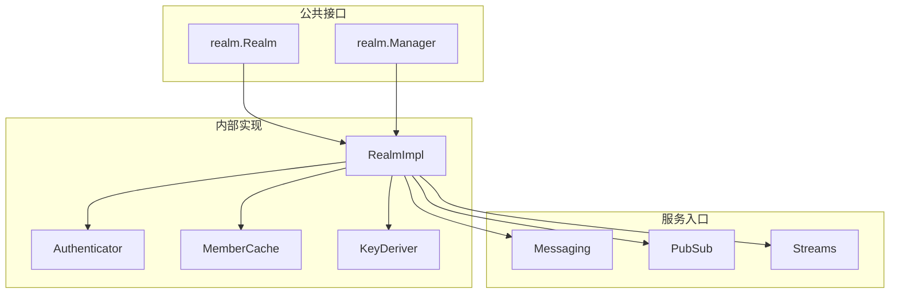
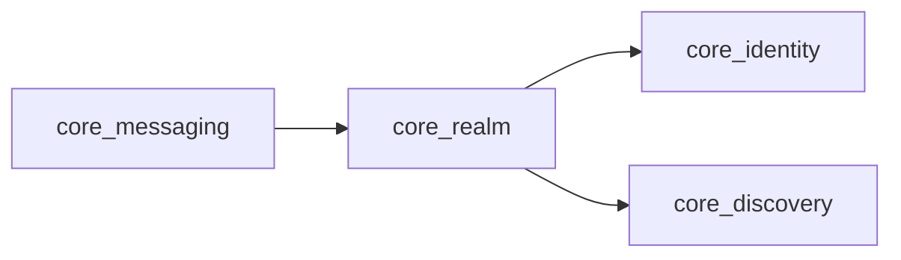

# core_realm 整体设计

> 模块架构与组件设计

---

## 模块架构



---

## 核心组件

### Realm 接口

```go
type Realm interface {
    // 基本信息
    Name() string
    ID() types.RealmID
    
    // 成员管理
    Members() []types.NodeID
    MemberCount() int
    IsMember(id types.NodeID) bool
    
    // ★ "仅 ID 连接"支持（核心特性）
    Connect(ctx context.Context, target types.NodeID) (Connection, error)
    
    // 服务入口
    Messaging() messaging.Service
    PubSub() pubsub.Service
    Streams() streams.Service
    Discovery() discovery.Service
    
    // 生命周期
    Leave(ctx context.Context) error
    Context() context.Context
}
```

### ★ "仅 ID 连接"设计

```
┌─────────────────────────────────────────────────────────────────────────────┐
│                    realm.Connect(ctx, targetNodeID) 实现                     │
├─────────────────────────────────────────────────────────────────────────────┤
│                                                                             │
│  1. 地址发现（v2.0 优先级顺序）                                             │
│     ┌─────────────────────────────────────────────────────────────────────┐ │
│     │ (1) Peerstore 查询      → 本地缓存，最快                           │ │
│     │         ↓ 无结果                                                   │ │
│     │ (2) MemberList 查询     → Gossip 同步的成员列表                    │ │
│     │         ↓ 无结果                                                   │ │
│     │ (3) DHT 查询            → ★ 权威来源（签名 PeerRecord）            │ │
│     │         ↓ 无结果/超时                                              │ │
│     │ (4) Relay 地址簿查询    → 缓存回退（非权威）                       │ │
│     │         ↓ 无结果                                                   │ │
│     │ (5) 直接使用 Relay 保底 → 始终可达                                 │ │
│     └─────────────────────────────────────────────────────────────────────┘ │
│                                                                             │
│  2. 连接尝试（优先级顺序）                                                  │
│     ┌─────────────────────────────────────────────────────────────────────┐ │
│     │ (1) 直接连接            → 使用发现的地址                           │ │
│     │         ↓ 失败                                                     │ │
│     │ (2) NAT 打洞            → 尝试穿透                                 │ │
│     │         ↓ 失败                                                     │ │
│     │ (3) Relay 转发保底      → 总是成功                                 │ │
│     └─────────────────────────────────────────────────────────────────────┘ │
│                                                                             │
└─────────────────────────────────────────────────────────────────────────────┘
```

### 连接器组件

```go
// Connector 负责 Realm 内的连接建立
type Connector interface {
    // Connect 使用纯 NodeID 连接（仅 Realm 内允许）
    Connect(ctx context.Context, target types.NodeID) (Connection, error)
}

// AddressResolver 负责地址解析
type AddressResolver interface {
    // Resolve 按优先级从多个来源解析地址
    Resolve(ctx context.Context, target types.NodeID) ([]Multiaddr, AddressSource, error)
}

// AddressSource 表示地址来源
type AddressSource int
const (
    SourcePeerstore AddressSource = iota  // 本地缓存
    SourceMemberList                       // Gossip 成员列表
    SourceRelayAddressBook                 // Relay 地址簿
    SourceRelayFallback                    // Relay 保底（无地址）
)
```

### Manager 接口

```
type Manager interface {
    // Join 加入 Realm
    Join(ctx context.Context, name string, psk types.PSK) (Realm, error)
    
    // Current 返回当前 Realm
    Current() Realm
    
    // Leave 离开当前 Realm
    Leave(ctx context.Context) error
}
```

---

## RealmID 派生

使用 HKDF-SHA256 从 PSK 派生确定性的 RealmID。

```go
// RealmIDFromPSK 从 PSK 派生 RealmID
// 
// 算法：
//   info = SHA256(PSK)
//   RealmID = hex(HKDF(sha256, PSK, salt="dep2p-realm-id-v1", info))
//
// 返回：64 字符十六进制字符串（32 字节 = 256 位）
func RealmIDFromPSK(psk PSK) RealmID {
    // 计算 PSK 的 SHA256 作为 info
    hash := sha256.Sum256(psk)
    
    // 使用 HKDF 派生
    kdf := hkdf.New(sha256.New, psk, []byte("dep2p-realm-id-v1"), hash[:])
    
    // 读取 32 字节
    realmID := make([]byte, 32)
    io.ReadFull(kdf, realmID)
    
    // 返回十六进制编码
    return RealmID(hex.EncodeToString(realmID))
}
```

**实现位置**：
- `pkg/types/ids.go`: `RealmIDFromPSK()` - 标准实现
- `internal/realm/auth/psk.go`: `DeriveRealmID()` - 内部实现（算法完全一致）

---

## Realm 启动流程（Step B3/B4 对齐）

```
┌─────────────────────────────────────────────────────────────────────────────┐
│                    Realm 启动流程（对齐 Phase B）                             │
├─────────────────────────────────────────────────────────────────────────────┤
│                                                                             │
│  realmImpl.start(ctx)                                                       │
│      │                                                                      │
│      ├─→ 启动 Member 管理器                                                │
│      ├─→ 启动 Routing 模块                                                 │
│      ├─→ 启动 Gateway 模块                                                 │
│      ├─→ 启动 AuthHandler / 发现循环                                       │
│      ├─→ 订阅连接事件                                                      │
│      │                                                                      │
│      ├─→ ★ startProtocolServices()  ← Step B4: 协议注册                   │
│      │       ├─→ messaging.Start()                                         │
│      │       ├─→ pubsub.Start()     → host.SetStreamHandler(protocolID)    │
│      │       ├─→ streams.Start()                                           │
│      │       └─→ liveness.Start()   → host.SetStreamHandler(protocolID)    │
│      │                                                                      │
│      ├─→ 订阅成员同步（PubSub Topic）                                      │
│      ├─→ 启动成员同步器（Discovery）                                       │
│      ├─→ r.active.Store(true)                                              │
│      │                                                                      │
│      ├─→ ★ go r.publishToDHT()       ← Step B3: DHT 发布                  │
│      │       └─→ dht.ProvideRealmMembership(ctx, realmID)                  │
│      │       └─→ dht.PublishRealmPeerRecord(ctx, realmID, record)          │
│      │                                                                      │
│      └─→ ★ go r.registerToRelay()    ← Step B4: Relay 地址注册            │
│              └─→ addressBookService.RegisterSelf(ctx, relayPeerID)         │
│                                                                             │
└─────────────────────────────────────────────────────────────────────────────┘
```

### 协议注册时机说明

| 协议服务 | 注册时机 | 说明 |
|---------|---------|------|
| **PubSub** | `Start()` 时 | 立即注册 Realm 作用域协议处理器 |
| **Liveness** | `Start()` 时 | 立即注册 Ping 处理器 |
| **Messaging** | `RegisterHandler()` 时 | 惰性注册，由业务调用触发 |
| **Streams** | `RegisterHandler()` 时 | 惰性注册，由业务调用触发 |

### Relay 地址注册

- **初始注册**：`realmImpl.start()` 完成后，若配置了 Relay，主动调用 `RegisterSelf()`
- **后续更新**：网络变化时通过 `OnNetworkChange()` 自动触发

---

## 网络变化处理（P2 对齐）

```
┌─────────────────────────────────────────────────────────────────────────────┐
│                    网络变化时的 DHT 重新发布                                  │
├─────────────────────────────────────────────────────────────────────────────┤
│                                                                             │
│  触发条件：                                                                  │
│  ──────────                                                                 │
│  • NetworkChangeType == NetworkChangeMajor（重大网络变化，如 4G→WiFi）       │
│  • 由 NetworkMonitor 检测并通过 Node.notifyNetworkChange() 传递              │
│                                                                             │
│  Node 级别处理（node.go）：                                                  │
│  ──────────────────────────                                                 │
│  notifyNetworkChange(event)                                                  │
│      │                                                                      │
│      ├─→ 通知用户注册的回调                                                 │
│      │                                                                      │
│      └─→ go triggerDHTRepublish(event)                                      │
│              │                                                              │
│              └─→ if event.Type == NetworkChangeMajor                        │
│                      └─→ dht.PublishRealmPeerRecord(ctx)                    │
│                          • 如果已加入 Realm，发布到 DHT                     │
│                          • 如果未加入 Realm，依赖 republishLoop 处理        │
│                                                                             │
│  设计考虑：                                                                  │
│  ──────────                                                                 │
│  • 只处理重大网络变化（Minor 变化由 republishLoop 定期处理）                 │
│  • 异步执行，不阻塞网络变化回调链                                            │
│  • 30 秒超时，避免长时间阻塞                                                 │
│  • Realm 层的 Relay 注册由内部事件机制处理                                   │
│                                                                             │
└─────────────────────────────────────────────────────────────────────────────┘
```

---

## 依赖关系



---

## Fx 模块定义

```
var Module = fx.Module("realm",
    fx.Provide(
        NewManager,
        fx.Annotate(
            NewManager,
            fx.As(new(realm.Manager)),
        ),
    ),
)
```

---

**最后更新**：2026-01-25
