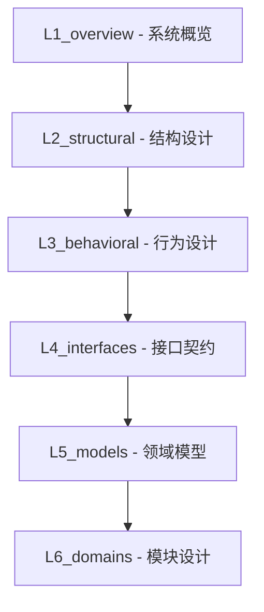
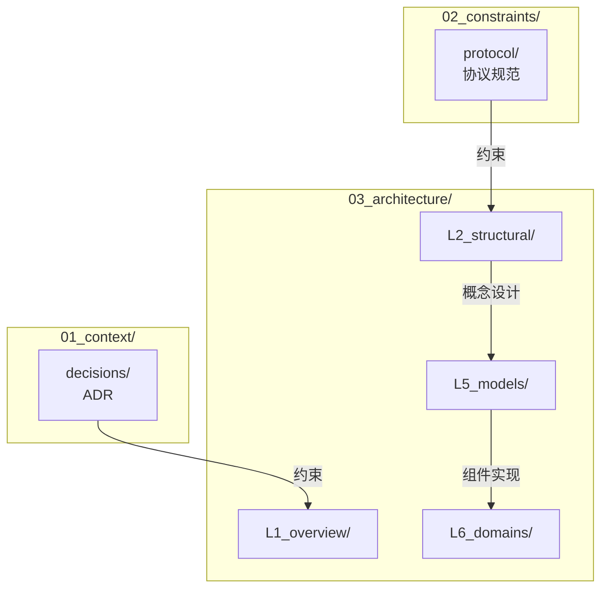

# 架构设计（Architecture Design）

> **版本**: v1.1.0  
> **更新日期**: 2026-01-13  
> **定位**: DeP2P 架构文档导航入口，采用六层文档结构从系统概览到代码模块逐层深入

---

## 五层软件架构

DeP2P 采用**五层软件架构**，Realm 作为独立架构层突出其核心创新地位：

```
┌─────────────────────────────────────────────────────────────────────────────┐
│                      DeP2P 五层软件架构                                      │
├─────────────────────────────────────────────────────────────────────────────┤
│                                                                             │
│  1. API Layer         │ dep2p.go, node.go       │ 用户入口，配置选项       │
│  2. Protocol Layer    │ internal/protocol/      │ 用户级应用协议           │
│  3. Realm Layer       │ internal/realm/         │ 业务隔离，成员管理       │
│  4. Core Layer        │ internal/core/          │ P2P 网络核心能力         │
│  5. Discovery Layer   │ internal/discovery/     │ 节点发现服务             │
│                                                                             │
│  依赖方向：API → Protocol → Realm → Core ↔ Discovery                       │
│                                                                             │
└─────────────────────────────────────────────────────────────────────────────┘
```

---

## 核心特性

| 特性 | 说明 |
|------|------|
| **身份优先** | NodeID = 公钥哈希，连接必须验证身份 |
| **Realm 隔离** | 使用 PSK 认证的业务隔离域 |
| **★ Relay 三大职责 (v2.0)** | 缓存加速层 + 打洞协调信令 + 数据通信保底 |
| **★ 仅 ID 连接** | Realm 内支持纯 NodeID 连接，自动地址发现 |
| **NAT 友好** | 自动 NAT 穿透，Relay 备选 |
| **统一 Relay** | 地址发现 + 信令通道 + 数据保底 |

---

## 六层文档结构



| 层级 | 目录 | 定位 | 主要读者 |
|------|------|------|----------|
| L1 | **L1_overview/** | 系统概览：定位、边界、术语、核心概念 | 管理层、业务方、新人 |
| L2 | **L2_structural/** | 结构设计：分层模型、依赖规则、C4 可视化 | 架构师 |
| L3 | **L3_behavioral/** | 行为设计：端到端流程、组件交互、状态流转 | 架构师、开发者 |
| L4 | **L4_interfaces/** | 接口契约：接口架构、依赖注入、API 规范 | 开发者 |
| L5 | **L5_models/** | 领域模型：核心概念设计、数据模型、一致性 | 核心开发者 |
| L6 | **L6_domains/** | 模块设计：单个组件的内部架构、接口、配置 | 模块开发者 |

---

## L5 与 L6 的区别

L5 和 L6 是最容易混淆的两层，它们的本质区别在于 **视角** 和 **粒度**：

| 维度 | L5_models（领域模型） | L6_domains（模块设计） |
|------|----------------------|------------------------|
| **视角** | 横切面（跨多个组件） | 单个组件（内聚设计） |
| **粒度** | 概念层面的整体设计 | 实现层面的具体设计 |
| **关注点** | 数据模型、生命周期、一致性边界 | 内部架构、接口定义、数据结构、配置项 |
| **回答的问题** | 这类数据是什么？怎么流转？ | 这个组件怎么实现？内部怎么分层？ |

---

## 目录结构

```
03_architecture/
├── README.md                        # 本文件
│
├── L1_overview/                     # ═══ L1: 系统概览 ═══
│   ├── README.md
│   ├── positioning.md               # DeP2P 定位
│   ├── system_boundary.md           # 系统边界
│   ├── glossary.md                  # 术语表
│   ├── core_concepts.md             # 核心概念
│   └── invariants.md                # 系统不变量
│
├── L2_structural/                   # ═══ L2: 结构设计 ═══
│   ├── README.md
│   ├── layer_model.md               # 分层模型
│   ├── dependency_rules.md          # 依赖规则
│   ├── module_design.md             # 模块划分
│   └── c4/                          # C4 可视化
│       ├── README.md
│       ├── context.md               # 系统上下文
│       ├── container.md             # 容器
│       ├── component.md             # 组件
│       └── code.md                  # 代码结构
│
├── L3_behavioral/                   # ═══ L3: 行为设计 ═══
│   ├── README.md
│   ├── connection_flow.md           # 连接建立流程
│   ├── realm_flow.md                # Realm 加入流程
│   ├── discovery_flow.md            # 节点发现流程
│   ├── relay_flow.md                # Relay 中继流程
│   └── messaging_flow.md            # 消息传递流程
│
├── L4_interfaces/                   # ═══ L4: 接口契约 ═══
│   ├── README.md
│   ├── public_interfaces.md         # 公共接口设计
│   ├── internal_interfaces.md       # 内部接口设计
│   ├── component_interface_map.md   # 组件-接口全景图
│   └── fx_lifecycle.md              # Fx + Lifecycle 模式
│
├── L5_models/                       # ═══ L5: 领域模型 ═══
│   ├── README.md
│   ├── identity/                    # 身份领域
│   │   ├── README.md
│   │   └── nodeid_model.md
│   ├── connection/                  # 连接领域
│   │   ├── README.md
│   │   └── connection_model.md
│   ├── realm/                       # Realm 领域
│   │   ├── README.md
│   │   └── realm_model.md
│   └── relay/                       # Relay 领域
│       ├── README.md
│       └── relay_model.md
│
└── L6_domains/                      # ═══ L6: 模块设计 ═══
    ├── README.md
    │
    ├── protocol_messaging/          # [Protocol Layer] 消息协议
    ├── protocol_pubsub/             # [Protocol Layer] 发布订阅
    │
    ├── realm/                       # [Realm Layer] 业务隔离
    │
    ├── core_host/                   # [Core Layer] 网络主机
    ├── core_identity/               # [Core Layer] 身份管理
    ├── core_transport/              # [Core Layer] 传输层
    ├── core_security/               # [Core Layer] 安全层
    ├── core_muxer/                  # [Core Layer] 多路复用
    ├── core_connmgr/                # [Core Layer] 连接管理
    ├── core_relay/                  # [Core Layer] 中继服务
    ├── core_nat/                    # [Core Layer] NAT 穿透
    │
    ├── discovery_coordinator/       # [Discovery Layer] 发现协调
    ├── discovery_dht/               # [Discovery Layer] DHT
    ├── discovery_bootstrap/         # [Discovery Layer] 引导节点
    ├── discovery_mdns/              # [Discovery Layer] 局域网发现
    ├── discovery_rendezvous/        # [Discovery Layer] 命名空间发现
    │
    └── pkg_types/                   # 公共类型
```

---

## 核心架构设计位置

| 核心设计 | 文档位置 |
|----------|----------|
| 系统定位 | `L1_overview/positioning.md` |
| 核心概念 | `L1_overview/core_concepts.md` |
| 系统不变量 | `L1_overview/invariants.md` |
| 分层模型 | `L2_structural/layer_model.md` |
| 依赖规则 | `L2_structural/dependency_rules.md` |
| C4 可视化 | `L2_structural/c4/` |
| 连接流程 | `L3_behavioral/connection_flow.md` |
| Fx + Lifecycle | `L4_interfaces/fx_lifecycle.md` |
| 组件-接口映射 | `L4_interfaces/component_interface_map.md` |
| 领域概念设计 | `L5_models/` |
| 模块实现设计 | `L6_domains/` |

---

## 阅读路径

### 快速了解系统

```
L1_overview/ → L2_structural/
```

1. 阅读 `L1_overview/` 了解系统定位和核心概念
2. 阅读 `L2_structural/` 了解分层、依赖和 C4 架构图

### 深入领域设计

```
L3_behavioral/ → L5_models/
```

1. 阅读 `L3_behavioral/` 了解核心端到端流程
2. 阅读 `L5_models/` 了解领域概念设计（横切面视角）

### 开发实现

```
L4_interfaces/ → L6_domains/
```

1. 阅读 `L4_interfaces/` 了解接口架构和依赖注入模式
2. 阅读 `L6_domains/` 了解模块实现设计（单组件视角）

---

## L6 组件文档结构模板

```
L6_domains/{component}/
├── README.md                    # 概述与导航
├── requirements/                # 需求追溯（来自哪里？解决什么？）
├── design/                      # 架构设计（整体怎么设计？）
├── coding/                      # 编码指南（怎么写代码？）
└── testing/                     # 测试策略（怎么验证？）
```

---

## 与其他目录的关系



---

## 相关文档

| 文档 | 说明 |
|------|------|
| [design/README.md](../README.md) | 设计文档入口 |
| [01_context/decisions/](../01_context/decisions/) | ADR 架构决策 |
| [02_constraints/protocol/](../02_constraints/protocol/) | 协议规范 |
| [04_delivery/testing/](../04_delivery/testing/) | 测试策略 |

---

**最后更新**：2026-01-16
