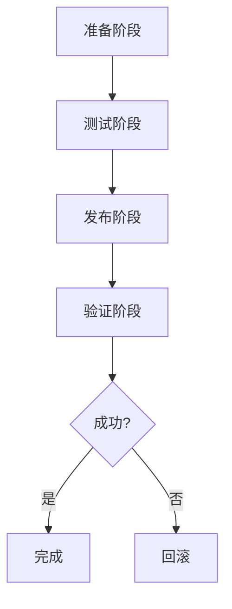

# 发布流程 (Process)

> 发布检查清单、发布步骤、回滚策略

---

## 目录结构

```
process/
├── README.md              # 本文件
├── checklist.md           # 发布检查清单
└── rollback.md            # 回滚策略
```

---

## 概述

本目录定义 DeP2P 的发布流程，确保每次发布的质量和可追溯性。

---

## 发布类型

| 类型 | 频率 | 审批 | 说明 |
|------|------|------|------|
| 补丁发布 | 按需 | 1 人 | Bug 修复 |
| 次版本发布 | 月度 | 2 人 | 新功能 |
| 主版本发布 | 年度 | 团队 | 重大变更 |
| 热修复 | 紧急 | 1 人 | 安全/严重 Bug |

---

## 发布流程概览



---

## 快速链接

| 文档 | 说明 |
|------|------|
| [checklist.md](checklist.md) | 发布检查清单 |
| [rollback.md](rollback.md) | 回滚策略 |

---

**最后更新**：2026-01-11
