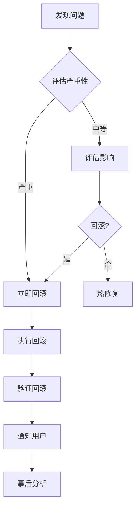

# 回滚策略

> 发布回滚触发条件、回滚步骤、事后处理

---

## 元信息

| 字段 | 值 |
|------|-----|
| **状态** | approved |
| **Owner** | DeP2P Team |
| **创建日期** | 2026-01-11 |
| **更新日期** | 2026-01-11 |

---

## 1. 回滚触发条件

### 1.1 必须回滚

| 情况 | 说明 | 响应时间 |
|------|------|----------|
| 安全漏洞 | 发现严重安全问题 | 立即 |
| 数据损坏 | 导致数据丢失或损坏 | 立即 |
| 核心功能故障 | 基本功能不可用 | 1 小时内 |
| 广泛影响 | 影响 > 50% 用户 | 2 小时内 |

### 1.2 考虑回滚

| 情况 | 说明 | 决策 |
|------|------|------|
| 性能严重下降 | 性能下降 > 50% | 评估后决定 |
| 兼容性问题 | 部分环境不兼容 | 评估影响范围 |
| 非核心功能故障 | 次要功能问题 | 可发热修复 |

### 1.3 不需要回滚

| 情况 | 说明 | 处理方式 |
|------|------|----------|
| 文档错误 | 文档描述不准确 | 更新文档 |
| 小 Bug | 不影响主要功能 | 下个版本修复 |
| 性能小幅下降 | < 10% | 性能优化 |

---

## 2. 回滚流程

### 2.1 流程概览



### 2.2 回滚决策

| 步骤 | 内容 | 负责人 |
|------|------|--------|
| 1. 确认问题 | 复现并确认问题 | 发现者 |
| 2. 评估影响 | 影响范围和严重性 | 技术负责人 |
| 3. 决策 | 是否回滚 | 技术负责人 |
| 4. 执行 | 执行回滚 | 发布负责人 |
| 5. 验证 | 验证回滚成功 | QA |
| 6. 通知 | 通知相关方 | 项目经理 |

---

## 3. 回滚执行

### 3.1 GitHub Release 回滚

```bash
# 1. 标记当前版本为问题版本
# 在 GitHub Release 页面编辑，添加警告标记

# 2. 创建回滚 Release
# 重新发布上一个稳定版本，或创建新的修复版本
```

### 3.2 Git 操作

```bash
# 不建议删除 Tag，保留历史记录
# 创建新版本替代

# 1. 基于上一个稳定版本创建分支
git checkout v1.0.0
git checkout -b hotfix/rollback-v1.1.0

# 2. 创建修复版本
git tag -a v1.1.1 -m "Rollback to v1.0.0 due to critical issue"
git push origin v1.1.1
```

### 3.3 Docker 镜像回滚

```bash
# 重新标记稳定版本
docker tag dep2p:v1.0.0 dep2p:latest
docker push dep2p:latest
```

---

## 4. 回滚验证

### 4.1 验证清单

- [ ] 版本号正确回滚
- [ ] 核心功能正常
- [ ] 问题不再复现
- [ ] 无新问题引入
- [ ] 数据完整性验证

### 4.2 验证脚本

```bash
#!/bin/bash
# scripts/verify-rollback.sh

VERSION=$1

echo "验证版本: $VERSION"

# 1. 版本检查
./dep2p version | grep -q "$VERSION" || { echo "版本不匹配"; exit 1; }

# 2. 基本功能测试
go test -tags=smoke ./tests/smoke/... || { echo "冒烟测试失败"; exit 1; }

# 3. 问题复现测试（应该失败/通过）
# ...

echo "回滚验证通过"
```

---

## 5. 用户通知

### 5.1 通知内容

```markdown
## 重要通知：v{VERSION} 版本回滚

**时间**: YYYY-MM-DD HH:MM UTC
**影响版本**: v{VERSION}
**当前版本**: v{ROLLBACK_VERSION}

### 问题描述
简要描述发现的问题...

### 影响范围
受影响的功能/用户...

### 用户操作
1. 如果您使用 v{VERSION}，请升级到 v{ROLLBACK_VERSION}
2. 升级命令: `go get github.com/dep2p/dep2p@v{ROLLBACK_VERSION}`

### 后续计划
我们将尽快修复问题并发布新版本。

如有疑问，请联系...
```

### 5.2 通知渠道

| 渠道 | 优先级 | 说明 |
|------|:------:|------|
| GitHub Issue | 高 | 创建公告 Issue |
| Release Notes | 高 | 更新发布说明 |
| 邮件列表 | 中 | 发送邮件通知 |
| 社交媒体 | 低 | 重大问题时 |

---

## 6. 事后分析

### 6.1 分析模板

```markdown
## 事后分析报告 - v{VERSION} 回滚

### 事件概述
- **时间线**: 发现时间、回滚时间、恢复时间
- **影响**: 影响范围和持续时间
- **根因**: 问题根本原因

### 时间线
| 时间 | 事件 |
|------|------|
| HH:MM | 发现问题 |
| HH:MM | 确认回滚 |
| HH:MM | 执行回滚 |
| HH:MM | 验证完成 |

### 根因分析
问题的根本原因是...

### 为什么没有提前发现
- 测试覆盖不足
- 边缘场景未考虑
- ...

### 改进措施
| 措施 | 负责人 | 截止日期 |
|------|--------|----------|
| 添加测试用例 | @xxx | YYYY-MM-DD |
| 改进 CI 检查 | @yyy | YYYY-MM-DD |

### 经验教训
1. 学到的经验
2. 后续改进方向
```

### 6.2 改进跟踪

| 改进项 | Issue | 状态 |
|--------|-------|------|
| 添加回归测试 | #xxx | 进行中 |
| 增加监控 | #yyy | 计划中 |

---

## 7. 预防措施

### 7.1 发布前检查强化

- 增加发布前测试时间
- 扩大测试覆盖范围
- 增加金丝雀发布

### 7.2 快速回滚能力

- 保持回滚脚本就绪
- 定期演练回滚流程
- 自动化回滚流程

---

## 变更历史

| 版本 | 日期 | 作者 | 变更说明 |
|------|------|------|----------|
| v1.0 | 2026-01-11 | DeP2P Team | 初始版本 |
