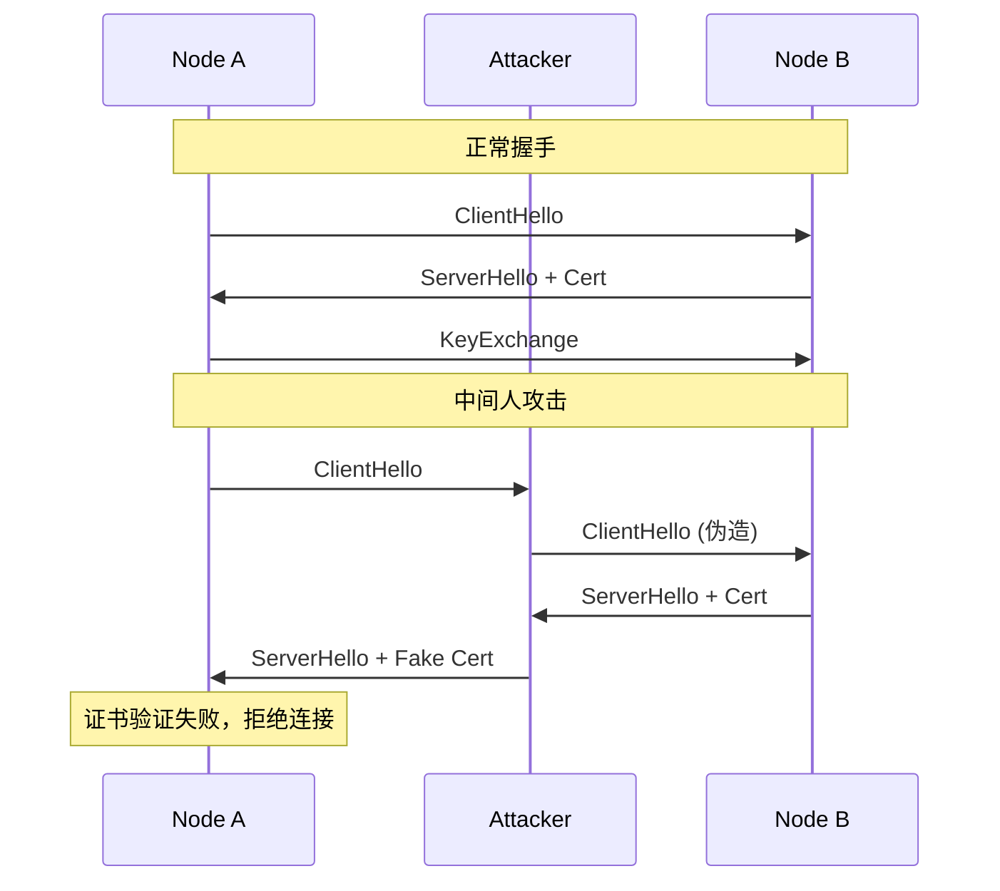

# 威胁模型

> DeP2P 安全威胁分析和防护策略

---

## 元信息

| 字段 | 值 |
|------|-----|
| **状态** | approved |
| **Owner** | DeP2P Team |
| **创建日期** | 2026-01-11 |
| **更新日期** | 2026-01-11 |

---

## 1. 系统概述

### 1.1 安全边界

```
┌─────────────────────────────────────────────────────────────┐
│                      DeP2P 安全边界                          │
│  ┌─────────────────────────────────────────────────────┐   │
│  │                    节点内部                           │   │
│  │   ┌─────────┐  ┌─────────┐  ┌─────────┐            │   │
│  │   │ Identity │  │Transport│  │  Realm  │            │   │
│  │   └─────────┘  └─────────┘  └─────────┘            │   │
│  └─────────────────────────────────────────────────────┘   │
│                           │                                  │
│                    ───────┼───────  网络边界                │
│                           │                                  │
│  ┌─────────────────────────────────────────────────────┐   │
│  │                    外部网络                           │   │
│  │   ┌─────────┐  ┌─────────┐  ┌─────────┐            │   │
│  │   │Other Node│  │  Relay  │  │Attacker │            │   │
│  │   └─────────┘  └─────────┘  └─────────┘            │   │
│  └─────────────────────────────────────────────────────┘   │
└─────────────────────────────────────────────────────────────┘
```

### 1.2 信任假设

| 假设 | 说明 |
|------|------|
| 密钥安全 | 私钥不会泄露 |
| 操作系统安全 | 底层 OS 可信 |
| 依赖安全 | 依赖库无恶意代码 |
| 时间同步 | 系统时间基本准确 |

---

## 2. STRIDE 威胁分析

### 2.1 Spoofing（欺骗/身份伪造）

| 威胁 | 描述 | 缓解措施 |
|------|------|----------|
| NodeID 伪造 | 攻击者伪造他人 NodeID | Ed25519 签名验证 |
| Relay 伪造 | 假冒 Relay 服务 | Relay 身份验证 |
| Realm 伪造 | 假冒 Realm 成员 | PSK 认证 |

**详细分析**：

1. **NodeID 伪造**
   - 风险等级：高
   - 攻击向量：生成与目标相同的 NodeID
   - 缓解：NodeID = Hash(PublicKey)，需要私钥才能签名
   - 验证：所有消息需签名验证

2. **Relay 伪造**
   - 风险等级：中
   - 攻击向量：设置恶意 Relay 拦截流量
   - 缓解：Relay 必须有可验证身份
   - 验证：连接时验证 Relay 身份

---

### 2.2 Tampering（篡改）

| 威胁 | 描述 | 缓解措施 |
|------|------|----------|
| 消息篡改 | 修改传输中的消息 | TLS 加密 + 消息签名 |
| 数据包重排 | 改变消息顺序 | 序列号验证 |
| 中间人攻击 | 拦截并修改通信 | 双向 TLS 认证 |

---

### 2.3 Repudiation（抵赖）

| 威胁 | 描述 | 缓解措施 |
|------|------|----------|
| 操作否认 | 否认发送过消息 | 消息签名 |
| 行为否认 | 否认某些行为 | 操作日志 |

---

### 2.4 Information Disclosure（信息泄露）

| 威胁 | 描述 | 缓解措施 |
|------|------|----------|
| 流量窃听 | 监听网络流量 | TLS 1.3 加密 |
| 元数据泄露 | 泄露通信模式 | 流量混淆（可选） |
| 密钥泄露 | 私钥被窃取 | 密钥安全存储 |
| Realm 成员泄露 | 泄露 Realm 成员列表 | 成员信息加密 |

---

### 2.5 Denial of Service（拒绝服务）

| 威胁 | 描述 | 缓解措施 |
|------|------|----------|
| 连接洪泛 | 大量连接请求 | 连接限制 |
| 资源耗尽 | 消耗内存/CPU | 资源配额 |
| 协议滥用 | 恶意协议消息 | 消息验证 + 速率限制 |
| Relay 攻击 | 攻击 Relay 服务 | 分布式 Relay |

**详细分析**：

1. **连接洪泛**
   - 风险等级：高
   - 攻击向量：大量 SYN 请求
   - 缓解措施：
     - 每 IP 连接限制
     - SYN Cookie
     - 连接速率限制

2. **资源耗尽**
   - 风险等级：高
   - 攻击向量：发送大量消息消耗资源
   - 缓解措施：
     - 连接管理器限制总连接数
     - 消息大小限制
     - 内存使用监控

---

### 2.6 Elevation of Privilege（权限提升）

| 威胁 | 描述 | 缓解措施 |
|------|------|----------|
| 未授权访问 Realm | 非成员访问 Realm 资源 | PSK + 访问控制 |
| 协议权限绕过 | 绕过协议权限检查 | 严格协议验证 |
| 管理权限获取 | 获取 Relay 管理权限 | 管理接口认证 |

---

## 3. 攻击场景

### 3.1 中间人攻击



**防护**：双向 TLS 认证，验证对方 NodeID。

---

### 3.2 Sybil 攻击

**描述**：攻击者创建大量虚假身份控制网络。

**防护**：
- 身份创建成本（密钥生成）
- 节点信誉系统（可选）
- Realm 成员限制

---

### 3.3 Eclipse 攻击

**描述**：控制目标节点的所有连接，隔离目标。

**防护**：
- 多样化连接来源
- 定期重新发现
- 多 Relay 备份

---

## 4. 安全控制

### 4.1 预防控制

| 控制 | 实现 |
|------|------|
| 身份认证 | Ed25519 + TLS 双向认证 |
| 访问控制 | Realm PSK + ConnectionGater |
| 加密传输 | TLS 1.3 |
| 输入验证 | 消息格式验证 |

### 4.2 检测控制

| 控制 | 实现 |
|------|------|
| 异常检测 | 连接模式监控 |
| 日志审计 | 安全事件日志 |
| 入侵检测 | 恶意行为识别 |

### 4.3 响应控制

| 控制 | 实现 |
|------|------|
| 连接断开 | 恶意节点断开 |
| 黑名单 | IP/NodeID 黑名单 |
| 速率限制 | 自动限速 |

---

## 5. 风险评估

### 5.1 风险矩阵

| 风险 | 可能性 | 影响 | 风险等级 |
|------|:------:|:----:|:--------:|
| NodeID 伪造 | 低 | 高 | 中 |
| 中间人攻击 | 低 | 高 | 中 |
| DoS 攻击 | 高 | 中 | 高 |
| 信息泄露 | 中 | 中 | 中 |
| 权限提升 | 低 | 高 | 中 |

### 5.2 优先处理

1. **高优先级**
   - DoS 防护
   - 连接安全

2. **中优先级**
   - 身份验证加强
   - 日志审计

3. **低优先级**
   - 流量混淆
   - 高级入侵检测

---

## 变更历史

| 版本 | 日期 | 作者 | 变更说明 |
|------|------|------|----------|
| v1.0 | 2026-01-11 | DeP2P Team | 初始版本 |
