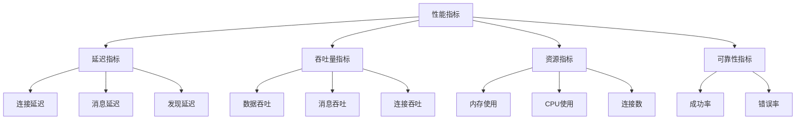

# 性能指标定义

> 性能指标分类、定义和目标值

---

## 元信息

| 字段 | 值 |
|------|-----|
| **状态** | approved |
| **Owner** | DeP2P Team |
| **创建日期** | 2026-01-11 |
| **更新日期** | 2026-01-11 |

---

## 1. 指标分类



---

## 2. 延迟指标 (Latency)

### 2.1 连接建立延迟

| 指标 | 定义 | 单位 |
|------|------|------|
| `conn_establish_p50` | 连接建立 50 分位延迟 | ms |
| `conn_establish_p99` | 连接建立 99 分位延迟 | ms |
| `conn_establish_max` | 连接建立最大延迟 | ms |

**目标值**：

| 场景 | P50 | P99 | 说明 |
|------|-----|-----|------|
| TCP 直连 | ≤ 10ms | ≤ 50ms | 本地网络 |
| QUIC 直连 | ≤ 20ms | ≤ 100ms | 包含握手 |
| Relay 连接 | ≤ 50ms | ≤ 200ms | 含中继开销 |

**测量方法**：

```go
func BenchmarkConnectionEstablish(b *testing.B) {
    for i := 0; i < b.N; i++ {
        start := time.Now()
        conn, _ := transport.Dial(addr)
        latency := time.Since(start)
        // 记录延迟
        conn.Close()
    }
}
```

---

### 2.2 消息传递延迟

| 指标 | 定义 | 单位 |
|------|------|------|
| `msg_latency_p50` | 消息传递 50 分位延迟 | ms |
| `msg_latency_p99` | 消息传递 99 分位延迟 | ms |
| `msg_rtt` | 消息往返时间 | ms |

**目标值**：

| 场景 | P50 | P99 | 说明 |
|------|-----|-----|------|
| 直连 | ≤ 5ms | ≤ 20ms | 小消息 |
| Relay | ≤ 20ms | ≤ 50ms | 含转发 |
| 广播 | ≤ 50ms | ≤ 200ms | GossipSub |

---

### 2.3 节点发现延迟

| 指标 | 定义 | 单位 |
|------|------|------|
| `discovery_first_peer` | 发现首个节点延迟 | ms |
| `discovery_complete` | 完成发现延迟 | s |

**目标值**：

| 场景 | 首个节点 | 完成 |
|------|----------|------|
| Bootstrap | ≤ 500ms | ≤ 5s |
| mDNS | ≤ 1s | ≤ 5s |
| DHT | ≤ 2s | ≤ 30s |

---

## 3. 吞吐量指标 (Throughput)

### 3.1 数据传输吞吐量

| 指标 | 定义 | 单位 |
|------|------|------|
| `data_throughput` | 数据传输速率 | MB/s |
| `data_throughput_bidirectional` | 双向传输速率 | MB/s |

**目标值**：

| 场景 | 吞吐量 | 说明 |
|------|--------|------|
| TCP 单向 | ≥ 100 MB/s | 1 Gbps 网络 |
| QUIC 单向 | ≥ 80 MB/s | 1 Gbps 网络 |
| Relay | ≥ 50 MB/s | 含转发开销 |

**测量方法**：

```go
func BenchmarkDataThroughput(b *testing.B) {
    data := make([]byte, 1024*1024) // 1MB
    
    b.SetBytes(int64(len(data)))
    b.ResetTimer()
    
    for i := 0; i < b.N; i++ {
        conn.Write(data)
    }
}
```

---

### 3.2 消息处理吞吐量

| 指标 | 定义 | 单位 |
|------|------|------|
| `msg_throughput` | 消息处理速率 | msg/s |
| `msg_throughput_per_topic` | 每主题消息速率 | msg/s |

**目标值**：

| 场景 | 吞吐量 | 说明 |
|------|--------|------|
| 点对点 | ≥ 50,000 msg/s | 小消息 |
| GossipSub | ≥ 10,000 msg/s | 单主题 |
| 多主题 | ≥ 5,000 msg/s | 每主题 |

---

### 3.3 连接建立吞吐量

| 指标 | 定义 | 单位 |
|------|------|------|
| `conn_rate` | 新连接建立速率 | conn/s |
| `max_parallel_conn` | 最大并发连接数 | 个 |

**目标值**：

| 场景 | 速率 | 最大并发 |
|------|------|----------|
| TCP | ≥ 1,000 conn/s | 10,000 |
| QUIC | ≥ 500 conn/s | 10,000 |

---

## 4. 资源指标 (Resource)

### 4.1 内存使用

| 指标 | 定义 | 单位 |
|------|------|------|
| `mem_per_conn` | 每连接内存占用 | KB |
| `mem_per_stream` | 每流内存占用 | KB |
| `mem_heap_alloc` | 堆内存分配 | MB |
| `mem_heap_idle` | 空闲堆内存 | MB |

**目标值**：

| 场景 | 目标 | 上限 |
|------|------|------|
| 每连接 | ≤ 10 KB | 50 KB |
| 每流 | ≤ 5 KB | 20 KB |
| 基础开销 | ≤ 50 MB | 100 MB |

---

### 4.2 CPU 使用

| 指标 | 定义 | 单位 |
|------|------|------|
| `cpu_per_msg` | 每消息 CPU 时间 | μs |
| `cpu_idle` | 空闲 CPU 占用 | % |
| `cpu_busy` | 高负载 CPU 占用 | % |

**目标值**：

| 场景 | 目标 | 上限 |
|------|------|------|
| 每消息 | ≤ 10 μs | 100 μs |
| 空闲 | ≤ 1% | 5% |
| 高负载 | ≤ 50% | 80% |

---

### 4.3 内存分配

| 指标 | 定义 | 单位 |
|------|------|------|
| `allocs_per_op` | 每操作内存分配次数 | 次 |
| `bytes_per_op` | 每操作分配字节数 | B |

**目标值**：

| 操作 | allocs/op | bytes/op |
|------|-----------|----------|
| 消息发送 | ≤ 5 | ≤ 1 KB |
| 消息接收 | ≤ 5 | ≤ 1 KB |
| 连接建立 | ≤ 20 | ≤ 10 KB |

---

## 5. 可靠性指标 (Reliability)

### 5.1 成功率

| 指标 | 定义 | 单位 |
|------|------|------|
| `conn_success_rate` | 连接成功率 | % |
| `msg_delivery_rate` | 消息送达率 | % |
| `discovery_success_rate` | 发现成功率 | % |

**目标值**：

| 场景 | 正常 | 降级 |
|------|------|------|
| 连接成功率 | ≥ 99.9% | ≥ 95% |
| 消息送达率 | ≥ 99.99% | ≥ 99% |
| 发现成功率 | ≥ 99% | ≥ 90% |

---

### 5.2 错误率

| 指标 | 定义 | 单位 |
|------|------|------|
| `error_rate` | 错误率 | % |
| `timeout_rate` | 超时率 | % |
| `retry_rate` | 重试率 | % |

**目标值**：

| 指标 | 目标 | 告警阈值 |
|------|------|----------|
| 错误率 | ≤ 0.1% | 1% |
| 超时率 | ≤ 0.5% | 2% |
| 重试率 | ≤ 5% | 10% |

---

## 6. 指标收集

### 6.1 Go 基准测试

```go
func BenchmarkXxx(b *testing.B) {
    // 准备
    
    b.ResetTimer()
    b.ReportAllocs()
    
    for i := 0; i < b.N; i++ {
        // 被测操作
    }
}
```

### 6.2 Prometheus 指标

```go
var (
    connEstablishDuration = prometheus.NewHistogramVec(
        prometheus.HistogramOpts{
            Name:    "dep2p_conn_establish_duration_seconds",
            Help:    "Connection establishment duration",
            Buckets: prometheus.ExponentialBuckets(0.001, 2, 10),
        },
        []string{"transport"},
    )
    
    msgThroughput = prometheus.NewCounterVec(
        prometheus.CounterOpts{
            Name: "dep2p_msg_total",
            Help: "Total messages processed",
        },
        []string{"direction"},
    )
)
```

---

## 7. 报告格式

### 7.1 基准测试输出

```
BenchmarkNodeID_Generate-8          100000    15234 ns/op    4096 B/op    12 allocs/op
BenchmarkConnection_TCP-8            10000   105234 ns/op    8192 B/op    24 allocs/op
BenchmarkMessage_Send-8             500000     2345 ns/op     512 B/op     3 allocs/op
```

### 7.2 性能报告

```markdown
## 性能基准报告

**版本**: v0.1.0
**日期**: 2026-01-11
**环境**: Linux, 4 核, 16GB

### 延迟

| 指标 | P50 | P99 | 目标 | 状态 |
|------|-----|-----|------|------|
| 连接建立 | 8ms | 45ms | ≤50ms | ✅ |
| 消息延迟 | 3ms | 18ms | ≤20ms | ✅ |

### 吞吐量

| 指标 | 测量值 | 目标 | 状态 |
|------|--------|------|------|
| 数据传输 | 120 MB/s | ≥100 | ✅ |
| 消息处理 | 55,000 msg/s | ≥50,000 | ✅ |
```

---

## 变更历史

| 版本 | 日期 | 作者 | 变更说明 |
|------|------|------|----------|
| v1.0 | 2026-01-11 | DeP2P Team | 初始版本 |
