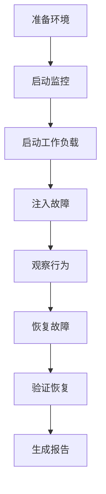

# 混沌测试 (Chaos Testing)

> 故障注入、弹性验证、恢复测试

---

## 目录结构

```
chaos/
├── README.md              # 本文件
└── scenarios/             # 故障场景定义
    └── README.md
```

---

## 概述

混沌测试通过主动注入故障，验证 DeP2P 在各种异常情况下的行为，确保系统的弹性和可恢复性。

---

## 测试目标

| 目标 | 说明 |
|------|------|
| **弹性验证** | 验证系统在故障下的行为 |
| **恢复能力** | 验证故障恢复的时效性 |
| **降级机制** | 验证优雅降级策略 |
| **告警验证** | 验证故障检测和告警 |

---

## 故障类型

### 网络故障

| 故障类型 | 注入方法 | 影响范围 |
|----------|----------|----------|
| 网络分区 | iptables / tc | 节点间通信中断 |
| 高延迟 | tc netem | 通信延迟增加 |
| 丢包 | tc netem | 数据包丢失 |
| 带宽限制 | tc tbf | 吞吐量下降 |
| DNS 故障 | 修改 /etc/hosts | 域名解析失败 |

### 节点故障

| 故障类型 | 注入方法 | 影响范围 |
|----------|----------|----------|
| 进程崩溃 | kill -9 | 节点不可用 |
| 进程挂起 | kill -STOP | 节点无响应 |
| 资源耗尽 | stress-ng | 性能下降 |
| 磁盘满 | fallocate | 写入失败 |

### 依赖故障

| 故障类型 | 注入方法 | 影响范围 |
|----------|----------|----------|
| Relay 不可用 | 停止服务 | 中继失效 |
| Bootstrap 不可用 | 停止服务 | 无法加入网络 |
| 证书过期 | 时间跳变 | TLS 握手失败 |

---

## 验证标准

### 可用性标准

| 故障场景 | 可用性要求 | 恢复时间 |
|----------|-----------|----------|
| 单节点故障 | ≥ 99.9% | ≤ 10s |
| 网络分区 | ≥ 95% | ≤ 30s |
| Relay 故障 | ≥ 99% | ≤ 30s |
| 50% 节点故障 | ≥ 90% | ≤ 60s |

### 数据完整性

| 场景 | 要求 |
|------|------|
| 故障期间消息 | 不丢失已确认消息 |
| 恢复后状态 | 状态一致性 |
| 身份信息 | 持久化保持 |

---

## 测试工具

### 推荐工具

| 工具 | 用途 | 平台 |
|------|------|------|
| tc / netem | 网络故障注入 | Linux |
| iptables | 网络分区 | Linux |
| stress-ng | 资源压力 | Linux/macOS |
| Toxiproxy | 网络代理故障 | 跨平台 |
| Chaos Mesh | K8s 混沌测试 | Kubernetes |

### 测试框架

```go
// 混沌测试框架示例
type ChaosTest struct {
    Name        string
    Duration    time.Duration
    Fault       FaultInjector
    Workload    Workload
    Validator   Validator
}

type FaultInjector interface {
    Inject() error
    Recover() error
}
```

---

## 执行流程



---

## 快速链接

| 文档 | 说明 |
|------|------|
| [scenarios/](scenarios/) | 故障场景定义 |

---

**最后更新**：2026-01-11
