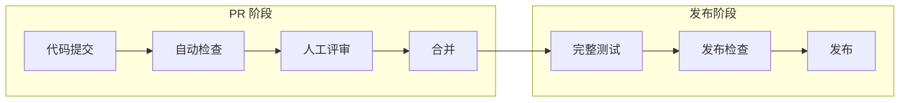

# 质量门禁

> PR 合并和发布的质量检查标准

---

## 元信息

| 字段 | 值 |
|------|-----|
| **状态** | approved |
| **Owner** | DeP2P Team |
| **创建日期** | 2026-01-11 |
| **更新日期** | 2026-01-11 |

---

## 1. 质量门禁概述



---

## 2. PR 合并门禁

### 2.1 必须通过的检查

| 检查项 | 工具/命令 | 阻断级别 | 要求 | 说明 |
|--------|----------|:--------:|------|------|
| **编译通过** | `go build ./...` | 🔴 阻断 | 零错误 | 所有包必须编译成功 |
| **单元测试通过** | `go test ./...` | 🔴 阻断 | 全部 PASS | 所有单元测试必须通过 |
| **Race 检测通过** | `go test -race ./...` | 🔴 阻断 | 零数据竞争 | 无并发数据竞争 |
| **集成测试** | `go test -tags=integration ./tests/integration/...` | 🔴 阻断 | 全部 PASS | 跨模块集成测试通过 |
| **失败测试修复** | - | 🔴 阻断 | 无遗留失败 | 不允许遗留失败测试 |
| 代码覆盖率 | Codecov | 🟡 警告 | 不低于现有 | 覆盖率不应降低 |
| 静态分析 | staticcheck | 🔴 阻断 | 无错误 | 静态分析零错误 |
| 代码风格 | golangci-lint | 🔴 阻断 | 符合规范 | 代码风格一致 |

### 2.2 覆盖率要求

| 类别 | 最低要求 | 目标 | 不可降低 |
|------|:--------:|:----:|:--------:|
| **核心模块** (`core/identity`, `core/security`) | 85% | 90% | ✅ |
| **基础设施** (`core/host`, `core/swarm`) | 80% | 85% | ✅ |
| **协议层** (`protocol/*`) | 80% | 85% | ✅ |
| **发现层** (`discovery/*`) | 75% | 80% | ✅ |
| **工具模块** (`metrics`, `resourcemgr`) | 70% | 75% | ✅ |
| **总体覆盖率** | 70% | 75% | ✅ |
| **新增代码** | 80% | 90% | ✅ |

> **说明**：覆盖率是度量指标，不是目标。高覆盖率 ≠ 无 BUG。关键在于测试质量。

### 2.3 代码评审要求

| 要求 | 说明 |
|------|------|
| 至少一位维护者批准 | 核心代码需两位 |
| 无未解决的评论 | 所有讨论已关闭 |
| 通过所有自动检查 | CI 状态为绿色 |
| 无冲突 | 与目标分支无冲突 |

---

## 3. CI 检查配置

### 3.1 必须的 CI Jobs

```yaml
# .github/workflows/ci.yml
name: CI

on:
  push:
    branches: [main, develop]
  pull_request:
    branches: [main, develop]

jobs:
  lint:
    name: Lint
    runs-on: ubuntu-latest
    steps:
      - uses: actions/checkout@v4
      - uses: actions/setup-go@v5
        with:
          go-version: '1.21'
      - name: golangci-lint
        uses: golangci/golangci-lint-action@v4
        with:
          version: latest

  test:
    name: Test
    runs-on: ubuntu-latest
    steps:
      - uses: actions/checkout@v4
      - uses: actions/setup-go@v5
        with:
          go-version: '1.21'
      - name: Run tests
        run: go test -race -coverprofile=coverage.out ./...
      - name: Upload coverage
        uses: codecov/codecov-action@v4
        with:
          file: ./coverage.out
          fail_ci_if_error: true

  integration:
    name: Integration Tests
    runs-on: ubuntu-latest
    steps:
      - uses: actions/checkout@v4
      - uses: actions/setup-go@v5
        with:
          go-version: '1.21'
      - name: Run integration tests
        run: go test -tags=integration -race ./tests/integration/...

  build:
    name: Build
    runs-on: ubuntu-latest
    steps:
      - uses: actions/checkout@v4
      - uses: actions/setup-go@v5
        with:
          go-version: '1.21'
      - name: Build
        run: go build ./...

  staticcheck:
    name: Staticcheck
    runs-on: ubuntu-latest
    steps:
      - uses: actions/checkout@v4
      - uses: actions/setup-go@v5
        with:
          go-version: '1.21'
      - name: Staticcheck
        uses: dominikh/staticcheck-action@v1
        with:
          version: "latest"
```

### 3.2 Codecov 配置

```yaml
# codecov.yml
coverage:
  precision: 2
  round: down
  status:
    project:
      default:
        target: auto
        threshold: 1%
        if_not_found: success
    patch:
      default:
        target: 80%
        threshold: 0%

comment:
  layout: "reach,diff,flags,files"
  behavior: default
  require_changes: true
```

### 3.3 golangci-lint 配置

```yaml
# .golangci.yml
run:
  timeout: 5m
  tests: true

linters:
  enable:
    - errcheck
    - gosimple
    - govet
    - ineffassign
    - staticcheck
    - unused
    - gofmt
    - goimports
    - misspell
    - unconvert
    - gosec

issues:
  exclude-use-default: false
  max-issues-per-linter: 0
  max-same-issues: 0
```

---

## 4. 发布门禁

### 4.1 发布前检查清单

| 检查项 | 说明 | 阻断 |
|--------|------|:----:|
| 所有 PR 检查通过 | CI 绿色 | 🔴 |
| E2E 测试通过 | 完整端到端测试 | 🔴 |
| 基准测试无回归 | 性能不下降超过 10% | 🟡 |
| 安全扫描通过 | 无高危漏洞 | 🔴 |
| 文档已更新 | CHANGELOG, API 文档 | 🔴 |
| 版本号已更新 | version.json | 🔴 |

### 4.2 发布流程检查

```yaml
# .github/workflows/release.yml
name: Release

on:
  push:
    tags:
      - 'v*'

jobs:
  validate:
    name: Validate Release
    runs-on: ubuntu-latest
    steps:
      - uses: actions/checkout@v4
      - uses: actions/setup-go@v5
      
      - name: Run all tests
        run: go test -race ./...
      
      - name: Run E2E tests
        run: go test -tags=e2e -timeout=10m ./tests/e2e/...
      
      - name: Run benchmarks
        run: go test -bench=. -benchmem ./... > bench.txt
      
      - name: Security scan
        uses: securego/gosec@master
        with:
          args: ./...

  release:
    name: Release
    needs: validate
    runs-on: ubuntu-latest
    steps:
      - uses: actions/checkout@v4
      - name: Create Release
        uses: softprops/action-gh-release@v1
        with:
          generate_release_notes: true
```

---

## 5. 性能回归检测

### 5.1 基准测试门禁

| 指标 | 回归阈值 | 动作 |
|------|----------|------|
| 吞吐量下降 | > 10% | 阻断发布 |
| 延迟增加 | > 20% | 警告 |
| 内存增加 | > 15% | 警告 |
| allocs/op 增加 | > 20% | 警告 |

### 5.2 自动检测

```bash
# 对比基准测试结果
benchstat base.txt new.txt | grep -E "(old|new|delta)" | while read line; do
  if echo "$line" | grep -q "+[0-9]*\.[0-9]*%"; then
    delta=$(echo "$line" | grep -oE "\+[0-9]+\.[0-9]+%")
    if [ "${delta%\%}" -gt 10 ]; then
      echo "::warning::Performance regression detected: $line"
    fi
  fi
done
```

---

## 6. 分支保护规则

### 6.1 main 分支

```
分支保护规则：
- ✅ 要求拉取请求评审后才能合并
  - 必需的审批数量：1
  - 推送新提交时关闭已批准的拉取请求审查
- ✅ 要求状态检查后才能合并
  - 必需的状态检查：lint, test, integration, build, staticcheck
  - 要求分支在合并前是最新的
- ✅ 要求线性历史记录
- ✅ 包括管理员
- ❌ 允许强制推送
- ❌ 允许删除
```

### 6.2 develop 分支

```
分支保护规则：
- ✅ 要求拉取请求评审后才能合并
  - 必需的审批数量：1
- ✅ 要求状态检查后才能合并
  - 必需的状态检查：lint, test, build
- ❌ 要求线性历史记录
- ❌ 允许强制推送
```

---

## 7. 豁免流程

### 7.1 豁免条件

在以下情况下可申请豁免质量门禁：

| 情况 | 可豁免项 | 审批要求 |
|------|----------|----------|
| 紧急修复 | 代码评审人数 | 事后补评审 |
| 测试环境问题 | Flaky 测试 | 创建 Issue 跟踪 |
| 第三方依赖问题 | 静态分析警告 | 添加忽略注释 |

### 7.2 豁免记录

所有豁免必须：
1. 创建 Issue 记录
2. 获得维护者批准
3. 设置修复期限
4. 在期限内解决

---

## 8. 监控和报告

### 8.1 质量指标仪表板

| 指标 | 监控频率 | 告警阈值 |
|------|----------|----------|
| 测试覆盖率 | 每次 PR | < 70% |
| CI 成功率 | 每日 | < 90% |
| 平均 CI 时间 | 每周 | > 15 分钟 |
| Flaky 测试数 | 每周 | > 5 |

### 8.2 周报内容

```markdown
## 质量周报 YYYY-WW

### 概览
- PR 合并数：N
- CI 成功率：N%
- 平均 CI 时间：N 分钟

### 覆盖率
- 总体覆盖率：N%（变化 ±N%）
- 核心模块：N%

### 问题
- Flaky 测试：N 个
- 未解决的质量问题：N 个

### 改进项
- [改进事项]
```

---

## 9. 测试质量要求

### 9.1 禁止的测试反模式

| 反模式 | 表现 | 示例 | 处理 |
|--------|------|------|------|
| **空断言** | 只调用不检查 | `func TestXxx(t *testing.T) { NewXxx() }` | 🔴 必须添加断言 |
| **永真断言** | 断言条件恒为真 | `if true { t.Log("ok") }` | 🔴 必须修复 |
| **仅检查无错误** | 不验证结果正确性 | `require.NoError(t, err)` 但不检查返回值 | 🟡 需补充断言 |
| **Happy path only** | 只测试正常流程 | 所有测试输入都是有效的 | 🟡 需补充边界用例 |
| **无意义 Skip** | 跳过但无说明 | `t.Skip()` 无注释 | 🔴 删除或实现 |

### 9.2 测试必须验证的维度

| 维度 | 说明 | 示例 |
|------|------|------|
| **功能正确性** | API 是否按预期工作 | 返回值、状态变化 |
| **边界条件** | 极端输入、空值、溢出等 | nil, 0, 最大值 |
| **并发安全** | 数据竞争（Race Detection） | 多 goroutine 访问 |
| **错误处理** | 异常路径是否正确处理 | 错误返回、panic |
| **资源泄漏** | goroutine 泄漏、内存泄漏 | 泄漏检测 |
| **状态一致性** | 并发操作后状态是否正确 | 状态验证 |

---

## 变更历史

| 版本 | 日期 | 作者 | 变更说明 |
|------|------|------|----------|
| v1.0 | 2026-01-11 | DeP2P Team | 初始版本 |
| v1.1 | 2026-01-21 | DeP2P Team | 基于测试策略分析更新质量门禁标准 |
