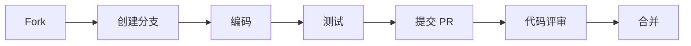

# 贡献指南

> 如何为 DeP2P 做贡献

---

## 欢迎贡献

感谢您对 DeP2P 的关注！我们欢迎各种形式的贡献，包括但不限于：

- 报告 Bug
- 提交功能建议
- 改进文档
- 提交代码

---

## 行为准则

参与 DeP2P 社区时，请遵守我们的[行为准则](code_of_conduct.md)。

---

## 报告 Bug

### 在报告之前

1. 搜索现有 Issues，避免重复
2. 确认使用的是最新版本
3. 尝试最小化复现步骤

### Issue 模板

```markdown
## Bug 描述

简要描述问题...

## 复现步骤

1. 步骤 1
2. 步骤 2
3. ...

## 预期行为

描述预期的行为...

## 实际行为

描述实际发生的情况...

## 环境信息

- DeP2P 版本:
- Go 版本:
- 操作系统:

## 附加信息

日志、截图等...
```

---

## 功能建议

### 在 Discussions 中讨论

对于新功能建议，请先在 Discussions 中讨论：

1. 描述您的需求
2. 说明为什么需要这个功能
3. 收集社区反馈

### 创建提案

对于重大功能，可能需要创建正式提案：

- 参考 [提案流程](../proposals/README.md)

---

## 代码贡献

### 贡献流程



### 详细步骤

#### 1. Fork 仓库

```bash
# Fork 到您的账户，然后克隆
git clone https://github.com/YOUR_USERNAME/dep2p.git
cd dep2p

# 添加上游仓库
git remote add upstream https://github.com/dep2p/dep2p.git
```

#### 2. 创建分支

```bash
# 同步上游
git fetch upstream
git checkout main
git merge upstream/main

# 创建功能分支
git checkout -b feature/your-feature-name
# 或修复分支
git checkout -b fix/issue-123
```

#### 3. 编码

遵循项目的编码规范：

- 运行 `go fmt ./...` 格式化代码
- 运行 `go vet ./...` 检查潜在问题
- 遵循 Go 代码风格

#### 4. 测试

```bash
# 运行测试
go test ./...

# 运行覆盖率检查
go test -cover ./...

# 运行 lint
golangci-lint run
```

#### 5. 提交

```bash
# 提交格式
git commit -m "type(scope): description"

# 示例
git commit -m "feat(relay): add support for multiple relays"
git commit -m "fix(transport): handle connection timeout correctly"
git commit -m "docs(readme): update installation instructions"
```

**提交类型**：
- `feat`: 新功能
- `fix`: Bug 修复
- `docs`: 文档更新
- `style`: 代码格式（不影响逻辑）
- `refactor`: 重构
- `test`: 测试
- `chore`: 构建/工具

#### 6. 推送并创建 PR

```bash
git push origin feature/your-feature-name
```

然后在 GitHub 上创建 Pull Request。

---

## Pull Request 指南

### PR 模板

```markdown
## 变更说明

描述此 PR 的变更内容...

## 关联 Issue

Fixes #123

## 变更类型

- [ ] Bug 修复
- [ ] 新功能
- [ ] 文档更新
- [ ] 重构
- [ ] 其他

## 检查清单

- [ ] 代码遵循项目风格
- [ ] 添加了必要的测试
- [ ] 所有测试通过
- [ ] 更新了相关文档
```

### 评审流程

1. 维护者会在 1-3 天内进行初步评审
2. 根据反馈修改代码
3. 通过评审后合并

### 评审标准

- 代码质量和可读性
- 测试覆盖
- 文档完整性
- 与现有代码的一致性

---

## 开发环境

### 环境要求

- Go 1.21+
- Git 2.0+
- Make (可选)

### 设置开发环境

```bash
# 克隆仓库
git clone https://github.com/dep2p/dep2p.git
cd dep2p

# 安装开发工具
go install github.com/golangci/golangci-lint/cmd/golangci-lint@latest

# 运行测试验证环境
go test ./...
```

---

## 获取帮助

如果您在贡献过程中遇到问题：

- 查看 [FAQ](../../docs/en/getting-started/faq.md)
- 在 Discussions 中提问
- 联系维护者

---

**感谢您的贡献！**
