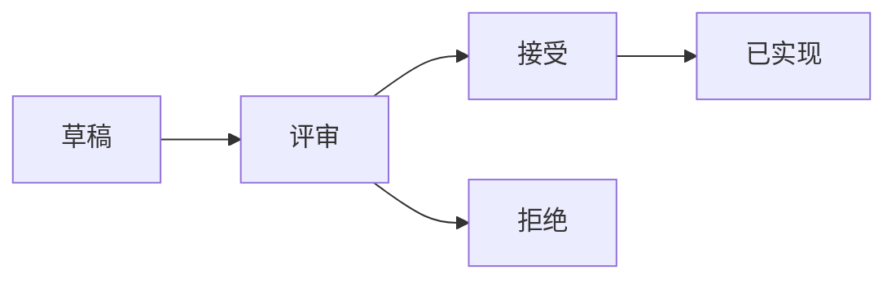

# 改进提案 (Proposals)

> 提案流程、提案索引、模板

---

## 概述

改进提案（Proposal）是 DeP2P 重大变更的正式流程，用于记录设计决策和获取社区反馈。

---

## 提案类型

| 类型 | 前缀 | 说明 | 审批要求 |
|------|------|------|----------|
| 功能提案 | PROP-FEAT | 新功能 | 2 位维护者 |
| 架构提案 | PROP-ARCH | 架构变更 | 全体维护者 |
| 协议提案 | PROP-PROTO | 协议变更 | 全体维护者 |
| 流程提案 | PROP-PROC | 流程改进 | 2 位维护者 |

---

## 提案流程



### 状态说明

| 状态 | 说明 |
|------|------|
| draft | 草稿，编写中 |
| review | 评审中，征求意见 |
| accepted | 已接受，待实现 |
| rejected | 已拒绝，附拒绝理由 |
| implemented | 已实现 |
| withdrawn | 已撤回 |

---

## 提交流程

### 1. 创建提案

```bash
# 复制模板
cp design/templates/proposal_template.md \
   design/05_governance/proposals/PROP-FEAT-0001.md

# 编辑填写
vim design/05_governance/proposals/PROP-FEAT-0001.md
```

### 2. 提交 PR

- 创建分支：`proposal/PROP-FEAT-0001`
- 提交 PR 到 `develop` 分支
- 标签：`proposal`

### 3. 评审

- 至少 2 周评审期
- 在 PR 中讨论
- 收集反馈和修改

### 4. 决策

- 维护者投票
- 记录决策理由
- 更新提案状态

---

## 提案索引

| 提案 ID | 标题 | 类型 | 状态 |
|---------|------|------|:----:|
| - | - | - | - |

（首个提案后更新）

---

## 模板

使用 [PROP-template.md](PROP-template.md) 或 [design/templates/proposal_template.md](../../templates/proposal_template.md)。

---

## 最佳实践

### 提案前

- 在 Discussion 中预先讨论
- 收集初步反馈
- 确认提案范围

### 撰写提案

- 清晰描述问题和动机
- 提供备选方案对比
- 分析兼容性影响
- 制定实现计划

### 评审中

- 积极回应反馈
- 及时更新提案
- 保持开放态度

---

**最后更新**：2026-01-11
