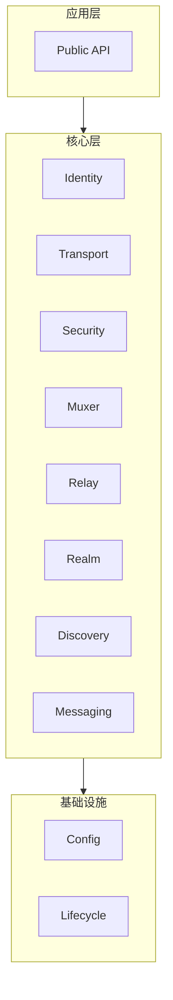

# 架构指南 (Architecture)

> 模块开发指南

---

## 目录结构

```
architecture/
├── README.md              # 本文件
└── module_guide.md        # 模块开发指南
```

---

## 概述

本目录提供 DeP2P 架构层面的开发指南，帮助开发者理解和扩展系统架构。

---

## 架构概览



---

## 快速链接

| 文档 | 说明 |
|------|------|
| [module_guide.md](module_guide.md) | 模块开发指南 |
| [../../../03_architecture/](../../03_architecture/) | 架构设计文档 |

---

**最后更新**：2026-01-11
