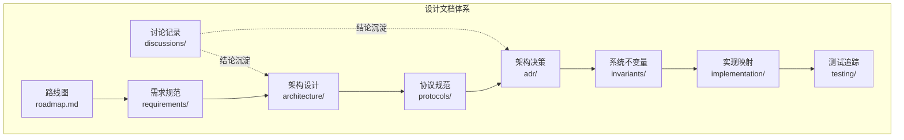
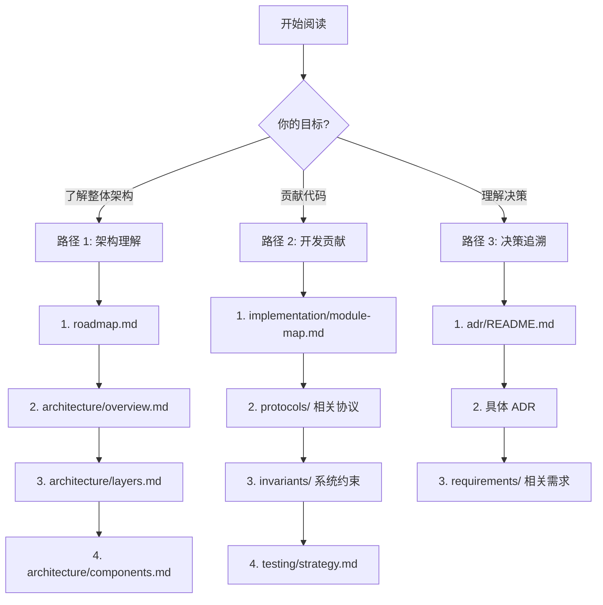
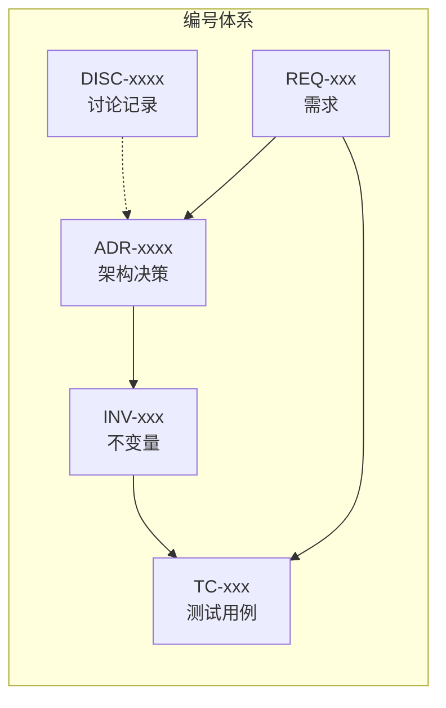

# 设计文档导航

本目录包含 DeP2P 项目的设计文档，记录架构决策、协议规范和实现细节。

---

## 为什么这样设计？

> 如果你是**用户**，想快速了解 DeP2P 的设计决策对你的影响，从这里开始：

```
┌─────────────────────────────────────────────────────────────────────┐
│                      用户需要了解的设计决策                          │
├─────────────────────────────────────────────────────────────────────┤
│                                                                      │
│  "为什么必须先 JoinRealm?"                                          │
│    → INV-002: Realm 成员约束                                        │
│    → 用户文档: docs/zh/reference/api-defaults.md                    │
│                                                                      │
│  "为什么 System Relay 不承载业务数据?"                              │
│    → INV-003: 控制面/数据面分离                                     │
│    → ADR-0004: 中继分层设计                                         │
│                                                                      │
│  "为什么使用 PSK 而不是证书?"                                       │
│    → ADR-0002: Realm 隔离设计                                       │
│    → 用户文档: docs/zh/concepts/core-concepts.md                    │
│                                                                      │
└─────────────────────────────────────────────────────────────────────┘
```

### 用户文档链接

| 设计决策 | 用户影响 | 用户文档 |
|----------|----------|----------|
| [INV-002 Realm 成员约束](invariants/INV-002-realm-membership.md) | 必须先 `JoinRealm()` | [API 约束](../docs/zh/reference/api-defaults.md) |
| [INV-003 控制/数据分离](invariants/INV-003-control-data-separation.md) | 中继层次理解 | [中继部署](../docs/zh/how-to/relay-deployment-models.md) |
| [ADR-0001 身份优先](adr/0001-identity-first.md) | NodeID 生成 | [核心概念](../docs/zh/concepts/core-concepts.md) |
| [ADR-0002 Realm 隔离](adr/0002-realm-isolation.md) | PSK 认证 | [加入 Realm](../docs/zh/getting-started/first-realm.md) |

---

## 概述

设计文档是 DeP2P 项目的技术蓝图，用于：

- **记录决策**：重要的架构和技术决策
- **规范协议**：网络协议和接口规范
- **追踪需求**：功能需求和系统约束
- **指导实现**：从设计到代码的映射



---

## 文档结构

```
design/
├── README.md                 # 📍 本文件 - 设计文档导航
├── roadmap.md                # 版本里程碑（目标/范围）
│
├── discussions/              # 🔄 设计讨论记录（新增）
│   ├── README.md             # 讨论记录说明
│   ├── DISC-1227-api-layer-design.md
│   └── DISC-1227-relay-isolation.md
│
├── requirements/             # 需求规范
│   ├── README.md             # 需求管理说明
│   ├── index.yaml            # 需求索引
│   ├── REQ-CONN-001.md       # 连接需求
│   └── REQ-REALM-001.md      # Realm 需求
│
├── architecture/             # 架构设计
│   ├── README.md             # 架构文档索引
│   ├── overview.md           # 架构总览（含整体架构图）
│   ├── layers.md             # 三层架构详解
│   ├── components.md         # 核心组件
│   └── interactions.md       # 组件交互
│
├── protocols/                # 协议规范
│   ├── README.md             # 协议索引
│   ├── foundation/           # 基础层协议
│   │   ├── identity.md       # 身份协议
│   │   └── addressing.md     # 地址协议
│   ├── transport/            # 传输层协议
│   │   ├── quic.md           # QUIC 传输
│   │   ├── relay.md          # 中继协议（含分层中继设计）
│   │   └── security.md       # 安全协议
│   ├── network/              # 网络层协议
│   │   ├── discovery.md      # 发现协议
│   │   ├── routing.md        # 路由协议
│   │   └── nat.md            # NAT 穿透
│   └── application/          # 应用层协议
│       ├── messaging.md      # 消息协议
│       ├── realm.md          # Realm 协议
│       └── pubsub.md         # 发布订阅
│
├── adr/                      # 架构决策记录
│   ├── README.md             # ADR 模板和索引
│   ├── 0001-identity-first.md
│   ├── 0002-realm-isolation.md
│   └── 0003-relay-first-connect.md
│
├── invariants/               # 系统不变量
│   ├── README.md             # 不变量说明
│   ├── INV-001-identity-first.md
│   └── INV-002-realm-membership.md
│
├── implementation/           # 实现映射
│   ├── README.md             # 实现说明
│   ├── module-map.md         # 模块映射
│   ├── status.md             # 实现状态
│   └── fx-lifecycle.md       # fx 生命周期
│
└── testing/                  # 测试追踪
    ├── README.md             # 测试说明
    ├── strategy.md           # 测试策略
    ├── coverage.md           # 覆盖率要求
    ├── test-plan.md          # 测试分层
    └── cases/                # 测试用例
        └── TC-CONN-001.md
```

---

## 如何阅读设计文档

### 阅读路径

根据你的目的选择不同的阅读路径：



### 路径 1：架构理解

适合：新加入的开发者、想了解项目全貌

1. **[roadmap.md](roadmap.md)** - 了解版本规划和演进方向
2. **[architecture/overview.md](architecture/overview.md)** - 理解整体架构
3. **[architecture/layers.md](architecture/layers.md)** - 深入三层架构
4. **[architecture/components.md](architecture/components.md)** - 了解核心组件

### 路径 2：开发贡献

适合：准备贡献代码的开发者

1. **[implementation/module-map.md](implementation/module-map.md)** - 设计到代码的映射
2. **[protocols/](protocols/README.md)** - 相关协议规范
3. **[invariants/](invariants/README.md)** - 必须遵守的系统约束
4. **[testing/strategy.md](testing/strategy.md)** - 测试要求

### 路径 3：决策追溯

适合：想了解"为什么这样设计"

1. **[adr/README.md](adr/README.md)** - ADR 索引
2. **具体 ADR** - 决策详情
3. **[requirements/](requirements/README.md)** - 相关需求

---

## 编号体系

DeP2P 使用统一的编号体系来追踪需求、决策和测试。



### DISC - 讨论记录编号

**格式**：`DISC-<编号>-<描述>.md`

- 编号：4 位日期编号（MMDD）或顺序编号
- 描述：讨论主题的简短描述

示例：
- `DISC-1227-api-layer-design.md`
- `DISC-1227-relay-isolation.md`

### REQ - 需求编号

**格式**：`REQ-<类别>-<编号>`

| 类别 | 说明 | 示例 |
|------|------|------|
| CONN | 连接相关 | REQ-CONN-001 |
| REALM | Realm 相关 | REQ-REALM-001 |
| DISC | 发现相关 | REQ-DISC-001 |
| NAT | NAT 穿透 | REQ-NAT-001 |
| MSG | 消息相关 | REQ-MSG-001 |
| SEC | 安全相关 | REQ-SEC-001 |

### ADR - 架构决策编号

**格式**：`<编号>-<描述>.md`

- 编号：4 位数字，从 0001 开始
- 描述：简短的决策描述（使用短横线连接）

示例：
- `0001-identity-first.md`
- `0002-realm-isolation.md`
- `0003-relay-first-connect.md`

### INV - 不变量编号

**格式**：`INV-<编号>-<描述>.md`

- 编号：3 位数字，从 001 开始
- 描述：不变量的简短描述

示例：
- `INV-001-identity-first.md`
- `INV-002-realm-membership.md`

### TC - 测试用例编号

**格式**：`TC-<类别>-<编号>.md`

| 类别 | 说明 | 示例 |
|------|------|------|
| CONN | 连接测试 | TC-CONN-001 |
| REALM | Realm 测试 | TC-REALM-001 |
| E2E | 端到端测试 | TC-E2E-001 |

---

## 文档类型说明

### 讨论记录 (discussions/)

记录设计讨论过程，是过程性文档。

**特点**：
- 记录讨论背景和过程
- 可演进、可追溯
- 结论沉淀到正式设计文档

**与其他文档的关系**：
- 讨论记录 → 结论 → 架构文档/ADR/协议规范

### 需求规范 (requirements/)

定义系统必须满足的功能和非功能需求。

**特点**：
- 可验证
- 可追踪
- 有明确的验收标准

### 架构设计 (architecture/)

描述系统的整体结构和设计决策。

**特点**：
- 高层视图
- 组件关系
- 设计原则

### 协议规范 (protocols/)

定义网络协议和接口规范。

**特点**：
- 消息格式
- 状态机
- 错误处理

### 架构决策 (adr/)

记录重要的架构决策及其背景。

**特点**：
- 决策上下文
- 考虑的选项
- 决策结果和后果

### 系统不变量 (invariants/)

定义系统必须始终满足的约束。

**特点**：
- 必须遵守
- 测试必覆盖
- 违反即 Bug

### 实现映射 (implementation/)

连接设计文档和代码实现。

**特点**：
- 模块映射
- 实现状态
- 生命周期管理

### 测试追踪 (testing/)

定义测试策略和追踪测试用例。

**特点**：
- 测试分层
- 覆盖率要求
- 用例管理

---

## 快速链接

| 目录 | 说明 | 链接 |
|------|------|------|
| **路线图** | 版本规划 | [roadmap.md](roadmap.md) |
| **讨论记录** | 设计讨论过程 | [discussions/README.md](discussions/README.md) |
| **需求** | 需求规范 | [requirements/README.md](requirements/README.md) |
| **架构** | 架构设计 | [architecture/README.md](architecture/README.md) |
| **协议** | 协议规范 | [protocols/README.md](protocols/README.md) |
| **决策** | 架构决策 | [adr/README.md](adr/README.md) |
| **不变量** | 系统约束 | [invariants/README.md](invariants/README.md) |
| **实现** | 实现映射 | [implementation/README.md](implementation/README.md) |
| **测试** | 测试追踪 | [testing/README.md](testing/README.md) |

---

## 文档状态标注

设计文档使用以下状态标注：

| 标记 | 含义 | 说明 |
|------|------|------|
| ✅ Implemented | 已实现 | 代码已实现并测试 |
| 🚧 In Progress | 进行中 | 正在开发 |
| 📋 Planned | 规划中 | 已设计但未实现 |
| ❌ Deprecated | 已废弃 | 不再使用 |

---

## 贡献设计文档

想要贡献设计文档？请参阅：

- [如何贡献](../docs/zh/contributing/README.md)
- [设计文档指南](../docs/zh/contributing/design-docs.md)

---

## 相关资源

### 用户文档（快乐路径）

- [5 分钟上手](../docs/zh/getting-started/quickstart.md) - 怎么成功
- [API 默认行为与约束](../docs/zh/reference/api-defaults.md) - 默认行为是什么
- [错误码参考](../docs/zh/reference/error-codes.md) - 失败为什么、如何修复
- [故障排查](../docs/zh/how-to/troubleshooting.md) - 遇到问题怎么办

### 开发资源

- [用户文档](../docs/README.md)
- [示例代码](../examples/README.md)
- [GitHub 仓库](https://github.com/dep2p/go-dep2p)
