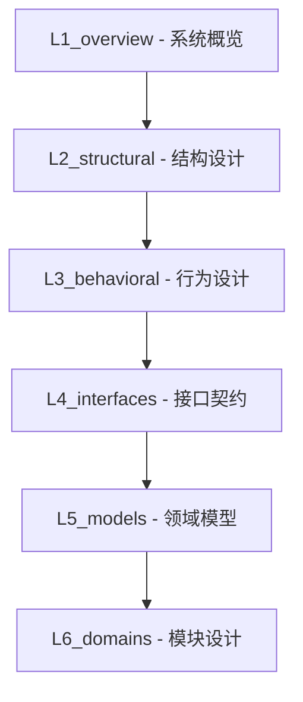

# DeP2P 内部设计文档（Design）

> **定位**：DeP2P 的内部 Source of Truth —— 协议规范、架构设计、需求追溯、测试治理、发布管理的统一中心。
>
> **更新日期**：2026-01-15

---

## 目录结构

```
design/
├── README.md                      # 本文件：入口与阅读路径
├── SUMMARY.md                     # 全目录索引
│
├── 01_context/                    # 【背景】需求 + 参考 + 决策
│   ├── requirements/              # 需求文档
│   ├── references/                # 参考研究（iroh、libp2p 分析）
│   └── decisions/                 # ADR 架构决策记录
│
├── 02_constraints/                # 【约束】协议规范 + 工程标准
│   ├── protocol/                  # 协议规范（身份、传输、网络、应用）
│   └── engineering/               # 工程标准（编码、测试规范）
│
├── 03_architecture/               # 【架构】六层结构
│   ├── L1_overview/               # 系统概览（定位、边界、术语）
│   ├── L2_structural/             # 结构设计（分层、依赖、C4 可视化）
│   ├── L3_behavioral/             # 行为设计（流程、状态机）
│   ├── L4_interfaces/             # 接口契约
│   ├── L5_models/                 # 领域模型（核心设计）
│   └── L6_domains/                # 模块设计（代码级，含实现状态）
│
├── 04_delivery/                   # 【交付】测试 + 发布 + 安全
│   ├── testing/                   # 测试策略与用例
│   ├── release/                   # 发布流程
│   └── security/                  # 安全防护
│
├── 05_governance/                 # 【治理】提案 + 版本策略
│
├── 06_guides/                     # 【指南】开发指南
│
├── templates/                     # 模板库
├── _discussions/                  # 讨论记录
└── _archive/                      # 归档
```

---

## 目录逻辑

```
01_context/        → 为什么做（需求、参考、决策）
02_constraints/    → 什么约束（协议规范、工程标准）
03_architecture/   → 怎么设计（视图、模型、模块、实现状态）
04_delivery/       → 怎么保障（测试、发布、安全）
05_governance/     → 怎么治理
06_guides/         → 怎么开发
```

---

## 03_architecture 六层结构



| 层次 | 目录 | 职责 | 读者 |
|------|------|------|------|
| L1 | `L1_overview/` | 系统定位、边界、术语 | 管理层、业务方 |
| L2 | `L2_structural/` | 结构设计（分层、依赖、C4 可视化） | 架构师 |
| L3 | `L3_behavioral/` | 行为设计（流程、状态机） | 架构师、开发者 |
| L4 | `L4_interfaces/` | 接口契约（API、协议） | 开发者、集成方 |
| L5 | `L5_models/` | 领域模型（核心业务设计） | 核心开发者 |
| L6 | `L6_domains/` | 模块设计（代码级实现、状态追踪） | 模块开发者 |

---

## 阅读路径

### 新人入门

1. 阅读 [01_context/decisions/](01_context/decisions/) 了解关键架构决策
2. 阅读 [03_architecture/L1_overview/](03_architecture/L1_overview/) 了解系统全貌
3. 阅读 [03_architecture/L2_structural/c4/](03_architecture/L2_structural/c4/) 了解架构图

### 深入架构

1. 阅读 [03_architecture/L2_structural/](03_architecture/L2_structural/) 了解分层和依赖
2. 阅读 [03_architecture/L3_behavioral/](03_architecture/L3_behavioral/) 了解核心流程
3. 阅读 [03_architecture/L5_models/](03_architecture/L5_models/) 了解领域设计

### 开发实现

1. 阅读 [02_constraints/](02_constraints/) 了解开发规范
2. 阅读 [03_architecture/L4_interfaces/](03_architecture/L4_interfaces/) 了解接口契约
3. 阅读 [03_architecture/L6_domains/](03_architecture/L6_domains/) 了解模块设计和实现状态

---

## 代码目录结构

> 代码目录采用 `internal/` + `pkg/` 分层结构，符合 Go 社区标准实践。
> 
> **架构**: 五层架构（API、Protocol、Realm、Core、Discovery）

```
dep2p/
├── cmd/                     # 命令入口
│   ├── dep2p/               # 主程序
│   └── relay-server/        # 中继服务器
│
├── config/                  # 配置管理（统一归口）
│
├── pkg/                     # 公开接口（可被外部项目导入）
│   ├── interfaces/          # 核心接口契约（扁平命名：host.go, messaging.go 等）
│   ├── types/               # 统一类型定义
│   ├── proto/               # 协议编码
│   ├── crypto/              # 加密工具
│   └── multiaddr/           # 多地址
│
├── internal/                # 内部实现（不可被外部导入）
│   ├── protocol/            # Protocol Layer - 协议层（面向应用）
│   │   ├── messaging/       # 点对点消息
│   │   ├── pubsub/          # 发布订阅（GossipSub）
│   │   ├── streams/         # 流管理
│   │   └── liveness/        # 存活检测（Ping）
│   │
│   ├── realm/               # Realm Layer - 业务隔离层
│   │   ├── auth/            # 成员认证（PSK/Cert）
│   │   ├── member/          # 成员管理
│   │   ├── routing/         # 域内路由
│   │   └── gateway/         # 域网关（Relay）
│   │
│   ├── core/                # Core Layer - P2P 核心能力
│   │   ├── host/            # 网络主机（门面）
│   │   ├── identity/        # 身份管理
│   │   ├── transport/       # 传输层（QUIC/TCP）
│   │   ├── security/        # 安全层（TLS/Noise）
│   │   ├── muxer/           # 多路复用
│   │   ├── swarm/           # 连接群管理
│   │   ├── connmgr/         # 连接管理
│   │   ├── relay/           # 中继服务
│   │   └── nat/             # NAT 穿透
│   │
│   └── discovery/           # Discovery Layer - 节点发现与广播
│       ├── coordinator/     # 发现协调器
│       ├── dht/             # DHT 发现
│       ├── bootstrap/       # 引导节点
│       ├── mdns/            # 局域网发现
│       └── rendezvous/      # 命名空间发现
│
├── examples/                # 示例代码
├── tests/                   # 集成测试
├── docs/                    # 对外文档
└── design/                  # 内部设计（本目录）
```

---

## 五层架构概览

```
┌─────────────────────────────────────────────────────────────────────────────┐
│                         DeP2P 五层架构                                       │
├─────────────────────────────────────────────────────────────────────────────┤
│                                                                             │
│  API Layer (根目录)   面向应用开发者的入口                                    │
│       ↓              Node / Options / Config                               │
│                                                                             │
│  Protocol Layer      面向应用的通信服务                                       │
│       ↓              Messaging / PubSub / Streams / Liveness               │
│                                                                             │
│  Realm Layer         业务隔离与成员管理                                       │
│       ↓              Auth / Member / Routing / Gateway                     │
│                                                                             │
│  Core Layer          P2P 网络核心能力                                         │
│       ↕              Host / Identity / Transport / Security / Relay / NAT  │
│                                                                             │
│  Discovery Layer     节点发现与广播                                           │
│                      Coordinator / DHT / Bootstrap / mDNS / Rendezvous     │
│                                                                             │
│  依赖规则: API → Protocol → Realm → Core ↔ Discovery                        │
│                                                                             │
└─────────────────────────────────────────────────────────────────────────────┘
```

---

## 文档体系定位

```
┌────────────────────────────────────────────────────────────────────┐
│                        DeP2P 文档分层                               │
├────────────────────────────────────────────────────────────────────┤
│  docs/          对外文档（用户手册、API 参考、教程）                  │
│  ─────────────────────────────────────────────────────────────────  │
│  design/        内部 Source of Truth（本目录）                       │
│                 - 协议规范、架构设计、需求注册表                      │
│                 - 测试策略、发布流程                                 │
│                 - ADR、系统不变量                                    │
│  ─────────────────────────────────────────────────────────────────  │
│  design/_archive/  旧文档归档（_design/ 和 _docs/ 已归档于此）       │
└────────────────────────────────────────────────────────────────────┘
```

---

## 用户心智模型

用户只需要理解两个核心对象：**Node**（节点）和 **Realm**（域）。

```
用户操作路径（三步）：
─────────────────────

Step 1: 启动节点        node := dep2p.Start(ctx, dep2p.Desktop())
Step 2: 加入域          realm := node.JoinRealm(ctx, key)
Step 3: 业务通信        realm.Messaging() / realm.PubSub() / realm.Streams()
```

| 对象 | 职责 | 核心 API |
|------|------|----------|
| **Node** | 我是谁、我在哪、加入哪个域 | `ID()`, `Addrs()`, `JoinRealm()`, `Close()` |
| **Realm** | 域内成员、通信服务入口 | `Members()`, `Messaging()`, `PubSub()`, `Streams()`, `Liveness()` |

详见 [L1_overview/core_concepts.md](03_architecture/L1_overview/core_concepts.md)

---

## 核心约束

| 约束 | 说明 |
|------|------|
| **单节点单域** | 一个节点只能加入一个 Realm |
| **多协议支持** | Messaging/Streams 支持多协议，PubSub 支持多主题 |
| **域内通信** | 所有业务通信必须在 Realm 上下文中 |
| **隐藏底层** | 用户不接触 DHT、连接池、传输层等 |
| **域级视图** | 用户只能看到域内的成员，不是全网节点 |

---

## DeP2P 核心概念

DeP2P 是一个现代化的 P2P 网络库，核心设计理念：

| 概念 | 说明 |
|------|------|
| **身份优先** | 每个节点拥有唯一的密钥对，NodeID = 公钥哈希 |
| **Realm 隔离** | 逻辑网络隔离，使用 PSK 认证，单节点单域 |
| **中继分层** | 统一 Relay（控制面/数据面） |
| **协议命名空间** | 统一的协议 ID 规范 `/dep2p/...` |
| **五层架构** | API、Protocol、Realm、Core、Discovery 分工明确 |

---

## 相关文档

- [SUMMARY.md](SUMMARY.md) - 全目录索引
- [01_context/decisions/](01_context/decisions/) - 架构决策记录
- [03_architecture/](03_architecture/) - 架构设计（六层结构）
- [03_architecture/L1_overview/core_concepts.md](03_architecture/L1_overview/core_concepts.md) - 核心概念与用户 API

---

**最后更新**：2026-01-15
