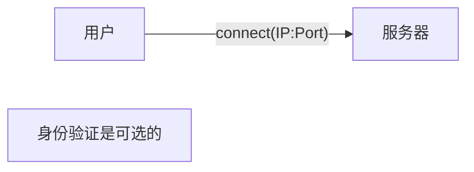
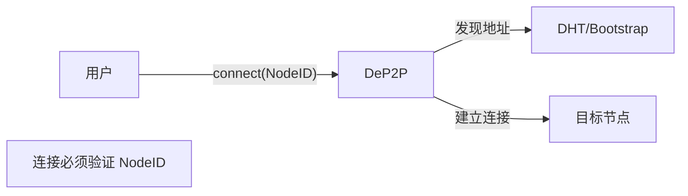
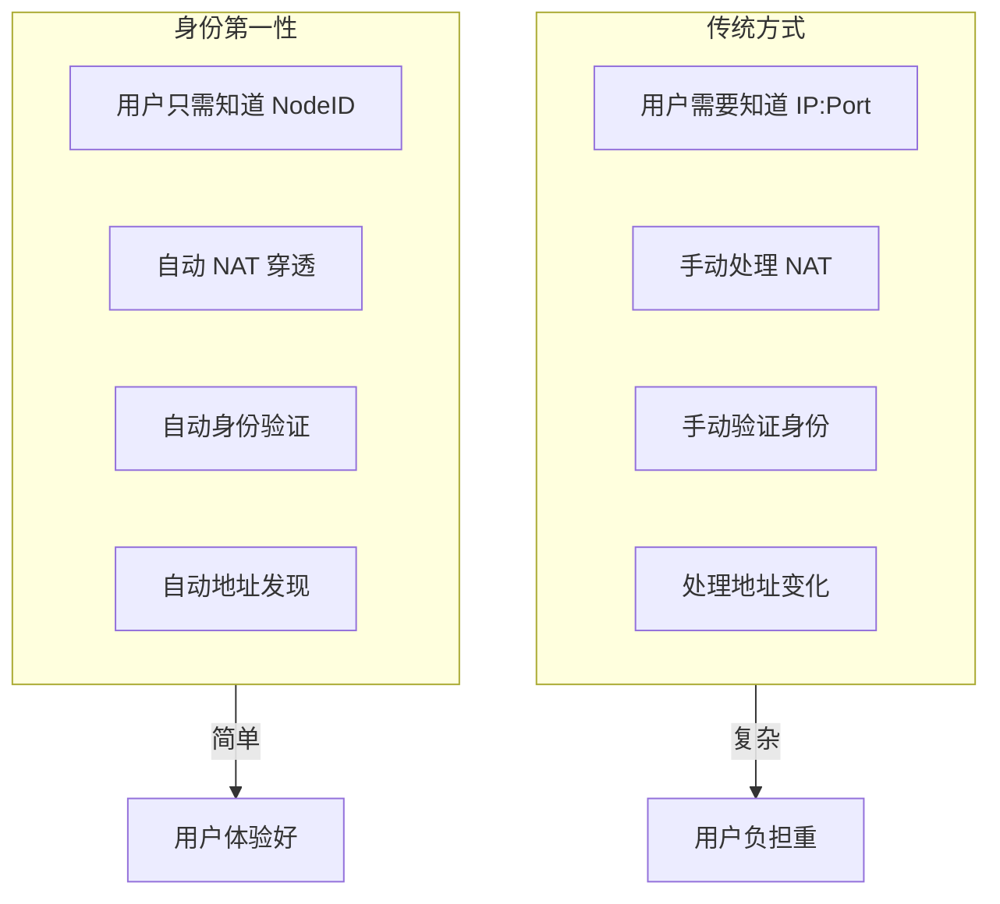
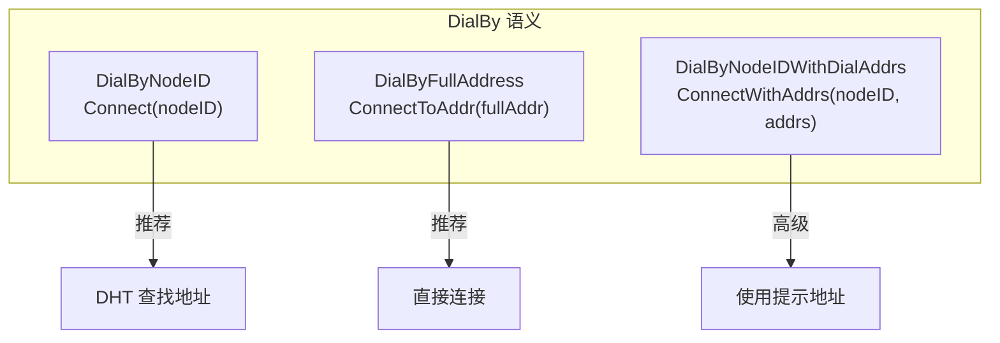

# ADR-0001: 身份第一性原则

## 元数据

| 属性 | 值 |
|------|-----|
| 状态 | ✅ Accepted |
| 决策日期 | 2024-01-15 |
| 决策者 | DeP2P 核心团队 |
| 相关 ADR | - |

---

## 上下文

在设计 DeP2P 网络库时，我们需要决定连接的基本抽象是什么：是传统的 IP 地址连接，还是基于身份的连接。

### 问题背景

传统网络编程中，连接是基于 IP 地址和端口的：

```go
// 传统方式
conn, err := net.Dial("tcp", "192.168.1.100:4001")
```

这种方式存在以下问题：

1. **身份验证困难**：IP 地址不能证明对端身份
2. **NAT 环境复杂**：IP 地址可能变化或不可达
3. **无法验证连接目标**：中间人攻击难以防范
4. **移动性差**：设备切换网络后地址变化

### 决策驱动因素

- **安全性**：需要确保连接到正确的节点
- **去中心化**：不依赖中心化的身份服务
- **移动性**：支持设备在不同网络间切换
- **简单性**：用户 API 应该简单直观

---

## 考虑的选项

### 选项 1: 传统 IP 连接方式

维持传统的基于 IP 地址的连接模型，身份验证作为可选层。



**优点**:
- 与现有网络编程模型一致
- 实现简单
- 无需地址发现机制

**缺点**:
- 身份验证复杂，容易被忽略
- 无法保证连接到正确节点
- NAT 环境下难以使用
- 不支持移动性

### 选项 2: 身份第一性（Identity First）

所有连接都以节点身份（NodeID，派生自公钥）为目标，IP 地址只是到达节点的路径提示。



**优点**:
- 安全性内置：连接必须验证身份
- 自动处理 NAT 和地址变化
- 支持移动性
- API 更简洁

**缺点**:
- 需要地址发现机制（DHT）
- 初始连接需要 Bootstrap
- 实现复杂度增加

---

## 决策结果

选择 **选项 2: 身份第一性**。

### 核心决策

> **在 DeP2P 中，连接目标永远是 NodeID（公钥身份），IP/端口只是 Dial Address（拨号路径提示）。**

### 决策理由

1. **安全性是 P2P 网络的核心需求**
   - 身份验证应该是默认行为，不是可选项
   - 用户不应该需要额外配置才能获得安全连接

2. **NAT 穿透是 P2P 的核心挑战**
   - 身份第一性允许系统自动处理地址发现和 NAT
   - 用户只需知道目标节点的 ID

3. **API 简洁性**
   - `connect(nodeID)` 比 `connect(ip, port, verifyID)` 更直观
   - 减少用户犯错的机会



---

## 后果

### 正面后果

1. **安全性保证**
   - 所有连接都必须验证 RemoteIdentity == ExpectedNodeID
   - 中间人攻击被自动阻止

2. **移动性支持**
   - 节点可以在不同网络间切换
   - 只要 NodeID 不变，就能被找到

3. **NAT 透明**
   - 用户不需要关心 NAT 类型
   - 系统自动选择最佳连接路径

4. **简洁 API**
   ```go
   // 简单直观的 API
   err := node.Connect(ctx, targetNodeID)
   ```

5. **去中心化**
   - 不依赖中心化的身份服务
   - NodeID 由公钥派生，自我证明

### 负面后果

1. **需要地址发现机制**
   - 必须实现 DHT 或其他发现机制
   - Bootstrap 节点是必需的

2. **冷启动问题**
   - 首次连接需要知道至少一个地址
   - 需要 Bootstrap 或手动提供地址

3. **实现复杂度**
   - 需要实现地址簿、DHT、NAT 穿透等
   - 比简单的 TCP 连接复杂

### 缓解措施

| 负面后果 | 缓解措施 |
|----------|----------|
| 地址发现 | 内置 DHT 和 Bootstrap 机制 |
| 冷启动 | 提供 Preset 配置和默认 Bootstrap 节点 |
| 实现复杂 | 封装在 Layer 1，对用户透明 |

---

## 三条连接语义

基于身份第一性，DeP2P 定义三条确定性连接语义：



| 语义 | API | 适用场景 | 用户可见 |
|------|-----|---------|---------|
| DialByNodeID | `Connect(nodeID)` | 常规业务 | ✅ 推荐 |
| DialByFullAddress | `ConnectToAddr(fullAddr)` | 冷启动/分享 | ✅ 推荐 |
| DialByNodeIDWithDialAddrs | `ConnectWithAddrs(nodeID, addrs)` | 高级/运维 | ❌ 隐藏 |

---

## 不变量

此决策产生以下系统不变量：

> **INV-001**: 任何连接都 MUST 验证 `RemoteIdentity == ExpectedNodeID`。

违反此不变量将导致：
- 安全漏洞
- 连接被拒绝
- 系统行为不可预测

---

## 代码示例

### 正确使用

```go
// ✅ 正确：连接到 NodeID
err := node.Connect(ctx, targetNodeID)

// ✅ 正确：使用完整地址（包含 NodeID）
fullAddr := "/ip4/1.2.3.4/udp/4001/quic-v1/p2p/12D3KooW..."
err := node.ConnectToAddr(ctx, fullAddr)
```

### 错误使用

```go
// ❌ 错误：DeP2P 不支持纯 IP 连接
err := node.Connect(ctx, "192.168.1.100:4001")

// ❌ 错误：不验证身份的连接
conn, _ := net.Dial("tcp", addr) // 这不是 DeP2P 的方式
```

---

## 相关文档

- [核心概念：身份第一性](../../docs/zh/concepts/core-concepts.md#身份优先identity-first)
- [身份协议规范](../protocols/foundation/identity.md)
- [系统不变量 INV-001](../invariants/INV-001-identity-first.md)
- [需求 REQ-CONN-001](../requirements/REQ-CONN-001.md)

---

## 备注

### 与 libp2p 的对比

libp2p 也采用类似的身份第一性设计，这验证了这种方法在 P2P 系统中的有效性。DeP2P 在此基础上：

- 更强调 NodeID 的唯一性
- 提供更简洁的 API
- 三层架构更清晰

### 未来演进

如果需要支持匿名连接（不验证身份），应该：

1. 创建新的 ADR 讨论此需求
2. 考虑作为独立的连接模式
3. 不影响默认的身份第一性行为
