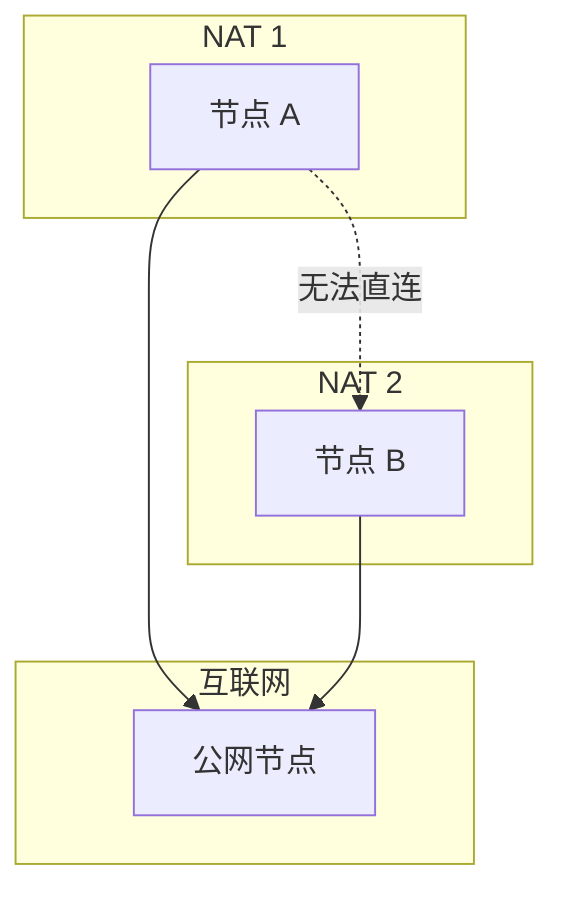
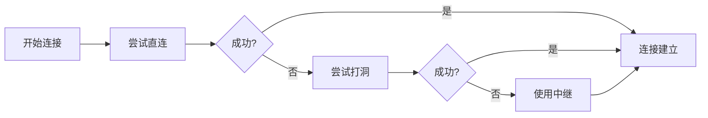
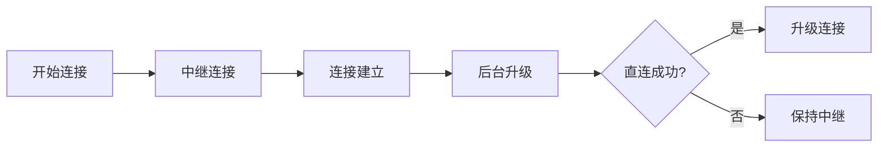
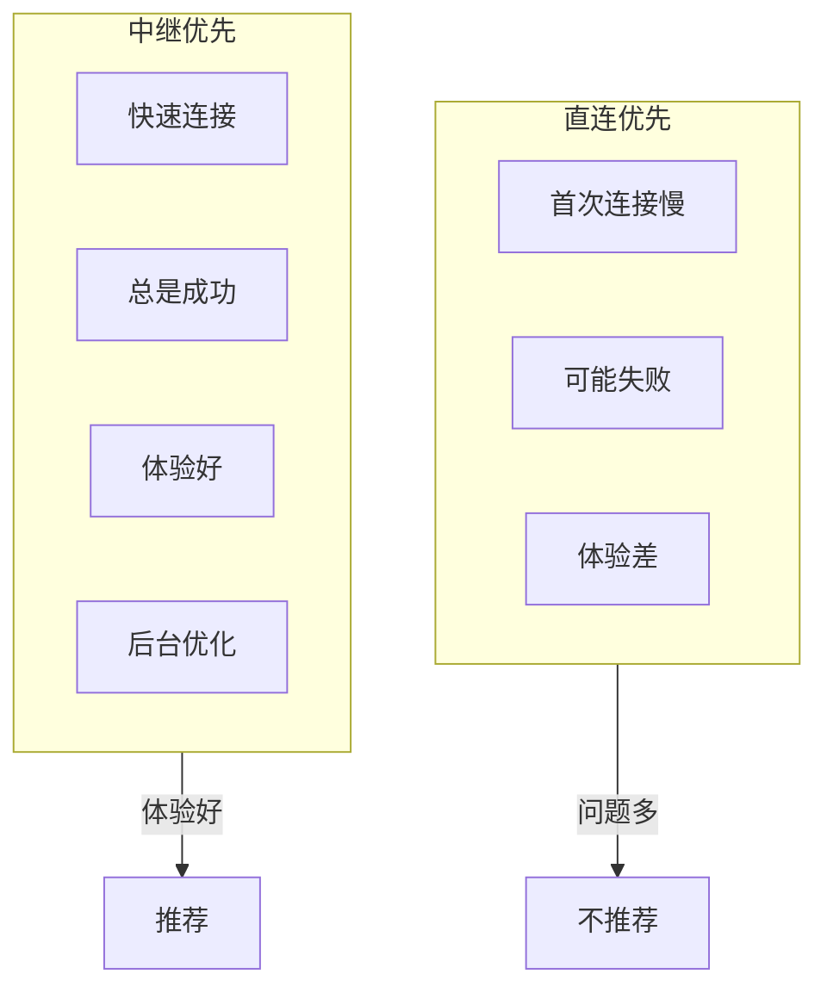
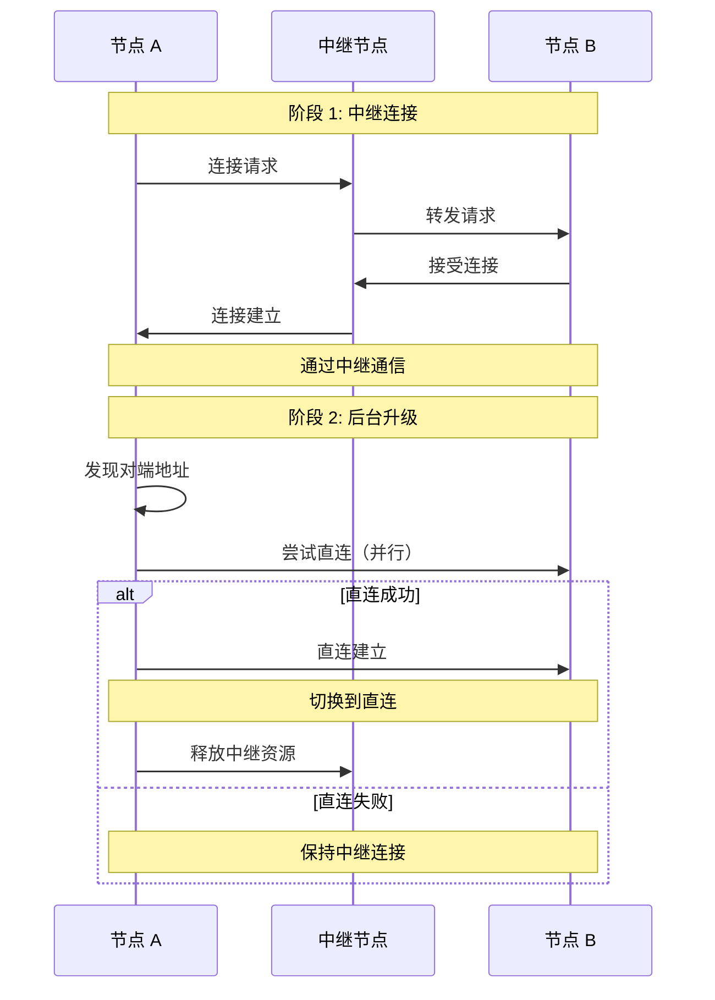
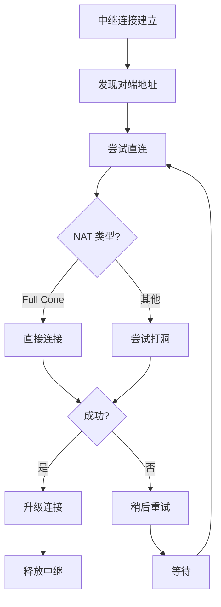
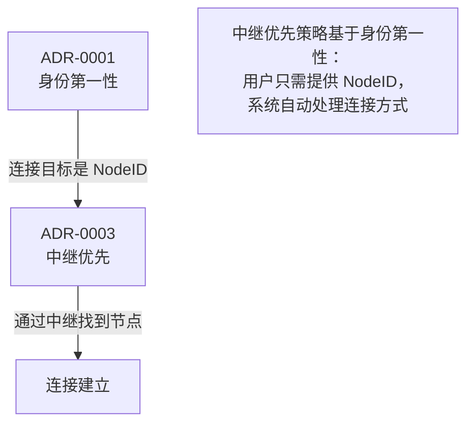

# ADR-0003: 中继优先连接策略

## 元数据

| 属性 | 值 |
|------|-----|
| 状态 | ✅ Accepted |
| 决策日期 | 2024-01-20 |
| 决策者 | DeP2P 核心团队 |
| 相关 ADR | [ADR-0001](0001-identity-first.md) |

---

## 上下文

在设计 DeP2P 的连接策略时，我们需要决定如何处理 NAT 环境下的节点连接。

### 问题背景

互联网上大多数设备位于 NAT 后面：

- 家庭路由器
- 企业防火墙
- 移动网络

NAT 使得节点间直接连接变得困难。P2P 系统需要解决这个问题。



### 决策驱动因素

- **连接成功率**：用户期望连接总是成功
- **用户体验**：连接应该快速建立
- **资源效率**：避免不必要的资源消耗
- **简单性**：用户不应该需要配置 NAT

---

## 考虑的选项

### 选项 1: 直连优先，中继兜底

首先尝试直接连接和 NAT 穿透，失败后才使用中继。



**优点**:
- 直连时资源效率最高
- 不消耗中继资源

**缺点**:
- 首次连接慢（需要多次尝试）
- 用户体验不一致
- 某些 NAT 环境下频繁失败

### 选项 2: 中继优先，直连升级

首先通过中继建立连接，然后在后台尝试升级到直连。



**优点**:
- 连接总是快速成功
- 用户体验一致
- 后台优化不影响应用

**缺点**:
- 初期消耗中继资源
- 需要中继基础设施
- 某些连接可能无法升级

---

## 决策结果

选择 **选项 2: 中继优先，直连升级**。

### 核心决策

> **连接首先通过中继建立，确保快速成功；然后在后台尝试升级到直连，优化性能。**

### 决策理由

1. **用户体验优先**
   - 用户期望 `Connect()` 快速返回
   - 不应该等待多次 NAT 穿透尝试

2. **连接成功率**
   - 中继连接几乎总是成功
   - 避免 "无法连接" 的沮丧体验

3. **透明优化**
   - 直连升级在后台进行
   - 应用层无需感知

4. **现实网络情况**
   - 大多数设备在 NAT 后
   - 直连成功率较低
   - 先中继再优化是务实选择



---

## 后果

### 正面后果

1. **快速连接**
   ```go
   // 连接几乎立即成功（通过中继）
   err := node.Connect(ctx, targetID)
   // 后台自动尝试升级到直连
   ```

2. **高成功率**
   - 只要中继可用，连接就能成功
   - 避免复杂的 NAT 穿透失败处理

3. **用户透明**
   - 应用不需要知道是中继还是直连
   - 升级过程完全透明

4. **渐进优化**
   - 随着直连成功，性能自动提升
   - 不需要用户干预

### 负面后果

1. **中继资源消耗**
   - 初期所有连接都经过中继
   - 需要足够的中继容量

2. **延迟可能较高**
   - 中继连接比直连延迟高
   - 某些应用可能受影响

3. **中继依赖**
   - 需要可靠的中继基础设施
   - 中继不可用时无法连接

### 缓解措施

| 负面后果 | 缓解措施 |
|----------|----------|
| 中继资源 | 积极的直连升级，减少中继占用 |
| 延迟 | 尽快升级到直连 |
| 中继依赖 | 支持多中继，自动切换 |

---

## 连接升级流程



---

## 配置选项

虽然默认采用中继优先，但支持配置调整：

```go
// 默认配置：中继优先
node, _ := dep2p.NewNode(
    dep2p.WithRelayFirst(true),      // 默认
    dep2p.WithAutoUpgrade(true),     // 自动升级
)

// 高级配置：直连优先（不推荐）
node, _ := dep2p.NewNode(
    dep2p.WithRelayFirst(false),     // 直连优先
    dep2p.WithRelayFallback(true),   // 失败时回退到中继
)

// 仅中继（特殊场景）
node, _ := dep2p.NewNode(
    dep2p.WithRelayOnly(true),       // 仅使用中继
)
```

---

## 升级策略

### 触发条件

直连升级在以下情况触发：

1. **连接建立后**
   - 立即开始后台升级尝试

2. **地址发现时**
   - 通过 DHT 发现新地址
   - 通过 Identify 协议获取地址

3. **定期重试**
   - 定期尝试升级失败的连接

### 升级流程



---

## 代码示例

### 用户代码（无需关心细节）

```go
// 用户只需要调用 Connect
err := node.Connect(ctx, targetID)
if err != nil {
    log.Fatal(err)
}

// 连接可能是中继的，但对用户透明
err = node.Send(ctx, targetID, "/app/chat", []byte("hello"))
```

### 检查连接类型（可选）

```go
// 高级用户可以检查连接类型
conn := node.Connection(targetID)
if conn != nil {
    switch conn.Type() {
    case dep2p.ConnTypeRelay:
        log.Info("通过中继连接")
    case dep2p.ConnTypeDirect:
        log.Info("直接连接")
    }
}
```

### 等待直连（可选）

```go
// 如果应用需要低延迟，可以等待直连
ctx, cancel := context.WithTimeout(context.Background(), 10*time.Second)
defer cancel()

err := node.WaitDirect(ctx, targetID)
if err != nil {
    log.Warn("无法建立直连，使用中继")
}
```

---

## 与其他 ADR 的关系



---

## 相关文档

- [中继协议规范](../protocols/transport/relay.md)
- [NAT 穿透协议](../protocols/network/nat.md)
- [如何使用中继](../../docs/zh/how-to/use-relay.md)
- [NAT 穿透配置](../../docs/zh/how-to/nat-traversal.md)

---

## 备注

### 与其他 P2P 系统的对比

| 系统 | 连接策略 |
|------|----------|
| WebRTC | ICE 框架，多候选并行 |
| libp2p | 可配置，默认直连优先 |
| IPFS | 使用 libp2p，直连优先 |
| DeP2P | 中继优先，直连升级 |

DeP2P 选择中继优先是基于用户体验的考量。对于大多数应用，快速建立连接比最优延迟更重要。

### 性能数据

基于测试数据：

| 场景 | 直连优先首次连接 | 中继优先首次连接 |
|------|------------------|------------------|
| 双方公网 | 100ms | 150ms |
| 一方 NAT | 2-5s | 200ms |
| 双方 NAT | 5-30s 或失败 | 200ms |

中继优先在 NAT 环境下有显著优势。

### 未来演进

1. **智能路由**
   - 基于历史数据选择最优路径
   - 预测直连成功率

2. **多中继**
   - 选择延迟最低的中继
   - 中继故障自动切换

3. **QUIC 0-RTT**
   - 利用 0-RTT 加速直连升级
   - 减少升级延迟
