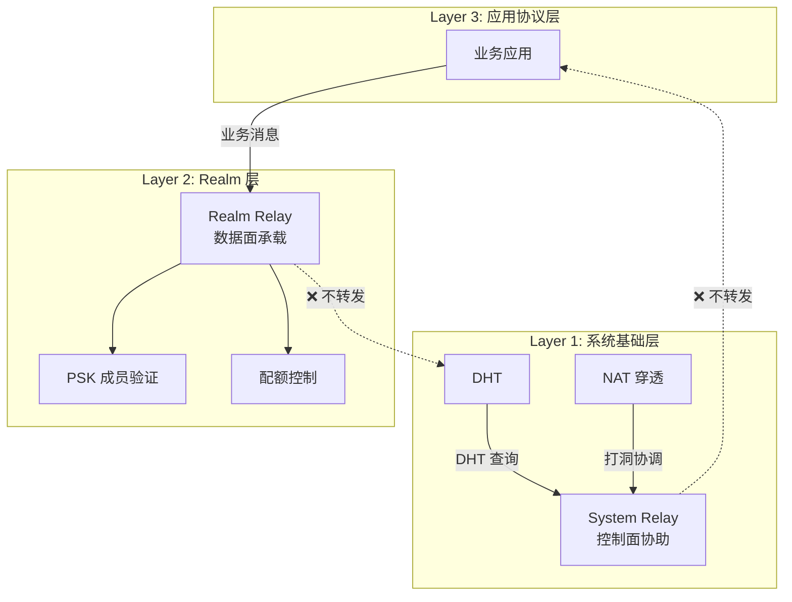

# ADR-0004: 控制面/数据面分离

## 元数据

| 属性 | 值 |
|------|-----|
| 编号 | ADR-0004 |
| 标题 | 控制面/数据面分离 |
| 状态 | ✅ Accepted |
| 日期 | 2025-12-28 |
| 关联不变量 | [INV-003](../invariants/INV-003-control-data-separation.md) |
| 关联讨论 | [DISC-1227-relay-isolation](../discussions/DISC-1227-relay-isolation.md) |

---

## 背景

在 DeP2P 的中继设计讨论中，发现了一个核心矛盾：Layer 1 的全局中继无法区分业务边界，导致 Realm 隔离被"穿透"。

### 问题场景

```
场景：A 和 B 在 Realm-X，但无法直连，需要中继 C

┌─────────┐                ┌─────────┐                ┌─────────┐
│  Node A │ ──────────────▶│ Relay C │──────────────▶ │  Node B │
│ Realm-X │   业务消息      │ Realm-Y │   业务消息      │ Realm-X │
└─────────┘                └─────────┘                └─────────┘
                                ▲
                                │
                 问题：
                 1. C 不在 Realm-X，但承担了 Realm-X 的带宽成本
                 2. C 可能看到 Realm-X 的流量模式（即使加密）
                 3. 打破了 Realm 业务隔离的设计初衷
```

### 外部启发

借鉴 [tunnelto](https://github.com/agrinman/tunnelto) 等隧道服务的设计，它们明确区分：

- **控制连接（WebSocket）**：用于协调、心跳、元数据交换
- **数据通道（TCP）**：用于承载实际业务流量

这种分离提供了清晰的职责边界和成本归属。

---

## 决策

**采用控制面/数据面分离的分层中继架构。**

### 核心原则

1. **System Relay（Layer 1）是"控制面/协助面"**
   - 职责：打洞协调、地址验证、DHT 辅助、Bootstrap
   - 不承载业务数据

2. **Realm Relay（Layer 2）是"数据面承载"**
   - 职责：业务消息转发
   - 必须做成员证明、配额控制、可观测

3. **协议前缀强制隔离**
   - `/dep2p/sys/*` → 只能走 System Relay
   - `/dep2p/app/<realmID>/*` → 只能走对应 Realm Relay
   - 违反时返回 `ErrProtocolNotAllowed`

### 架构图



---

## 考虑的替代方案

### 方案 1：全局统一中继

所有流量使用同一套中继，不区分控制面/数据面。

**优点**：
- 实现简单
- 无需维护两套中继

**缺点**：
- 成本分配不合理：非 Realm 成员承担业务流量成本
- 隔离被打破：业务数据流经非业务成员
- 安全风险：流量模式可能泄露业务信息
- 资源滥用难以控制

**结论**：❌ 拒绝

### 方案 2：仅 Realm Relay

取消 System Relay，所有流量都走 Realm Relay。

**优点**：
- 简化架构

**缺点**：
- Bootstrap 问题：节点加入 Realm 前如何获得中继？
- DHT 问题：跨 Realm 的 DHT 查询无法进行
- 打洞协调问题：需要先加入 Realm 才能打洞

**结论**：❌ 拒绝

### 方案 3：分层中继 + 协议前缀隔离（采用）

System Relay 只处理控制面协议，Realm Relay 只处理数据面协议。

**优点**：
- 成本归属清晰
- 隔离边界明确
- 可观测性分离
- 安全策略分离

**缺点**：
- 实现复杂度略增
- 需要维护协议白名单

**结论**：✅ 采用

---

## 后果

### 正面后果

1. **业务数据隔离**
   - 业务数据永远不会"泄露"到 Realm 外部节点
   - 非 Realm 成员无法看到业务流量模式

2. **成本归属合理**
   - 控制面：公共基础设施承担（轻量）
   - 数据面：Realm 成员承担（合理，因为他们受益）

3. **可观测性清晰**
   - 控制面监控：打洞成功率、DHT 延迟
   - 数据面监控：业务吞吐、成员活跃度

4. **安全策略分离**
   - 控制面：速率限制、时长限制（防滥用）
   - 数据面：PSK 验证、配额控制（业务保障）

### 负面后果

1. **实现复杂度增加**
   - 需要维护两套中继逻辑
   - 需要实现协议前缀检查

2. **Realm 内中继依赖**
   - 如果 Realm 内没有愿意提供中继的成员，业务连接可能失败
   - 不会 fallback 到 System Relay

3. **协议命名规范要求**
   - 所有协议必须遵循命名规范
   - 错误的协议前缀会被拒绝

---

## 实现指南

### 协议前缀检查

```go
// System Relay 协议验证
func (r *SystemRelay) validateProtocol(proto types.ProtocolID) error {
    if !strings.HasPrefix(string(proto), "/dep2p/sys/") {
        return ErrProtocolNotAllowed
    }
    return nil
}

// Realm Relay 协议验证
func (r *RealmRelay) validateProtocol(proto types.ProtocolID) error {
    appPrefix := fmt.Sprintf("/dep2p/app/%s/", r.realmID)
    realmPrefix := fmt.Sprintf("/dep2p/realm/%s/", r.realmID)
    
    p := string(proto)
    if !strings.HasPrefix(p, appPrefix) && !strings.HasPrefix(p, realmPrefix) {
        return ErrProtocolNotAllowed
    }
    return nil
}
```

### 连接建立流程

```
A 连接 B（同 Realm）完整流程：

1. 地址发现（通过 DHT，可能经 System Relay 中转查询）
2. 尝试直连
3. 直连失败 → 通过 System Relay 协调打洞
4. 打洞失败 → 使用 Realm Relay 转发业务数据
5. 无 Realm Relay 可用 → 连接失败（不 fallback 到 System Relay）
```

### 配置项

```go
// System Relay 默认限制
var SystemRelayDefaults = RelayLimits{
    MaxBandwidth:  10 * 1024,      // 10 KB/s
    MaxDuration:   60 * time.Second,
    MaxCircuits:   128,
}

// Realm Relay 默认限制（可由提供者配置）
var RealmRelayDefaults = RelayLimits{
    MaxBandwidth:  0,              // 无限制
    MaxDuration:   0,              // 无限制
    MaxCircuits:   64,
}
```

---

## 相关文档

- [INV-003: 控制面/数据面分离](../invariants/INV-003-control-data-separation.md)
- [DISC-1227: 分层中继设计](../discussions/DISC-1227-relay-isolation.md)
- [中继协议规范](../protocols/transport/relay.md)
- [三层架构详解](../architecture/layers.md)

---

## 变更历史

| 版本 | 日期 | 变更 |
|------|------|------|
| 1.0 | 2025-12-28 | 初始版本 |

