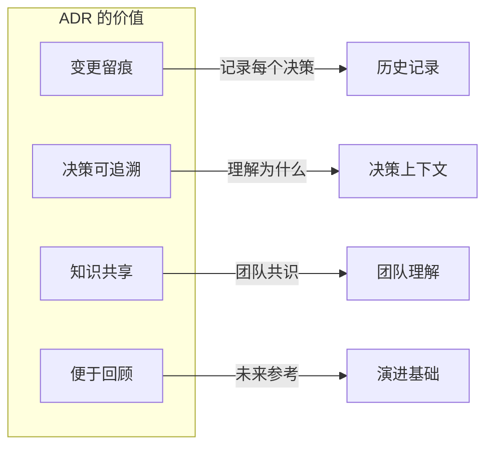
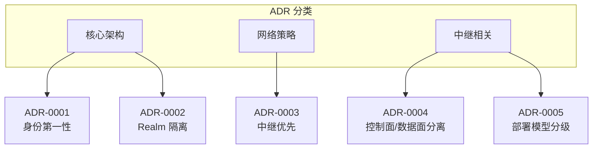
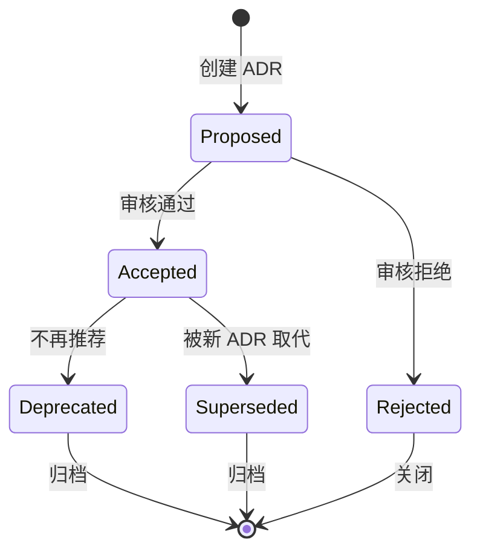
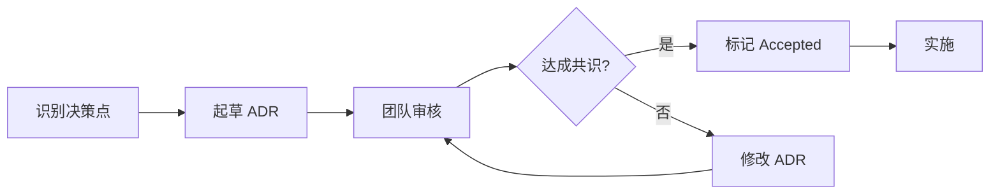
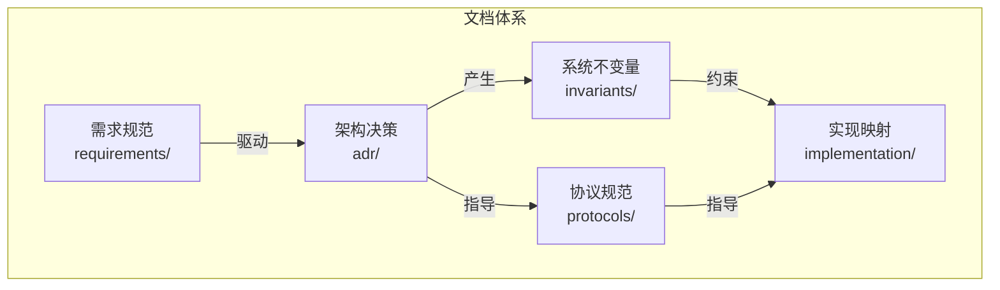

# 架构决策记录（ADR）

本目录包含 DeP2P 项目的架构决策记录，用于追踪重要的技术和架构决策。

---

## 概述

### 什么是 ADR

ADR（Architecture Decision Record）是一种记录架构决策的轻量级方法。每个 ADR 描述一个重要的架构决策，包括其上下文、考虑的选项、决策结果和后果。

### 为什么需要 ADR



| 价值 | 描述 |
|------|------|
| 变更留痕 | 所有重要决策都有记录 |
| 决策可追溯 | 理解"为什么这样设计" |
| 知识共享 | 新成员快速了解决策背景 |
| 便于回顾 | 未来重新评估决策的基础 |

---

## ADR 索引

### 当前决策

| 编号 | 标题 | 状态 | 日期 |
|------|------|------|------|
| [ADR-0001](0001-identity-first.md) | 身份第一性原则 | ✅ Accepted | 2024-01 |
| [ADR-0002](0002-realm-isolation.md) | 严格单 Realm 隔离 | ✅ Accepted | 2024-01 |
| [ADR-0003](0003-relay-first-connect.md) | 中继优先连接策略 | ✅ Accepted | 2024-01 |
| [ADR-0004](0004-control-data-separation.md) | 控制面/数据面分离原则 | ✅ Accepted | 2025-12 |
| [ADR-0005](0005-relay-deployment-models.md) | Relay 部署模型分级 | ✅ Accepted | 2025-12 |

### 按类别分类



---

## ADR 状态说明

| 状态 | 标记 | 描述 |
|------|------|------|
| Proposed | 📝 | 提议中，等待讨论和审核 |
| Accepted | ✅ | 已接受，正在或将要实施 |
| Deprecated | ⚠️ | 已废弃，不再推荐使用 |
| Superseded | 🔄 | 已被其他 ADR 取代 |

### 状态生命周期



---

## ADR 模板

创建新的 ADR 时，请使用以下模板：

```markdown
# ADR-XXXX: [决策标题]

## 元数据

| 属性 | 值 |
|------|-----|
| 状态 | Proposed / Accepted / Deprecated / Superseded |
| 决策日期 | YYYY-MM-DD |
| 决策者 | [决策者列表] |
| 相关 ADR | [相关 ADR 链接] |

---

## 上下文

[描述问题背景和为什么需要做这个决策]

---

## 决策驱动因素

- [因素 1]
- [因素 2]
- [因素 3]

---

## 考虑的选项

### 选项 1: [选项名称]

[描述选项]

**优点**:
- [优点 1]
- [优点 2]

**缺点**:
- [缺点 1]
- [缺点 2]

### 选项 2: [选项名称]

[描述选项]

**优点**:
- [优点 1]
- [优点 2]

**缺点**:
- [缺点 1]
- [缺点 2]

---

## 决策结果

选择 **选项 X**，因为 [理由]。

---

## 后果

### 正面后果

- [正面后果 1]
- [正面后果 2]

### 负面后果

- [负面后果 1]
- [负面后果 2]

### 中性后果

- [中性后果 1]

---

## 相关文档

- [需求文档](../requirements/REQ-XXX.md)
- [协议规范](../protocols/xxx.md)
- [不变量](../invariants/INV-XXX.md)

---

## 备注

[任何额外的备注或讨论记录]
```

---

## 如何编写 ADR

### 编写流程



### 编写指南

1. **标题清晰**
   - 使用动词短语描述决策
   - 例如："采用身份第一性原则"

2. **上下文完整**
   - 描述问题背景
   - 说明为什么需要决策
   - 列出约束条件

3. **选项详尽**
   - 列出所有考虑的选项
   - 每个选项都有优缺点分析
   - 不要只列出最终选择

4. **后果诚实**
   - 明确列出正面和负面后果
   - 不要隐藏缺点
   - 说明如何缓解负面后果

5. **链接完整**
   - 链接到相关的需求文档
   - 链接到相关的协议规范
   - 链接到相关的不变量

---

## ADR 与其他文档的关系



| 关系 | 说明 |
|------|------|
| 需求 → ADR | 需求驱动架构决策 |
| ADR → 不变量 | 决策产生系统约束 |
| ADR → 协议 | 决策指导协议设计 |
| 不变量 → 实现 | 约束指导代码实现 |

---

## 最佳实践

### DO

- ✅ 在做出重要决策时立即记录
- ✅ 包含足够的上下文信息
- ✅ 诚实记录所有考虑的选项
- ✅ 明确说明正面和负面后果
- ✅ 链接到相关文档

### DON'T

- ❌ 不要在实施后才补充 ADR
- ❌ 不要隐藏负面后果
- ❌ 不要只记录最终选择
- ❌ 不要忽略上下文信息
- ❌ 不要修改已接受的 ADR（应创建新的）

---

## 相关文档

- [设计文档导航](../README.md)
- [需求规范](../requirements/README.md)
- [系统不变量](../invariants/README.md)
- [协议规范](../protocols/README.md)
