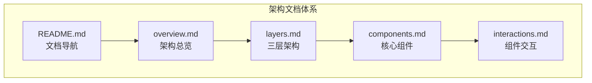

# 架构设计

本目录包含 DeP2P 的系统架构设计文档。

---

## 概述

架构设计文档的目标是：

- **稳定**：架构决策一旦确定，尽量少变更
- **少变更**：只有重大设计变化才更新
- **可引用**：提供清晰的章节锚点，便于其他文档引用



---

## 文档列表

| 文档 | 说明 |
|------|------|
| [overview.md](overview.md) | 架构总览，高层视图和设计理念 |
| [layers.md](layers.md) | 三层架构详解，各层职责和边界 |
| [components.md](components.md) | 核心组件，各组件的职责和接口 |
| [interactions.md](interactions.md) | 组件交互，交互流程和时序 |

---

## 架构概览

DeP2P 采用三层架构设计：

```
┌─────────────────────────────────────────────────────────────────────┐
│                    DeP2P 三层架构                                    │
├─────────────────────────────────────────────────────────────────────┤
│                                                                      │
│  ┌─────────────────────────────────────────────────────────────┐   │
│  │  Layer 3: 应用协议层 (Application Protocols)                 │   │
│  │  /dep2p/app/* 协议（必须 JoinRealm 后才能使用）                │   │
│  └─────────────────────────────────────────────────────────────┘   │
│                              ▲                                       │
│  ┌─────────────────────────────────────────────────────────────┐   │
│  │  Layer 2: Realm 层 (Business Isolation)                      │   │
│  │  业务隔离、成员管理、准入控制（需显式 JoinRealm）               │   │
│  └─────────────────────────────────────────────────────────────┘   │
│                              ▲                                       │
│  ┌─────────────────────────────────────────────────────────────┐   │
│  │  Layer 1: 系统基础层 (Infrastructure)                        │   │
│  │  Transport/Security/DHT/Relay/NAT/Bootstrap（启动自动就绪）   │   │
│  └─────────────────────────────────────────────────────────────┘   │
│                                                                      │
└─────────────────────────────────────────────────────────────────────┘
```

| 层次 | 名称 | 职责 | 用户感知 |
|------|------|------|---------|
| Layer 1 | 系统基础层 | Transport/DHT/Relay/NAT | 无（静默运行）|
| Layer 2 | Realm 层 | 业务隔离、成员管理 | 主动操作（JoinRealm）|
| Layer 3 | 应用协议层 | 消息发送、发布订阅 | 完全感知 |

---

## 阅读指南


**建议阅读顺序**：

1. **[架构总览](overview.md)**
   - 了解整体设计理念
   - 理解三层架构概念

2. **[三层架构详解](layers.md)**
   - 深入理解各层职责
   - 了解层间边界

3. **[核心组件](components.md)**
   - 了解各组件职责
   - 理解组件接口

4. **[组件交互](interactions.md)**
   - 理解组件间协作
   - 了解关键流程

---

## 术语约定

| 术语 | 说明 |
|------|------|
| **Layer 编号** | 仅用于三层架构（Layer 1/2/3） |
| **sys scope** | 系统作用域（Layer 1 协议） |
| **realm scope** | Realm 作用域（Layer 2/3 协议） |
| **协议前缀** | `/dep2p/sys/*` 或 `/dep2p/app/*` |

---

## 相关文档

| 类型 | 链接 |
|------|------|
| 需求规范 | [requirements/README.md](../requirements/README.md) |
| 协议规范 | [protocols/README.md](../protocols/README.md) |
| 架构决策 | [adr/README.md](../adr/README.md) |
| 系统不变量 | [invariants/README.md](../invariants/README.md) |
