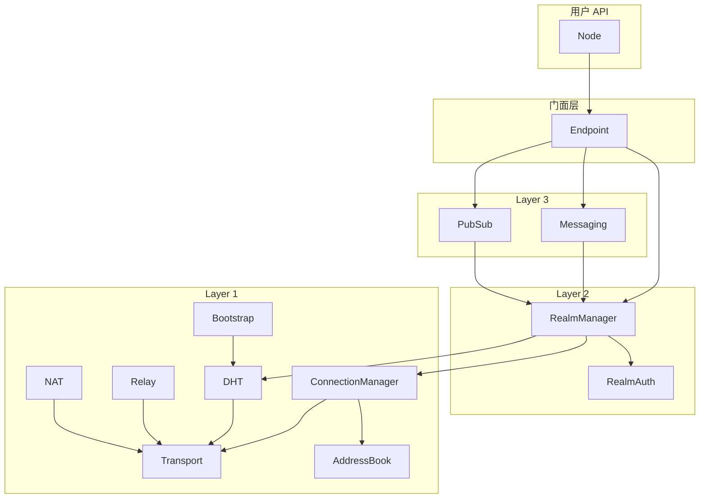
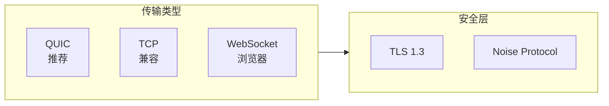
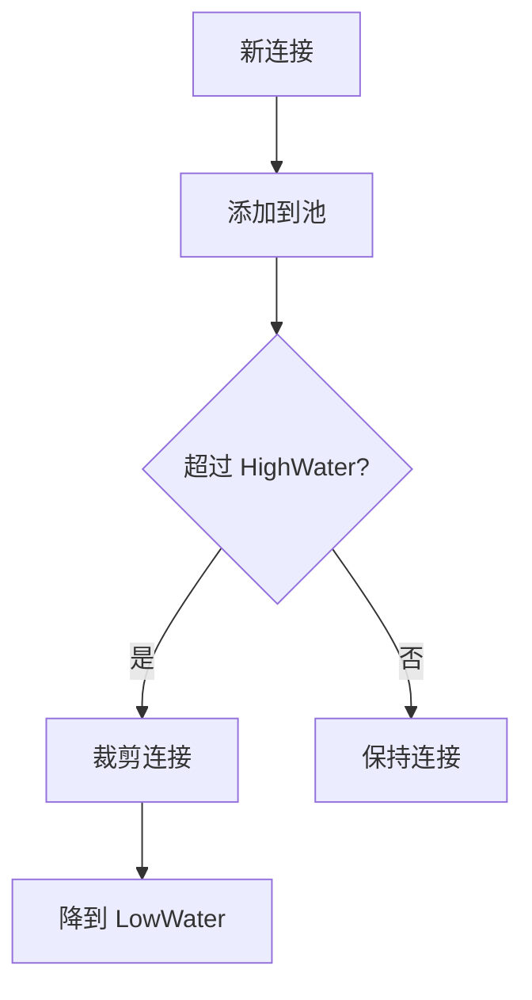
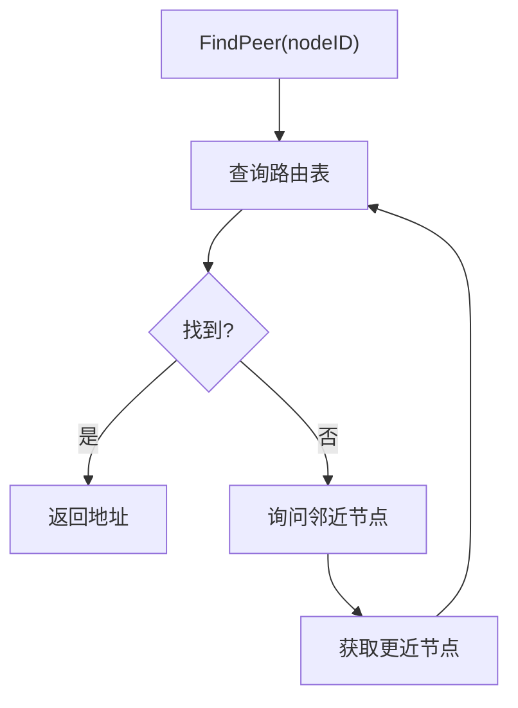
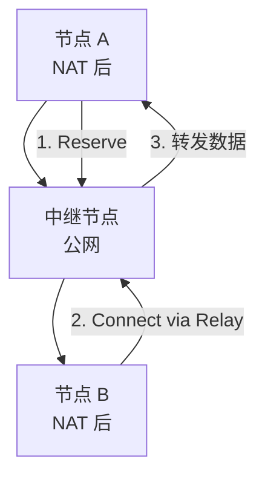
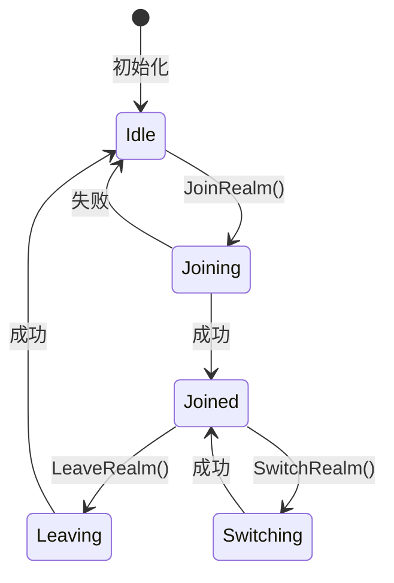
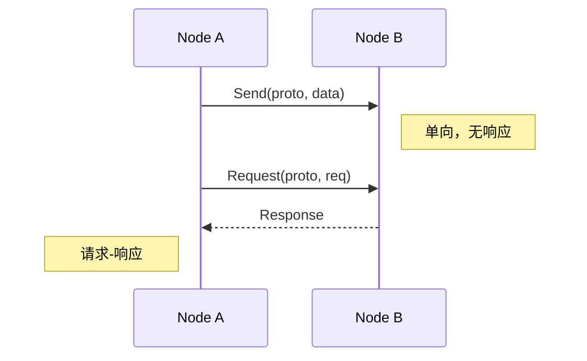
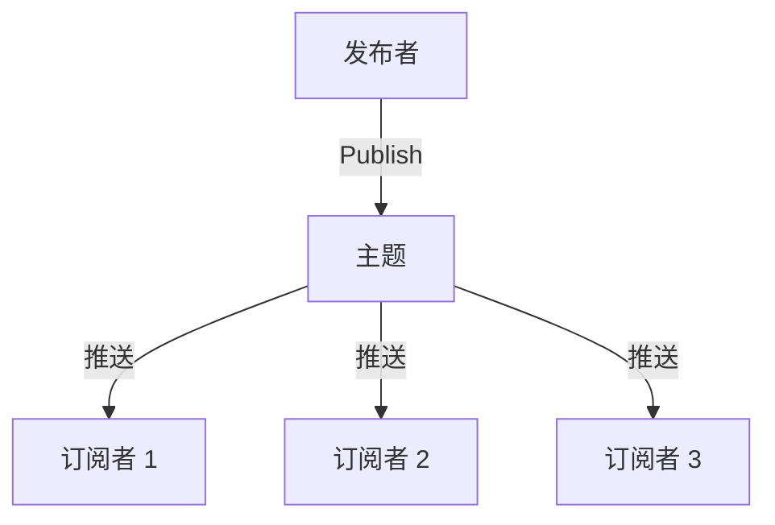
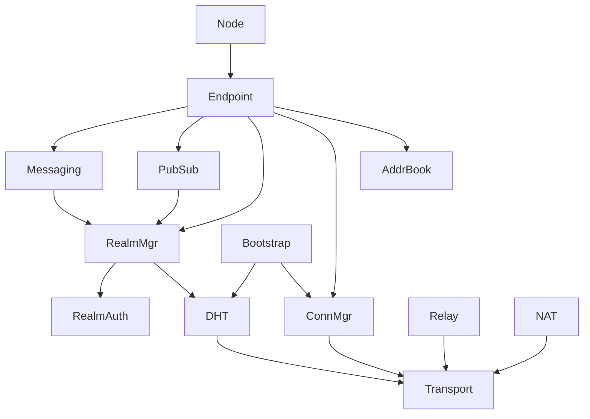

# 核心组件

本文档详细描述 DeP2P 各核心组件的职责和接口。

---

## 组件概览



---

## 门面组件

### Node

用户使用的主要入口，封装了 Endpoint 的复杂性。

```go
type Node interface {
    // 身份
    ID() NodeID
    
    // 连接
    Connect(ctx context.Context, peerID NodeID) (Connection, error)
    ConnectToAddr(ctx context.Context, fullAddr string) (Connection, error)
    
    // Realm
    JoinRealm(ctx context.Context, realmID string, opts ...JoinOption) error
    LeaveRealm(ctx context.Context) error
    CurrentRealm() string
    
    // 消息
    Send(ctx context.Context, peerID NodeID, proto string, data []byte) error
    Request(ctx context.Context, peerID NodeID, proto string, req []byte) ([]byte, error)
    
    // 订阅
    Publish(ctx context.Context, topic string, data []byte) error
    Subscribe(ctx context.Context, topic string, handler Handler) (*Subscription, error)
    
    // 生命周期
    Close() error
}
```

| 职责 | 说明 |
|------|------|
| 简化 API | 提供用户友好的高层 API |
| 封装复杂性 | 隐藏底层实现细节 |
| 门面模式 | 统一的入口点 |

### Endpoint

底层的端点管理，提供更细粒度的控制。

```go
type Endpoint interface {
    // 身份
    ID() NodeID
    PublicKey() crypto.PublicKey
    
    // 连接管理
    Connect(ctx context.Context, peerID NodeID) (Connection, error)
    Connections() []Connection
    
    // 协议处理
    SetProtocolHandler(proto string, handler StreamHandler)
    RemoveProtocolHandler(proto string)
    
    // 地址
    ListenAddrs() []Multiaddr
    ShareableAddrs() []Multiaddr
    
    // 子系统访问
    Discovery() Discovery
    NAT() NATManager
    Relay() RelayManager
    AddressBook() AddressBook
    
    // 生命周期
    Close() error
}
```

---

## Layer 1 组件

### Transport

传输层，负责底层网络连接。



```go
type Transport interface {
    // 监听
    Listen(addr Multiaddr) (Listener, error)
    
    // 拨号
    Dial(ctx context.Context, addr Multiaddr, peerID NodeID) (Connection, error)
    
    // 协议支持
    Protocols() []string
    
    // 关闭
    Close() error
}
```

| 特性 | QUIC | TCP | WebSocket |
|------|------|-----|-----------|
| 多路复用 | ✅ 原生 | ❌ 需要 | ❌ 需要 |
| 0-RTT | ✅ 支持 | ❌ 不支持 | ❌ 不支持 |
| 加密 | ✅ 内置 | 🔧 需配置 | 🔧 需配置 |
| 穿透性 | ✅ UDP | 🔧 TCP | 🔧 HTTP |

### ConnectionManager

连接池管理，负责连接的生命周期。

```go
type ConnectionManager interface {
    // 连接获取
    GetConnection(peerID NodeID) (Connection, bool)
    Connections() []Connection
    
    // 连接管理
    AddConnection(conn Connection)
    RemoveConnection(peerID NodeID)
    
    // 水位线
    HighWater() int
    LowWater() int
    
    // 裁剪
    TrimConnections()
}
```



### AddressBook

地址簿，存储和管理节点地址。

```go
type AddressBook interface {
    // 地址管理
    AddAddrs(peerID NodeID, addrs []Multiaddr, ttl time.Duration)
    Addrs(peerID NodeID) []Multiaddr
    ClearAddrs(peerID NodeID)
    
    // 地址验证
    SetVerified(peerID NodeID, addr Multiaddr)
    VerifiedAddrs(peerID NodeID) []Multiaddr
    
    // 订阅
    Subscribe(peerID NodeID) <-chan AddressChange
}
```

### DHT

分布式哈希表，基于 Kademlia 协议。

```go
type DHT interface {
    // 路由
    FindPeer(ctx context.Context, peerID NodeID) (AddrInfo, error)
    
    // 存储
    PutValue(ctx context.Context, key string, value []byte) error
    GetValue(ctx context.Context, key string) ([]byte, error)
    
    // Provider
    Provide(ctx context.Context, key cid.Cid) error
    FindProviders(ctx context.Context, key cid.Cid) (<-chan AddrInfo, error)
    
    // 路由表
    RoutingTable() RoutingTable
}
```



### Relay

中继服务，用于 NAT 穿透失败时的兜底。

```go
type RelayManager interface {
    // 客户端
    Reserve(ctx context.Context, relay NodeID) error
    Connect(ctx context.Context, target NodeID, relay NodeID) (Connection, error)
    
    // 服务器
    EnableServer() error
    DisableServer()
    
    // 状态
    Reservations() []Reservation
}
```



### NAT

NAT 穿透，管理 NAT 类型检测和穿透。

```go
type NATManager interface {
    // NAT 类型
    GetNATType() NATType
    
    // 端口映射
    RequestMapping(port int) (Multiaddr, error)
    ReleaseMapping(port int) error
    
    // 地址发现
    ObservedAddrs() []Multiaddr
    
    // 打洞
    HolePunch(ctx context.Context, peerID NodeID) error
}
```

| NAT 类型 | 可直连 | 可打洞 | 需中继 |
|----------|--------|--------|--------|
| Full Cone | ✅ | ✅ | - |
| Restricted Cone | ✅ | ✅ | - |
| Port Restricted | 🔧 | ✅ | - |
| Symmetric | ❌ | ❌ | ✅ |

### Bootstrap

引导机制，提供初始节点发现。

```go
type Bootstrap interface {
    // 配置
    AddPeer(addr string) error
    RemovePeer(addr string)
    Peers() []AddrInfo
    
    // 启动
    Start(ctx context.Context) error
    Stop()
    
    // 状态
    IsConnected() bool
    ConnectedPeers() []NodeID
}
```

---

## Layer 2 组件

### RealmManager

Realm 管理器，负责 Realm 的加入、离开和状态管理。

```go
type RealmManager interface {
    // Realm 操作
    JoinRealm(ctx context.Context, realmID string, opts ...JoinOption) error
    LeaveRealm(ctx context.Context) error
    SwitchRealm(ctx context.Context, realmID string) error
    
    // 状态查询
    CurrentRealm() string
    IsMember() bool
    
    // 成员管理
    RealmPeers() []NodeID
    IsRealmPeer(peerID NodeID) bool
}
```



### RealmAuth

Realm 认证，负责准入控制。

```go
type RealmAuth interface {
    // 验证
    Authenticate(ctx context.Context, realmID string, credential Credential) error
    
    // 凭证类型
    SupportedTypes() []CredentialType
    
    // Realm 类型
    RealmType(realmID string) RealmType
}
```

| Realm 类型 | 凭证类型 | 验证方式 |
|------------|----------|----------|
| Public | 无 | 直接加入 |
| Protected | InviteCode | 验证邀请码 |
| Private | Signature | 管理员签名 |

---

## Layer 3 组件

### Messaging

消息服务，提供点对点消息能力。

```go
type Messaging interface {
    // 发送
    Send(ctx context.Context, peerID NodeID, proto string, data []byte) error
    
    // 请求-响应
    Request(ctx context.Context, peerID NodeID, proto string, req []byte) ([]byte, error)
    
    // 处理器
    SetHandler(proto string, handler MessageHandler)
    RemoveHandler(proto string)
}
```



### PubSub

发布订阅服务，提供主题消息能力。

```go
type PubSub interface {
    // 发布
    Publish(ctx context.Context, topic string, data []byte) error
    
    // 订阅
    Subscribe(ctx context.Context, topic string) (*Subscription, error)
    Unsubscribe(topic string) error
    
    // 主题管理
    Topics() []string
    Peers(topic string) []NodeID
}
```



---

## 组件依赖关系



---

## 相关文档

| 文档 | 说明 |
|------|------|
| [架构总览](overview.md) | 高层视图和设计理念 |
| [三层架构详解](layers.md) | 各层职责和边界 |
| [组件交互](interactions.md) | 交互流程和时序 |
