# 组件交互

本文档描述 DeP2P 核心组件间的交互流程和时序。

---

## 交互概览

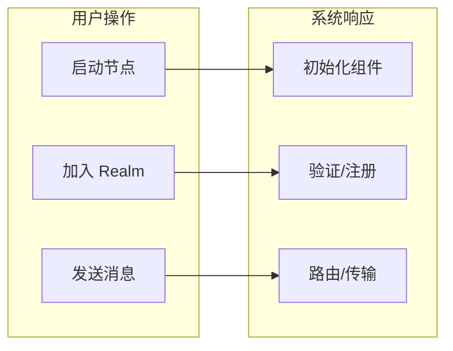

---

## 节点启动流程

### 时序图

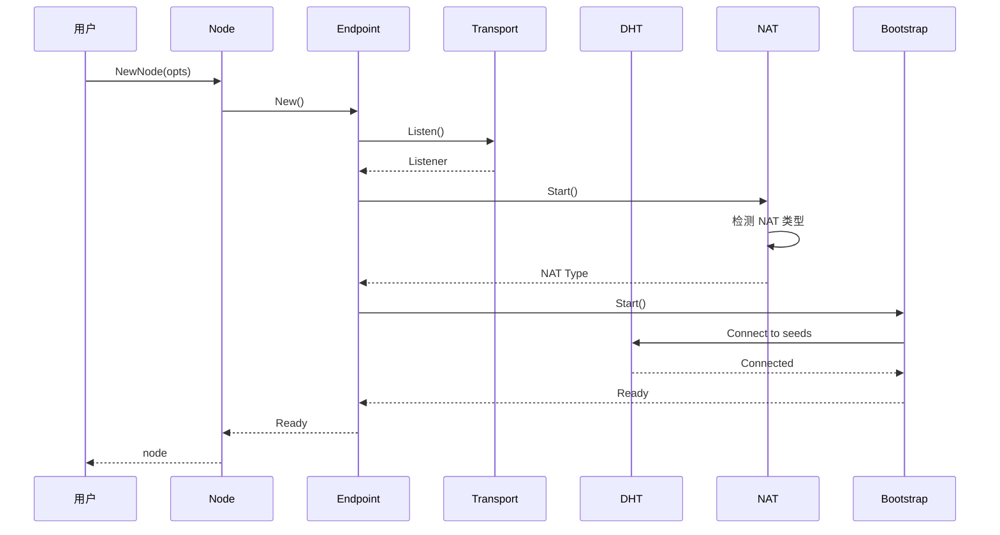

### 流程说明

```
┌─────────────────────────────────────────────────────────────────────────────┐
│                           节点启动流程                                        │
├─────────────────────────────────────────────────────────────────────────────┤
│                                                                              │
│  1. 用户调用 NewNode(opts)                                                   │
│     └─ 解析配置选项                                                          │
│                                                                              │
│  2. 创建 Endpoint                                                            │
│     ├─ 生成或加载身份密钥                                                    │
│     └─ 初始化内部组件                                                        │
│                                                                              │
│  3. 启动 Transport                                                           │
│     ├─ 绑定监听地址                                                          │
│     └─ 准备接受连接                                                          │
│                                                                              │
│  4. 启动 NAT                                                                 │
│     ├─ 检测 NAT 类型                                                         │
│     ├─ 尝试 UPnP/NAT-PMP 端口映射                                            │
│     └─ 发现外部地址                                                          │
│                                                                              │
│  5. 启动 Bootstrap                                                           │
│     ├─ 连接种子节点                                                          │
│     └─ 加入 DHT 网络                                                         │
│                                                                              │
│  6. 返回就绪的 Node                                                          │
│     └─ Layer 1 自动就绪                                                      │
│                                                                              │
└─────────────────────────────────────────────────────────────────────────────┘
```

---

## 连接建立流程

### DialByNodeID 时序图

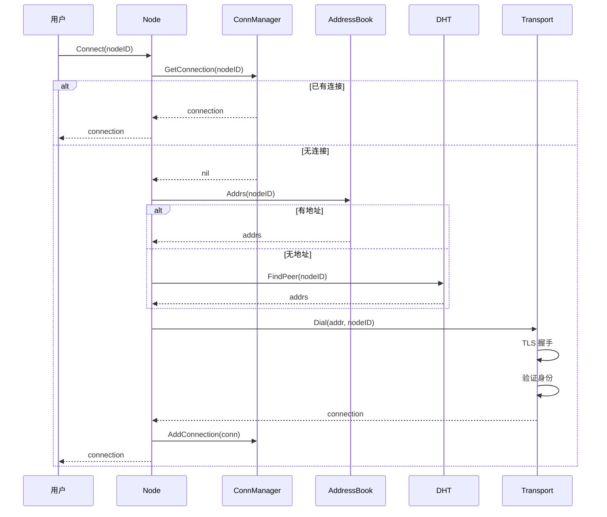

### DialByFullAddress 时序图

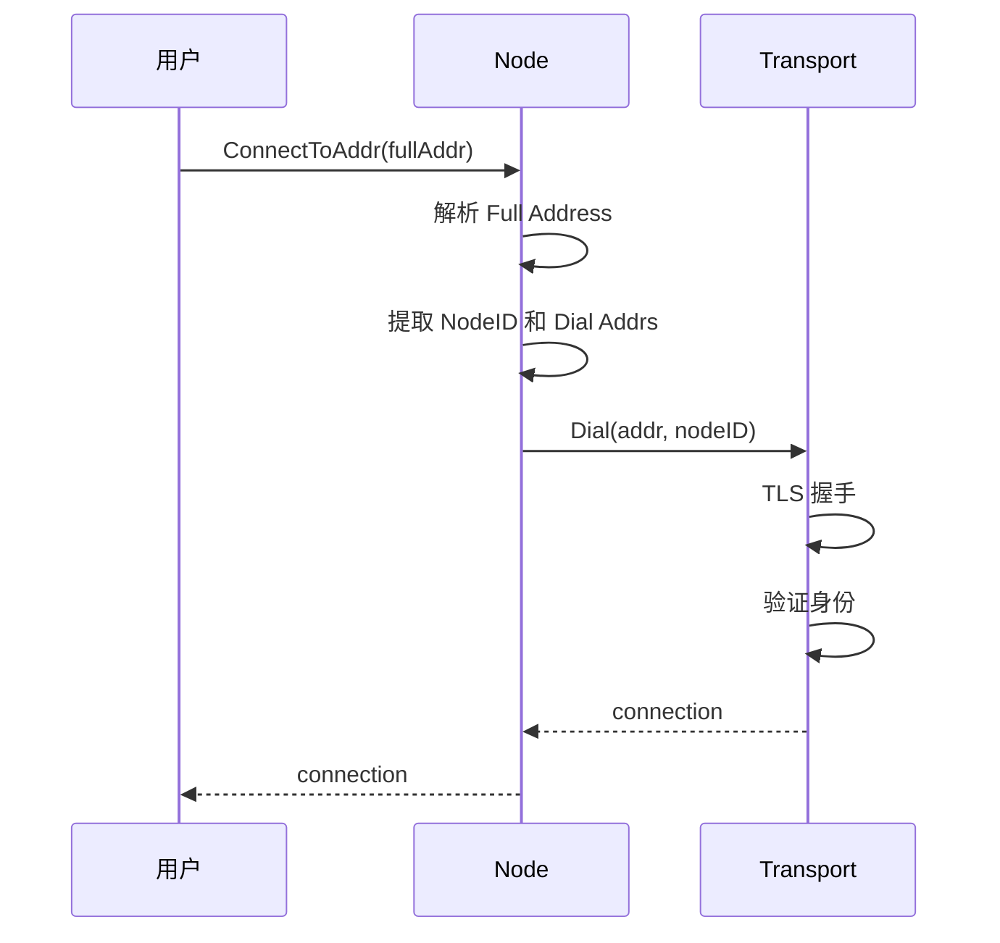

### 连接失败处理

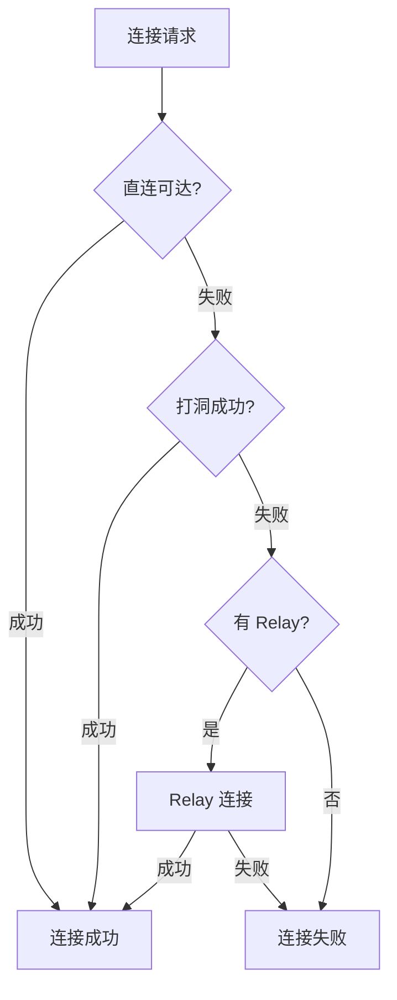

---

## Realm 加入流程

### 时序图

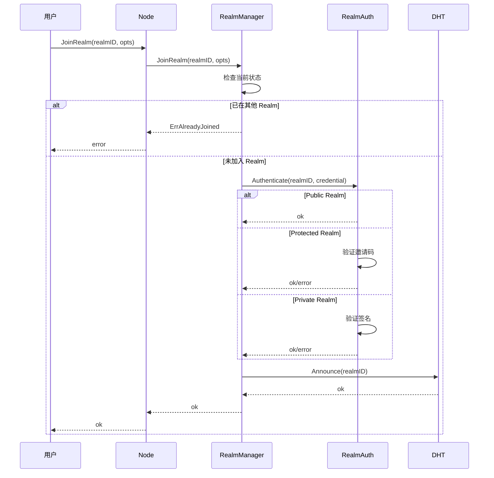

### 状态转换

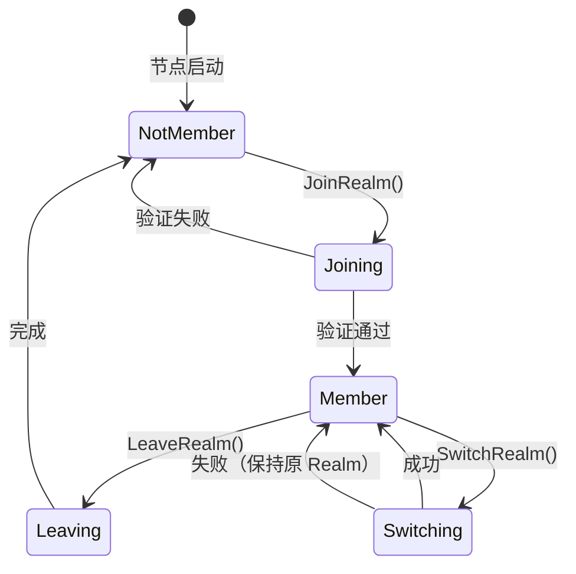

---

## 消息发送流程

### Send 时序图

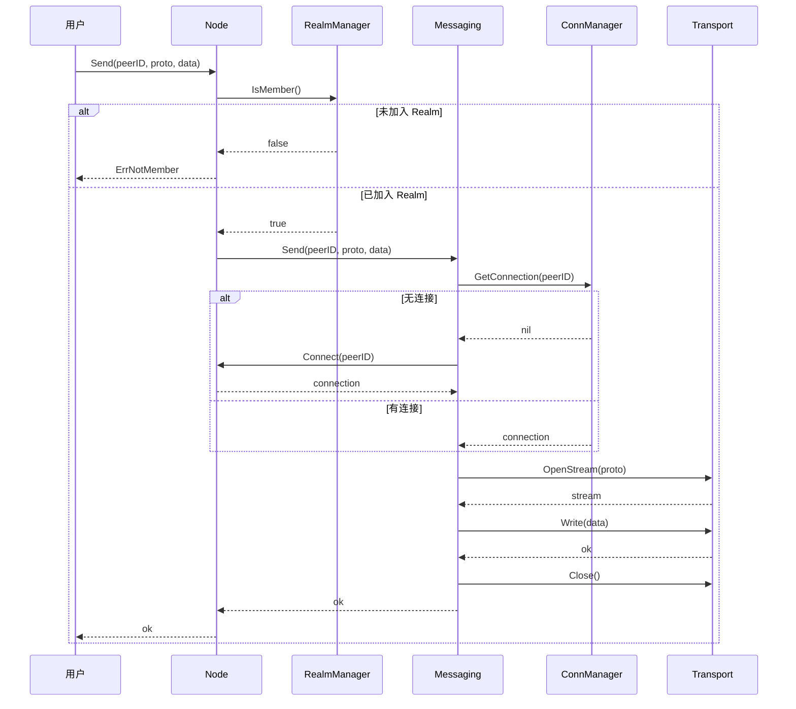

### Request 时序图

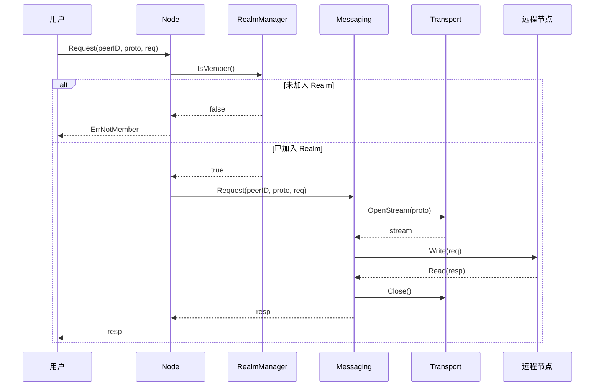

---

## 发现流程

### DHT 发现时序图

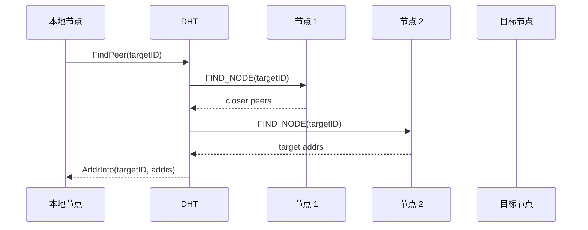

### mDNS 发现时序图

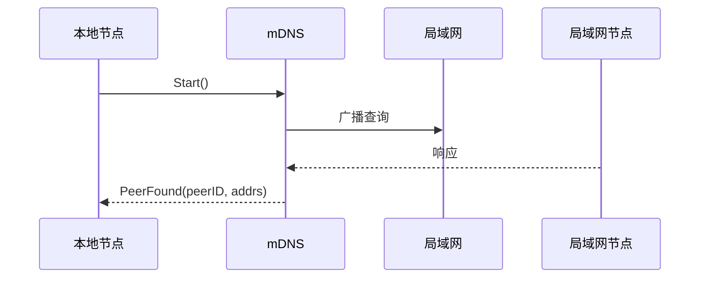

---

## 错误处理流程

### 错误分类

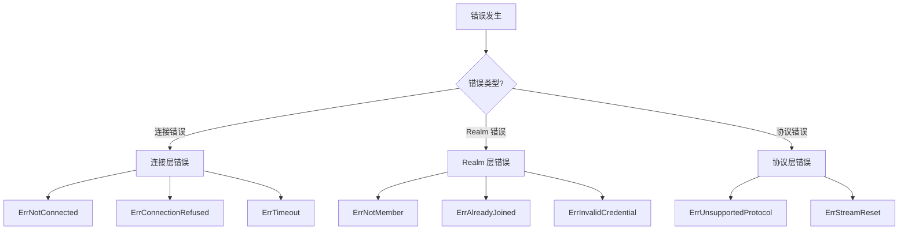

### 重试策略

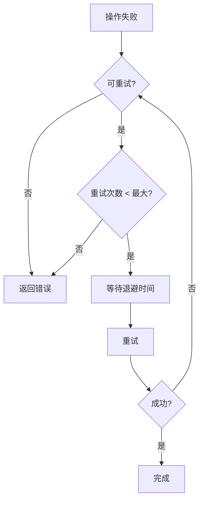

---

## 关键交互总结

| 流程 | 涉及层 | 关键组件 | 前置条件 |
|------|--------|----------|----------|
| 节点启动 | L1 | Transport, DHT, NAT | 无 |
| 连接建立 | L1 | ConnMgr, AddrBook, DHT | 节点就绪 |
| Realm 加入 | L2 | RealmMgr, RealmAuth | 节点就绪 |
| 消息发送 | L3 | Messaging, ConnMgr | 已加入 Realm |
| 发布订阅 | L3 | PubSub, DHT | 已加入 Realm |

---

## 相关文档

| 文档 | 说明 |
|------|------|
| [架构总览](overview.md) | 高层视图和设计理念 |
| [三层架构详解](layers.md) | 各层职责和边界 |
| [核心组件](components.md) | 各组件的职责和接口 |
