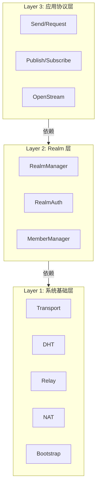
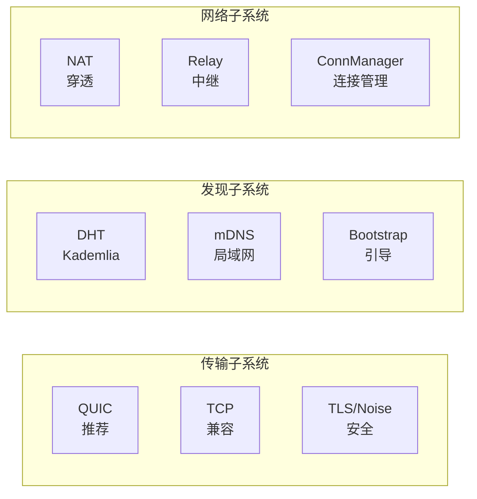
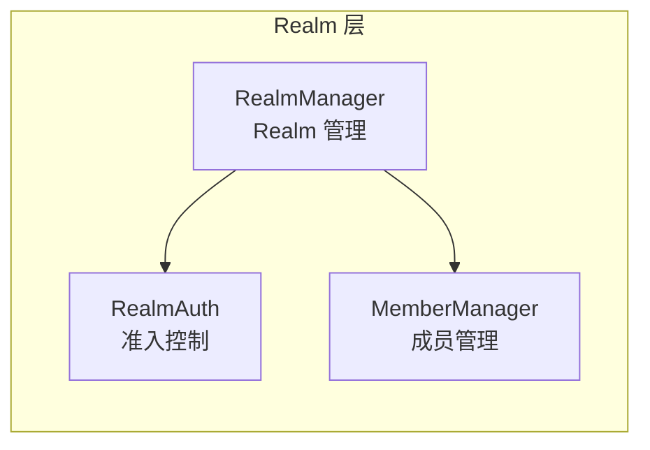
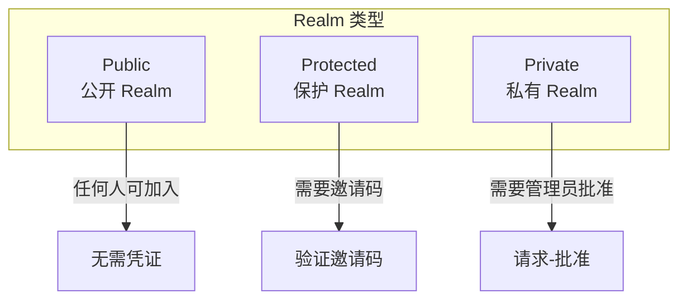
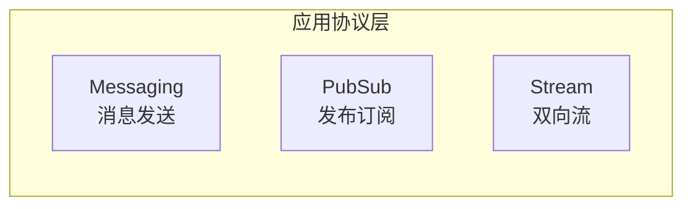
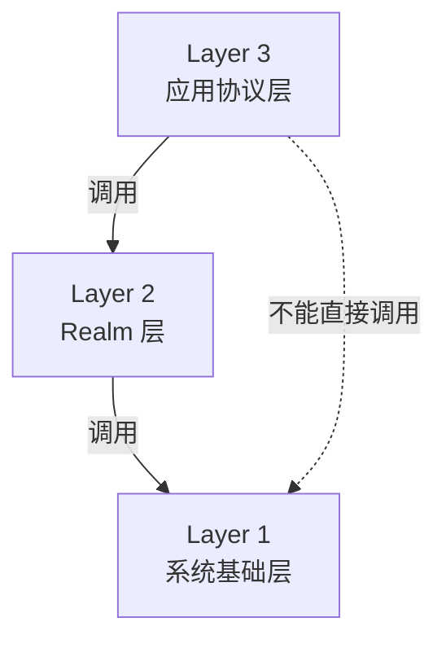
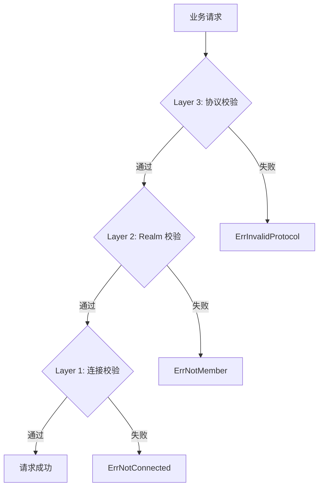
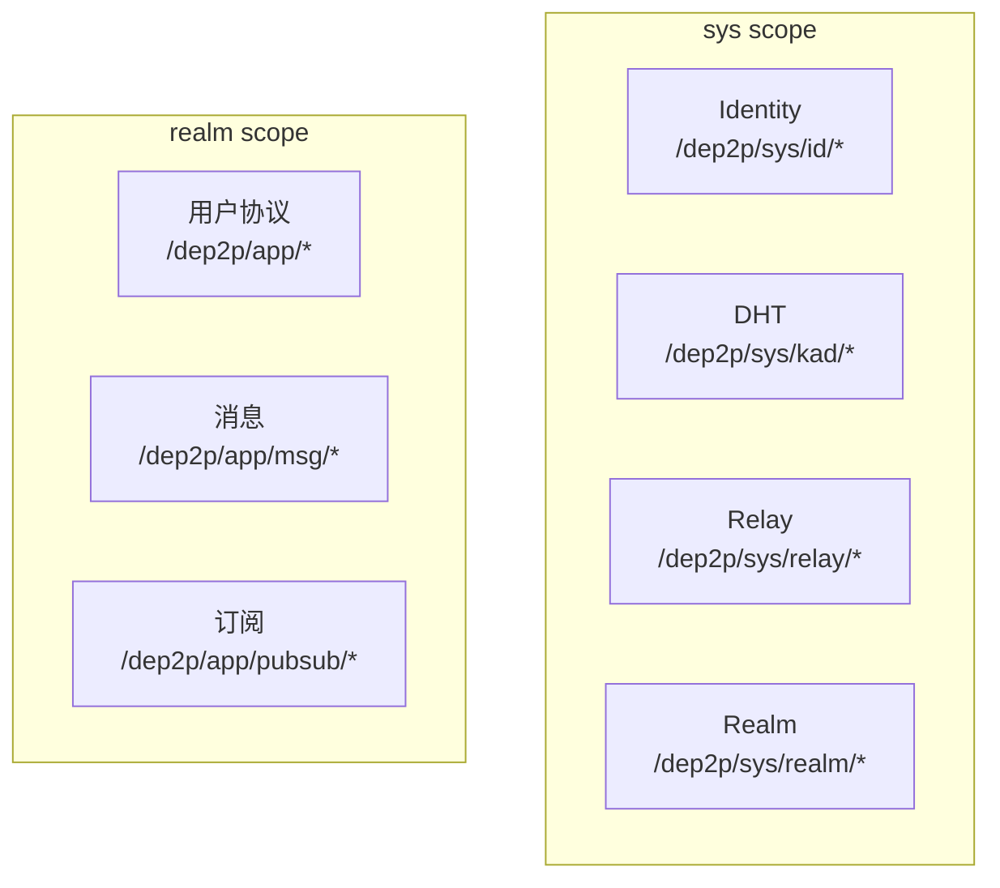

# 三层架构详解

本文档详细说明 DeP2P 三层架构的各层职责、组件和接口。

> **三层架构是 DeP2P 的唯一分层口径**

---

## 层次总览

```
┌─────────────────────────────────────────────────────────────────────────────┐
│                           DeP2P 三层架构                                     │
├─────────────────────────────────────────────────────────────────────────────┤
│                                                                              │
│  Layer 3: 应用协议层 (Application Protocols)                                 │
│           流协议 (Send/Request/OpenStream) + 订阅协议 (Publish/Subscribe)    │
│           [!] 必须加入 Realm 后才能使用                                       │
│                                                                              │
│  Layer 2: Realm 层 (Business Isolation)                                      │
│           业务隔离、成员管理、准入控制、RealmAuth                             │
│           [*] 用户显式加入，严格单 Realm                                      │
│                                                                              │
│  Layer 1: 系统基础层 (Infrastructure)                                        │
│           Transport/Security/DHT/Relay/NAT/Bootstrap                         │
│           [_] 启动后自动就绪，用户无感知                                      │
│                                                                              │
└─────────────────────────────────────────────────────────────────────────────┘
```



---

## Layer 1: 系统基础层

### 职责和范围

```
┌─────────────────────────────────────────────────────────────────────────────┐
│  Layer 1: 系统基础层 (Infrastructure)                                       │
├─────────────────────────────────────────────────────────────────────────────┤
│                                                                              │
│   职责：提供 P2P 网络的基础能力                                              │
│   范围：传输、安全、发现、穿透、中继                                         │
│   特点：节点启动自动就绪，用户完全无感知                                     │
│                                                                              │
└─────────────────────────────────────────────────────────────────────────────┘
```

### 核心组件



| 组件 | 职责 | 说明 |
|------|------|------|
| **Transport** | 传输层 | QUIC（推荐）、TCP、WebSocket |
| **Security** | 安全层 | TLS 1.3、Noise Protocol |
| **DHT** | 分布式哈希表 | Kademlia 路由和发现 |
| **NAT** | NAT 穿透 | STUN、UPnP、Hole Punching |
| **Relay** | 中继服务 | 穿透失败时的兜底通道 |
| **Bootstrap** | 引导机制 | 初始节点发现 |

### 协议前缀

```
/dep2p/sys/...
```

| 协议 | ID |
|------|-----|
| Identify | `/dep2p/sys/id/1.0.0` |
| Ping | `/dep2p/sys/ping/1.0.0` |
| Kademlia | `/dep2p/sys/kad/1.0.0` |
| Relay | `/dep2p/sys/relay/1.0.0` |

### 用户感知

| 感知 | 说明 |
|------|------|
| **无** | 用户完全无感知 |
| | 启动后自动就绪 |
| | 无需手动配置 |

### 控制面职责（INV-003）

> Layer 1 作为**控制面**，提供协助性服务，不承载业务数据。
>
> 详见 [INV-003: 控制面/数据面分离](../invariants/INV-003-control-data-separation.md)

```
┌─────────────────────────────────────────────────────────────────────────────┐
│                    Layer 1 = 控制面（Control Plane）                          │
├─────────────────────────────────────────────────────────────────────────────┤
│                                                                              │
│   职责范围：                                                                 │
│   • 打洞协调（Hole Punching Coordination）                                   │
│   • 地址验证（STUN-like Address Discovery）                                  │
│   • DHT 辅助（路由查询、节点发现）                                            │
│   • Bootstrap（初始连接建立）                                                │
│   • NAT 探测（类型检测）                                                     │
│                                                                              │
│   中继限制（System Relay）：                                                 │
│   • 只转发 /dep2p/sys/* 协议                                                 │
│   • 带宽限制：10 KB/s                                                        │
│   • 时长限制：60 秒                                                          │
│   • ❌ 禁止转发业务协议（/dep2p/app/*、/dep2p/realm/*）                       │
│                                                                              │
└─────────────────────────────────────────────────────────────────────────────┘
```

| 控制面能力 | 用途 | System Relay 支持 |
|------------|------|-------------------|
| 打洞协调 | 帮助 NAT 后节点建立直连 | ✅ |
| DHT 查询 | 查找节点地址 | ✅ |
| Bootstrap | 初始节点发现 | ✅ |
| 业务消息 | 应用数据传输 | ❌ 禁止 |

---

## Layer 2: Realm 层

### 职责和范围

```
┌─────────────────────────────────────────────────────────────────────────────┐
│  Layer 2: Realm 层 (Business Isolation)                                     │
├─────────────────────────────────────────────────────────────────────────────┤
│                                                                              │
│   职责：提供业务隔离能力                                                     │
│   范围：成员管理、准入控制、权限校验                                         │
│   特点：用户显式操作，严格单 Realm                                           │
│                                                                              │
└─────────────────────────────────────────────────────────────────────────────┘
```

### 核心组件



| 组件 | 职责 | 说明 |
|------|------|------|
| **RealmManager** | Realm 管理 | JoinRealm/LeaveRealm/SwitchRealm |
| **RealmAuth** | 准入控制 | Public/Protected/Private 验证 |
| **MemberManager** | 成员管理 | 节点列表、在线状态 |

### Realm 类型



| 类型 | 准入条件 | 适用场景 |
|------|----------|----------|
| **Public** | 无 | 开放社区 |
| **Protected** | 邀请码 | 半开放群组 |
| **Private** | 管理员批准 | 私密团队 |

### 协议前缀

```
/dep2p/sys/realm/...
```

| 协议 | ID |
|------|-----|
| RealmAuth | `/dep2p/sys/realm/auth/1.0.0` |
| RealmSync | `/dep2p/sys/realm/sync/1.0.0` |

### 用户感知

| 感知 | 说明 |
|------|------|
| **主动操作** | 用户需要显式调用 JoinRealm |
| | 可以查询当前 Realm |
| | 可以主动离开或切换 |

### 数据面职责（INV-003）

> Layer 2/3 作为**数据面**，承载业务流量，必须做成员证明和配额控制。
>
> 详见 [INV-003: 控制面/数据面分离](../invariants/INV-003-control-data-separation.md)

```
┌─────────────────────────────────────────────────────────────────────────────┐
│                    Layer 2/3 = 数据面（Data Plane）                           │
├─────────────────────────────────────────────────────────────────────────────┤
│                                                                              │
│   职责范围：                                                                 │
│   • 业务消息传输（Send/Request）                                             │
│   • 发布订阅（PubSub）                                                       │
│   • 双向流（Stream）                                                         │
│   • 应用自定义协议                                                           │
│                                                                              │
│   中继要求（Realm Relay）：                                                  │
│   • 只转发本 Realm 协议（/dep2p/app/<realmID>/*）                            │
│   • 必须验证 PSK 成员证明                                                    │
│   • 配额控制由提供者配置                                                     │
│   • 可观测（流量统计、成员活跃度）                                           │
│   • ❌ 禁止转发系统协议（/dep2p/sys/*）                                       │
│   • ❌ 禁止转发其他 Realm 协议                                                │
│                                                                              │
│   重要：业务数据永远不会"泄露"到 Realm 外部节点                               │
│                                                                              │
└─────────────────────────────────────────────────────────────────────────────┘
```

| 数据面能力 | 用途 | Realm Relay 支持 |
|------------|------|------------------|
| 业务消息 | 应用数据传输 | ✅（需成员验证）|
| PubSub | 发布订阅 | ✅（需成员验证）|
| Stream | 双向流 | ✅（需成员验证）|
| DHT 查询 | 节点发现 | ❌ 禁止 |

### 核心 API（IMPL-1227 更新）

```go
// JoinRealm 加入指定 Realm（返回 Realm 对象）
// IMPL-1227: 使用 realmKey 进行成员认证
func (n *Node) JoinRealm(ctx context.Context, name string, opts ...RealmOption) (Realm, error)

// JoinRealmWithKey 使用 realmKey 加入 Realm（便捷方法）
func (n *Node) JoinRealmWithKey(ctx context.Context, name string, realmKey RealmKey) (Realm, error)

// CurrentRealm 获取当前 Realm 对象
// 返回 nil 表示未加入任何 Realm
func (n *Node) CurrentRealm() Realm

// IsMember 检查是否已加入 Realm
func (n *Node) IsMember() bool
```

### Realm 对象（IMPL-1227 新增）

```go
// Realm 业务隔离域对象
// 所有 Layer 3 服务都从 Realm 对象获取
type Realm interface {
    // 基本信息
    Name() string      // 显示名称
    ID() RealmID       // 唯一标识（从 realmKey 派生）
    Key() RealmKey     // Realm 密钥
    
    // 成员信息
    Members() []NodeID     // 已知成员列表
    MemberCount() int      // 成员数量
    
    // Layer 3 服务获取
    Messaging() Messaging           // 消息服务
    PubSub() PubSub                 // 发布订阅服务
    Streams() StreamManager         // 流管理服务
    Discovery() RealmDiscovery      // Realm 内发现服务
    Relay() RealmRelayService       // Realm 中继服务
    
    // PSK 认证
    PSKAuth() PSKAuthenticator      // PSK 成员验证器
}
```

### PSK 成员认证（IMPL-1227 新增）

```
┌─────────────────────────────────────────────────────────────────────────────┐
│                       PSK 成员认证机制                                       │
├─────────────────────────────────────────────────────────────────────────────┤
│                                                                              │
│   realmKey (32 bytes)                                                        │
│       ↓                                                                      │
│   DeriveRealmID: SHA256("dep2p-realm-id-v1" || H(realmKey))                  │
│       ↓                                                                      │
│   MembershipProof:                                                           │
│       MAC = HMAC-SHA256(HKDF(realmKey), nodeID || realmID || peerID || ...)  │
│                                                                              │
│   验证规则：                                                                  │
│   - 时间戳窗口检查（5分钟）                                                  │
│   - peerID 目标节点匹配                                                      │
│   - realmID 匹配                                                             │
│   - MAC 验证通过                                                             │
│                                                                              │
└─────────────────────────────────────────────────────────────────────────────┘
```

---

## Layer 3: 应用协议层

### 职责和范围

```
┌─────────────────────────────────────────────────────────────────────────────┐
│  Layer 3: 应用协议层 (Application Protocols)                                │
├─────────────────────────────────────────────────────────────────────────────┤
│                                                                              │
│   职责：提供业务通信能力                                                     │
│   范围：流协议、订阅协议                                                     │
│   特点：必须先 JoinRealm，否则返回 ErrNotMember                              │
│                                                                              │
└─────────────────────────────────────────────────────────────────────────────┘
```

### 核心组件



| 组件 | 职责 | API |
|------|------|-----|
| **Messaging** | 消息发送 | Send/Request |
| **PubSub** | 发布订阅 | Publish/Subscribe |
| **Stream** | 双向流 | OpenStream |

### 流协议

| API | 模式 | 说明 |
|-----|------|------|
| `Send` | 单向 | 发送消息，不等待响应 |
| `Request` | 请求-响应 | 发送请求，等待响应 |
| `OpenStream` | 双向流 | 双向流通信 |

### 订阅协议

| API | 模式 | 说明 |
|-----|------|------|
| `Publish` | 发布 | 发布消息到主题 |
| `Subscribe` | 订阅 | 订阅主题消息 |
| `Query` | 查询 | 查询主题数据 |

### 用户感知

| 感知 | 说明 |
|------|------|
| **完全感知** | 用户直接调用 API |
| | 自定义协议 |
| | 处理消息回调 |

### 核心 API（IMPL-1227 更新）

所有 Layer 3 服务从 Realm 对象获取：

```go
// 获取当前 Realm
realm := node.CurrentRealm()

// Messaging 服务
realm.Messaging().Send(ctx, target, data)
realm.Messaging().SendWithProtocol(ctx, target, "chat/1.0.0", data)
realm.Messaging().Request(ctx, target, data)
realm.Messaging().RequestWithProtocol(ctx, target, "rpc/1.0.0", data)
realm.Messaging().OnProtocol("handler/1.0.0", handler)

// PubSub 服务
topic, _ := realm.PubSub().Join(ctx, "news")
topic.Publish(ctx, data)
topic.Subscribe()

// Stream 服务
stream, _ := realm.Streams().Open(ctx, target, "protocol")
realm.Streams().SetHandler("protocol", handler)

// Relay 服务
realm.Relay().Serve()
realm.Relay().StopServing()
realm.Relay().Stats()
```

> **注意**：用户提供的协议名会自动添加 `/dep2p/app/{realmID}/` 前缀

---

## 层间关系

### 依赖关系



| 规则 | 说明 |
|------|------|
| 上层依赖下层 | Layer 3 → Layer 2 → Layer 1 |
| 不跨层依赖 | Layer 3 不直接依赖 Layer 1 |
| 接口隔离 | 层间通过接口通信 |

### 校验点



| 层次 | 校验点 | 错误 |
|------|--------|------|
| Layer 3 | 协议有效性 | ErrInvalidProtocol |
| Layer 2 | Realm 成员 | ErrNotMember |
| Layer 1 | 连接状态 | ErrNotConnected |

---

## 协议作用域



| 作用域 | 前缀 | 需要 Realm | 说明 |
|--------|------|------------|------|
| **sys scope** | `/dep2p/sys/` | 否 | 系统协议，跨 Realm |
| **realm scope** | `/dep2p/app/` | 是 | 应用协议，Realm 内 |

---

## 相关文档

| 文档 | 说明 |
|------|------|
| [架构总览](overview.md) | 高层视图和设计理念 |
| [核心组件](components.md) | 各组件的职责和接口 |
| [组件交互](interactions.md) | 交互流程和时序 |
