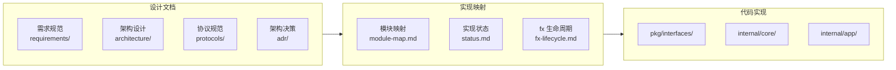
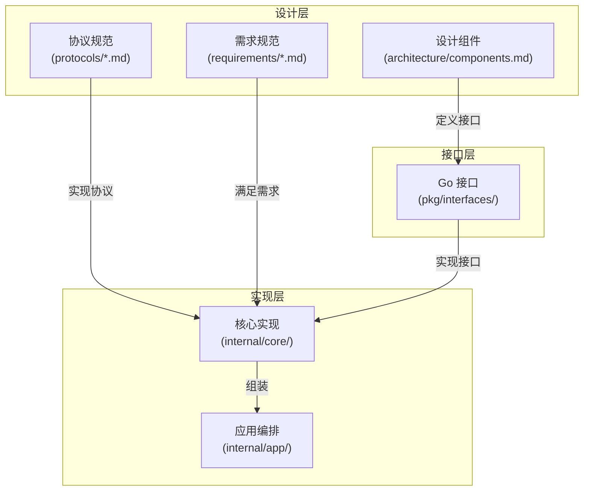
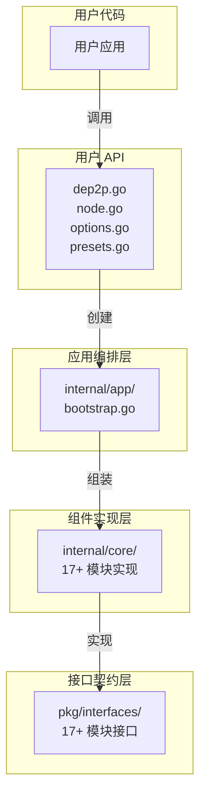
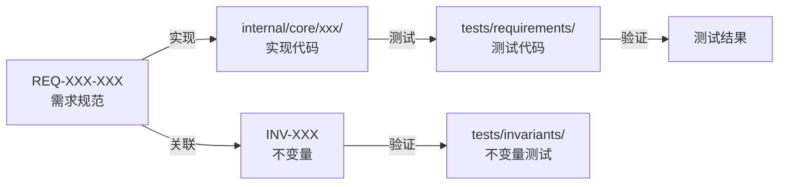
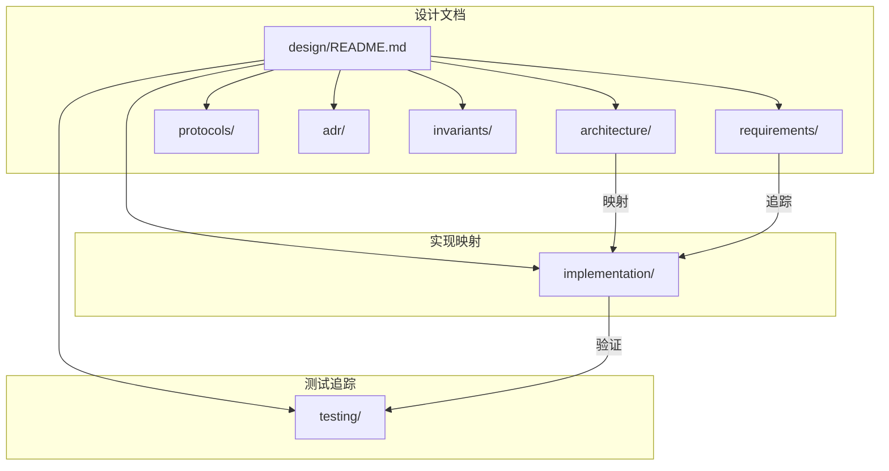

# 实现映射

本目录包含 DeP2P 设计到代码的映射文档，确保设计与实现的可追踪性。

---

## 概述

### 实现映射的目的

实现映射文档建立了**设计文档**与**代码实现**之间的追踪关系：



### 映射的价值

| 价值 | 描述 |
|------|------|
| 可追踪性 | 从需求到代码的完整追踪链 |
| 一致性检查 | 验证实现是否符合设计 |
| 变更影响 | 评估设计变更对代码的影响 |
| 新人入门 | 快速了解代码组织结构 |
| 代码审查 | 提供审查的设计依据 |

---

## 文档导航

| 文档 | 描述 |
|------|------|
| [module-map.md](module-map.md) | 设计组件 → Go 包/目录映射 |
| [status.md](status.md) | 实现状态（链接 PR/Issue） |
| [fx-lifecycle.md](fx-lifecycle.md) | fx 模块生命周期 |

---

## 映射关系

### 设计到代码的映射方式



### 映射层次

| 设计层次 | 代码位置 | 说明 |
|---------|---------|------|
| 设计组件 | `pkg/interfaces/` | 接口定义 |
| 协议规范 | `internal/core/` | 协议实现 |
| 架构层次 | `internal/app/` | 模块组装 |
| 用户 API | 根目录 | Facade API |

---

## 代码结构概览

### 目录结构

```
dep2p/
├── pkg/                          # 公共包（对外暴露）
│   ├── interfaces/               # 接口定义（17+ 模块）
│   │   ├── address/              # 地址管理接口
│   │   ├── bandwidth/            # 带宽统计接口
│   │   ├── connmgr/              # 连接管理接口
│   │   ├── discovery/            # 发现服务接口
│   │   ├── endpoint/             # 端点接口
│   │   ├── identity/             # 身份管理接口
│   │   ├── liveness/             # 存活检测接口
│   │   ├── messaging/            # 消息服务接口
│   │   ├── muxer/                # 多路复用接口
│   │   ├── nat/                  # NAT 穿透接口
│   │   ├── netreport/            # 网络诊断接口
│   │   ├── protocol/             # 协议管理接口
│   │   ├── reachability/         # 可达性接口
│   │   ├── realm/                # 领域管理接口
│   │   ├── relay/                # 中继服务接口
│   │   ├── security/             # 安全层接口
│   │   └── transport/            # 传输层接口
│   ├── types/                    # 纯类型定义
│   └── proto/                    # Protobuf 定义
│
├── internal/                     # 内部实现
│   ├── app/                      # 应用编排层
│   │   ├── bootstrap.go          # 模块组装
│   │   ├── lifecycle.go          # 生命周期管理
│   │   └── modulesets.go         # 模块集合
│   ├── config/                   # 配置管理
│   └── core/                     # 核心实现（17+ 模块）
│       ├── address/              # 地址管理实现
│       ├── bandwidth/            # 带宽统计实现
│       ├── connmgr/              # 连接管理实现
│       ├── discovery/            # 发现服务实现
│       ├── endpoint/             # 端点实现
│       ├── identity/             # 身份管理实现
│       ├── liveness/             # 存活检测实现
│       ├── messaging/            # 消息服务实现
│       ├── muxer/                # 多路复用实现
│       ├── nat/                  # NAT 穿透实现
│       ├── netreport/            # 网络诊断实现
│       ├── protocol/             # 协议管理实现
│       ├── reachability/         # 可达性实现
│       ├── realm/                # 领域管理实现
│       ├── relay/                # 中继服务实现
│       ├── security/             # 安全层实现
│       └── transport/            # 传输层实现
│
├── dep2p.go                      # 用户 API 入口
├── node.go                       # Node Facade
├── options.go                    # 配置选项
└── presets.go                    # 预设配置
```

### 分层架构



---

## 追踪方法

### 如何追踪实现状态

1. **需求追踪**: 查看 `status.md` 中的需求实现状态
2. **组件追踪**: 查看 `module-map.md` 中的组件到代码映射
3. **测试追踪**: 查看 `../testing/` 中的测试覆盖情况

### 追踪链路



---

## 与其他文档的关系



| 关系 | 说明 |
|------|------|
| 架构设计 → 实现映射 | 设计组件映射到代码 |
| 需求规范 → 实现映射 | 需求实现状态追踪 |
| 实现映射 → 测试追踪 | 实现代码的测试覆盖 |

---

## 相关文档

- [设计文档导航](../README.md)
- [架构设计](../architecture/README.md)
- [需求规范](../requirements/README.md)
- [测试追踪](../testing/README.md)
