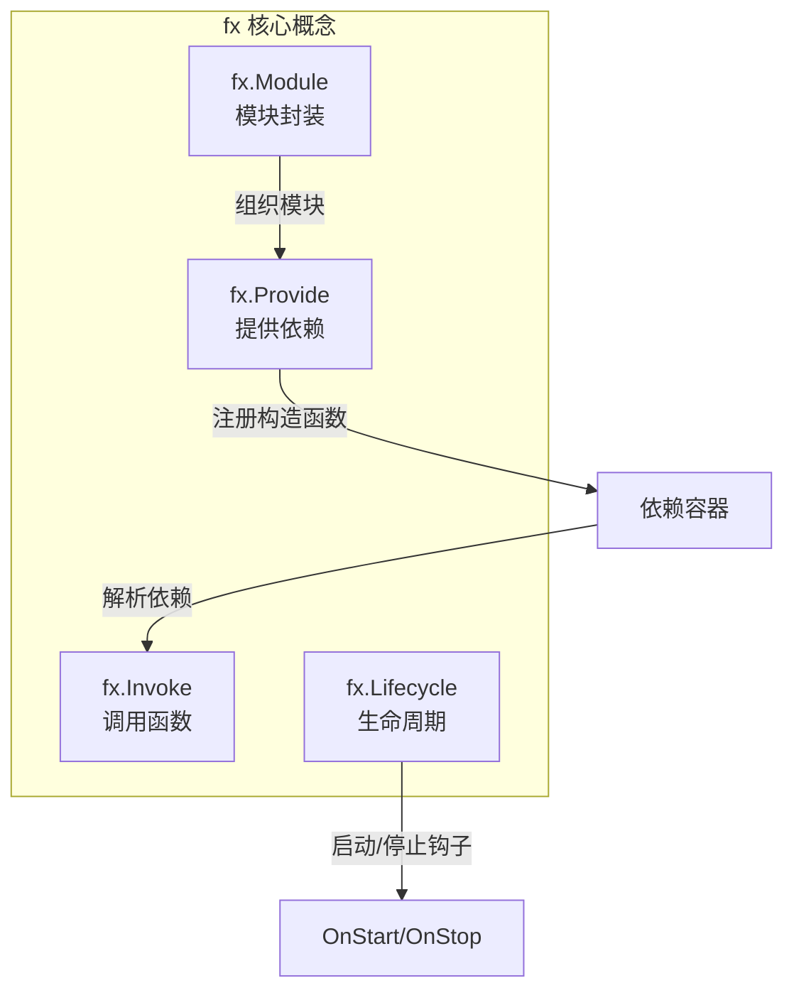
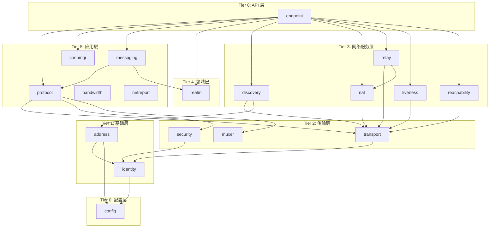
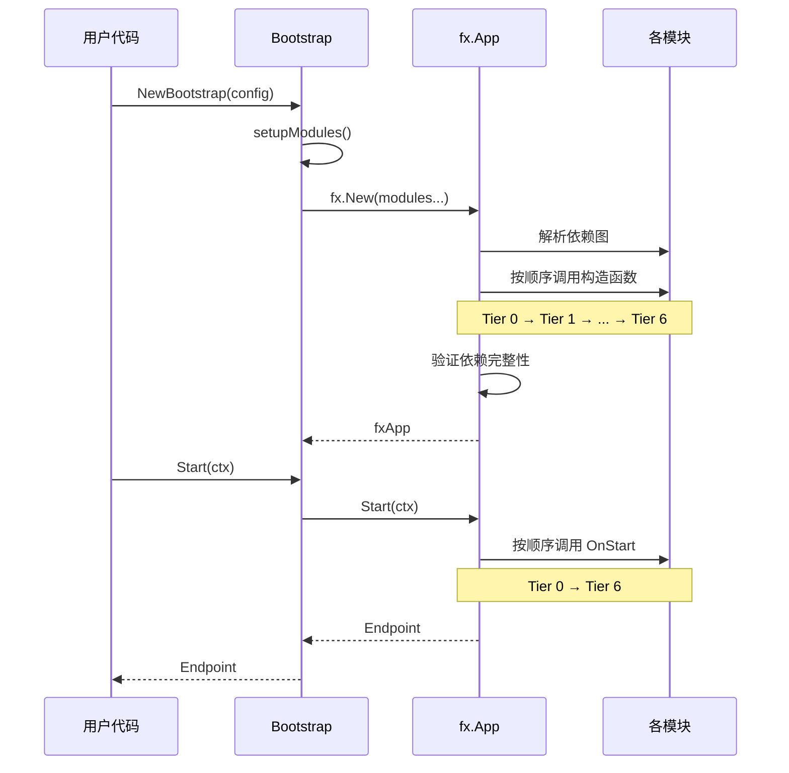
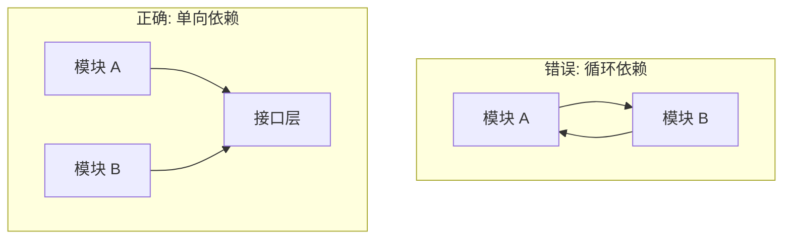

# fx 模块生命周期

本文档描述 DeP2P 使用 uber-go/fx 框架进行依赖注入和生命周期管理的方式。

---

## 概述

### 为什么使用 fx

DeP2P 使用 [uber-go/fx](https://github.com/uber-go/fx) 框架进行依赖注入和生命周期管理：

| 特性 | fx | 手动管理 |
|------|----|----|
| 依赖解析 | 自动 | 手动排序 |
| 生命周期 | 自动启停 | 手动管理 |
| 可选依赖 | 原生支持 | 条件判断 |
| 测试友好 | 易于 mock | 困难 |
| 循环检测 | 编译时 | 运行时 |

### fx 核心概念



---

## 模块依赖层级

### 层级图



### 层级说明

```
Tier 0: 配置层（无依赖）
└── config            # 配置管理

Tier 1: 基础层
├── identity          # 依赖: config
└── address           # 依赖: config, identity

Tier 2: 传输层
├── transport         # 依赖: identity
├── security          # 依赖: identity, transport
└── muxer             # 依赖: (无)

Tier 3: 网络服务层
├── nat               # 依赖: transport
├── discovery         # 依赖: transport, address
├── relay             # 依赖: transport, nat
├── liveness          # 依赖: transport
└── reachability      # 依赖: transport

Tier 4: 领域层
└── realm             # 依赖: discovery, connmgr

Tier 5: 应用层
├── protocol          # 依赖: transport, security, muxer
├── connmgr           # 依赖: (无)
├── messaging         # 依赖: protocol, realm
├── bandwidth         # 依赖: (无)
└── netreport         # 依赖: (无)

Tier 6: API 层
└── endpoint          # 依赖: 所有 Tier 3-5 模块
```

---

## 模块初始化顺序

### Bootstrap 组装

```go
// internal/app/bootstrap.go
func (b *Bootstrap) setupModules() ([]fx.Option, error) {
    return []fx.Option{
        // Tier 0: 配置层
        b.setupConfigModule(),      // config.Module()

        // Tier 1: 基础层
        b.setupFoundationLayer(),   // identity.Module(), address.Module()

        // Tier 2: 传输层
        b.setupTransportLayer(),    // transport.Module(), security.Module(), muxer.Module()

        // Tier 3: 网络服务层
        b.setupNetworkLayer(),      // nat.Module(), discovery.Module(), relay.Module(), etc.

        // Tier 4: 领域层
        b.setupRealmLayer(),        // realm.Module()

        // Tier 5: 应用层
        b.setupApplicationLayer(),  // protocol.Module(), connmgr.Module(), messaging.Module()

        // Tier 6: API 层
        b.setupEndpointLayer(),     // endpoint.Module()
    }, nil
}
```

### 初始化序列



---

## 生命周期钩子

### OnStart/OnStop

每个模块可以注册生命周期钩子：

```go
// internal/core/xxx/module.go
func registerLifecycle(input lifecycleInput) {
    input.LC.Append(fx.Hook{
        OnStart: func(ctx context.Context) error {
            // 启动时执行
            log.Info("模块启动")
            return service.Start(ctx)
        },
        OnStop: func(ctx context.Context) error {
            // 停止时执行
            log.Info("模块停止")
            return service.Stop()
        },
    })
}
```

### 生命周期流程

```mermaid
flowchart TB
    subgraph Startup [启动流程]
        S1["Tier 0: config.OnStart"]
        S2["Tier 1: identity.OnStart, address.OnStart"]
        S3["Tier 2: transport.OnStart, security.OnStart"]
        S4["Tier 3: nat.OnStart, discovery.OnStart"]
        S5["Tier 4: realm.OnStart"]
        S6["Tier 5: messaging.OnStart"]
        S7["Tier 6: endpoint.OnStart"]
    end
    
    S1 --> S2 --> S3 --> S4 --> S5 --> S6 --> S7
    
    subgraph Shutdown [停止流程]
        P7["Tier 6: endpoint.OnStop"]
        P6["Tier 5: messaging.OnStop"]
        P5["Tier 4: realm.OnStop"]
        P4["Tier 3: discovery.OnStop, nat.OnStop"]
        P3["Tier 2: security.OnStop, transport.OnStop"]
        P2["Tier 1: address.OnStop, identity.OnStop"]
        P1["Tier 0: config.OnStop"]
    end
    
    P7 --> P6 --> P5 --> P4 --> P3 --> P2 --> P1
```



> **重要**: 停止顺序与启动顺序相反，确保依赖的模块最后停止。

---

## 模块定义示例

### 基础模块（无依赖）

```go
// internal/core/identity/module.go
package identity

import "go.uber.org/fx"

// ModuleInput 模块输入参数
type ModuleInput struct {
    fx.In
    
    Config *config.Config
}

// ModuleOutput 模块输出
type ModuleOutput struct {
    fx.Out
    
    Identity Identity `name:"identity"`
}

// ProvideServices 提供模块服务
func ProvideServices(input ModuleInput) (ModuleOutput, error) {
    identity, err := NewIdentity(input.Config)
    if err != nil {
        return ModuleOutput{}, err
    }
    
    return ModuleOutput{
        Identity: identity,
    }, nil
}

// Module 返回 fx 模块配置
func Module() fx.Option {
    return fx.Module("identity",
        fx.Provide(ProvideServices),
        fx.Invoke(registerLifecycle),
    )
}

// lifecycleInput 生命周期输入
type lifecycleInput struct {
    fx.In
    LC       fx.Lifecycle
    Identity Identity `name:"identity"`
}

// registerLifecycle 注册生命周期
func registerLifecycle(input lifecycleInput) {
    input.LC.Append(fx.Hook{
        OnStart: func(ctx context.Context) error {
            log.Info("Identity 模块启动",
                "nodeID", input.Identity.NodeID().ShortString())
            return nil
        },
        OnStop: func(ctx context.Context) error {
            log.Info("Identity 模块停止")
            return nil
        },
    })
}
```

### 依赖其他模块

```go
// internal/core/transport/module.go
package transport

import "go.uber.org/fx"

// ModuleInput 模块输入参数
type ModuleInput struct {
    fx.In
    
    Config   *config.Config
    Identity identityif.Identity `name:"identity"`
}

// ModuleOutput 模块输出
type ModuleOutput struct {
    fx.Out
    
    Transport Transport `name:"transport"`
}

// ProvideServices 提供模块服务
func ProvideServices(input ModuleInput) (ModuleOutput, error) {
    transport, err := NewTransport(input.Config, input.Identity)
    if err != nil {
        return ModuleOutput{}, err
    }
    
    return ModuleOutput{
        Transport: transport,
    }, nil
}

// Module 返回 fx 模块配置
func Module() fx.Option {
    return fx.Module("transport",
        fx.Provide(ProvideServices),
        fx.Invoke(registerLifecycle),
    )
}
```

### 可选依赖

```go
// internal/core/discovery/module.go
package discovery

import "go.uber.org/fx"

// ModuleInput 模块输入参数
type ModuleInput struct {
    fx.In
    
    Config     *config.Config
    Transport  transportif.Transport `name:"transport"`
    NAT        natif.NATService      `name:"nat" optional:"true"`  // 可选依赖
    Relay      relayif.RelayService  `name:"relay" optional:"true"` // 可选依赖
}

// ProvideServices 提供模块服务
func ProvideServices(input ModuleInput) (ModuleOutput, error) {
    service := NewDiscoveryService(input.Config, input.Transport)
    
    // 根据可选依赖配置
    if input.NAT != nil {
        service.SetNATService(input.NAT)
    }
    if input.Relay != nil {
        service.SetRelayService(input.Relay)
    }
    
    return ModuleOutput{
        Discovery: service,
    }, nil
}
```

### 多输出

```go
// internal/core/address/module.go
package address

import "go.uber.org/fx"

// ModuleOutput 模块输出（多个服务）
type ModuleOutput struct {
    fx.Out
    
    AddressBook    *AddressBook    `name:"address_book"`
    AddressManager *AddressManager `name:"address_manager"`
    Parser         *Parser         `name:"address_parser"`
    Validator      *Validator      `name:"address_validator"`
}

// ProvideServices 提供模块服务
func ProvideServices(input ModuleInput) (ModuleOutput, error) {
    book := NewAddressBook()
    manager := NewAddressManager(DefaultConfig())
    parser := NewParser()
    validator := NewValidator(DefaultValidatorConfig())
    
    return ModuleOutput{
        AddressBook:    book,
        AddressManager: manager,
        Parser:         parser,
        Validator:      validator,
    }, nil
}
```

---

## 依赖注入模式

### 命名依赖

使用 `name` 标签区分同类型的不同实例：

```go
// 提供方
type ModuleOutput struct {
    fx.Out
    
    QUICTransport transportif.Transport `name:"quic_transport"`
    TCPTransport  transportif.Transport `name:"tcp_transport"`
}

// 使用方
type ModuleInput struct {
    fx.In
    
    QUICTransport transportif.Transport `name:"quic_transport"`
    TCPTransport  transportif.Transport `name:"tcp_transport"`
}
```

### 分组依赖

使用 `group` 标签收集同类型的多个实例：

```go
// 提供方
type ProtocolHandlerOutput struct {
    fx.Out
    
    Handler protocolif.Handler `group:"protocol_handlers"`
}

// 使用方
type ModuleInput struct {
    fx.In
    
    Handlers []protocolif.Handler `group:"protocol_handlers"`
}
```

### 接口转换

使用 `fx.As` 转换为接口类型：

```go
fx.Provide(
    fx.Annotate(
        NewEndpoint,
        fx.As(new(endpointif.Endpoint)),
        fx.ResultTags(`name:"endpoint"`),
    ),
)
```

---

## 错误处理

### 构造函数错误

```go
func ProvideServices(input ModuleInput) (ModuleOutput, error) {
    service, err := NewService(input.Config)
    if err != nil {
        // 返回错误，fx 会停止启动并报告
        return ModuleOutput{}, fmt.Errorf("创建服务失败: %w", err)
    }
    return ModuleOutput{Service: service}, nil
}
```

### 生命周期错误

```go
func registerLifecycle(input lifecycleInput) {
    input.LC.Append(fx.Hook{
        OnStart: func(ctx context.Context) error {
            if err := input.Service.Start(ctx); err != nil {
                // 返回错误，fx 会触发 rollback
                return fmt.Errorf("启动服务失败: %w", err)
            }
            return nil
        },
        OnStop: func(ctx context.Context) error {
            // OnStop 中的错误会被记录但不影响其他模块停止
            return input.Service.Stop()
        },
    })
}
```

---

## 测试支持

### 替换依赖

```go
func TestWithMockTransport(t *testing.T) {
    app := fx.New(
        messaging.Module(),
        
        // 替换真实 transport 为 mock
        fx.Replace(fx.Annotate(
            mockTransport,
            fx.As(new(transportif.Transport)),
            fx.ResultTags(`name:"transport"`),
        )),
    )
    
    // ...
}
```

### 添加测试依赖

```go
func TestWithTestDependency(t *testing.T) {
    app := fx.New(
        realModule.Module(),
        
        // 添加测试专用依赖
        fx.Supply(
            fx.Annotate(
                testConfig,
                fx.ResultTags(`name:"test_config"`),
            ),
        ),
    )
}
```

---

## 最佳实践

### 模块设计原则

1. **单一职责**: 每个模块只负责一个功能领域
2. **显式依赖**: 通过 `fx.In` 明确声明所有依赖
3. **接口隔离**: 依赖接口而非实现
4. **可选依赖**: 使用 `optional:"true"` 处理可选功能

### 命名约定

| 类型 | 命名规则 | 示例 |
|------|---------|------|
| 模块函数 | `Module()` | `identity.Module()` |
| 输入结构 | `ModuleInput` | `identity.ModuleInput` |
| 输出结构 | `ModuleOutput` | `identity.ModuleOutput` |
| 服务提供 | `ProvideServices` | `identity.ProvideServices` |
| 生命周期 | `registerLifecycle` | `identity.registerLifecycle` |

### 避免循环依赖



---

## 相关文档

- [实现映射概述](README.md)
- [模块映射](module-map.md)
- [实现状态](status.md)
- [uber-go/fx 文档](https://github.com/uber-go/fx)
