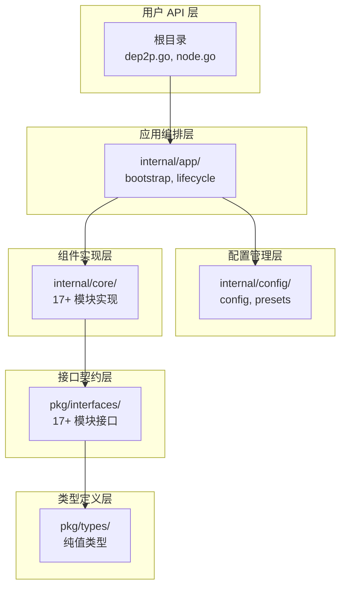
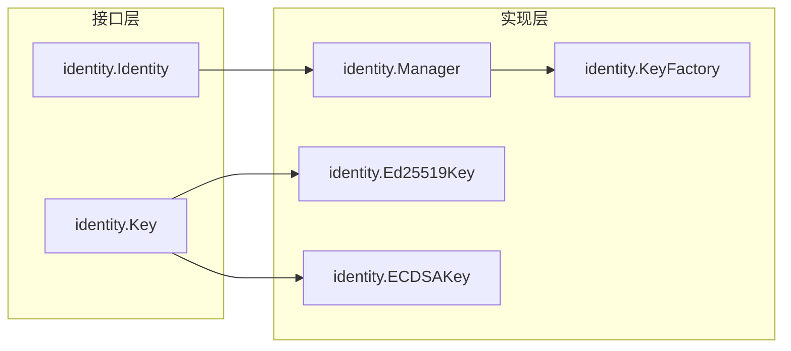
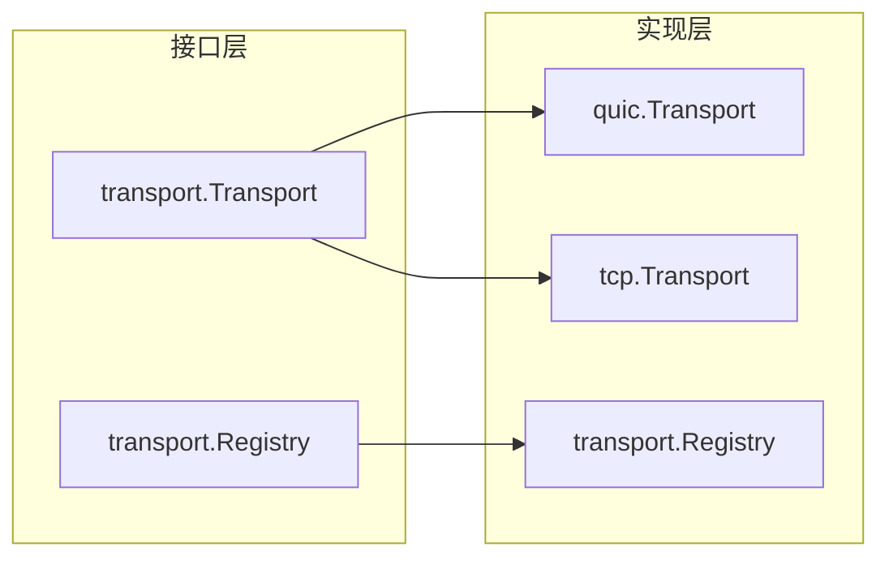
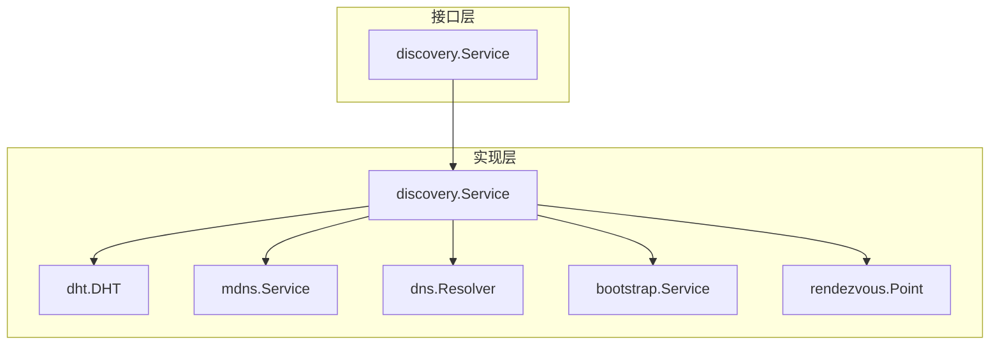
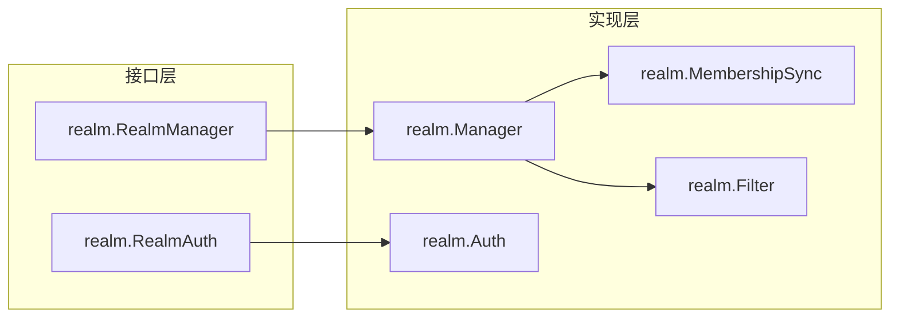

# 设计组件 → Go 包/目录映射

本文档定义设计组件到 Go 代码的映射关系。

---

## 概述

DeP2P 采用分层架构，代码组织遵循 Go 社区最佳实践：

---

## 分层映射

### 按架构层次映射

| 架构层次 | 设计组件 | 接口位置 | 实现位置 |
|---------|---------|---------|---------|
| **Layer 1** | Transport | `pkg/interfaces/transport/` | `internal/core/transport/` |
| | Security | `pkg/interfaces/security/` | `internal/core/security/` |
| | Muxer | `pkg/interfaces/muxer/` | `internal/core/muxer/` |
| | NAT | `pkg/interfaces/nat/` | `internal/core/nat/` |
| | Discovery | `pkg/interfaces/discovery/` | `internal/core/discovery/` |
| | Relay | `pkg/interfaces/relay/` | `internal/core/relay/` |
| | Bootstrap | - | `internal/core/discovery/bootstrap/` |
| **Layer 2** | RealmManager | `pkg/interfaces/realm/` | `internal/core/realm/` |
| | RealmAuth | `pkg/interfaces/realm/` | `internal/core/realm/` |
| **Layer 3** | Messaging | `pkg/interfaces/messaging/` | `internal/core/messaging/` |
| | PubSub | `pkg/interfaces/messaging/` | `internal/core/messaging/gossipsub/` |
| | Protocol | `pkg/interfaces/protocol/` | `internal/core/protocol/` |
| **门面层** | Node | 根目录 `node.go` | 根目录 `node.go` |
| | Endpoint | `pkg/interfaces/endpoint/` | `internal/core/endpoint/` |

---

## 核心组件映射

### 1. 身份管理 (Identity)

| 设计组件 | 接口 | 实现 |
|---------|------|------|
| IdentityManager | `pkg/interfaces/identity/identity.go` | `internal/core/identity/manager.go` |
| KeyFactory | `pkg/interfaces/identity/key.go` | `internal/core/identity/keyfactory.go` |
| NodeID | `pkg/types/nodeid.go` | `internal/core/identity/nodeid.go` |

### 2. 传输层 (Transport)

| 设计组件 | 接口 | 实现 |
|---------|------|------|
| Transport | `pkg/interfaces/transport/transport.go` | `internal/core/transport/module.go` |
| QUICTransport | - | `internal/core/transport/quic/` |
| TCPTransport | - | `internal/core/transport/tcp/` |

### 3. 安全层 (Security)

| 设计组件 | 接口 | 实现 |
|---------|------|------|
| SecurityTransport | `pkg/interfaces/security/security.go` | `internal/core/security/module.go` |
| TLS 1.3 | - | `internal/core/security/tls/` |
| Noise Protocol | - | `internal/core/security/noise/` |

### 4. 多路复用 (Muxer)

| 设计组件 | 接口 | 实现 |
|---------|------|------|
| MuxerFactory | `pkg/interfaces/muxer/muxer.go` | `internal/core/muxer/module.go` |
| Yamux | - | `internal/core/muxer/yamux/` |

### 5. 地址管理 (Address)

| 设计组件 | 接口 | 实现 |
|---------|------|------|
| AddressBook | `pkg/interfaces/address/address.go` | `internal/core/address/book.go` |
| AddressManager | - | `internal/core/address/manager.go` |
| AddressParser | - | `internal/core/address/parser.go` |
| AddressValidator | - | `internal/core/address/validator.go` |

### 6. 连接管理 (ConnMgr)

| 设计组件 | 接口 | 实现 |
|---------|------|------|
| ConnectionManager | `pkg/interfaces/connmgr/connmgr.go` | `internal/core/connmgr/manager.go` |
| ConnectionGater | `pkg/interfaces/connmgr/gater.go` | `internal/core/connmgr/gater.go` |

### 7. 发现服务 (Discovery)

| 设计组件 | 接口 | 实现 |
|---------|------|------|
| DiscoveryService | `pkg/interfaces/discovery/discovery.go` | `internal/core/discovery/service.go` |
| DHT | - | `internal/core/discovery/dht/` |
| mDNS | - | `internal/core/discovery/mdns/` |
| DNS | - | `internal/core/discovery/dns/` |
| Bootstrap | - | `internal/core/discovery/bootstrap/` |
| Rendezvous | - | `internal/core/discovery/rendezvous/` |

### 8. NAT 穿透 (NAT)

| 设计组件 | 接口 | 实现 |
|---------|------|------|
| NATService | `pkg/interfaces/nat/nat.go` | `internal/core/nat/service.go` |
| UPnP | - | `internal/core/nat/upnp/` |
| NAT-PMP | - | `internal/core/nat/natpmp/` |
| STUN | - | `internal/core/nat/stun/` |
| Hole Punching | - | `internal/core/nat/holepunch/` |

### 9. 中继服务 (Relay)

| 设计组件 | 接口 | 实现 |
|---------|------|------|
| RelayService | `pkg/interfaces/relay/relay.go` | `internal/core/relay/client.go` |
| RelayClient | - | `internal/core/relay/client/` |
| RelayServer | - | `internal/core/relay/server/` |
| RelayTransport | - | `internal/core/relay/transport.go` |

### 10. 可达性 (Reachability)

| 设计组件 | 接口 | 实现 |
|---------|------|------|
| ReachabilityCoordinator | `pkg/interfaces/reachability/reachability.go` | `internal/core/reachability/coordinator.go` |
| DialBack | - | `internal/core/reachability/dialback.go` |
| Witness | - | `internal/core/reachability/witness.go` |

### 11. 领域管理 (Realm)

| 设计组件 | 接口 | 实现 |
|---------|------|------|
| RealmManager | `pkg/interfaces/realm/realm.go` | `internal/core/realm/manager.go` |
| RealmAuth | `pkg/interfaces/realm/auth.go` | `internal/core/realm/auth.go` |
| MembershipSync | - | `internal/core/realm/sync.go` |

### 12. 消息服务 (Messaging)

| 设计组件 | 接口 | 实现 |
|---------|------|------|
| MessagingService | `pkg/interfaces/messaging/messaging.go` | `internal/core/messaging/service.go` |
| GossipSub | `pkg/interfaces/messaging/gossip.go` | `internal/core/messaging/gossipsub/` |
| RequestService | - | `internal/core/messaging/request.go` |
| QueryService | - | `internal/core/messaging/query.go` |

### 13. 协议管理 (Protocol)

| 设计组件 | 接口 | 实现 |
|---------|------|------|
| ProtocolRouter | `pkg/interfaces/protocol/protocol.go` | `internal/core/protocol/router_impl.go` |
| ProtocolRegistry | - | `internal/core/protocol/registry.go` |
| ProtocolNegotiator | - | `internal/core/protocol/negotiator.go` |

### 14. 存活检测 (Liveness)

| 设计组件 | 接口 | 实现 |
|---------|------|------|
| LivenessService | `pkg/interfaces/liveness/liveness.go` | `internal/core/liveness/service.go` |

### 15. 带宽统计 (Bandwidth)

| 设计组件 | 接口 | 实现 |
|---------|------|------|
| BandwidthReporter | `pkg/interfaces/bandwidth/bandwidth.go` | `internal/core/bandwidth/reporter.go` |
| BandwidthMeter | - | `internal/core/bandwidth/meter.go` |

### 16. 网络诊断 (NetReport)

| 设计组件 | 接口 | 实现 |
|---------|------|------|
| NetReportService | `pkg/interfaces/netreport/netreport.go` | `internal/core/netreport/report.go` |
| Prober | - | `internal/core/netreport/prober.go` |

### 17. 端点 (Endpoint)

| 设计组件 | 接口 | 实现 |
|---------|------|------|
| Endpoint | `pkg/interfaces/endpoint/endpoint.go` | `internal/core/endpoint/endpoint_impl.go` |
| Connection | `pkg/interfaces/endpoint/connection.go` | `internal/core/endpoint/connection.go` |
| Stream | `pkg/interfaces/endpoint/stream.go` | `internal/core/endpoint/stream.go` |

---

## 接口映射详情

### 核心接口列表

| 接口文件 | 定义的接口 | 实现位置 |
|---------|-----------|---------|
| `endpoint/endpoint.go` | `Endpoint` | `internal/core/endpoint/endpoint_impl.go` |
| `endpoint/connection.go` | `Connection` | `internal/core/endpoint/connection.go` |
| `endpoint/stream.go` | `Stream` | `internal/core/endpoint/stream.go` |
| `identity/identity.go` | `Identity`, `Manager` | `internal/core/identity/manager.go` |
| `identity/key.go` | `Key`, `PrivateKey`, `PublicKey` | `internal/core/identity/keyfactory.go` |
| `transport/transport.go` | `Transport` | `internal/core/transport/quic/`, `tcp/` |
| `transport/registry.go` | `Registry` | `internal/core/endpoint/transport_registry.go` |
| `security/security.go` | `SecureTransport` | `internal/core/security/tls/`, `noise/` |
| `muxer/muxer.go` | `MuxerFactory`, `Muxer` | `internal/core/muxer/yamux/` |
| `address/address.go` | `AddressBook`, `AddressParser` | `internal/core/address/` |
| `connmgr/connmgr.go` | `ConnectionManager` | `internal/core/connmgr/manager.go` |
| `connmgr/gater.go` | `ConnectionGater` | `internal/core/connmgr/gater.go` |
| `discovery/discovery.go` | `DiscoveryService` | `internal/core/discovery/service.go` |
| `nat/nat.go` | `NATService` | `internal/core/nat/service.go` |
| `relay/relay.go` | `RelayService` | `internal/core/relay/client.go` |
| `realm/realm.go` | `RealmManager` | `internal/core/realm/manager.go` |
| `realm/auth.go` | `RealmAuth` | `internal/core/realm/auth.go` |
| `messaging/messaging.go` | `MessagingService` | `internal/core/messaging/service.go` |
| `messaging/gossip.go` | `GossipRouter` | `internal/core/messaging/gossipsub/router.go` |
| `protocol/protocol.go` | `Router`, `Handler` | `internal/core/protocol/router_impl.go` |
| `liveness/liveness.go` | `LivenessService` | `internal/core/liveness/service.go` |
| `bandwidth/bandwidth.go` | `BandwidthReporter` | `internal/core/bandwidth/reporter.go` |
| `netreport/netreport.go` | `Reporter` | `internal/core/netreport/report.go` |
| `reachability/reachability.go` | `Coordinator` | `internal/core/reachability/coordinator.go` |

---

## fx 模块映射

### 模块对应关系

| fx 模块 | 接口包 | 实现包 | 提供的服务 |
|--------|-------|-------|-----------|
| `identity.Module()` | `identity` | `internal/core/identity` | `Identity` |
| `address.Module()` | `address` | `internal/core/address` | `AddressBook`, `AddressParser` |
| `transport.Module()` | `transport` | `internal/core/transport` | `Transport` |
| `security.Module()` | `security` | `internal/core/security` | `SecureTransport` |
| `muxer.Module()` | `muxer` | `internal/core/muxer` | `MuxerFactory` |
| `nat.Module()` | `nat` | `internal/core/nat` | `NATService` |
| `discovery.Module()` | `discovery` | `internal/core/discovery` | `DiscoveryService` |
| `relay.Module()` | `relay` | `internal/core/relay` | `RelayService` |
| `liveness.Module()` | `liveness` | `internal/core/liveness` | `LivenessService` |
| `realm.Module()` | `realm` | `internal/core/realm` | `RealmManager` |
| `protocol.Module()` | `protocol` | `internal/core/protocol` | `Router` |
| `connmgr.Module()` | `connmgr` | `internal/core/connmgr` | `ConnectionManager` |
| `messaging.Module()` | `messaging` | `internal/core/messaging` | `MessagingService` |
| `bandwidth.Module()` | `bandwidth` | `internal/core/bandwidth` | `BandwidthReporter` |
| `netreport.Module()` | `netreport` | `internal/core/netreport` | `Reporter` |
| `reachability.Module()` | `reachability` | `internal/core/reachability` | `Coordinator` |
| `endpoint.Module()` | `endpoint` | `internal/core/endpoint` | `Endpoint` |

---

## 设计到代码的追踪

### 从设计文档定位代码

1. **找到设计组件**：在 `architecture/components.md` 中查找
2. **找到接口**：在 `pkg/interfaces/{component}/` 中查找
3. **找到实现**：在 `internal/core/{component}/` 中查找
4. **找到 fx 模块**：在 `internal/core/{component}/module.go` 中查找

### 从代码定位设计文档

1. **找到代码路径**：`internal/core/{component}/`
2. **找到对应接口**：`pkg/interfaces/{component}/`
3. **找到设计文档**：`architecture/components.md` 中的对应组件

---

## 相关文档

- [实现映射概述](README.md)
- [实现状态](status.md)
- [fx 生命周期](fx-lifecycle.md)
- [架构设计](../architecture/README.md)
