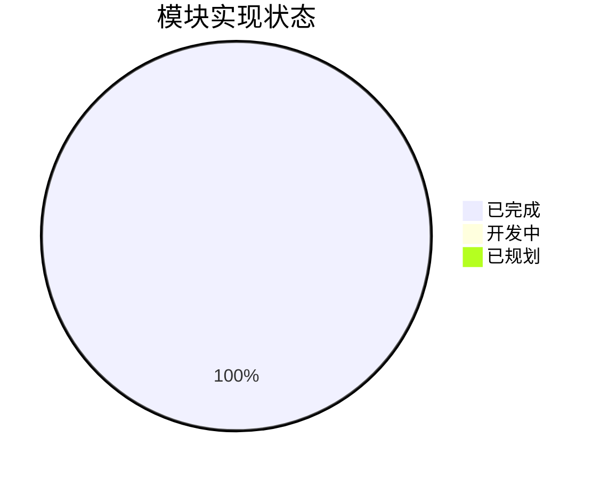
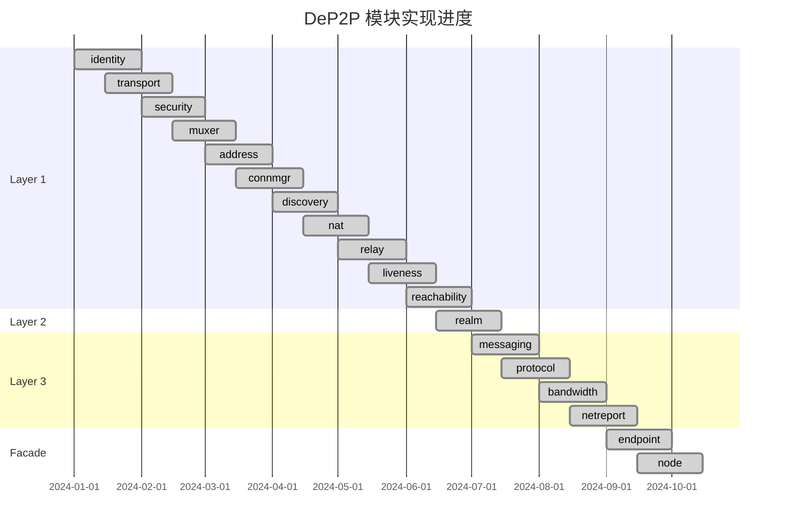
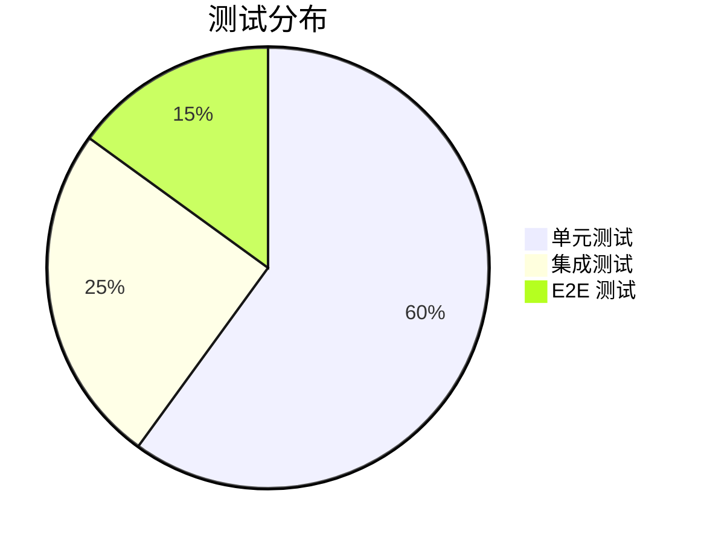

# 实现状态

本文档追踪 DeP2P 各模块的实现状态。

---

## 概述

### 状态定义

| 状态 | 标记 | 描述 |
|------|------|------|
| Planned | 📋 | 已规划，尚未开始 |
| In Progress | 🚧 | 正在开发中 |
| Completed | ✅ | 已完成，可用 |
| Testing | 🧪 | 开发完成，测试中 |
| Deprecated | ⚠️ | 已废弃 |

### 整体进度

---

## 核心模块状态

### Layer 1: 系统基础层

| 模块 | 状态 | 进度 | 测试覆盖 | 备注 |
|------|------|------|----------|------|
| identity | ✅ Completed | 100% | ✅ | 身份管理、密钥生成 |
| transport | ✅ Completed | 100% | ✅ | QUIC/TCP 传输 |
| security | ✅ Completed | 100% | ✅ | TLS 1.3/Noise 协议 |
| muxer | ✅ Completed | 100% | ✅ | Yamux 多路复用 |
| address | ✅ Completed | 100% | ✅ | 地址管理、解析、验证 |
| connmgr | ✅ Completed | 100% | ✅ | 连接管理、门控 |
| discovery | ✅ Completed | 100% | ✅ | DHT/mDNS/Bootstrap |
| nat | ✅ Completed | 100% | ✅ | UPnP/NAT-PMP/STUN |
| relay | ✅ Completed | 100% | ✅ | 中继客户端/服务器 |
| liveness | ✅ Completed | 100% | ✅ | 存活检测 |
| reachability | ✅ Completed | 100% | ✅ | 可达性验证 |

### Layer 2: Realm 层

| 模块 | 状态 | 进度 | 测试覆盖 | 备注 |
|------|------|------|----------|------|
| realm | ✅ Completed | 100% | ✅ | 领域管理、成员同步 |

### Layer 3: 应用协议层

| 模块 | 状态 | 进度 | 测试覆盖 | 备注 |
|------|------|------|----------|------|
| messaging | ✅ Completed | 100% | ✅ | Send/Request/Publish/Subscribe |
| protocol | ✅ Completed | 100% | ✅ | 协议路由、协商 |
| bandwidth | ✅ Completed | 100% | ✅ | 带宽统计 |
| netreport | ✅ Completed | 100% | ✅ | 网络诊断 |

### 门面层

| 模块 | 状态 | 进度 | 测试覆盖 | 备注 |
|------|------|------|----------|------|
| endpoint | ✅ Completed | 100% | ✅ | 端点聚合 |
| node (facade) | ✅ Completed | 100% | ✅ | 用户 API 入口 |

---

## 子模块状态

### Discovery 子模块

| 子模块 | 状态 | 位置 | 备注 |
|--------|------|------|------|
| DHT | ✅ Completed | `discovery/dht/` | Kademlia DHT |
| mDNS | ✅ Completed | `discovery/mdns/` | 局域网发现 |
| DNS | ✅ Completed | `discovery/dns/` | DNS TXT 记录 |
| Bootstrap | ✅ Completed | `discovery/bootstrap/` | 引导节点 |
| Rendezvous | ✅ Completed | `discovery/rendezvous/` | 会合点 |

### NAT 子模块

| 子模块 | 状态 | 位置 | 备注 |
|--------|------|------|------|
| UPnP | ✅ Completed | `nat/upnp/` | UPnP 端口映射 |
| NAT-PMP | ✅ Completed | `nat/natpmp/` | NAT-PMP 协议 |
| STUN | ✅ Completed | `nat/stun/` | STUN 客户端 |
| Hole Punching | ✅ Completed | `nat/holepunch/` | UDP 打洞 |

### Security 子模块

| 子模块 | 状态 | 位置 | 备注 |
|--------|------|------|------|
| TLS 1.3 | ✅ Completed | `security/tls/` | TLS 安全层 |
| Noise | ✅ Completed | `security/noise/` | Noise 协议 |

### Transport 子模块

| 子模块 | 状态 | 位置 | 备注 |
|--------|------|------|------|
| QUIC | ✅ Completed | `transport/quic/` | QUIC 传输 |
| TCP | ✅ Completed | `transport/tcp/` | TCP 传输 |

### Messaging 子模块

| 子模块 | 状态 | 位置 | 备注 |
|--------|------|------|------|
| GossipSub | ✅ Completed | `messaging/gossipsub/` | 发布订阅 |
| Request | ✅ Completed | `messaging/request.go` | 请求响应 |
| Query | ✅ Completed | `messaging/query.go` | 查询服务 |

---

## 实现进度图

---

## 需求实现追踪

### 连接相关需求

| 需求 ID | 描述 | 状态 | 实现模块 | 测试 |
|---------|------|------|----------|------|
| [REQ-CONN-001](../requirements/REQ-CONN-001.md) | 用户可预测的连接语义 | ✅ | endpoint, transport | ✅ |

### Realm 相关需求

| 需求 ID | 描述 | 状态 | 实现模块 | 测试 |
|---------|------|------|----------|------|
| [REQ-REALM-001](../requirements/REQ-REALM-001.md) | 强制 Realm 隔离 | ✅ | realm, messaging | ✅ |

---

## 不变量实现状态

| 不变量 ID | 描述 | 状态 | 验证模块 | 测试 |
|-----------|------|------|----------|------|
| [INV-001](../invariants/INV-001-identity-first.md) | 身份第一性 | ✅ | security, endpoint | ✅ |
| [INV-002](../invariants/INV-002-realm-membership.md) | Realm 成员资格 | ✅ | realm, messaging | ✅ |

---

## 测试覆盖

### 测试类型

### 测试位置

| 测试类型 | 位置 | 描述 |
|---------|------|------|
| 单元测试 | `internal/core/*/` | 各模块目录下的 `*_test.go` |
| 集成测试 | `tests/integration/` | 模块间集成测试 |
| E2E 测试 | `tests/e2e/` | 端到端测试 |
| 需求测试 | `tests/requirements/` | 需求验证测试 |
| 不变量测试 | `tests/invariants/` | 不变量验证测试 |

### 覆盖率要求

| 层次 | 目标覆盖率 | 当前状态 |
|------|-----------|---------|
| 核心模块 | > 80% | ✅ |
| 接口层 | > 90% | ✅ |
| 用户 API | > 85% | ✅ |

---

## 问题追踪

### 已知问题

| 问题 | 状态 | 模块 | 描述 |
|------|------|------|------|
| - | - | - | 暂无已知问题 |

### 待优化项

| 优化项 | 优先级 | 模块 | 描述 |
|--------|-------|------|------|
| 性能优化 | P2 | discovery | DHT 查询性能优化 |
| 内存优化 | P2 | connmgr | 连接池内存优化 |

---

## 版本历史

| 版本 | 日期 | 变更 |
|------|------|------|
| v0.1.0 | 2024-Q1 | 基础架构 |
| v0.2.0 | 2024-Q2 | 核心模块 |
| v0.3.0 | 2024-Q3 | 完整功能 |
| v1.0.0 | 2024-Q4 | 正式发布 |

---

## 相关文档

- [实现映射概述](README.md)
- [模块映射](module-map.md)
- [fx 生命周期](fx-lifecycle.md)
- [版本路线图](../roadmap.md)
