# INV-001: 身份第一性

## 元数据

| 属性 | 值 |
|------|-----|
| 编号 | INV-001 |
| 名称 | 身份第一性（Identity First） |
| 状态 | ✅ Active |
| 关联 ADR | [ADR-0001](../adr/0001-identity-first.md) |
| 关联需求 | [REQ-CONN-001](../requirements/REQ-CONN-001.md) |

---

## 不变量陈述

> **任何连接都 MUST 绑定 Expected NodeID，并在握手后验证 RemoteIdentity == ExpectedNodeID。**

这是 DeP2P 最核心的不变量，定义了系统的基本连接语义。

---

## 规范说明

### 核心断言

```
┌─────────────────────────────────────────────────────────────────────────────┐
│                      INV-001：身份第一性                                     │
├─────────────────────────────────────────────────────────────────────────────┤
│                                                                              │
│   在 DeP2P 中 **不存在"纯 IP 连接"这件事**                                  │
│   只能存在"按身份（NodeID）连接"，IP/端口只是 Dial Address（拨号提示）       │
│                                                                              │
│   连接目标：永远是 NodeID（公钥身份）                                        │
│   地址角色：永远只是 Dial Address（或 Relay Circuit Address）                │
│   验证要求：RemoteIdentity == ExpectedNodeID（MUST）                         │
│                                                                              │
└─────────────────────────────────────────────────────────────────────────────┘
```

### 正确与错误表述

| 类型 | 表述 |
|------|------|
| ✅ 正确 | "连接到 NodeID，使用 Dial Address 作为拨号路径" |
| ✅ 正确 | "身份连接 + 地址提示" |
| ✅ 正确 | "NodeID 连接 + 多地址尝试" |
| ❌ 错误 | "连接到 IP:Port" |
| ❌ 错误 | "无身份连接" |
| ❌ 错误 | "纯地址连接" |

---

## 验证时机

### 验证流程

```mermaid
sequenceDiagram
    participant Caller as 调用方
    participant Endpoint as Endpoint
    participant Transport as Transport
    participant Security as Security
    participant Remote as 远端节点

    Caller->>Endpoint: Connect(expectedNodeID, dialAddrs)
    Endpoint->>Transport: Dial(dialAddr)
    Transport-->>Security: RawConnection
    Security->>Remote: TLS Handshake
    Remote-->>Security: RemoteIdentity
    
    Note over Security: 🔍 验证点：RemoteIdentity == ExpectedNodeID
    
    alt 验证成功
        Security-->>Endpoint: SecureConnection
        Endpoint-->>Caller: Connection
    else 验证失败
        Security-->>Endpoint: ErrIdentityMismatch
        Endpoint-->>Caller: Error
    end
```



### 关键验证点

| 验证点 | 时机 | 条件 | 失败行为 |
|--------|------|------|----------|
| TLS 握手后 | 安全连接建立后 | `RemoteIdentity == ExpectedNodeID` | 关闭连接，返回 `ErrIdentityMismatch` |

---

## 代码约束

### MUST 要求

```go
// ✅ MUST: 所有连接建立都包含身份验证
func (e *Endpoint) Connect(ctx context.Context, expectedID NodeID) (Connection, error) {
    // 获取 dialAddrs
    dialAddrs := e.addressBook.Addrs(expectedID)
    if len(dialAddrs) == 0 {
        dialAddrs, err = e.discovery.FindAddrs(ctx, expectedID)
        if err != nil {
            return nil, err
        }
    }
    
    // 尝试连接
    conn, err := e.dialWithAddrs(ctx, expectedID, dialAddrs)
    if err != nil {
        return nil, err
    }
    
    // INV-001 验证点 ⚠️ 必须存在
    if conn.RemoteID() != expectedID {
        conn.Close()
        return nil, ErrIdentityMismatch
    }
    
    return conn, nil
}
```

### MUST NOT 要求

```go
// ❌ MUST NOT: 不存在无身份目标的连接
func (e *Endpoint) ConnectToIP(addr string) (Connection, error) {
    // 此方法不应该存在！
    // 违反 INV-001：没有 Expected NodeID
}

// ❌ MUST NOT: 不跳过身份验证
func (e *Endpoint) Connect(ctx context.Context, expectedID NodeID) (Connection, error) {
    conn, err := e.dial(ctx, dialAddrs)
    if err != nil {
        return nil, err
    }
    // 缺少身份验证！违反 INV-001
    return conn, nil
}
```

---

## 三条连接语义

基于 INV-001，DeP2P 定义三条确定性连接语义：

```mermaid
flowchart TD
    Start[需要连接] --> Q1{有完整地址?}
    
    Q1 -->|"Full Address"| API2["ConnectToAddr<br/>解析 NodeID + Dial"]
    Q1 -->|否| Q2{网络已连通?}
    
    Q2 -->|是| API1["Connect<br/>DHT 查找地址"]
    Q2 -->|否| Q3{有 Dial 列表?}
    
    Q3 -->|是| API3["ConnectWithAddrs<br/>高级运维"]
    Q3 -->|否| Fail["无法连接"]
    
    API1 --> Verify["验证身份"]
    API2 --> Verify
    API3 --> Verify
    Verify --> Success["连接成功"]
```



| 语义 | API | 输入 | 用户可见 |
|------|-----|------|---------|
| DialByNodeID | `Connect(nodeID)` | NodeID | ✅ 推荐 |
| DialByFullAddress | `ConnectToAddr(fullAddr)` | Full Address | ✅ 推荐 |
| DialByNodeIDWithDialAddrs | `ConnectWithAddrs(nodeID, addrs)` | NodeID + Dial Address | ❌ 隐藏 |

> **所有三条语义都以 NodeID 为目标，地址只是拨号路径。**

---

## 测试要求

### 必须覆盖的场景

| 场景 | 测试名称 | 期望结果 |
|------|----------|----------|
| 正常连接 | `TestINV001_ValidConnection` | 连接成功 |
| 身份不匹配 | `TestINV001_IdentityMismatch` | 返回 `ErrIdentityMismatch`，连接关闭 |
| 无 Expected ID | `TestINV001_NoExpectedID` | 编译错误或 panic |
| 中间人攻击 | `TestINV001_MITM` | 连接失败 |

### 测试示例

```go
func TestINV001_IdentityMismatch(t *testing.T) {
    // 创建两个节点
    nodeA := createTestNode(t)
    nodeB := createTestNode(t)
    nodeC := createTestNode(t) // 假冒节点
    
    // 尝试用 nodeB 的 ID 连接到 nodeC
    // nodeC 会返回自己的身份，与 expectedID 不匹配
    _, err := nodeA.Connect(context.Background(), nodeB.ID())
    
    // 期望：身份验证失败
    assert.ErrorIs(t, err, ErrIdentityMismatch)
}

func TestINV001_ValidConnection(t *testing.T) {
    nodeA := createTestNode(t)
    nodeB := createTestNode(t)
    
    // 正常连接
    conn, err := nodeA.Connect(context.Background(), nodeB.ID())
    
    // 期望：连接成功，RemoteID 正确
    assert.NoError(t, err)
    assert.Equal(t, nodeB.ID(), conn.RemoteID())
}
```

---

## 违反后果

### 检测违反

```mermaid
flowchart TB
    Connect[建立连接] --> Handshake[TLS 握手]
    Handshake --> GetID[获取 RemoteIdentity]
    GetID --> Check{RemoteID == ExpectedID?}
    
    Check -->|是| Success[连接成功]
    Check -->|否| Violation[检测到违反]
    
    Violation --> Close[关闭连接]
    Close --> Log[记录日志]
    Log --> Error[返回 ErrIdentityMismatch]
```



### 错误处理

```go
var (
    // ErrIdentityMismatch 表示远端身份与预期不匹配
    // 这是 INV-001 违反时的标准错误
    ErrIdentityMismatch = errors.New("remote identity does not match expected")
)

// 处理身份验证失败
func handleIdentityMismatch(conn net.Conn, expected, actual NodeID) error {
    // 1. 关闭连接
    conn.Close()
    
    // 2. 记录日志（可能的攻击）
    log.Warn("identity mismatch detected",
        "expected", expected,
        "actual", actual,
        "remote_addr", conn.RemoteAddr(),
    )
    
    // 3. 返回错误
    return fmt.Errorf("%w: expected %s, got %s", ErrIdentityMismatch, expected, actual)
}
```

---

## 安全意义

### 防护能力

| 威胁 | INV-001 防护 |
|------|-------------|
| 中间人攻击 | ✅ 攻击者无法伪造 NodeID |
| DNS 欺骗 | ✅ 即使 IP 被篡改，身份验证仍会失败 |
| IP 欺骗 | ✅ IP 不是连接目标，NodeID 才是 |
| 节点冒充 | ✅ 没有对应私钥无法通过验证 |

### 信任模型

```mermaid
flowchart LR
    subgraph Trust [信任模型]
        NodeID[NodeID]
        PrivKey[私钥]
        PubKey[公钥]
    end
    
    PrivKey --> |派生| PubKey
    PubKey --> |哈希| NodeID
    
    PrivKey --> |签名| Proof[身份证明]
    PubKey --> |验证| Proof
```



---

## 相关文档

- [ADR-0001: 身份第一性原则](../adr/0001-identity-first.md)
- [REQ-CONN-001: 用户可预测的连接语义](../requirements/REQ-CONN-001.md)
- [身份协议规范](../protocols/foundation/identity.md)
- [安全协议规范](../protocols/transport/security.md)

---

## 变更历史

| 版本 | 日期 | 变更 |
|------|------|------|
| 1.0 | 2024-01 | 初始版本 |
