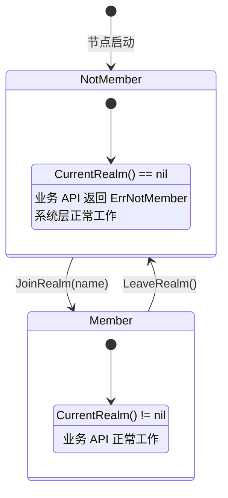
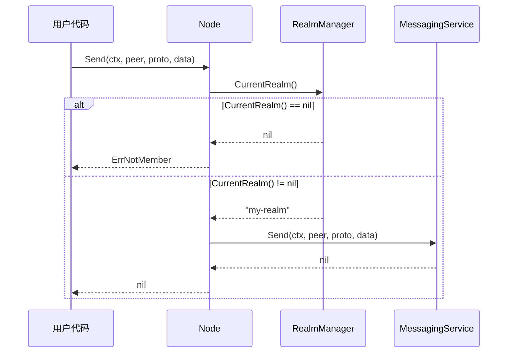
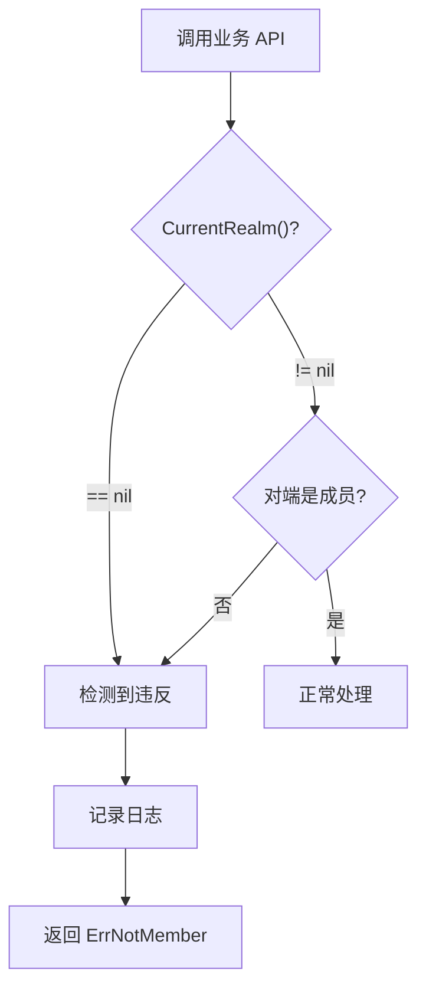
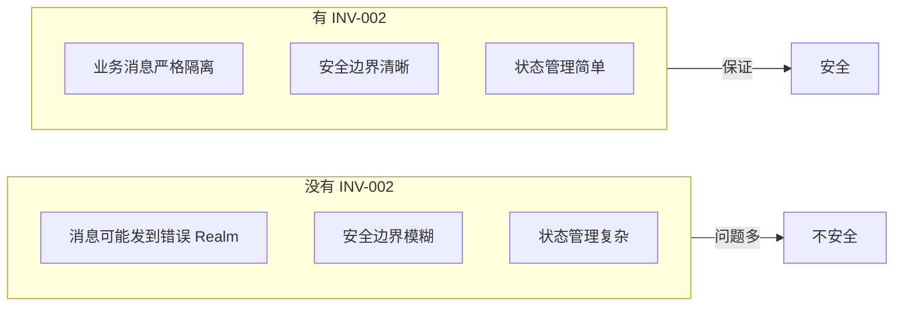

# INV-002: Realm 成员资格

## 元数据

| 属性 | 值 |
|------|-----|
| 编号 | INV-002 |
| 名称 | Realm 成员资格（Realm Membership） |
| 状态 | ✅ Active |
| 关联 ADR | [ADR-0002](../adr/0002-realm-isolation.md) |
| 关联需求 | [REQ-REALM-001](../requirements/REQ-REALM-001.md) |

---

## 不变量陈述

> **业务 API（Send/Request/Publish/Subscribe）在 `CurrentRealm() == nil` 时 MUST 返回 `ErrNotMember`。**

这是 DeP2P Realm 隔离的核心不变量，确保业务层的安全边界。

---

## 规范说明

### 核心断言

```
┌─────────────────────────────────────────────────────────────────────────────┐
│                      INV-002：Realm 成员资格                                 │
├─────────────────────────────────────────────────────────────────────────────┤
│                                                                              │
│   节点同一时间只能属于一个 Realm，Join 前业务层零交互                        │
│                                                                              │
│   成员状态：                                                                 │
│   ─────────                                                                  │
│   CurrentRealm() == nil  → 未加入任何 Realm，业务 API 不可用                │
│   CurrentRealm() != nil  → 已加入 Realm，业务 API 可用                      │
│                                                                              │
│   业务 API 边界：                                                            │
│   ─────────────                                                              │
│   Send()      → 需要 Realm 成员资格                                         │
│   Request()   → 需要 Realm 成员资格                                         │
│   Publish()   → 需要 Realm 成员资格                                         │
│   Subscribe() → 需要 Realm 成员资格                                         │
│                                                                              │
│   系统层不受影响：                                                           │
│   ───────────────                                                            │
│   DHT、Relay、NAT、Bootstrap 等系统层功能始终可用                           │
│                                                                              │
└─────────────────────────────────────────────────────────────────────────────┘
```

### 层次边界

| 层次 | 需要 Realm? | 说明 |
|------|-------------|------|
| Layer 1（系统层） | ❌ 否 | DHT/Relay/NAT 始终可用 |
| Layer 2（Realm 层） | - | JoinRealm/LeaveRealm 管理状态 |
| Layer 3（应用层） | ✅ 是 | 业务 API 需要 Realm |

---

## 验证时机

### 状态机



### 验证流程



---

## 代码约束（IMPL-1227 更新）

### MUST 要求

```go
// ✅ MUST: 业务 API 通过 Realm 对象获取
// IMPL-1227: 所有 Layer 3 服务从 Realm 对象获取
func example(node *dep2p.Node) error {
    // INV-002 检查点 ⚠️ 必须先获取 Realm
    realm := node.CurrentRealm()
    if realm == nil {
        return ErrNotMember
    }
    
    // 通过 Realm 对象获取服务
    messaging := realm.Messaging()
    pubsub := realm.PubSub()
    
    // 发送消息
    return messaging.Send(ctx, targetNodeID, data)
}

// ✅ MUST: 使用 realmKey 加入 Realm（PSK 认证）
func joinExample(node *dep2p.Node) error {
    realmKey := types.GenerateRealmKey()
    realm, err := node.JoinRealmWithKey(ctx, "my-realm", realmKey)
    if err != nil {
        return err
    }
    
    // realm.ID() 返回从 realmKey 派生的 RealmID
    // realm.Messaging() 返回 Realm 范围内的消息服务
    return nil
}

// ✅ MUST: Messaging 服务需要 Realm
messaging := realm.Messaging()
messaging.Send(ctx, target, data)
messaging.SendWithProtocol(ctx, target, "chat/1.0.0", data) // 自动添加前缀
messaging.Request(ctx, target, data)
messaging.OnProtocol("handler/1.0.0", handler)

// ✅ MUST: PubSub 服务需要 Realm
pubsub := realm.PubSub()
topic, _ := pubsub.Join(ctx, "news") // 自动添加 Realm 前缀
topic.Publish(ctx, data)
sub, _ := topic.Subscribe()
```

### MUST NOT 要求

```go
// ❌ MUST NOT: 业务 API 跳过 Realm 检查
func (n *Node) Send(ctx context.Context, to peer.ID, proto string, data []byte) error {
    // 缺少 Realm 检查！违反 INV-002
    return n.messaging.Send(ctx, to, proto, data)
}

// ❌ MUST NOT: 允许未加入 Realm 时发送消息
func (n *Node) SendAnyway(ctx context.Context, to peer.ID, proto string, data []byte) error {
    // 此方法不应该存在！违反 INV-002
}
```

---

## 受影响的 API

### 需要 Realm 的 API（Layer 3）

| API | 需要 Realm | 说明 |
|-----|-----------|------|
| `Send(peer, proto, data)` | ✅ 是 | 单向消息 |
| `Request(peer, proto, data)` | ✅ 是 | 请求响应 |
| `Publish(topic, data)` | ✅ 是 | 发布消息 |
| `Subscribe(topic)` | ✅ 是 | 订阅主题 |
| `SetMessageHandler(proto, handler)` | ✅ 是 | 注册处理器 |
| `SetRequestHandler(proto, handler)` | ✅ 是 | 注册处理器 |

### 不需要 Realm 的 API（Layer 1/2）

| API | 需要 Realm | 说明 |
|-----|-----------|------|
| `Connect(nodeID)` | ❌ 否 | 连接节点 |
| `ConnectToAddr(addr)` | ❌ 否 | 连接地址 |
| `JoinRealm(name)` | ❌ 否 | 加入 Realm |
| `LeaveRealm()` | ❌ 否 | 离开 Realm |
| `ID()` | ❌ 否 | 获取节点 ID |
| `ListenAddrs()` | ❌ 否 | 获取监听地址 |
| `ShareableAddrs()` | ❌ 否 | 获取可分享地址 |

---

## 测试要求

### 必须覆盖的场景

| 场景 | 测试名称 | 期望结果 |
|------|----------|----------|
| 未加入时 Send | `TestINV002_Send_NotMember` | 返回 `ErrNotMember` |
| 未加入时 Request | `TestINV002_Request_NotMember` | 返回 `ErrNotMember` |
| 未加入时 Publish | `TestINV002_Publish_NotMember` | 返回 `ErrNotMember` |
| 未加入时 Subscribe | `TestINV002_Subscribe_NotMember` | 返回 `ErrNotMember` |
| 加入后 Send | `TestINV002_Send_Member` | 成功 |
| 加入后离开再 Send | `TestINV002_Send_AfterLeave` | 返回 `ErrNotMember` |
| 向非成员发送 | `TestINV002_Send_ToNonMember` | 返回 `ErrNotMember` |

### 测试示例（IMPL-1227 更新）

```go
func TestINV002_Send_NotMember(t *testing.T) {
    node := createTestNode(t)
    defer node.Close()
    
    // 未加入 Realm
    assert.Nil(t, node.CurrentRealm())
    
    // 尝试通过 Node 快捷方法发送消息
    err := node.Send(context.Background(), somePeerID, []byte("hello"))
    
    // 期望：返回 ErrNotMember
    assert.ErrorIs(t, err, ErrNotMember)
}

func TestINV002_Send_Member(t *testing.T) {
    node := createTestNode(t)
    defer node.Close()
    
    // 使用 realmKey 加入 Realm（IMPL-1227）
    realmKey := types.GenerateRealmKey()
    realm, err := node.JoinRealmWithKey(context.Background(), "test-realm", realmKey)
    require.NoError(t, err)
    
    // 验证已加入
    assert.NotNil(t, node.CurrentRealm())
    assert.Equal(t, "test-realm", realm.Name())
    
    // 通过 Realm 对象获取 Messaging 服务
    messaging := realm.Messaging()
    
    // 现在可以发送消息
    err = messaging.Send(context.Background(), memberPeerID, []byte("hello"))
    assert.NoError(t, err)
}

func TestINV002_Send_AfterLeave(t *testing.T) {
    node := createTestNode(t)
    defer node.Close()
    
    // 加入然后离开
    realmKey := types.GenerateRealmKey()
    realm, _ := node.JoinRealmWithKey(context.Background(), "test-realm", realmKey)
    realm.Leave()
    
    // 验证已离开
    assert.Nil(t, node.CurrentRealm())
    
    // 尝试通过 Node 快捷方法发送消息
    err := node.Send(context.Background(), somePeerID, []byte("hello"))
    
    // 期望：返回 ErrNotMember
    assert.ErrorIs(t, err, ErrNotMember)
}

func TestINV002_PSKAuth_Required(t *testing.T) {
    nodeA := createTestNode(t)
    nodeB := createTestNode(t)
    defer nodeA.Close()
    defer nodeB.Close()
    
    // 使用相同的 realmKey 加入
    realmKey := types.GenerateRealmKey()
    realmA, _ := nodeA.JoinRealmWithKey(context.Background(), "test-realm", realmKey)
    realmB, _ := nodeB.JoinRealmWithKey(context.Background(), "test-realm", realmKey)
    
    // 验证 RealmID 相同（从 realmKey 派生）
    assert.Equal(t, realmA.ID(), realmB.ID())
    
    // PSK 认证通过后可以通信
    err := realmA.Messaging().Send(context.Background(), nodeB.ID(), []byte("hello"))
    assert.NoError(t, err)
}
```

---

## 违反后果

### 检测违反



### 错误处理

```go
var (
    // ErrNotMember 表示节点不是 Realm 成员
    // 这是 INV-002 违反时的标准错误
    ErrNotMember = errors.New("not a member of any realm")
    
    // ErrAlreadyJoined 表示已经加入了 Realm
    ErrAlreadyJoined = errors.New("already joined a realm")
)

// 用户代码应该这样处理
func handleBusinessLogic(node *dep2p.Node, peer peer.ID, data []byte) error {
    err := node.Send(context.Background(), peer, "/app/msg", data)
    
    if errors.Is(err, dep2p.ErrNotMember) {
        // 需要先加入 Realm
        log.Warn("请先加入 Realm")
        return err
    }
    
    return err
}
```

---

## 设计理由

### 为什么需要这个不变量



### 与三层架构的关系

| 层次 | INV-002 影响 |
|------|-------------|
| Layer 1 | 不受影响，始终可用 |
| Layer 2 | 管理 Realm 状态 |
| Layer 3 | 受 INV-002 约束 |

---

## 相关文档

- [ADR-0002: 严格单 Realm 隔离](../adr/0002-realm-isolation.md)
- [REQ-REALM-001: 强制 Realm 隔离](../requirements/REQ-REALM-001.md)
- [Realm 协议规范](../protocols/application/realm.md)
- [Realm API 参考](../../docs/zh/reference/api/realm.md)

---

## 变更历史

| 版本 | 日期 | 变更 |
|------|------|------|
| 1.0 | 2024-01 | 初始版本 |
