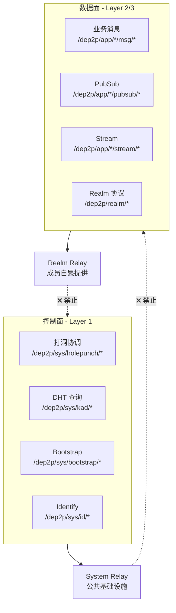
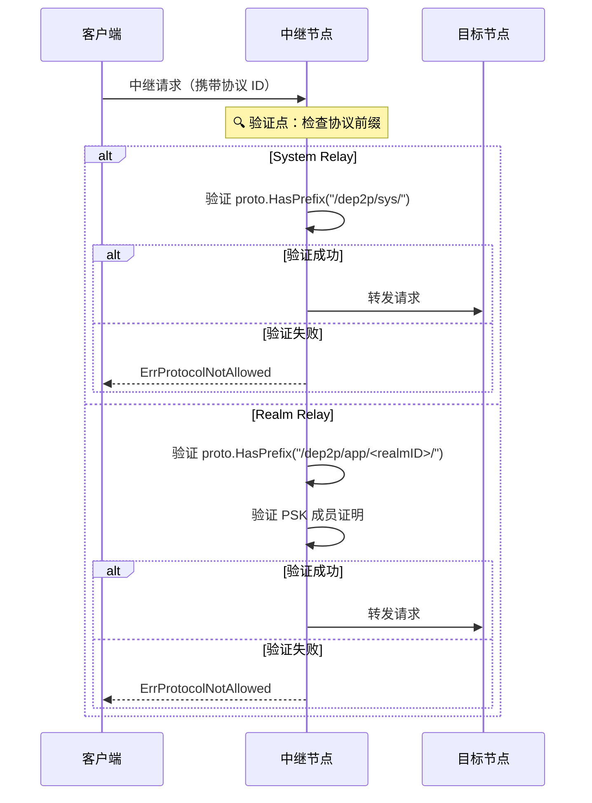
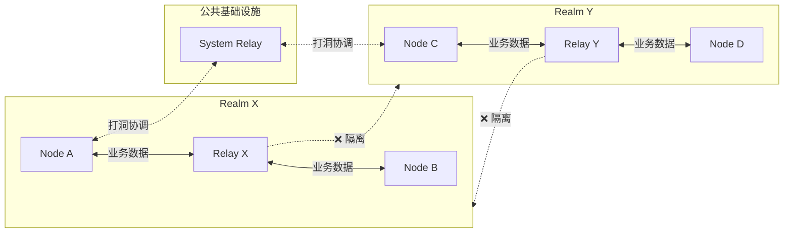

# INV-003: 控制面/数据面分离

## 元数据

| 属性 | 值 |
|------|-----|
| 编号 | INV-003 |
| 名称 | 控制面/数据面分离（Control-Data Plane Separation） |
| 状态 | ✅ Active |
| 关联 ADR | [ADR-0004](../adr/0004-control-data-separation.md) |
| 关联讨论 | [DISC-1227-relay-isolation](../discussions/DISC-1227-relay-isolation.md) |

---

## 不变量陈述

> **System Relay（Layer 1）MUST NOT 转发 `/dep2p/app/*` 或 `/dep2p/realm/*` 协议流量。**
>
> **Realm Relay（Layer 2）MUST NOT 转发 `/dep2p/sys/*` 协议流量。**

这是 DeP2P 中继分层设计的核心不变量，确保控制面与数据面的严格隔离。

---

## 规范说明

### 核心断言

```
┌─────────────────────────────────────────────────────────────────────────────┐
│                    INV-003：控制面/数据面分离                                 │
├─────────────────────────────────────────────────────────────────────────────┤
│                                                                              │
│   控制面（Control Plane）= Layer 1 System 协议                               │
│   ─────────────────────────────────────────────────────────────────────────  │
│   职责：打洞协调、地址验证、DHT 辅助、Bootstrap、NAT 探测                     │
│   协议前缀：/dep2p/sys/*                                                     │
│   承载方式：System Relay（公共基础设施）                                      │
│   不承载业务数据                                                             │
│                                                                              │
│   数据面（Data Plane）= Layer 2/3 Realm 业务协议                             │
│   ─────────────────────────────────────────────────────────────────────────  │
│   职责：业务消息、PubSub、Stream、应用协议                                   │
│   协议前缀：/dep2p/app/<realmID>/*、/dep2p/realm/<realmID>/*                 │
│   承载方式：Realm Relay（Realm 成员自愿提供）                                 │
│   必须做成员证明/配额/可观测                                                  │
│                                                                              │
└─────────────────────────────────────────────────────────────────────────────┘
```

### 分层中继架构图



### 协议分类表

| 协议前缀 | 分类 | System Relay | Realm Relay | 说明 |
|----------|------|--------------|-------------|------|
| `/dep2p/sys/*` | 控制面 | ✅ 允许 | ❌ 禁止 | 系统基础协议 |
| `/dep2p/app/<realmID>/*` | 数据面 | ❌ 禁止 | ✅ 允许 | 应用业务协议 |
| `/dep2p/realm/<realmID>/*` | 数据面 | ❌ 禁止 | ✅ 允许 | Realm 控制协议 |

---

## 设计动机

### 为什么需要分离？

借鉴 tunnelto 等隧道服务的设计，明确区分"控制连接"与"数据通道"可以带来以下好处：

```
┌─────────────────────────────────────────────────────────────────────────────┐
│                         分离带来的价值                                        │
├─────────────────────────────────────────────────────────────────────────────┤
│                                                                              │
│   1. 成本归属清晰                                                            │
│      ─────────────────────────────────────────────────────────────────────  │
│      System Relay：公共基础设施承担（打洞协调、DHT 等轻量流量）               │
│      Realm Relay：Realm 成员承担（业务数据由受益者付费）                      │
│                                                                              │
│   2. 隔离边界明确                                                            │
│      ─────────────────────────────────────────────────────────────────────  │
│      业务数据永远不会"泄露"到 Realm 外部节点                                 │
│      非 Realm 成员无法看到（即使加密的）业务流量模式                          │
│                                                                              │
│   3. 可观测性分离                                                            │
│      ─────────────────────────────────────────────────────────────────────  │
│      控制面：监控打洞成功率、DHT 查询延迟                                     │
│      数据面：监控业务吞吐、成员活跃度、配额使用                               │
│                                                                              │
│   4. 安全策略分离                                                            │
│      ─────────────────────────────────────────────────────────────────────  │
│      控制面：速率限制、时长限制（防滥用）                                     │
│      数据面：PSK 成员验证、配额控制（业务保障）                               │
│                                                                              │
└─────────────────────────────────────────────────────────────────────────────┘
```

### 问题场景

如果不分离控制面/数据面，会出现以下问题：

```
场景：A 和 B 在 Realm-X，但无法直连，需要中继 C

┌─────────┐                ┌─────────┐                ┌─────────┐
│  Node A │ ──────────────▶│ Relay C │──────────────▶ │  Node B │
│ Realm-X │   业务消息      │ Realm-Y │   业务消息      │ Realm-X │
└─────────┘                └─────────┘                └─────────┘
                                ▲
                                │
                 ❌ 问题：C 不在 Realm-X
                 ❌ 但 C 承担了 Realm-X 的带宽成本
                 ❌ C 甚至可能"看到"（虽然加密）Realm-X 的流量模式
                 ❌ 打破了 Realm 业务隔离的设计初衷
```

---

## 验证时机

### 验证流程



### 关键验证点

| 验证点 | 时机 | 条件 | 失败行为 |
|--------|------|------|----------|
| System Relay 协议检查 | 中继请求到达时 | `proto.HasPrefix("/dep2p/sys/")` | 返回 `ErrProtocolNotAllowed` |
| Realm Relay 协议检查 | 中继请求到达时 | `proto.HasPrefix("/dep2p/app/<realmID>/")` | 返回 `ErrProtocolNotAllowed` |
| Realm Relay 成员验证 | 中继请求到达时 | PSK 成员证明有效 | 返回 `ErrNotMember` |

---

## 代码约束

### MUST 要求

```go
// ✅ MUST: System Relay 只转发系统协议
func (r *SystemRelay) handleRelayRequest(req *RelayRequest) error {
    // INV-003 验证点 ⚠️ 必须存在
    if !strings.HasPrefix(string(req.Protocol), "/dep2p/sys/") {
        log.Warn("system relay rejected non-sys protocol",
            "protocol", req.Protocol,
            "from", req.From)
        return ErrProtocolNotAllowed
    }
    
    // 继续处理...
    return r.forward(req)
}

// ✅ MUST: Realm Relay 只转发本 Realm 业务协议
func (r *RealmRelay) handleRelayRequest(req *RelayRequest) error {
    expectedAppPrefix := fmt.Sprintf("/dep2p/app/%s/", r.realmID)
    expectedRealmPrefix := fmt.Sprintf("/dep2p/realm/%s/", r.realmID)
    
    proto := string(req.Protocol)
    
    // INV-003 验证点 ⚠️ 必须存在
    if !strings.HasPrefix(proto, expectedAppPrefix) && 
       !strings.HasPrefix(proto, expectedRealmPrefix) {
        log.Warn("realm relay rejected protocol",
            "protocol", req.Protocol,
            "expected_realm", r.realmID,
            "from", req.From)
        return ErrProtocolNotAllowed
    }
    
    // 继续验证 PSK 成员证明...
    return r.forward(req)
}
```

### MUST NOT 要求

```go
// ❌ MUST NOT: System Relay 不能转发业务协议
func (r *SystemRelay) handleRelayRequest(req *RelayRequest) error {
    // 缺少协议检查！违反 INV-003
    return r.forward(req)
}

// ❌ MUST NOT: Realm Relay 不能转发系统协议
func (r *RealmRelay) handleRelayRequest(req *RelayRequest) error {
    if strings.HasPrefix(string(req.Protocol), "/dep2p/sys/") {
        // 不应该处理系统协议！应该拒绝
        return r.forward(req) // 违反 INV-003
    }
    // ...
}
```

---

## 两种中继对比

| 维度 | System Relay (控制面) | Realm Relay (数据面) |
|------|----------------------|----------------------|
| **服务范围** | 全网任意节点 | 仅同 Realm 成员 |
| **提供者** | 公共基础设施 | Realm 成员自愿提供 |
| **协议白名单** | `/dep2p/sys/*` | `/dep2p/app/<realmID>/*`<br/>`/dep2p/realm/<realmID>/*` |
| **协议黑名单** | `/dep2p/app/*`<br/>`/dep2p/realm/*` | `/dep2p/sys/*` |
| **成员验证** | 无 | PSK 证明 |
| **带宽限制** | 严格（10KB/s） | 由提供者配置 |
| **时长限制** | 60 秒 | 无限（或由提供者配置） |
| **用途** | 打洞协调、DHT、Bootstrap | 业务消息转发 |
| **成本承担** | 公共基础设施 | Realm 成员（合理！） |

---

## 测试要求

### 必须覆盖的场景

| 场景 | 测试名称 | 期望结果 |
|------|----------|----------|
| System Relay 接受系统协议 | `TestINV003_SystemRelay_AcceptSysProtocol` | 转发成功 |
| System Relay 拒绝应用协议 | `TestINV003_SystemRelay_RejectAppProtocol` | 返回 `ErrProtocolNotAllowed` |
| System Relay 拒绝 Realm 协议 | `TestINV003_SystemRelay_RejectRealmProtocol` | 返回 `ErrProtocolNotAllowed` |
| Realm Relay 接受本 Realm 协议 | `TestINV003_RealmRelay_AcceptOwnProtocol` | 转发成功 |
| Realm Relay 拒绝其他 Realm 协议 | `TestINV003_RealmRelay_RejectOtherRealm` | 返回 `ErrProtocolNotAllowed` |
| Realm Relay 拒绝系统协议 | `TestINV003_RealmRelay_RejectSysProtocol` | 返回 `ErrProtocolNotAllowed` |

### 测试示例

```go
func TestINV003_SystemRelay_RejectAppProtocol(t *testing.T) {
    relay := createSystemRelay(t)
    
    // 尝试通过 System Relay 转发应用协议
    req := &RelayRequest{
        Protocol: "/dep2p/app/realm123/chat/1.0.0",
        From:     nodeA.ID(),
        To:       nodeB.ID(),
    }
    
    err := relay.HandleRequest(req)
    
    // 期望：协议被拒绝
    assert.ErrorIs(t, err, ErrProtocolNotAllowed)
}

func TestINV003_RealmRelay_AcceptOwnProtocol(t *testing.T) {
    realmID := types.RealmID("realm123")
    relay := createRealmRelay(t, realmID)
    
    // 通过 Realm Relay 转发本 Realm 协议
    req := &RelayRequest{
        Protocol: "/dep2p/app/realm123/chat/1.0.0",
        From:     nodeA.ID(), // 已验证成员
        To:       nodeB.ID(), // 已验证成员
    }
    
    err := relay.HandleRequest(req)
    
    // 期望：转发成功
    assert.NoError(t, err)
}
```

---

## 违反后果

### 检测违反

```mermaid
flowchart TB
    Request[中继请求] --> CheckType{中继类型?}
    
    CheckType -->|System Relay| CheckSys{proto.HasPrefix<br/>"/dep2p/sys/"?}
    CheckType -->|Realm Relay| CheckRealm{proto.HasPrefix<br/>"/dep2p/app/<realmID>/"?}
    
    CheckSys -->|是| Forward1[转发请求]
    CheckSys -->|否| Violation1[检测到违反]
    
    CheckRealm -->|是| CheckMember{成员验证?}
    CheckRealm -->|否| Violation2[检测到违反]
    
    CheckMember -->|通过| Forward2[转发请求]
    CheckMember -->|失败| Violation3[成员验证失败]
    
    Violation1 --> Log1[记录日志]
    Violation2 --> Log2[记录日志]
    Violation3 --> Log3[记录日志]
    
    Log1 --> Error1["返回 ErrProtocolNotAllowed"]
    Log2 --> Error2["返回 ErrProtocolNotAllowed"]
    Log3 --> Error3["返回 ErrNotMember"]
```

### 错误处理

```go
var (
    // ErrProtocolNotAllowed 表示协议不在中继白名单内
    // 这是 INV-003 违反时的标准错误
    ErrProtocolNotAllowed = errors.New("protocol not allowed for this relay type")
)

// 处理协议违规
func handleProtocolViolation(relay RelayType, proto types.ProtocolID, from types.NodeID) error {
    // 1. 记录日志（可能的滥用尝试）
    log.Warn("protocol violation detected",
        "relay_type", relay,
        "protocol", proto,
        "from", from,
    )
    
    // 2. 可选：更新滥用统计
    metrics.ProtocolViolations.Inc()
    
    // 3. 返回错误
    return fmt.Errorf("%w: %s on %s relay", ErrProtocolNotAllowed, proto, relay)
}
```

---

## 安全意义

### 防护能力

| 威胁 | INV-003 防护 |
|------|-------------|
| 流量泄露 | ✅ 业务数据只经过 Realm 成员中继 |
| 成本滥用 | ✅ 业务流量成本由 Realm 承担 |
| 协议混淆攻击 | ✅ 严格的协议前缀检查 |
| 跨 Realm 嗅探 | ✅ 非成员无法成为业务中继 |

### 隔离边界



---

## 相关文档

- [ADR-0004: 控制面/数据面分离](../adr/0004-control-data-separation.md)
- [DISC-1227: 分层中继设计](../discussions/DISC-1227-relay-isolation.md)
- [中继协议规范](../protocols/transport/relay.md)
- [协议命名空间](../protocols/foundation/protocol-namespace.md)
- [三层架构详解](../architecture/layers.md)

---

## 变更历史

| 版本 | 日期 | 变更 |
|------|------|------|
| 1.0 | 2025-12-28 | 初始版本，基于 DISC-1227 讨论正式化 |

