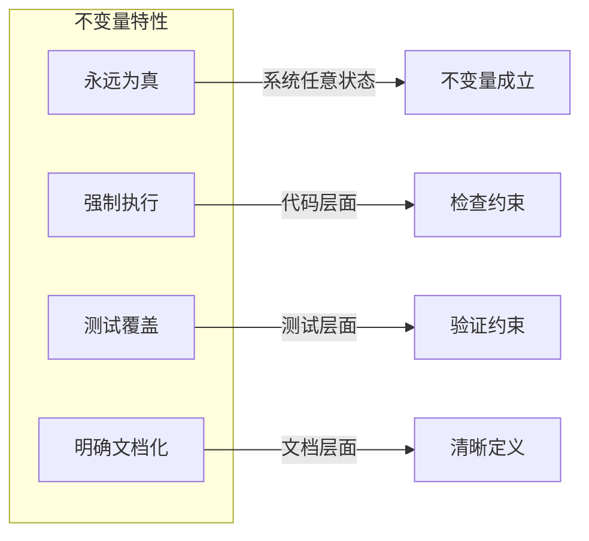
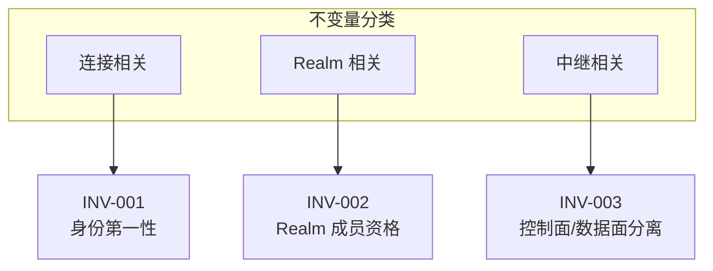
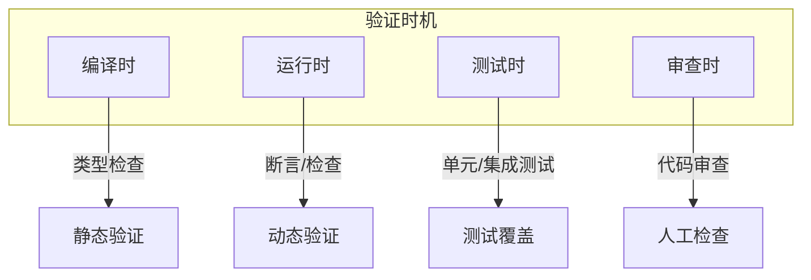
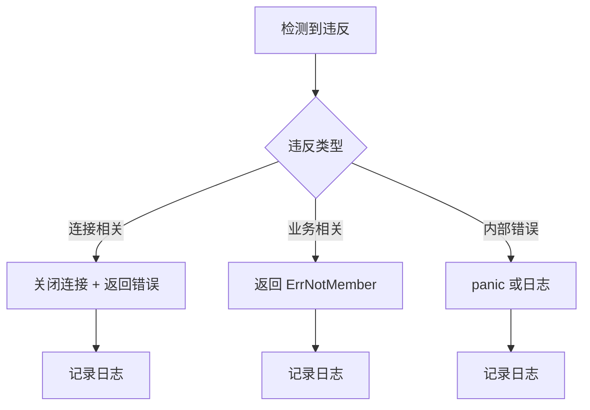
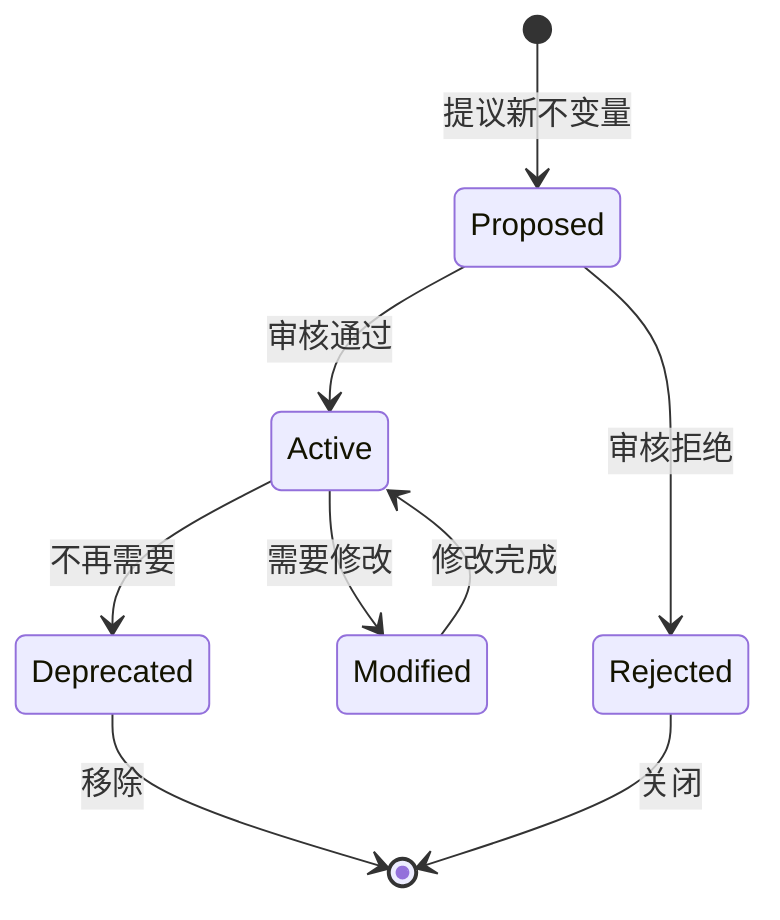
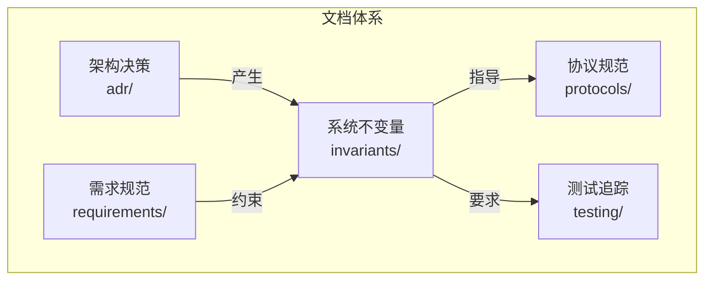

# 系统不变量

本目录定义 DeP2P 系统的核心不变量，这些是系统设计和实现的强制性约束。

---

## 概述

### 什么是不变量

不变量（Invariant）是系统中**永远为真**的属性。违反不变量意味着设计错误或实现缺陷。



### 不变量的价值

| 价值 | 描述 |
|------|------|
| 消除模糊性 | 明确系统行为边界 |
| 防止漂移 | 新功能开发有明确约束 |
| 代码审查 | 提供检查标准 |
| 测试基础 | 明确必须覆盖的场景 |
| 文档一致性 | 统一表述规范 |

---

## 不变量索引

### 当前不变量

| 编号 | 名称 | 描述 | 状态 |
|------|------|------|------|
| [INV-001](INV-001-identity-first.md) | 身份第一性 | 所有连接必须验证 NodeID | ✅ Active |
| [INV-002](INV-002-realm-membership.md) | Realm 成员资格 | 业务 API 需要 Realm 成员资格 | ✅ Active |
| [INV-003](INV-003-control-data-separation.md) | 控制面/数据面分离 | System Relay 禁止转发业务协议 | ✅ Active |

### 按类别分类



---

## 不变量格式

### 标准格式

每个不变量文档应包含以下部分：

```markdown
# INV-XXX: [不变量名称]

## 元数据
| 属性 | 值 |
|------|-----|
| 编号 | INV-XXX |
| 状态 | Active / Deprecated |
| 关联 ADR | ADR-XXXX |
| 关联需求 | REQ-XXX-XXX |

## 不变量陈述
> **[简洁的 MUST 语句]**

## 规范说明
[详细解释不变量的含义和边界]

## 验证时机
[何时验证此不变量]

## 代码约束
[实现中的 MUST/MUST NOT 要求]

## 测试要求
[必须覆盖的测试场景]

## 违反后果
[违反时的行为和处理]

## 相关文档
[链接到相关文档]
```

---

## 关键术语

### MUST/MUST NOT

不变量使用 RFC 2119 关键字：

| 关键字 | 含义 |
|--------|------|
| **MUST** | 绝对要求，必须实现 |
| **MUST NOT** | 绝对禁止，不能实现 |
| **SHALL** | 同 MUST |
| **SHALL NOT** | 同 MUST NOT |

### 状态定义

| 状态 | 描述 |
|------|------|
| Active | 当前有效，必须遵守 |
| Deprecated | 已废弃，不再强制 |
| Proposed | 提议中，待审核 |

---

## 验证方法

### 验证时机



### 验证层次

| 层次 | 方法 | 工具 |
|------|------|------|
| 编译时 | 类型系统 | Go 编译器 |
| 运行时 | 断言/检查 | 代码中的检查 |
| 测试时 | 单元测试 | go test |
| 审查时 | 代码审查 | PR Review |

---

## 测试要求

### 必须覆盖

每个不变量必须有对应的测试覆盖：

1. **正向测试**: 验证不变量成立时的正常行为
2. **负向测试**: 验证违反不变量时的错误处理
3. **边界测试**: 验证边界条件下的行为

### 测试命名

```go
// 测试命名规范
func TestINV001_IdentityFirst_ValidConnection(t *testing.T) {}
func TestINV001_IdentityFirst_InvalidIdentity(t *testing.T) {}
func TestINV002_RealmMembership_NotMember(t *testing.T) {}
```

---

## 违反处理

### 违反不变量时的行为



### 错误类型

| 不变量 | 违反时错误 | 行为 |
|--------|-----------|------|
| INV-001 | `ErrIdentityMismatch` | 关闭连接 |
| INV-002 | `ErrNotMember` | 拒绝业务调用 |
| INV-003 | `ErrProtocolNotAllowed` | 拒绝中继请求 |

---

## 不变量生命周期



### 生命周期说明

1. **Proposed**: 新不变量提议，需要团队审核
2. **Active**: 审核通过，强制执行
3. **Modified**: 需要修改，创建新版本
4. **Deprecated**: 不再需要，准备移除

---

## 与其他文档的关系



| 关系 | 说明 |
|------|------|
| ADR → INV | 架构决策产生不变量 |
| REQ → INV | 需求约束不变量范围 |
| INV → PROTO | 不变量指导协议设计 |
| INV → TEST | 不变量要求测试覆盖 |

---

## 检查清单

### 代码审查检查项

| 检查项 | 不变量 | 通过条件 |
|--------|--------|----------|
| 所有 Connect 调用都有 Expected NodeID | INV-001 | ✅ |
| 所有连接建立都验证 RemoteIdentity | INV-001 | ✅ |
| 业务 API 在调用前检查 Realm 状态 | INV-002 | ✅ |
| 未加入 Realm 时返回 ErrNotMember | INV-002 | ✅ |
| System Relay 检查协议前缀 `/dep2p/sys/` | INV-003 | ✅ |
| Realm Relay 检查协议前缀 `/dep2p/app/<realmID>/` | INV-003 | ✅ |
| 业务协议被 System Relay 拒绝 | INV-003 | ✅ |

### 文档审查检查项

| 检查项 | 不变量 | 通过条件 |
|--------|--------|----------|
| 不出现"纯 IP 连接"表述 | INV-001 | ✅ |
| 连接示例都显示 NodeID 使用 | INV-001 | ✅ |
| 业务 API 示例显示先 JoinRealm | INV-002 | ✅ |
| 错误处理包含 ErrNotMember | INV-002 | ✅ |
| 中继文档区分控制面/数据面 | INV-003 | ✅ |
| 协议白名单/黑名单表格明确 | INV-003 | ✅ |

---

## 相关文档

- [设计文档导航](../README.md)
- [架构决策记录](../adr/README.md)
- [需求规范](../requirements/README.md)
- [测试追踪](../testing/README.md)
