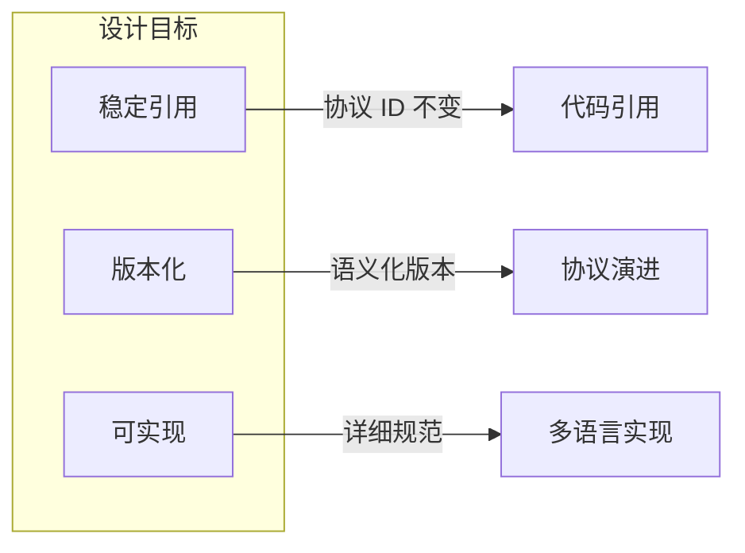
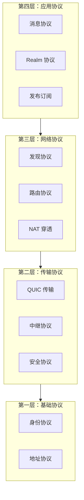
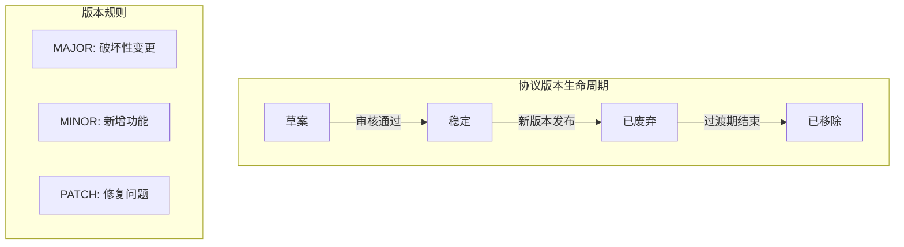

# 协议规范索引

本文档是 DeP2P 所有协议规范的索引和导航页面，定义协议命名规范和版本策略。

---

## 概述

DeP2P 协议规范的设计目标：



| 目标 | 描述 |
|------|------|
| 稳定引用 | 协议 ID 一旦发布不变，便于代码引用 |
| 版本化 | 使用语义化版本，支持向后兼容 |
| 可实现 | 提供足够细节，支持多语言实现 |

---

## 协议分类

DeP2P 协议按四层架构分类：



### 协议目录

| 分类 | 目录 | 协议 |
|------|------|------|
| 基础协议 | [foundation/](foundation/) | 身份、地址 |
| 传输协议 | [transport/](transport/) | QUIC、中继、安全 |
| 网络协议 | [network/](network/) | 发现、路由、NAT |
| 应用协议 | [application/](application/) | 消息、Realm、PubSub |

---

## 协议 ID 命名规范（IMPL-1227 更新）

详细规范请参见 [协议命名空间规范](foundation/protocol-namespace.md)。

### 格式

协议 ID 采用分层路径格式：

```
Layer 1: /dep2p/sys/<protocol>/<version>
Layer 2: /dep2p/realm/<realmID>/<protocol>/<version>
Layer 3: /dep2p/app/<realmID>/<protocol>/<version>
```

### 作用域（Scope）

| Scope | 前缀 | RealmID | Realm 验证 | 说明 |
|-------|------|---------|------------|------|
| System | `/dep2p/sys/` | 无 | 不需要 | 基础设施协议 |
| Realm | `/dep2p/realm/<realmID>/` | 需要 | 需要 | Realm 控制协议 |
| Application | `/dep2p/app/<realmID>/` | 需要 | 需要 | 业务协议 |

### 自动前缀补全（IMPL-1227）

用户只需提供相对协议名，框架自动添加 Realm 前缀：

```go
// 用户代码
realm.Messaging().SendWithProtocol(ctx, target, "chat/1.0.0", data)

// 实际协议 ID
// /dep2p/app/<realmID>/chat/1.0.0
```

### 示例

```go
// 系统协议 - 无需 Realm
const (
    SysPing     = "/dep2p/sys/ping/1.0.0"
    SysIdentify = "/dep2p/sys/identify/1.0.0"
    SysRelay    = "/dep2p/sys/relay/1.0.0"
)

// Realm 控制协议 - 包含 RealmID
// /dep2p/realm/<realmID>/auth/1.0.0
// /dep2p/realm/<realmID>/sync/1.0.0

// 应用协议 - 包含 RealmID，框架自动添加前缀
// /dep2p/app/<realmID>/messaging/1.0.0
// /dep2p/app/<realmID>/chat/1.0.0
```

---

## 版本策略

### 语义化版本

协议版本遵循 [Semantic Versioning](https://semver.org/)：

```
MAJOR.MINOR.PATCH
```

| 版本部分 | 变更含义 | 示例 |
|----------|----------|------|
| MAJOR | 不兼容的协议变更 | 1.0.0 → 2.0.0 |
| MINOR | 向后兼容的功能新增 | 1.0.0 → 1.1.0 |
| PATCH | 向后兼容的修复 | 1.0.0 → 1.0.1 |

### 版本管理流程



### 兼容性规则

1. **向后兼容**: MINOR 和 PATCH 版本必须向后兼容
2. **多版本支持**: 节点应支持多个 MAJOR 版本
3. **废弃通知**: 废弃协议需提前一个版本通知
4. **过渡期**: 废弃协议保留至少两个 MINOR 版本

---

## 协议索引

### 系统协议（/dep2p/sys/）

| 协议 ID | 文档 | 功能 |
|---------|------|------|
| `/dep2p/sys/ping/1.0.0` | - | 节点存活检测 |
| `/dep2p/sys/identify/1.0.0` | [identity.md](foundation/identity.md) | 身份交换 |
| `/dep2p/sys/goodbye/1.0.0` | - | 优雅关闭 |
| `/dep2p/sys/heartbeat/1.0.0` | - | 连接保活 |
| `/dep2p/sys/relay/1.0.0` | [relay.md](transport/relay.md) | 流量中继 |
| `/dep2p/sys/holepunch/1.0.0` | [nat.md](network/nat.md) | NAT 打洞 |
| `/dep2p/sys/kad/1.0.0` | [discovery.md](network/discovery.md) | DHT 发现 |
| `/dep2p/sys/realm/1.0.0` | [realm.md](application/realm.md) | Realm 认证 |

### 应用协议（/dep2p/app/）

| 协议 ID | 文档 | 功能 |
|---------|------|------|
| `/dep2p/app/messaging/send/1.0.0` | [messaging.md](application/messaging.md) | 单向消息 |
| `/dep2p/app/messaging/request/1.0.0` | [messaging.md](application/messaging.md) | 请求响应 |
| `/dep2p/app/pubsub/1.0.0` | [pubsub.md](application/pubsub.md) | 发布订阅 |

---

## 协议注册

### 新增协议流程


### 步骤

1. **定义协议**
   - 确定协议功能和范围
   - 选择合适的 scope（sys/app）
   - 分配协议名称

2. **编写文档**
   - 在对应目录创建 `.md` 文件
   - 描述消息格式、流程、错误处理

3. **注册常量**
   - 在 `pkg/protocolids/` 中定义常量
   - 更新 `_docs/01-design/architecture/protocol-registry.md`

4. **实现协议**
   - 引用 `protocolids` 包中的常量
   - 禁止在其他位置硬编码协议 ID

5. **测试验证**
   - 编写单元测试和集成测试
   - 验证与其他版本的兼容性

---

## 代码引用

### 唯一真源原则

协议 ID 必须从 `pkg/protocolids/` 包引用，禁止硬编码：

```go
import "github.com/dep2p/go-dep2p/pkg/protocolids"

// ✅ 正确：引用常量
node.SetStreamHandler(protocolids.SysPing, handlePing)

// ❌ 错误：硬编码字面量
node.SetStreamHandler("/dep2p/sys/ping/1.0.0", handlePing)
```

### CI 校验

项目 CI 会扫描仓库，禁止在非允许文件中出现 `/dep2p/` 字面量。

---

## 相关文档

### 基础协议
- [身份协议](foundation/identity.md)
- [地址协议](foundation/addressing.md)
- [协议命名空间规范](foundation/protocol-namespace.md) (IMPL-1227)

### 传输协议
- [QUIC 传输](transport/quic.md)
- [中继协议](transport/relay.md)
- [安全协议](transport/security.md)

### 网络协议
- [发现协议](network/discovery.md)
- [路由协议](network/routing.md)
- [NAT 穿透](network/nat.md)

### 应用协议
- [消息协议](application/messaging.md)
- [Realm 协议](application/realm.md)
- [发布订阅](application/pubsub.md)

---

## 参考

- [协议 ID 命名规范](../../docs/zh/reference/protocol-ids.md)
- [协议注册表](./_docs/01-design/architecture/protocol-registry.md)
- [protocolids 包](../../pkg/protocolids/)
