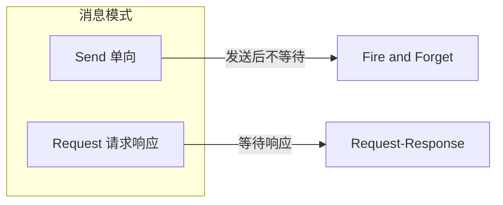
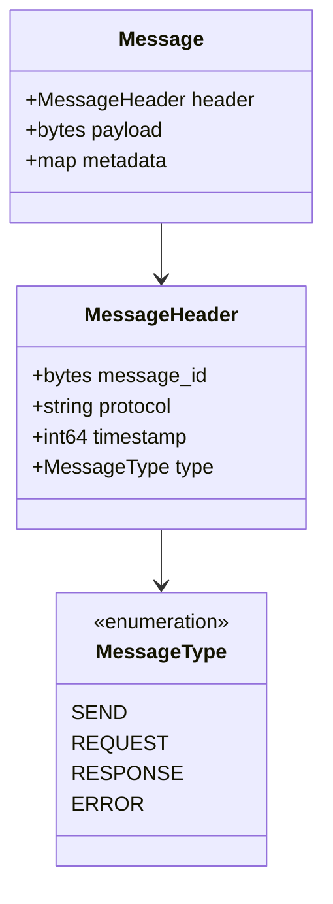
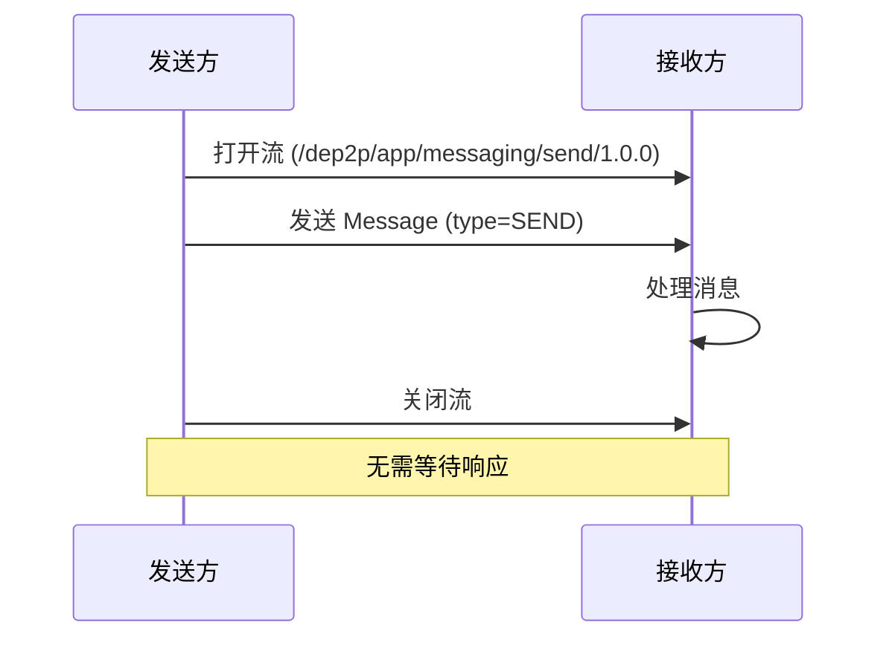
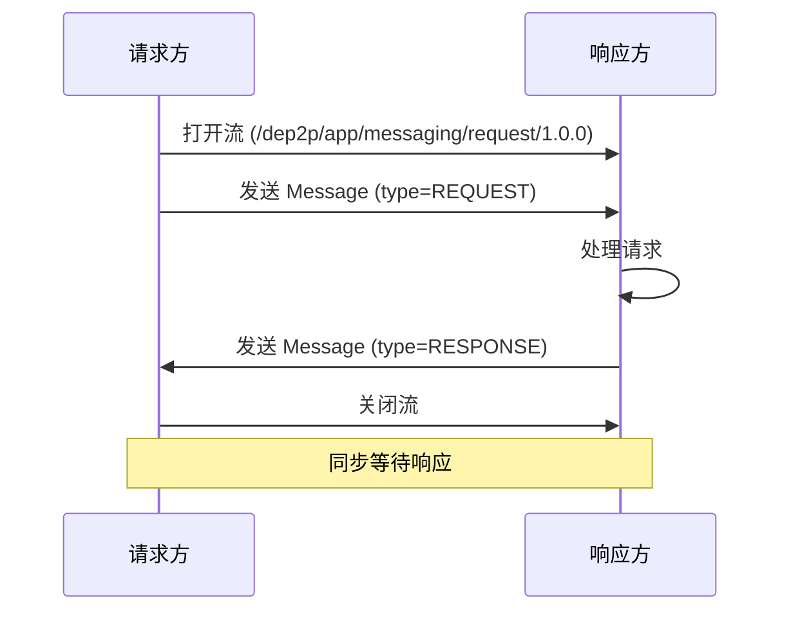
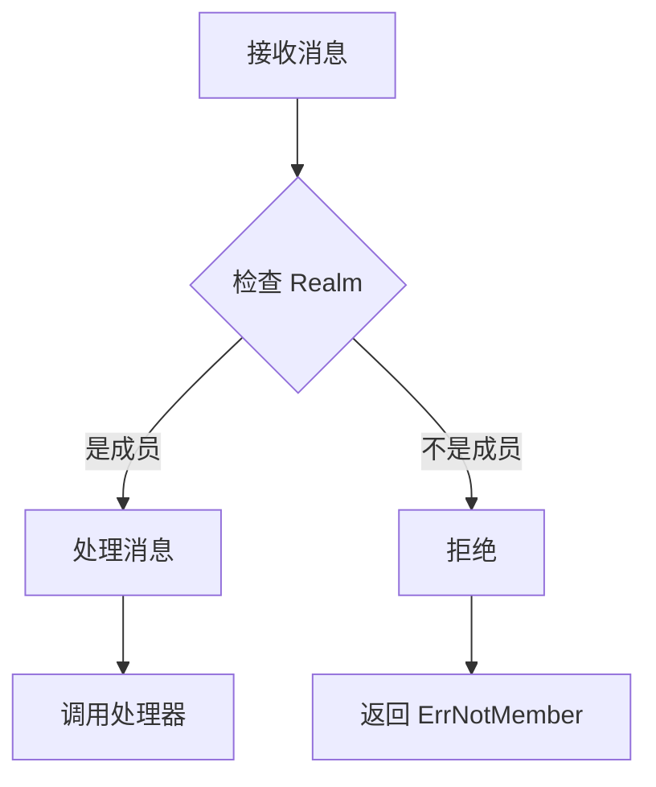

# 消息协议规范

本文档定义 DeP2P 消息协议的格式、流程和实现细节。

---

## 概述

消息协议提供节点间的消息传递能力，支持单向发送和请求响应两种模式。

### 协议信息

| 属性 | 值 |
|------|-----|
| Send 协议 ID | `/dep2p/app/messaging/send/1.0.0` |
| Request 协议 ID | `/dep2p/app/messaging/request/1.0.0` |
| 作用域 | Application |
| Realm 验证 | 需要 |

### 消息模式



| 模式 | 描述 | 适用场景 |
|------|------|----------|
| Send | 单向发送，不等待响应 | 通知、事件 |
| Request | 请求响应，等待结果 | 查询、RPC |

---

## 消息格式

### 通用消息头

```protobuf
message MessageHeader {
    // 消息 ID（用于关联请求和响应）
    bytes message_id = 1;
    
    // 协议 ID
    string protocol = 2;
    
    // 发送时间戳
    int64 timestamp = 3;
    
    // 消息类型
    MessageType type = 4;
}

enum MessageType {
    SEND = 0;      // 单向消息
    REQUEST = 1;   // 请求
    RESPONSE = 2;  // 响应
    ERROR = 3;     // 错误响应
}
```

### 消息体

```protobuf
message Message {
    // 消息头
    MessageHeader header = 1;
    
    // 消息载荷
    bytes payload = 2;
    
    // 元数据（可选）
    map<string, bytes> metadata = 3;
}
```

### 消息结构图



---

## Send 协议

### 流程



### 代码示例

```go
// 发送消息
func (s *MessagingService) Send(ctx context.Context, to peer.ID, proto string, data []byte) error {
    // 检查 Realm 成员资格
    if !s.realmManager.IsMember(to) {
        return ErrNotMember
    }
    
    // 打开流
    stream, err := s.host.NewStream(ctx, to, protocolids.AppMessagingSend)
    if err != nil {
        return fmt.Errorf("open stream failed: %w", err)
    }
    defer stream.Close()
    
    // 构建消息
    msg := &pb.Message{
        Header: &pb.MessageHeader{
            MessageId: generateMessageID(),
            Protocol:  proto,
            Timestamp: time.Now().UnixNano(),
            Type:      pb.MessageType_SEND,
        },
        Payload: data,
    }
    
    // 发送消息
    if err := writeMessage(stream, msg); err != nil {
        return fmt.Errorf("write message failed: %w", err)
    }
    
    return nil
}

// 处理 Send 消息
func (s *MessagingService) handleSend(stream network.Stream) {
    defer stream.Close()
    
    // 验证 Realm
    remotePeer := stream.Conn().RemotePeer()
    if !s.realmManager.IsMember(remotePeer) {
        return
    }
    
    // 读取消息
    msg, err := readMessage(stream)
    if err != nil {
        log.Error("read message failed", "error", err)
        return
    }
    
    // 调用处理器
    handler, ok := s.handlers[msg.Header.Protocol]
    if !ok {
        log.Warn("no handler for protocol", "protocol", msg.Header.Protocol)
        return
    }
    
    handler(remotePeer, msg.Payload)
}
```

---

## Request 协议

### 流程



### 代码示例

```go
// 请求消息
func (s *MessagingService) Request(ctx context.Context, to peer.ID, proto string, data []byte) ([]byte, error) {
    // 检查 Realm 成员资格
    if !s.realmManager.IsMember(to) {
        return nil, ErrNotMember
    }
    
    // 打开流
    stream, err := s.host.NewStream(ctx, to, protocolids.AppMessagingRequest)
    if err != nil {
        return nil, fmt.Errorf("open stream failed: %w", err)
    }
    defer stream.Close()
    
    // 构建请求
    msgID := generateMessageID()
    req := &pb.Message{
        Header: &pb.MessageHeader{
            MessageId: msgID,
            Protocol:  proto,
            Timestamp: time.Now().UnixNano(),
            Type:      pb.MessageType_REQUEST,
        },
        Payload: data,
    }
    
    // 发送请求
    if err := writeMessage(stream, req); err != nil {
        return nil, fmt.Errorf("write request failed: %w", err)
    }
    
    // 等待响应
    resp, err := readMessage(stream)
    if err != nil {
        return nil, fmt.Errorf("read response failed: %w", err)
    }
    
    // 检查响应类型
    if resp.Header.Type == pb.MessageType_ERROR {
        return nil, decodeError(resp.Payload)
    }
    
    // 验证消息 ID
    if !bytes.Equal(resp.Header.MessageId, msgID) {
        return nil, errors.New("message ID mismatch")
    }
    
    return resp.Payload, nil
}

// 处理 Request 消息
func (s *MessagingService) handleRequest(stream network.Stream) {
    defer stream.Close()
    
    // 验证 Realm
    remotePeer := stream.Conn().RemotePeer()
    if !s.realmManager.IsMember(remotePeer) {
        writeError(stream, ErrNotMember)
        return
    }
    
    // 读取请求
    req, err := readMessage(stream)
    if err != nil {
        log.Error("read request failed", "error", err)
        return
    }
    
    // 调用处理器
    handler, ok := s.requestHandlers[req.Header.Protocol]
    if !ok {
        writeError(stream, ErrProtocolNotSupported)
        return
    }
    
    // 处理请求
    respData, err := handler(remotePeer, req.Payload)
    if err != nil {
        writeError(stream, err)
        return
    }
    
    // 发送响应
    resp := &pb.Message{
        Header: &pb.MessageHeader{
            MessageId: req.Header.MessageId,
            Protocol:  req.Header.Protocol,
            Timestamp: time.Now().UnixNano(),
            Type:      pb.MessageType_RESPONSE,
        },
        Payload: respData,
    }
    
    writeMessage(stream, resp)
}
```

---

## 处理器注册

### API

```go
// 消息处理器
type MessageHandler func(from peer.ID, data []byte)

// 请求处理器
type RequestHandler func(from peer.ID, data []byte) ([]byte, error)

// 注册消息处理器
func (s *MessagingService) SetMessageHandler(proto string, handler MessageHandler) {
    s.mu.Lock()
    s.handlers[proto] = handler
    s.mu.Unlock()
}

// 注册请求处理器
func (s *MessagingService) SetRequestHandler(proto string, handler RequestHandler) {
    s.mu.Lock()
    s.requestHandlers[proto] = handler
    s.mu.Unlock()
}
```

### 使用示例

```go
// 注册消息处理器
node.SetMessageHandler("/myapp/notify", func(from peer.ID, data []byte) {
    log.Info("收到通知", "from", from, "data", string(data))
})

// 注册请求处理器
node.SetRequestHandler("/myapp/query", func(from peer.ID, data []byte) ([]byte, error) {
    // 处理查询
    result, err := processQuery(data)
    if err != nil {
        return nil, err
    }
    return result, nil
})

// 发送消息
err := node.Send(ctx, targetPeer, "/myapp/notify", []byte("hello"))

// 发送请求
resp, err := node.Request(ctx, targetPeer, "/myapp/query", []byte("query data"))
```

---

## Realm 验证

### 验证流程



### 验证逻辑

```go
// 验证 Realm 成员资格
func (s *MessagingService) validateRealm(remotePeer peer.ID) error {
    // 检查当前 Realm
    currentRealm := s.realmManager.CurrentRealm()
    if currentRealm == "" {
        return ErrNotJoinedRealm
    }
    
    // 检查对端是否是 Realm 成员
    if !s.realmManager.IsMember(remotePeer) {
        return ErrNotMember
    }
    
    return nil
}
```

---

## 错误处理

### 错误类型

| 错误 | 描述 | 处理方式 |
|------|------|----------|
| `ErrNotMember` | 对端不是 Realm 成员 | 拒绝消息 |
| `ErrNotJoinedRealm` | 未加入 Realm | 先加入 Realm |
| `ErrProtocolNotSupported` | 协议不支持 | 检查协议注册 |
| `ErrTimeout` | 请求超时 | 重试或放弃 |
| `ErrStreamClosed` | 流已关闭 | 重新建立连接 |

### 错误响应格式

```protobuf
message ErrorResponse {
    // 错误码
    int32 code = 1;
    
    // 错误消息
    string message = 2;
    
    // 详细信息
    map<string, string> details = 3;
}
```

---

## 超时控制

### 配置

```go
// 消息超时配置
type MessagingConfig struct {
    // Send 超时
    SendTimeout time.Duration
    
    // Request 超时
    RequestTimeout time.Duration
    
    // 最大消息大小
    MaxMessageSize int64
}

var DefaultMessagingConfig = &MessagingConfig{
    SendTimeout:    10 * time.Second,
    RequestTimeout: 30 * time.Second,
    MaxMessageSize: 1 << 20, // 1MB
}
```

### 使用超时

```go
// 带超时的请求
func (s *MessagingService) RequestWithTimeout(ctx context.Context, to peer.ID, proto string, data []byte, timeout time.Duration) ([]byte, error) {
    ctx, cancel := context.WithTimeout(ctx, timeout)
    defer cancel()
    
    return s.Request(ctx, to, proto, data)
}
```

---

## 实现参考

### 代码位置

| 组件 | 路径 |
|------|------|
| 协议 ID | `pkg/protocolids/app.go` |
| 消息服务 | `internal/core/messaging/service.go` |
| 消息定义 | `pkg/proto/messaging/messaging.proto` |
| 测试 | `internal/core/messaging/*_test.go` |

---

## 相关文档

- [Realm 协议](realm.md)
- [发布订阅](pubsub.md)
- [协议索引](../README.md)
