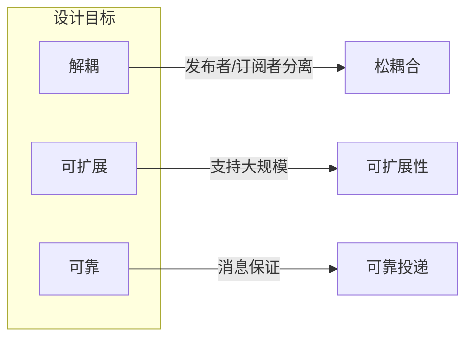
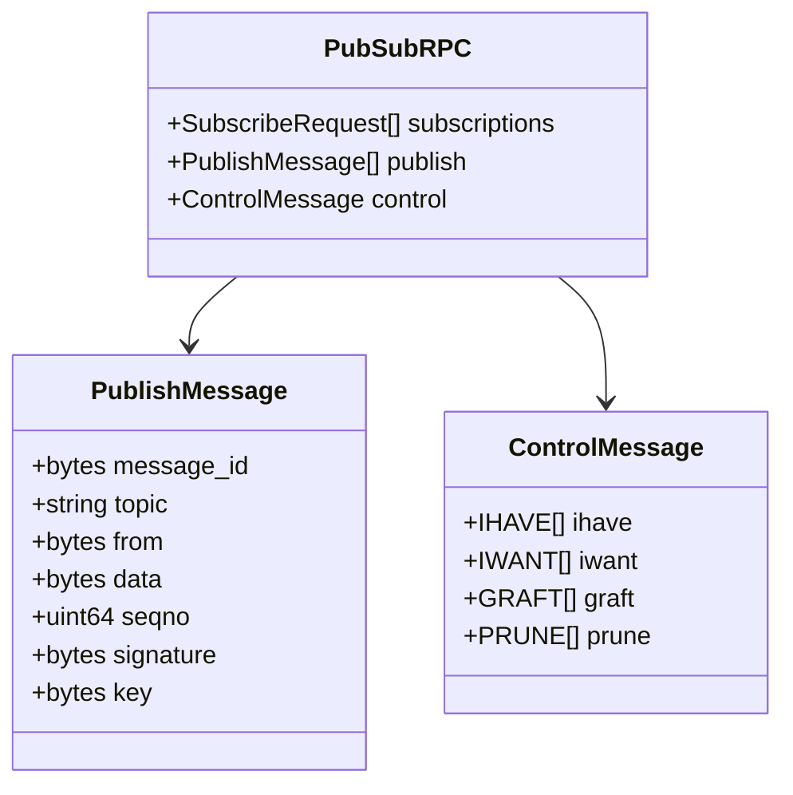
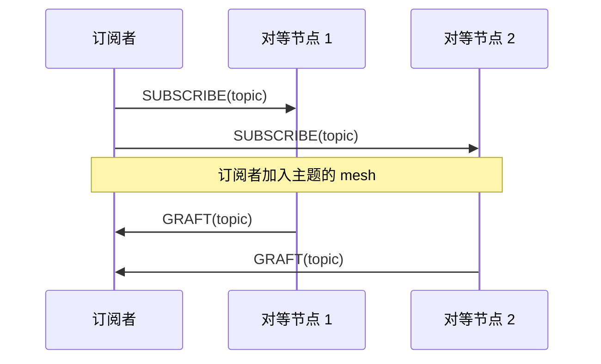
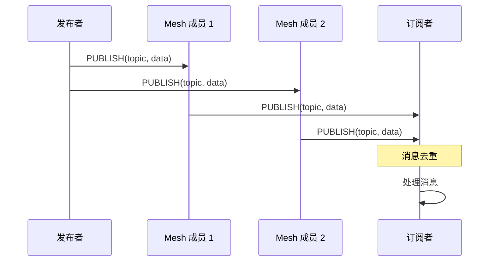
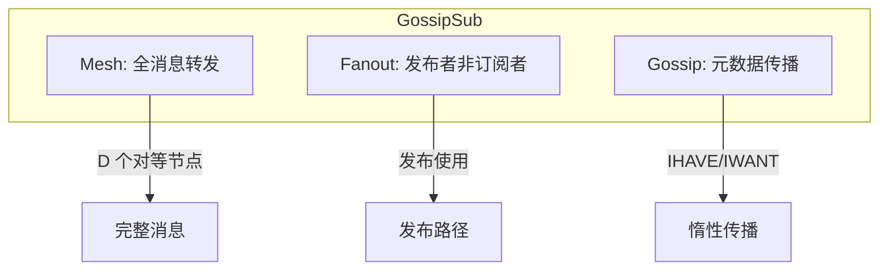
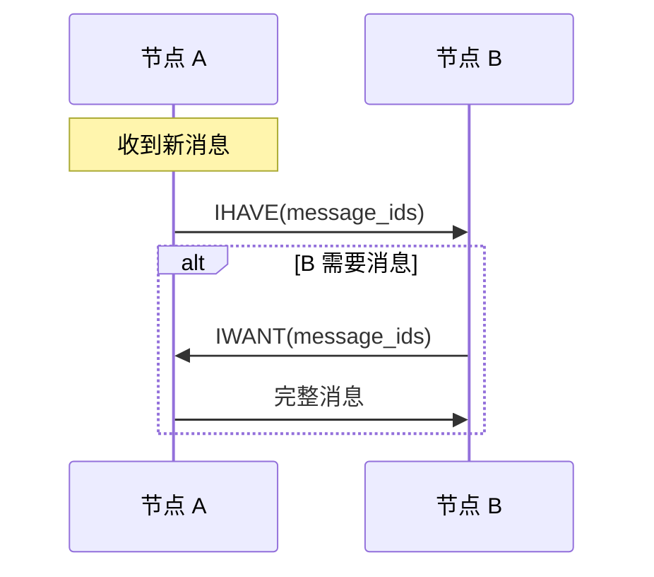
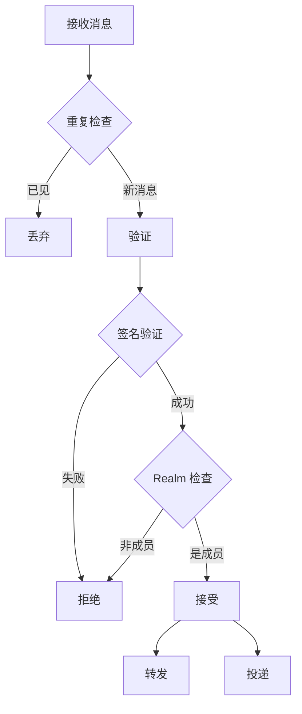

# 发布订阅协议规范

本文档定义 DeP2P 发布订阅（PubSub）协议的格式、流程和实现细节。

---

## 概述

发布订阅协议提供一对多的消息分发能力，支持基于主题的消息广播。

### 协议信息

| 属性 | 值 |
|------|-----|
| 协议 ID | `/dep2p/app/pubsub/1.0.0` |
| 作用域 | Application |
| Realm 验证 | 需要 |

### 设计目标



| 目标 | 描述 |
|------|------|
| 解耦 | 发布者和订阅者无需直接连接 |
| 可扩展 | 支持大量主题和订阅者 |
| 可靠 | 尽力保证消息投递 |

---

## 消息格式

### 消息类型

```protobuf
enum PubSubMessageType {
    SUBSCRIBE = 0;      // 订阅
    UNSUBSCRIBE = 1;    // 取消订阅
    PUBLISH = 2;        // 发布
    DATA = 3;           // 数据消息
    GRAFT = 4;          // 加入 mesh
    PRUNE = 5;          // 离开 mesh
    IHAVE = 6;          // 拥有消息
    IWANT = 7;          // 请求消息
}
```

### 订阅消息

```protobuf
message SubscribeRequest {
    // 主题列表
    repeated string topics = 1;
}

message UnsubscribeRequest {
    // 主题列表
    repeated string topics = 1;
}
```

### 发布消息

```protobuf
message PublishMessage {
    // 消息 ID
    bytes message_id = 1;
    
    // 主题
    string topic = 2;
    
    // 发布者 ID
    bytes from = 3;
    
    // 消息数据
    bytes data = 4;
    
    // 序列号
    uint64 seqno = 5;
    
    // 签名
    bytes signature = 6;
    
    // 密钥（用于验证签名）
    bytes key = 7;
}
```

### 消息结构图



---

## 主题管理

### 主题命名

主题使用层次化命名：

```
/<realm>/<category>/<topic>
```

示例：
- `/myapp/chat/general`
- `/myapp/events/user-joined`
- `/myapp/data/updates`

### 订阅流程



### 代码示例

```go
// 订阅主题
func (ps *PubSub) Subscribe(topic string) (*Subscription, error) {
    ps.mu.Lock()
    defer ps.mu.Unlock()
    
    // 检查 Realm
    if !ps.realmManager.IsJoined() {
        return nil, ErrNotJoinedRealm
    }
    
    // 创建订阅
    sub := &Subscription{
        topic:   topic,
        ch:      make(chan *Message, 32),
        cancel:  make(chan struct{}),
    }
    
    ps.subscriptions[topic] = append(ps.subscriptions[topic], sub)
    
    // 通知对等节点
    ps.announceSubscription(topic)
    
    return sub, nil
}

// 取消订阅
func (ps *PubSub) Unsubscribe(topic string, sub *Subscription) error {
    ps.mu.Lock()
    defer ps.mu.Unlock()
    
    subs := ps.subscriptions[topic]
    for i, s := range subs {
        if s == sub {
            ps.subscriptions[topic] = append(subs[:i], subs[i+1:]...)
            close(sub.cancel)
            break
        }
    }
    
    // 如果没有更多订阅，通知对等节点
    if len(ps.subscriptions[topic]) == 0 {
        ps.announceUnsubscription(topic)
    }
    
    return nil
}
```

---

## 消息发布

### 发布流程



### 代码示例

```go
// 发布消息
func (ps *PubSub) Publish(ctx context.Context, topic string, data []byte) error {
    // 检查 Realm
    if !ps.realmManager.IsJoined() {
        return ErrNotJoinedRealm
    }
    
    // 构建消息
    msg := &pb.PublishMessage{
        MessageId: generateMessageID(),
        Topic:     topic,
        From:      []byte(ps.host.ID()),
        Data:      data,
        Seqno:     ps.nextSeqno(),
    }
    
    // 签名
    msg.Signature = ps.sign(msg)
    msg.Key = ps.host.PublicKey().Raw()
    
    // 添加到已见消息
    ps.seenMessages.Add(string(msg.MessageId))
    
    // 发送到 mesh
    peers := ps.mesh[topic]
    for _, p := range peers {
        go ps.sendMessage(ctx, p, msg)
    }
    
    // 本地处理
    ps.deliverMessage(msg)
    
    return nil
}

// 接收消息
func (ps *PubSub) handlePublish(from peer.ID, msg *pb.PublishMessage) {
    // 检查是否已见
    if ps.seenMessages.Contains(string(msg.MessageId)) {
        return
    }
    ps.seenMessages.Add(string(msg.MessageId))
    
    // 验证签名
    if !ps.verifySignature(msg) {
        log.Warn("invalid signature", "from", from)
        return
    }
    
    // 验证 Realm 成员资格
    sender := peer.ID(msg.From)
    if !ps.realmManager.IsMember(sender) {
        return
    }
    
    // 转发到 mesh
    ps.forward(msg)
    
    // 本地投递
    ps.deliverMessage(msg)
}
```

---

## Mesh 管理

### GossipSub 协议

DeP2P PubSub 基于 GossipSub 协议：



### Mesh 参数

| 参数 | 默认值 | 描述 |
|------|--------|------|
| D | 6 | Mesh 目标度 |
| D_low | 4 | 最小度 |
| D_high | 12 | 最大度 |
| D_lazy | 6 | Gossip 目标数 |

### GRAFT/PRUNE

```go
// 处理 GRAFT
func (ps *PubSub) handleGraft(from peer.ID, topics []string) {
    for _, topic := range topics {
        // 检查是否超过最大度
        if len(ps.mesh[topic]) >= ps.config.D_high {
            // 发送 PRUNE
            ps.sendPrune(from, topic)
            continue
        }
        
        // 添加到 mesh
        ps.mesh[topic] = append(ps.mesh[topic], from)
    }
}

// 处理 PRUNE
func (ps *PubSub) handlePrune(from peer.ID, topics []string) {
    for _, topic := range topics {
        ps.removeFromMesh(from, topic)
    }
}

// 维护 mesh
func (ps *PubSub) maintainMesh() {
    for topic, peers := range ps.mesh {
        // 度太低，添加节点
        if len(peers) < ps.config.D_low {
            needed := ps.config.D - len(peers)
            candidates := ps.getGraftCandidates(topic, needed)
            for _, p := range candidates {
                ps.sendGraft(p, topic)
            }
        }
        
        // 度太高，移除节点
        if len(peers) > ps.config.D_high {
            excess := len(peers) - ps.config.D
            toRemove := ps.selectPeersToRemove(peers, excess)
            for _, p := range toRemove {
                ps.sendPrune(p, topic)
            }
        }
    }
}
```

---

## Gossip 传播

### IHAVE/IWANT

用于惰性传播消息元数据：



### 代码示例

```go
// 发送 IHAVE
func (ps *PubSub) sendIHave() {
    // 收集最近消息 ID
    messageIDs := ps.recentMessages.Keys()
    if len(messageIDs) == 0 {
        return
    }
    
    // 随机选择节点
    peers := ps.selectRandomPeers(ps.config.D_lazy)
    
    ihave := &pb.ControlIHave{
        MessageIds: messageIDs,
    }
    
    for _, p := range peers {
        ps.sendControl(p, &pb.ControlMessage{Ihave: []*pb.ControlIHave{ihave}})
    }
}

// 处理 IHAVE
func (ps *PubSub) handleIHave(from peer.ID, ihave *pb.ControlIHave) {
    var wanted [][]byte
    
    for _, id := range ihave.MessageIds {
        if !ps.seenMessages.Contains(string(id)) {
            wanted = append(wanted, id)
        }
    }
    
    if len(wanted) > 0 {
        ps.sendControl(from, &pb.ControlMessage{
            Iwant: []*pb.ControlIWant{{MessageIds: wanted}},
        })
    }
}

// 处理 IWANT
func (ps *PubSub) handleIWant(from peer.ID, iwant *pb.ControlIWant) {
    for _, id := range iwant.MessageIds {
        if msg, ok := ps.messageCache.Get(string(id)); ok {
            ps.sendMessage(context.Background(), from, msg)
        }
    }
}
```

---

## 消息验证

### 验证流程



### 自定义验证

```go
// 消息验证器
type MessageValidator func(ctx context.Context, from peer.ID, msg *pb.PublishMessage) ValidationResult

type ValidationResult int

const (
    ValidationAccept ValidationResult = iota
    ValidationReject
    ValidationIgnore
    ValidationThrottle
)

// 注册验证器
func (ps *PubSub) RegisterValidator(topic string, validator MessageValidator) {
    ps.validators[topic] = validator
}

// 应用验证
func (ps *PubSub) validateMessage(ctx context.Context, from peer.ID, msg *pb.PublishMessage) ValidationResult {
    validator, ok := ps.validators[msg.Topic]
    if !ok {
        return ValidationAccept
    }
    
    return validator(ctx, from, msg)
}
```

---

## Realm 集成

### Realm 感知

PubSub 消息限制在 Realm 内：

```go
// Realm 验证
func (ps *PubSub) realmValidator(ctx context.Context, from peer.ID, msg *pb.PublishMessage) ValidationResult {
    sender := peer.ID(msg.From)
    
    // 检查发送者是否是 Realm 成员
    if !ps.realmManager.IsMember(sender) {
        return ValidationReject
    }
    
    return ValidationAccept
}

// 初始化时注册
func (ps *PubSub) init() {
    // 为所有主题注册 Realm 验证器
    ps.RegisterValidator("*", ps.realmValidator)
}
```

---

## 配置

### PubSub 配置

```go
// PubSub 配置
type PubSubConfig struct {
    // Mesh 参数
    D         int // Mesh 目标度
    D_low     int // 最小度
    D_high    int // 最大度
    D_lazy    int // Gossip 目标数
    
    // 超时
    HeartbeatInterval time.Duration
    
    // 缓存
    MessageCacheSize int
    SeenCacheTTL     time.Duration
    
    // 签名
    SignMessages bool
    ValidateSig  bool
}

var DefaultPubSubConfig = &PubSubConfig{
    D:                 6,
    D_low:             4,
    D_high:            12,
    D_lazy:            6,
    HeartbeatInterval: 1 * time.Second,
    MessageCacheSize:  1000,
    SeenCacheTTL:      2 * time.Minute,
    SignMessages:      true,
    ValidateSig:       true,
}
```

---

## 使用示例

```go
// 订阅主题
sub, err := node.Subscribe("/myapp/events")
if err != nil {
    log.Fatal(err)
}

// 接收消息
go func() {
    for {
        msg, err := sub.Next(ctx)
        if err != nil {
            return
        }
        fmt.Printf("收到消息: %s\n", msg.Data)
    }
}()

// 发布消息
err = node.Publish(ctx, "/myapp/events", []byte("hello world"))
if err != nil {
    log.Error("发布失败", "error", err)
}
```

---

## 实现参考

### 代码位置

| 组件 | 路径 |
|------|------|
| 协议 ID | `pkg/protocolids/app.go` |
| PubSub 服务 | `internal/core/pubsub/pubsub.go` |
| Mesh 管理 | `internal/core/pubsub/mesh.go` |
| 消息定义 | `pkg/proto/pubsub/pubsub.proto` |

### 依赖库

- `github.com/libp2p/go-libp2p-pubsub`

---

## 相关文档

- [消息协议](messaging.md)
- [Realm 协议](realm.md)
- [协议索引](../README.md)
