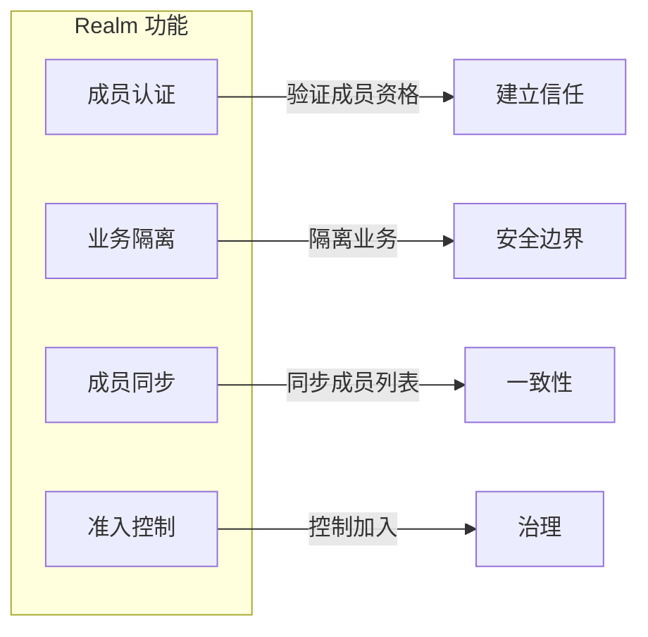
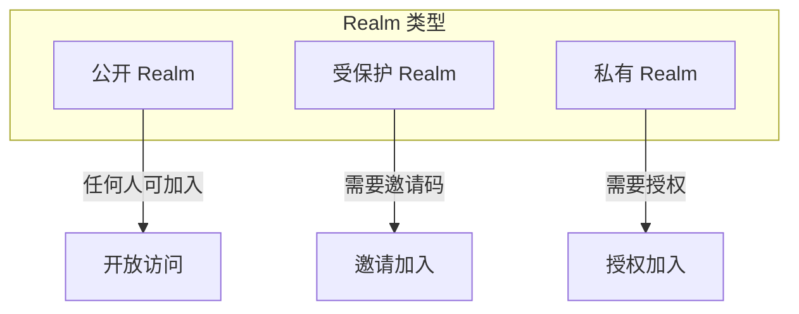
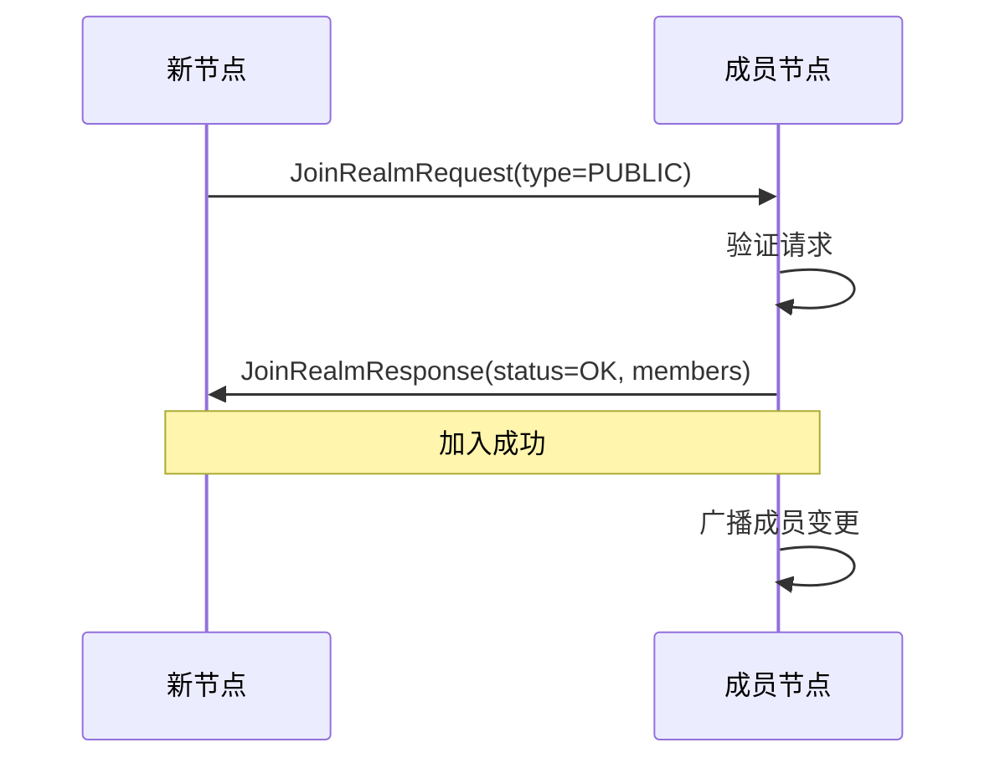
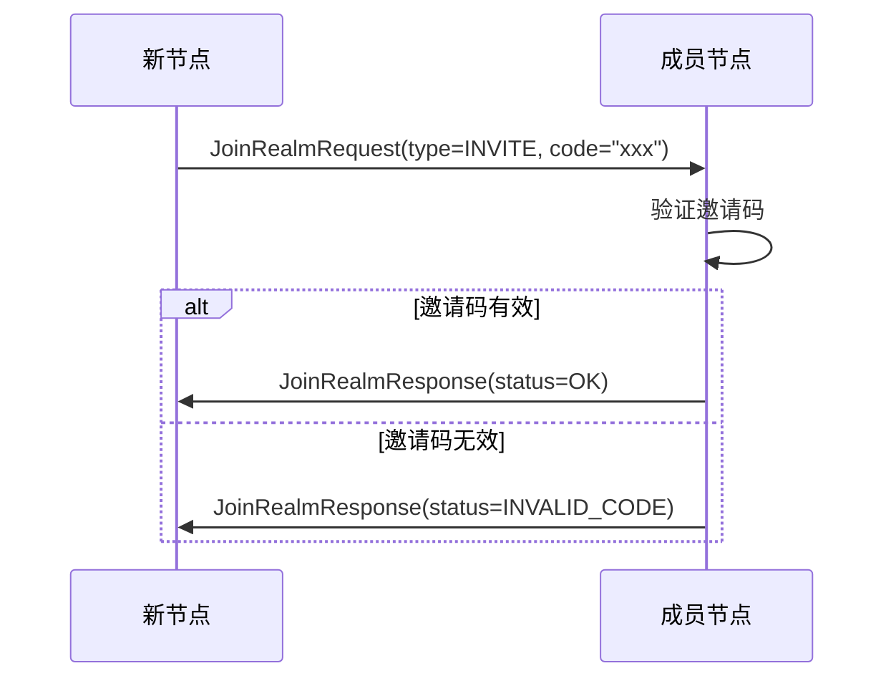
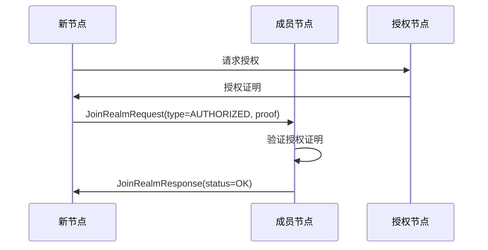
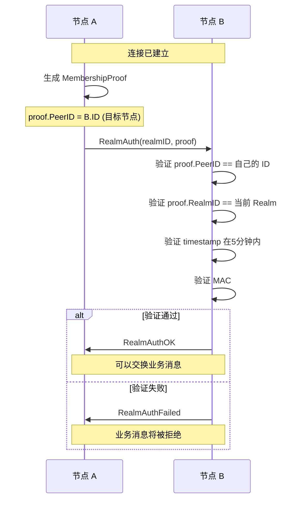
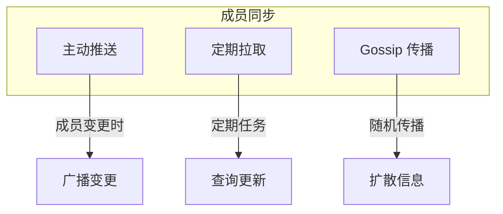
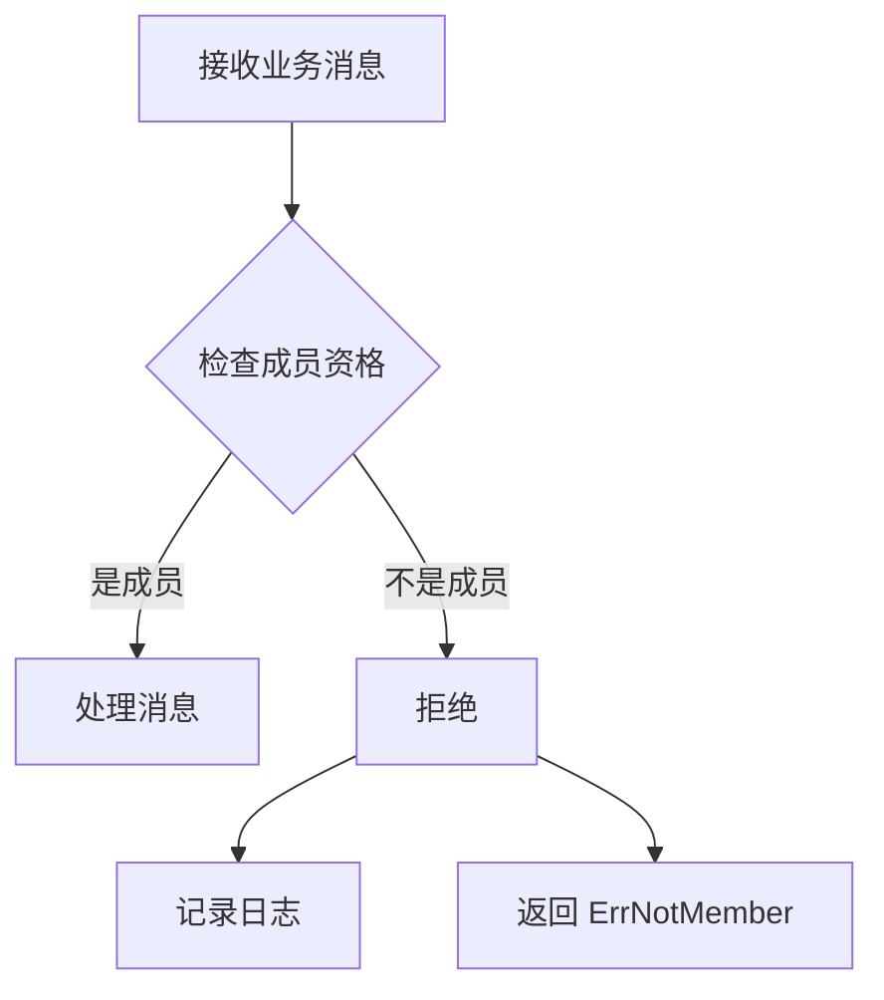

# Realm 协议规范

本文档定义 DeP2P Realm 协议的格式、流程和实现细节。

---

## 概述

Realm 协议提供业务网络隔离和成员管理能力，是 DeP2P 业务层的核心协议。

### 协议信息（IMPL-1227 更新）

| 属性 | 值 |
|------|-----|
| 认证协议 ID | `/dep2p/realm/<realmID>/auth/1.0.0` |
| 同步协议 ID | `/dep2p/realm/<realmID>/sync/1.0.0` |
| 作用域 | Layer 2 (Realm) |
| 认证机制 | PSK (Pre-Shared Key) |
| Realm 验证 | 连接级 + PSK 成员证明 |

### 核心功能



| 功能 | 描述 |
|------|------|
| 成员认证 | 验证节点是否为 Realm 成员 |
| 业务隔离 | 隔离不同 Realm 的业务消息 |
| 成员同步 | 同步 Realm 成员列表 |
| 准入控制 | 控制节点加入 Realm |

---

## Realm 类型

### 分类



| 类型 | 准入条件 | 适用场景 |
|------|----------|----------|
| Public | 无限制 | 开放社区 |
| Protected | 邀请码 | 受控社区 |
| Private | 成员授权 | 私密群组 |

---

## 消息格式

### 加入请求

```protobuf
message JoinRealmRequest {
    // Realm 名称
    string realm_name = 1;
    
    // 加入类型
    JoinType type = 2;
    
    // 邀请码（Protected Realm）
    string invite_code = 3;
    
    // 证明数据（Private Realm）
    bytes proof = 4;
    
    // 元数据
    map<string, string> metadata = 5;
}

enum JoinType {
    JOIN_PUBLIC = 0;
    JOIN_INVITE = 1;
    JOIN_AUTHORIZED = 2;
}
```

### 加入响应

```protobuf
message JoinRealmResponse {
    // 状态
    JoinStatus status = 1;
    
    // 成员列表
    repeated PeerInfo members = 2;
    
    // Realm 配置
    RealmConfig config = 3;
    
    // 错误信息
    string error = 4;
}

enum JoinStatus {
    JOIN_OK = 0;
    JOIN_DENIED = 1;
    JOIN_INVALID_CODE = 2;
    JOIN_UNAUTHORIZED = 3;
    JOIN_ALREADY_MEMBER = 4;
}
```

### 成员同步

```protobuf
message MemberSyncRequest {
    // Realm 名称
    string realm_name = 1;
    
    // 本地已知版本
    uint64 version = 2;
}

message MemberSyncResponse {
    // 当前版本
    uint64 version = 1;
    
    // 成员变更
    repeated MemberChange changes = 2;
}

message MemberChange {
    // 变更类型
    ChangeType type = 1;
    
    // 成员信息
    PeerInfo peer = 2;
    
    // 时间戳
    int64 timestamp = 3;
}

enum ChangeType {
    MEMBER_ADDED = 0;
    MEMBER_REMOVED = 1;
    MEMBER_UPDATED = 2;
}
```

---

## 加入流程

### Public Realm



### Protected Realm



### Private Realm



---

## 成员认证（IMPL-1227 更新）

### PSK 成员认证机制

IMPL-1227 采用 PSK (Pre-Shared Key) 作为成员认证机制：

```
┌─────────────────────────────────────────────────────────────────────────────────┐
│                       PSK 成员认证流程                                            │
├─────────────────────────────────────────────────────────────────────────────────┤
│                                                                                 │
│   realmKey (32 bytes, 高熵随机数)                                                │
│       ↓                                                                         │
│   1. 派生 RealmID:                                                              │
│      RealmID = SHA256("dep2p-realm-id-v1" || H(realmKey))                       │
│       ↓                                                                         │
│   2. 派生认证密钥:                                                               │
│      authKey = HKDF(realmKey, "dep2p-realm-psk-v1")                             │
│       ↓                                                                         │
│   3. 生成成员证明:                                                               │
│      MAC = HMAC-SHA256(authKey, nodeID || realmID || peerID || nonce || ts)     │
│                                                                                 │
│   4. 验证:                                                                       │
│      - 检查时间戳窗口（5分钟）                                                    │
│      - 检查 peerID 是否匹配目标节点                                               │
│      - 检查 realmID 是否匹配                                                     │
│      - 验证 MAC 值                                                               │
│                                                                                 │
└─────────────────────────────────────────────────────────────────────────────────┘
```

### RealmAuth 协议

连接建立后进行 Realm 认证：



### MembershipProof 结构

```go
// MembershipProof PSK 成员证明
type MembershipProof struct {
    NodeID    types.NodeID   // 证明者节点ID
    RealmID   types.RealmID  // 所属 Realm
    PeerID    types.NodeID   // 目标节点ID（通信对方）
    Nonce     [16]byte       // 随机数
    Timestamp int64          // 时间戳（Unix 毫秒）
    MAC       [32]byte       // HMAC-SHA256 签名
}
```

### 代码示例

```go
// PSKAuthenticator PSK 认证器
type PSKAuthenticator struct {
    realmKey types.RealmKey
    realmID  types.RealmID
}

// Generate 生成成员证明
func (p *PSKAuthenticator) Generate(nodeID, peerID types.NodeID) (*types.MembershipProof, error) {
    proof := &types.MembershipProof{
        NodeID:    nodeID,
        RealmID:   p.realmID,
        PeerID:    peerID,
        Timestamp: time.Now().UnixMilli(),
    }
    
    // 生成随机 Nonce
    if _, err := rand.Read(proof.Nonce[:]); err != nil {
        return nil, err
    }
    
    // 计算 MAC
    authKey := p.deriveKey()
    mac := hmac.New(sha256.New, authKey)
    mac.Write(proof.DataForMAC())
    copy(proof.MAC[:], mac.Sum(nil))
    
    return proof, nil
}

// Verify 验证成员证明
func (p *PSKAuthenticator) Verify(proof *types.MembershipProof, expectedPeerID types.NodeID) error {
    // 检查目标节点是否匹配
    if proof.PeerID != expectedPeerID {
        return ErrPeerIDMismatch
    }
    
    // 检查 RealmID
    if proof.RealmID != p.realmID {
        return ErrRealmIDMismatch
    }
    
    // 检查时间戳
    if proof.IsExpired(5 * time.Minute) {
        return ErrProofExpired
    }
    
    // 验证 MAC
    authKey := p.deriveKey()
    mac := hmac.New(sha256.New, authKey)
    mac.Write(proof.DataForMAC())
    expected := mac.Sum(nil)
    
    if !hmac.Equal(proof.MAC[:], expected) {
        return ErrInvalidMAC
    }
    
    return nil
}
```

---

## 成员同步

### 同步机制



### 代码示例

```go
// 成员同步服务
type MemberSync struct {
    realmManager *RealmManager
    version      uint64
    mu           sync.RWMutex
}

// 处理同步请求
func (ms *MemberSync) HandleSync(stream network.Stream) {
    defer stream.Close()
    
    // 读取请求
    var req pb.MemberSyncRequest
    if err := readMsg(stream, &req); err != nil {
        return
    }
    
    // 获取变更
    ms.mu.RLock()
    changes := ms.getChangesSince(req.RealmName, req.Version)
    version := ms.version
    ms.mu.RUnlock()
    
    // 发送响应
    resp := &pb.MemberSyncResponse{
        Version: version,
        Changes: changes,
    }
    writeMsg(stream, resp)
}

// 定期同步
func (ms *MemberSync) periodicSync(ctx context.Context) {
    ticker := time.NewTicker(30 * time.Second)
    defer ticker.Stop()
    
    for {
        select {
        case <-ticker.C:
            ms.syncWithPeers(ctx)
        case <-ctx.Done():
            return
        }
    }
}

// 广播成员变更
func (ms *MemberSync) broadcastChange(change *pb.MemberChange) {
    members := ms.realmManager.GetMembers()
    
    for _, member := range members {
        go func(p peer.ID) {
            stream, err := ms.host.NewStream(context.Background(), p, protocolids.SysRealmSync)
            if err != nil {
                return
            }
            defer stream.Close()
            
            writeMsg(stream, &pb.MemberSyncPush{
                Changes: []*pb.MemberChange{change},
            })
        }(member)
    }
}
```

---

## 准入控制

### 邀请码

```go
// 邀请码生成
func (rm *RealmManager) GenerateInviteCode(realm string, options *InviteOptions) (string, error) {
    // 检查权限
    if !rm.isAdmin(realm) {
        return "", ErrNotAuthorized
    }
    
    code := &InviteCode{
        Realm:     realm,
        Code:      generateRandomCode(),
        CreatedAt: time.Now(),
        ExpiresAt: time.Now().Add(options.TTL),
        MaxUses:   options.MaxUses,
        Uses:      0,
    }
    
    rm.inviteCodes[code.Code] = code
    
    return code.Code, nil
}

// 验证邀请码
func (rm *RealmManager) ValidateInviteCode(realm, code string) error {
    invite, ok := rm.inviteCodes[code]
    if !ok {
        return ErrInvalidInviteCode
    }
    
    if invite.Realm != realm {
        return ErrInvalidInviteCode
    }
    
    if time.Now().After(invite.ExpiresAt) {
        return ErrInviteCodeExpired
    }
    
    if invite.MaxUses > 0 && invite.Uses >= invite.MaxUses {
        return ErrInviteCodeExhausted
    }
    
    return nil
}
```

### 授权证明

```go
// 授权证明
type AuthorizationProof struct {
    // 被授权节点
    PeerID peer.ID
    
    // Realm
    Realm string
    
    // 授权者
    Authorizer peer.ID
    
    // 有效期
    ExpiresAt time.Time
    
    // 签名
    Signature []byte
}

// 验证授权证明
func (rm *RealmManager) VerifyProof(proof *AuthorizationProof) error {
    // 检查授权者是否有权限
    if !rm.isAuthorizer(proof.Realm, proof.Authorizer) {
        return ErrInvalidAuthorizer
    }
    
    // 检查有效期
    if time.Now().After(proof.ExpiresAt) {
        return ErrProofExpired
    }
    
    // 验证签名
    if !verifySignature(proof.Authorizer, proof) {
        return ErrInvalidSignature
    }
    
    return nil
}
```

---

## 错误处理

### 错误类型

| 错误 | 描述 | 处理方式 |
|------|------|----------|
| `ErrNotMember` | 不是 Realm 成员 | 拒绝业务消息 |
| `ErrAlreadyJoined` | 已经加入 | 忽略或切换 |
| `ErrInvalidInviteCode` | 邀请码无效 | 提示用户 |
| `ErrNotAuthorized` | 未授权 | 请求授权 |
| `ErrRealmNotFound` | Realm 不存在 | 检查名称 |

### ErrNotMember 处理



---

## 配置

### Realm 配置

```go
// Realm 配置
type RealmConfig struct {
    // Realm 名称
    Name string
    
    // Realm 类型
    Type RealmType
    
    // 最大成员数
    MaxMembers int
    
    // 成员同步间隔
    SyncInterval time.Duration
    
    // 准入策略
    AdmissionPolicy AdmissionPolicy
}

// 准入策略
type AdmissionPolicy struct {
    // 是否需要邀请
    RequireInvite bool
    
    // 是否需要授权
    RequireAuthorization bool
    
    // 授权者列表
    Authorizers []peer.ID
}
```

---

## 实现参考

### 代码位置

| 组件 | 路径 |
|------|------|
| 协议 ID | `pkg/protocolids/sys.go` |
| Realm 管理器 | `internal/core/realm/manager.go` |
| 成员同步 | `internal/core/realm/sync.go` |
| 认证 | `internal/core/realm/auth.go` |
| 消息定义 | `pkg/proto/realm/realm.proto` |

---

## 相关文档

- [消息协议](messaging.md)
- [发布订阅](pubsub.md)
- [协议索引](../README.md)
