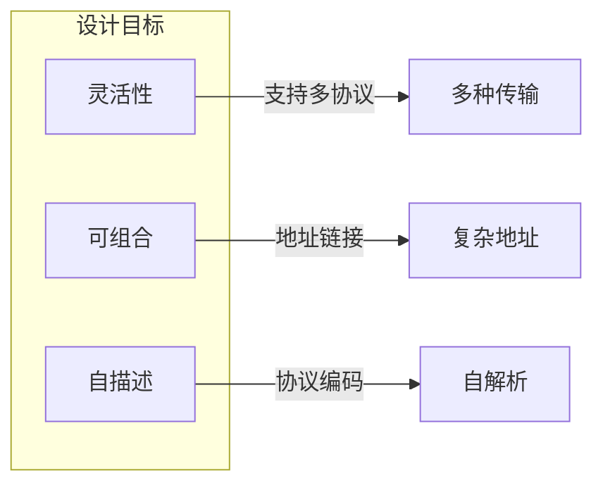
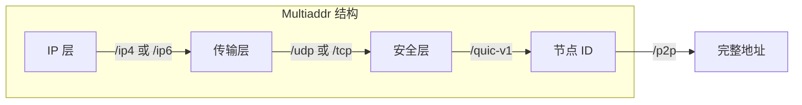
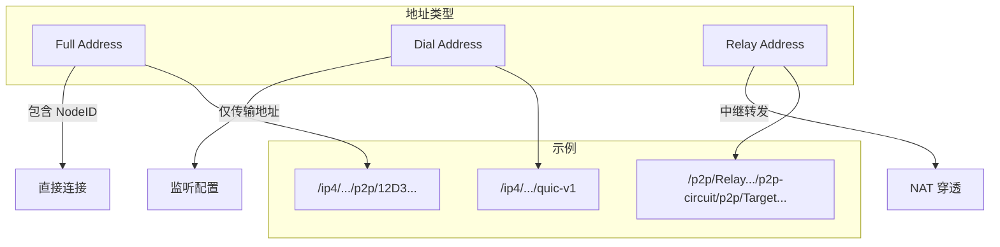
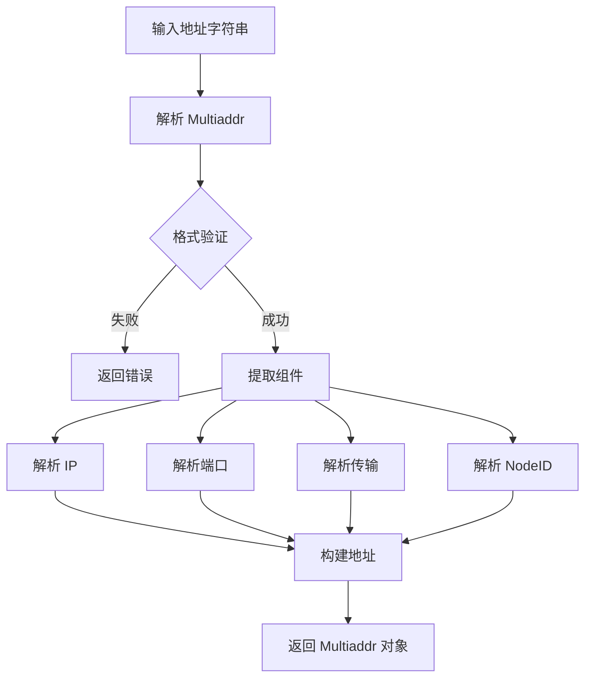
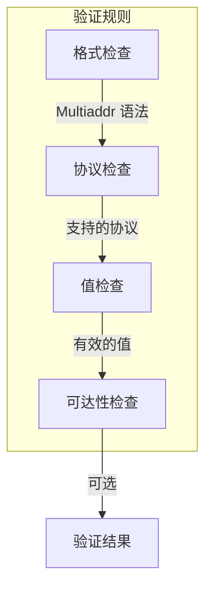
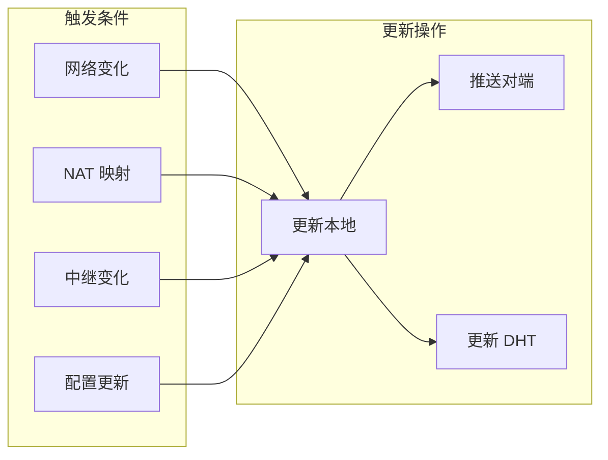
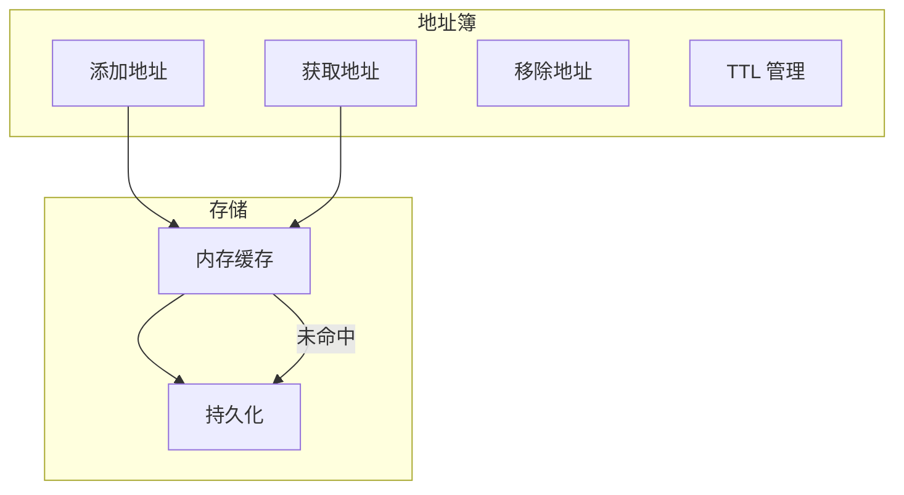

# 地址协议规范

本文档定义 DeP2P 地址格式、解析规则和使用规范。

---

## 概述

DeP2P 使用 Multiaddr 格式表示网络地址，支持多种传输协议和复杂的地址组合。

### 设计目标



| 目标 | 描述 |
|------|------|
| 灵活性 | 支持 TCP、UDP、QUIC、WebSocket 等多种传输 |
| 可组合 | 支持通过中继、代理等组合地址 |
| 自描述 | 地址本身包含协议信息，无需额外元数据 |

---

## Multiaddr 格式

### 基本格式

Multiaddr 是协议和值的链式组合：

```
/<protocol1>/<value1>/<protocol2>/<value2>/...
```

### 常见示例

```
# IPv4 + UDP + QUIC
/ip4/192.168.1.1/udp/4001/quic-v1

# IPv6 + UDP + QUIC
/ip6/::1/udp/4001/quic-v1

# DNS + UDP + QUIC
/dns4/node.example.com/udp/4001/quic-v1

# 完整地址（包含 NodeID）
/ip4/192.168.1.1/udp/4001/quic-v1/p2p/12D3KooW...
```

### 地址结构图



---

## 地址类型

### Full Address（完整地址）

包含 NodeID 的完整可连接地址：

```
/ip4/192.168.1.1/udp/4001/quic-v1/p2p/12D3KooWExample...
```

**特点**：
- 可直接用于连接
- 包含目标节点身份验证信息
- 用于 `Connect()` API

### Dial Address（拨号地址）

不包含 NodeID 的传输地址：

```
/ip4/192.168.1.1/udp/4001/quic-v1
```

**特点**：
- 仅表示网络位置
- 需要配合 NodeID 使用
- 用于 `Listen()` 配置

### Relay Address（中继地址）

通过中继节点转发的地址：

```
/ip4/relay.example.com/udp/4001/quic-v1/p2p/12D3KooWRelay.../p2p-circuit/p2p/12D3KooWTarget...
```

**特点**：
- 用于 NAT 穿透场景
- 包含中继节点和目标节点
- 性能低于直连

### 地址类型对比



---

## 协议组件

### 网络层协议

| 协议 | 编码 | 描述 |
|------|------|------|
| `/ip4` | 0x04 | IPv4 地址 |
| `/ip6` | 0x29 | IPv6 地址 |
| `/dns4` | 0x36 | IPv4 DNS 解析 |
| `/dns6` | 0x37 | IPv6 DNS 解析 |
| `/dnsaddr` | 0x38 | TXT 记录解析 |

### 传输层协议

| 协议 | 编码 | 描述 |
|------|------|------|
| `/tcp` | 0x06 | TCP 端口 |
| `/udp` | 0x0111 | UDP 端口 |
| `/quic-v1` | 0x01cd | QUIC v1 |
| `/webtransport` | 0x01d2 | WebTransport |
| `/ws` | 0x01dd | WebSocket |
| `/wss` | 0x01de | WebSocket Secure |

### 身份层协议

| 协议 | 编码 | 描述 |
|------|------|------|
| `/p2p` | 0x01a5 | 节点 ID |
| `/p2p-circuit` | 0x0122 | 中继电路 |

---

## 地址解析

### 解析流程



### 代码示例

```go
import (
    "github.com/multiformats/go-multiaddr"
)

// 解析地址
func ParseAddress(s string) (multiaddr.Multiaddr, error) {
    ma, err := multiaddr.NewMultiaddr(s)
    if err != nil {
        return nil, fmt.Errorf("无效的地址格式: %w", err)
    }
    return ma, nil
}

// 提取 NodeID
func ExtractNodeID(ma multiaddr.Multiaddr) (peer.ID, error) {
    // 查找 /p2p 组件
    p2pAddr, _ := ma.ValueForProtocol(multiaddr.P_P2P)
    if p2pAddr == "" {
        return "", errors.New("地址中无 NodeID")
    }
    
    return peer.Decode(p2pAddr)
}

// 提取传输地址
func ExtractTransportAddr(ma multiaddr.Multiaddr) (multiaddr.Multiaddr, error) {
    // 移除 /p2p 组件
    return multiaddr.SplitFirst(ma)
}
```

---

## 地址验证

### 验证规则



### 验证项

| 验证项 | 描述 | 必须 |
|--------|------|------|
| 格式检查 | Multiaddr 语法正确 | 是 |
| 协议检查 | 协议组合有效 | 是 |
| IP 检查 | IP 地址格式正确 | 是 |
| 端口检查 | 端口范围 1-65535 | 是 |
| NodeID 检查 | NodeID 格式正确 | 可选 |
| 可达性检查 | 地址可访问 | 可选 |

### 代码示例

```go
// 验证地址
func ValidateAddress(ma multiaddr.Multiaddr) error {
    // 检查是否包含必需组件
    protocols := ma.Protocols()
    
    hasNetwork := false
    hasTransport := false
    
    for _, p := range protocols {
        switch p.Code {
        case multiaddr.P_IP4, multiaddr.P_IP6, 
             multiaddr.P_DNS4, multiaddr.P_DNS6:
            hasNetwork = true
        case multiaddr.P_UDP, multiaddr.P_TCP:
            hasTransport = true
        }
    }
    
    if !hasNetwork {
        return errors.New("缺少网络层协议")
    }
    if !hasTransport {
        return errors.New("缺少传输层协议")
    }
    
    return nil
}

// 验证完整地址（包含 NodeID）
func ValidateFullAddress(ma multiaddr.Multiaddr) error {
    if err := ValidateAddress(ma); err != nil {
        return err
    }
    
    // 检查 NodeID
    if _, err := ExtractNodeID(ma); err != nil {
        return fmt.Errorf("无效的 NodeID: %w", err)
    }
    
    return nil
}
```

---

## 地址更新

### 更新场景

节点地址可能因以下原因变化：



### 地址优先级

多个地址时，按以下优先级选择：

| 优先级 | 地址类型 | 描述 |
|--------|----------|------|
| 1 | 直连地址 | 公网 IP 直连 |
| 2 | NAT 映射地址 | UPnP/NAT-PMP 映射 |
| 3 | STUN 地址 | STUN 发现的外部地址 |
| 4 | 中继地址 | 通过中继转发 |

### 代码示例

```go
// 地址排序
func SortAddresses(addrs []multiaddr.Multiaddr) []multiaddr.Multiaddr {
    sort.Slice(addrs, func(i, j int) bool {
        return addressPriority(addrs[i]) < addressPriority(addrs[j])
    })
    return addrs
}

func addressPriority(ma multiaddr.Multiaddr) int {
    // 检查是否是中继地址
    if isRelayAddr(ma) {
        return 4
    }
    
    // 检查是否是公网地址
    if isPublicAddr(ma) {
        return 1
    }
    
    // 其他情况
    return 3
}
```

---

## 地址簿

### 功能

地址簿管理节点的已知地址：



### API

```go
// AddressBook 接口
type AddressBook interface {
    // 添加地址
    AddAddrs(p peer.ID, addrs []multiaddr.Multiaddr, ttl time.Duration)
    
    // 获取地址
    Addrs(p peer.ID) []multiaddr.Multiaddr
    
    // 设置地址（替换现有）
    SetAddrs(p peer.ID, addrs []multiaddr.Multiaddr, ttl time.Duration)
    
    // 清除地址
    ClearAddrs(p peer.ID)
    
    // 获取所有已知节点
    PeersWithAddrs() []peer.ID
}
```

---

## 错误处理

### 错误类型

| 错误 | 描述 | 处理方式 |
|------|------|----------|
| `ErrInvalidFormat` | 地址格式无效 | 拒绝使用 |
| `ErrUnsupportedProtocol` | 不支持的协议 | 尝试其他地址 |
| `ErrInvalidIP` | IP 地址无效 | 拒绝使用 |
| `ErrInvalidPort` | 端口无效 | 拒绝使用 |
| `ErrInvalidNodeID` | NodeID 无效 | 拒绝使用 |
| `ErrUnreachable` | 地址不可达 | 标记为失败 |

---

## 最佳实践

### 地址选择

1. **优先直连**: 公网地址优先于中继地址
2. **多地址尝试**: 按优先级尝试多个地址
3. **缓存有效地址**: 记录成功连接的地址
4. **定期更新**: 定期刷新地址信息

### 地址分享

1. **只分享可达地址**: 不分享本地回环地址
2. **包含 NodeID**: 完整地址便于连接
3. **使用 DNS**: 便于记忆和分享
4. **考虑隐私**: 不在公开场合分享私有地址

---

## 实现参考

### 代码位置

| 组件 | 路径 |
|------|------|
| 地址解析 | `internal/core/address/parser.go` |
| 地址簿 | `internal/core/address/book.go` |
| 验证 | `internal/core/address/validator.go` |
| 测试 | `internal/core/address/*_test.go` |

### 依赖库

- `github.com/multiformats/go-multiaddr`
- `github.com/libp2p/go-libp2p/core/peer`

---

## 相关文档

- [身份协议](identity.md)
- [中继协议](../transport/relay.md)
- [NAT 穿透](../network/nat.md)
- [协议索引](../README.md)
