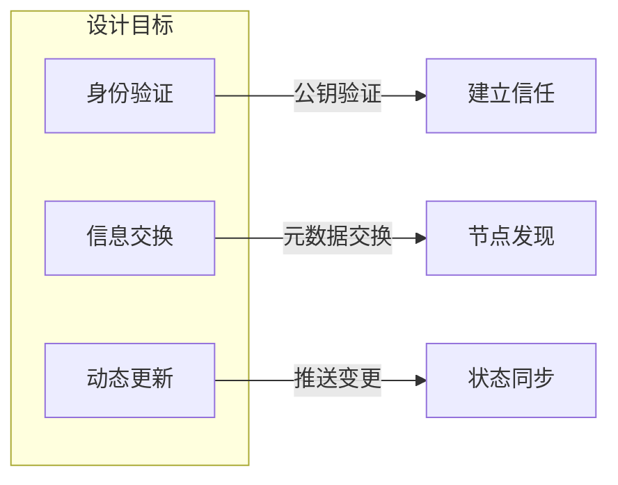
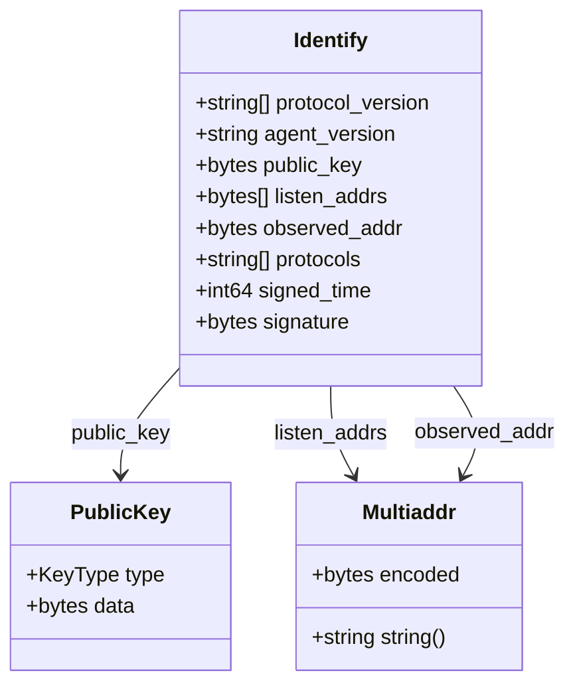
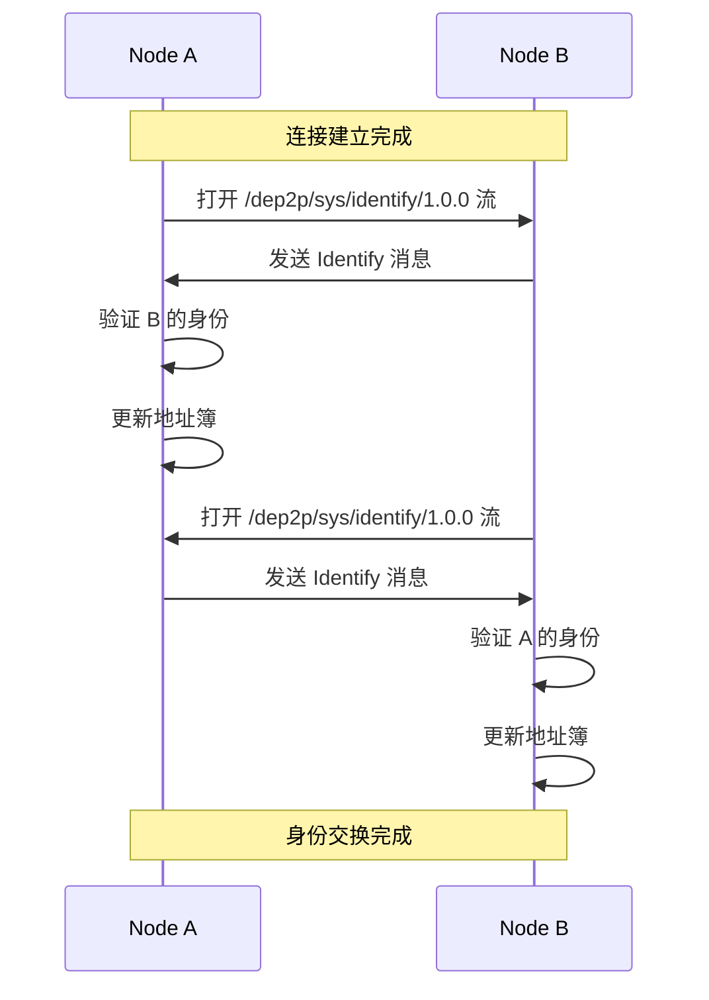
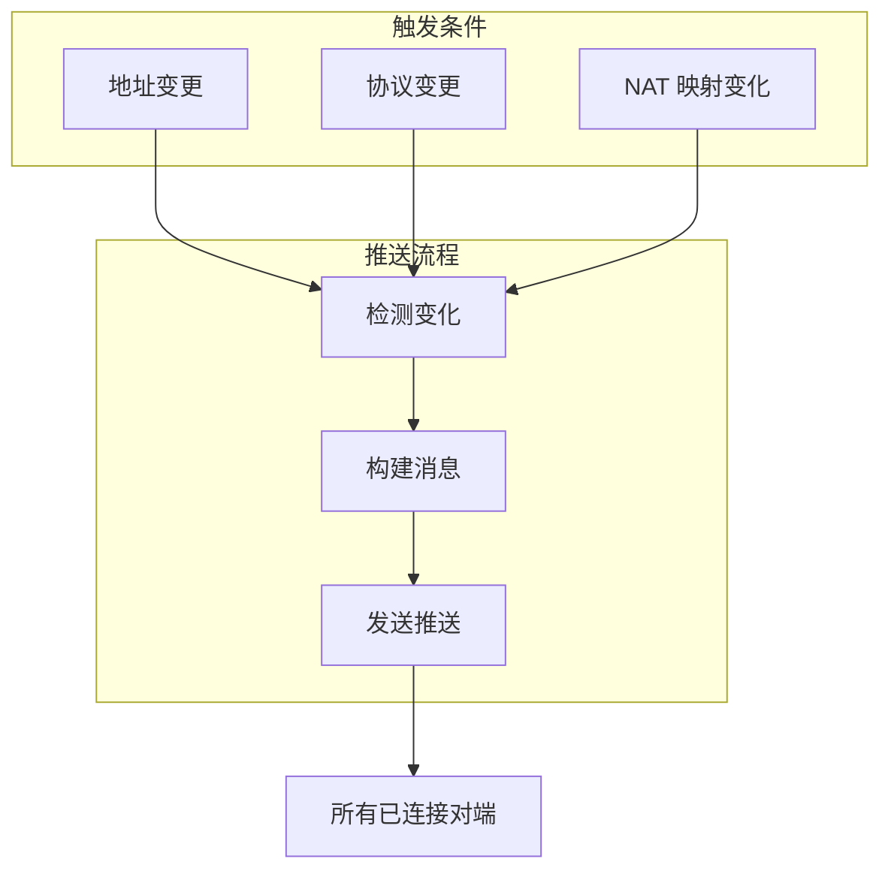
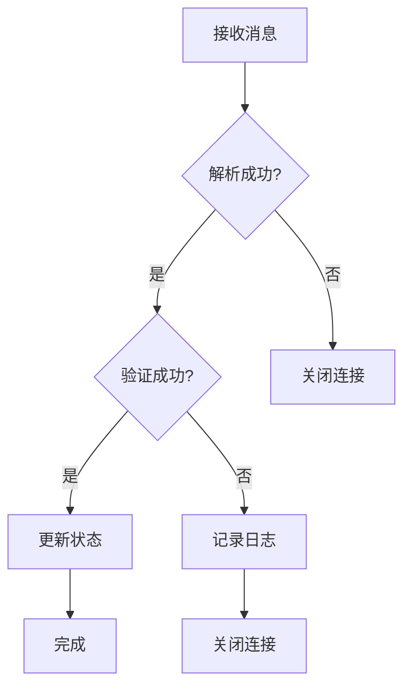
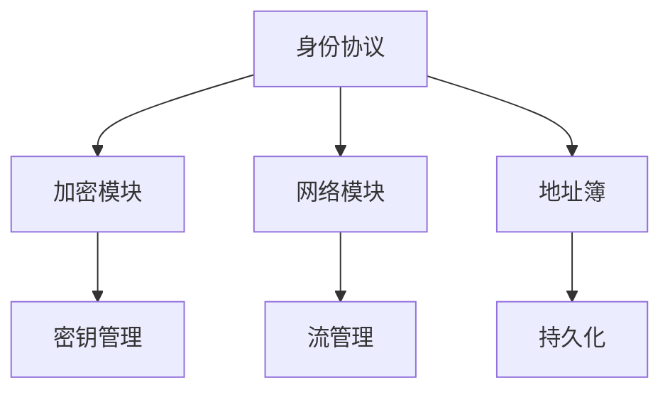

# 身份协议规范

本文档定义 DeP2P 身份协议的格式、流程和实现细节。

---

## 概述

身份协议负责节点间的身份交换和验证，是 DeP2P 网络的基础协议之一。

### 协议信息

| 属性 | 值 |
|------|-----|
| 协议 ID | `/dep2p/sys/identify/1.0.0` |
| 作用域 | System |
| Realm 验证 | 不需要 |
| 状态 | 稳定 |

### 设计目标



| 目标 | 描述 |
|------|------|
| 身份验证 | 验证对端公钥，确保身份真实 |
| 信息交换 | 交换节点元数据（地址、版本等） |
| 动态更新 | 支持身份信息变更推送 |

---

## 协议 ID

### 主协议

```
/dep2p/sys/identify/1.0.0
```

用于连接建立后的身份交换。

### 推送协议

```
/dep2p/sys/identify/push/1.0.0
```

用于主动推送身份变更。

---

## 消息格式

### Identify 消息

身份交换使用 Protocol Buffers 编码：

```protobuf
message Identify {
    // 协议版本列表
    repeated string protocol_version = 1;
    
    // 代理版本（如 "dep2p/0.1.0"）
    string agent_version = 2;
    
    // 公钥（编码格式）
    bytes public_key = 3;
    
    // 监听地址列表（Multiaddr 编码）
    repeated bytes listen_addrs = 4;
    
    // 观察到的对端地址
    bytes observed_addr = 5;
    
    // 支持的协议列表
    repeated string protocols = 6;
    
    // 签名时间戳
    int64 signed_time = 7;
    
    // 签名（可选，用于验证）
    bytes signature = 8;
}
```

### 消息结构图



---

## 握手流程

### 基本流程

连接建立后自动触发身份交换：



### 详细步骤

1. **连接建立**: 两个节点通过传输层建立连接
2. **发起交换**: 双方各自打开一个 identify 流
3. **发送身份**: 将本地身份信息编码发送
4. **接收验证**: 接收对端身份并验证公钥
5. **更新状态**: 更新本地地址簿和连接信息

### 代码示例

```go
// 处理身份交换请求
func (h *IdentifyHandler) Handle(s network.Stream) {
    defer s.Close()
    
    // 构建身份消息
    msg := &pb.Identify{
        ProtocolVersion: []string{"/dep2p/1.0"},
        AgentVersion:    "dep2p/0.1.0",
        PublicKey:       h.host.PublicKey().Raw(),
        ListenAddrs:     h.getListenAddrs(),
        ObservedAddr:    s.Conn().RemoteMultiaddr().Bytes(),
        Protocols:       h.host.Mux().Protocols(),
        SignedTime:      time.Now().Unix(),
    }
    
    // 签名
    msg.Signature = h.sign(msg)
    
    // 发送
    if err := writeMsg(s, msg); err != nil {
        log.Error("发送身份消息失败", "error", err)
        return
    }
}

// 验证对端身份
func (h *IdentifyHandler) Verify(msg *pb.Identify) error {
    // 解析公钥
    pubKey, err := crypto.UnmarshalPublicKey(msg.PublicKey)
    if err != nil {
        return fmt.Errorf("解析公钥失败: %w", err)
    }
    
    // 验证签名
    if !h.verifySignature(pubKey, msg) {
        return errors.New("签名验证失败")
    }
    
    // 验证 NodeID
    expectedID := peer.IDFromPublicKey(pubKey)
    if expectedID != h.remotePeer {
        return errors.New("NodeID 不匹配")
    }
    
    return nil
}
```

---

## 身份推送

### 推送场景

当节点信息发生变化时，主动推送给已连接的对端：



### 推送消息

```protobuf
message IdentifyPush {
    // 变更的地址列表
    repeated bytes listen_addrs = 1;
    
    // 变更的协议列表
    repeated string protocols = 2;
    
    // 签名时间戳
    int64 signed_time = 3;
    
    // 签名
    bytes signature = 4;
}
```

### 代码示例

```go
// 推送身份变更
func (h *IdentifyHandler) PushUpdate() {
    msg := &pb.IdentifyPush{
        ListenAddrs: h.getListenAddrs(),
        Protocols:   h.host.Mux().Protocols(),
        SignedTime:  time.Now().Unix(),
    }
    msg.Signature = h.sign(msg)
    
    // 向所有已连接对端推送
    for _, conn := range h.host.Network().Conns() {
        go func(c network.Conn) {
            s, err := c.NewStream(context.Background())
            if err != nil {
                return
            }
            defer s.Close()
            
            s.SetProtocol(protocolids.SysIdentifyPush)
            writeMsg(s, msg)
        }(conn)
    }
}
```

---

## 错误处理

### 错误类型

| 错误 | 描述 | 处理方式 |
|------|------|----------|
| `ErrInvalidPublicKey` | 公钥格式无效 | 关闭连接 |
| `ErrSignatureInvalid` | 签名验证失败 | 关闭连接 |
| `ErrNodeIDMismatch` | NodeID 不匹配 | 关闭连接 |
| `ErrTimeout` | 交换超时 | 重试或关闭 |
| `ErrProtocolNotSupported` | 协议不支持 | 降级处理 |

### 错误处理流程



### 代码示例

```go
func (h *IdentifyHandler) handleError(err error, s network.Stream) {
    switch {
    case errors.Is(err, ErrInvalidPublicKey):
        log.Warn("无效的公钥", "peer", s.Conn().RemotePeer())
        s.Conn().Close()
        
    case errors.Is(err, ErrSignatureInvalid):
        log.Warn("签名验证失败", "peer", s.Conn().RemotePeer())
        s.Conn().Close()
        
    case errors.Is(err, ErrNodeIDMismatch):
        log.Warn("NodeID 不匹配", "peer", s.Conn().RemotePeer())
        s.Conn().Close()
        
    case errors.Is(err, ErrTimeout):
        log.Debug("身份交换超时", "peer", s.Conn().RemotePeer())
        // 可以重试
        
    default:
        log.Error("身份交换错误", "error", err)
    }
}
```

---

## 安全考虑

### 防护措施

1. **签名验证**: 所有身份消息必须签名
2. **时间戳检查**: 防止重放攻击
3. **公钥绑定**: NodeID 必须从公钥派生
4. **速率限制**: 防止身份推送泛洪

### 签名格式

```
signature = Sign(private_key, Hash(public_key || addrs || protocols || timestamp))
```

---

## 实现参考

### 代码位置

| 组件 | 路径 |
|------|------|
| 协议 ID | `pkg/protocolids/sys.go` |
| 消息定义 | `pkg/proto/identify/identify.proto` |
| 处理器 | `internal/core/identify/handler.go` |
| 测试 | `internal/core/identify/handler_test.go` |

### 依赖关系



---

## 相关文档

- [地址协议](addressing.md)
- [安全协议](../transport/security.md)
- [协议索引](../README.md)
