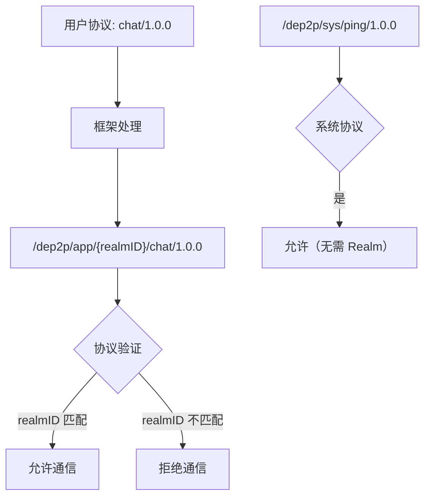

# 协议命名空间规范

本文档定义 DeP2P 协议命名空间的设计、格式和验证规则。

---

## 概述

协议命名空间是 DeP2P 协议隔离的核心机制，通过在协议 ID 中嵌入层级和 Realm 信息，从根本上杜绝协议冲突和跨 Realm 通信。

### 版本信息（IMPL-1227）

| 属性 | 值 |
|------|-----|
| 规范版本 | 1.0.0 |
| 状态 | 稳定 |
| 相关 ADR | ADR-0002, ADR-0003, ADR-0004 |

---

## 命名空间层次

```
┌─────────────────────────────────────────────────────────────────────────────────┐
│                          协议命名空间层次                                          │
├─────────────────────────────────────────────────────────────────────────────────┤
│                                                                                 │
│   Layer 1 - 系统协议:      /dep2p/sys/<protocol>                                │
│                                                                                 │
│   Layer 2 - Realm 控制:    /dep2p/realm/<realmID>/<protocol>                    │
│                                                                                 │
│   Layer 3 - 应用协议:      /dep2p/app/<realmID>/<protocol>                      │
│                                                                                 │
└─────────────────────────────────────────────────────────────────────────────────┘
```

### 前缀分类

| 前缀 | 层级 | 说明 | 示例 |
|------|------|------|------|
| `/dep2p/sys/` | Layer 1 | 系统协议，全网通用 | `/dep2p/sys/ping/1.0.0` |
| `/dep2p/realm/<realmID>/` | Layer 2 | Realm 控制协议 | `/dep2p/realm/{id}/auth/1.0.0` |
| `/dep2p/app/<realmID>/` | Layer 3 | 应用协议 | `/dep2p/app/{id}/chat/1.0.0` |

---

## 设计原理

### 为什么需要协议命名空间？

1. **防止协议冲突**: 不同 Realm 可以使用相同的应用协议名，互不干扰
2. **强制隔离边界**: 协议 ID 中包含 RealmID，无法跨 Realm 通信
3. **系统协议保护**: 用户无法注册 `/dep2p/sys/` 前缀的协议
4. **透明性**: 用户只需关心相对协议名，框架自动处理前缀

### 协议隔离机制



---

## Layer 1 系统协议

系统协议用于基础网络功能，无需加入 Realm 即可使用。

### 协议列表

```
/dep2p/sys/ping/1.0.0           # 心跳检测
/dep2p/sys/identify/1.0.0       # 身份识别
/dep2p/sys/dht/kad/1.0.0        # Kademlia DHT
/dep2p/sys/relay/1.0.0          # 系统中继
/dep2p/sys/holepunch/1.0.0      # 打洞协调
/dep2p/sys/bootstrap/1.0.0      # 引导协议
/dep2p/sys/autonat/1.0.0        # NAT 检测
```

### 特点

- 不包含 RealmID
- 全网通用
- 由框架内部使用
- 用户不可注册

---

## Layer 2 Realm 控制协议

Realm 控制协议用于 Realm 内部管理，包含 RealmID 以确保隔离。

### 协议列表

```
/dep2p/realm/<realmID>/auth/1.0.0     # Realm 认证
/dep2p/realm/<realmID>/sync/1.0.0     # 成员同步
/dep2p/realm/<realmID>/relay/1.0.0    # Realm 中继
```

### 特点

- 包含 RealmID
- 仅同 Realm 成员可用
- 由框架管理
- 用户不可直接注册

---

## Layer 3 应用协议

应用协议是用户定义的业务协议，框架自动添加 Realm 前缀。

### 自动前缀补全

```go
// 用户代码
realm.Messaging().SendWithProtocol(ctx, target, "chat/1.0.0", data)

// 实际协议 ID
// /dep2p/app/<realmID>/chat/1.0.0
```

### 用户 API

```go
// 使用相对协议名（推荐）
realm.Messaging().SendWithProtocol(ctx, target, "myproto/1.0.0", data)
realm.Streams().Open(ctx, target, "stream/1.0.0")

// 注册协议处理器
realm.Messaging().OnProtocol("myproto/1.0.0", handler)
realm.Streams().SetHandler("stream/1.0.0", handler)
```

---

## 协议验证规则

### ValidateUserProtocol

验证用户提供的协议是否合法：

```go
func ValidateUserProtocol(proto string, currentRealmID types.RealmID) error {
    // 1. 禁止使用系统前缀
    if strings.HasPrefix(proto, "/dep2p/sys/") {
        return ErrReservedProtocol
    }
    
    // 2. 禁止使用 Realm 前缀
    if strings.HasPrefix(proto, "/dep2p/realm/") {
        return ErrReservedProtocol
    }
    
    // 3. 如果已经是完整协议，检查 RealmID 匹配
    if strings.HasPrefix(proto, "/dep2p/app/") {
        realmID, err := ExtractRealmID(proto)
        if err != nil {
            return err
        }
        if realmID != currentRealmID {
            return ErrCrossRealmProtocol
        }
    }
    
    return nil
}
```

### 验证规则表

| 规则 | 描述 | 错误 |
|------|------|------|
| 系统前缀检查 | 禁止 `/dep2p/sys/` | `ErrReservedProtocol` |
| Realm 前缀检查 | 禁止 `/dep2p/realm/` | `ErrReservedProtocol` |
| 跨 Realm 检查 | RealmID 必须匹配 | `ErrCrossRealmProtocol` |
| 空协议检查 | 协议不能为空 | `ErrEmptyProtocol` |

---

## 协议辅助函数

### FullAppProtocol

构造完整的应用协议 ID：

```go
func FullAppProtocol(realmID types.RealmID, userProto string) types.ProtocolID {
    return types.ProtocolID(fmt.Sprintf("/dep2p/app/%s/%s", realmID, userProto))
}

// 示例
proto := FullAppProtocol("abc123", "chat/1.0.0")
// => /dep2p/app/abc123/chat/1.0.0
```

### FullRealmProtocol

构造完整的 Realm 控制协议 ID：

```go
func FullRealmProtocol(realmID types.RealmID, subProto string) types.ProtocolID {
    return types.ProtocolID(fmt.Sprintf("/dep2p/realm/%s/%s", realmID, subProto))
}

// 示例
proto := FullRealmProtocol("abc123", "auth/1.0.0")
// => /dep2p/realm/abc123/auth/1.0.0
```

### ExtractRealmID

从协议 ID 中提取 RealmID：

```go
func ExtractRealmID(proto types.ProtocolID) (types.RealmID, error) {
    s := string(proto)
    
    // 检查 /dep2p/app/<realmID>/...
    if strings.HasPrefix(s, AppPrefix) {
        rest := strings.TrimPrefix(s, AppPrefix)
        parts := strings.SplitN(rest, "/", 2)
        if len(parts) >= 1 && parts[0] != "" {
            return types.RealmID(parts[0]), nil
        }
    }
    
    // 检查 /dep2p/realm/<realmID>/...
    if strings.HasPrefix(s, RealmPrefix) {
        rest := strings.TrimPrefix(s, RealmPrefix)
        parts := strings.SplitN(rest, "/", 2)
        if len(parts) >= 1 && parts[0] != "" {
            return types.RealmID(parts[0]), nil
        }
    }
    
    return "", ErrNoRealmInProtocol
}
```

### BelongsToRealm

检查协议是否属于指定 Realm：

```go
func BelongsToRealm(proto types.ProtocolID, realmID types.RealmID) bool {
    extractedID, err := ExtractRealmID(proto)
    if err != nil {
        return false
    }
    return extractedID == realmID
}
```

---

## 中继协议白名单

### System Relay

System Relay 只允许系统协议：

```go
func (s *SystemRelay) isProtocolAllowed(proto types.ProtocolID) bool {
    return IsSystemProtocol(proto)
}

// 允许的协议
// /dep2p/sys/ping/1.0.0       ✓
// /dep2p/sys/dht/kad/1.0.0    ✓
// /dep2p/app/abc/chat/1.0.0   ✗ (业务协议)
```

### Realm Relay

Realm Relay 允许同 Realm 的业务和控制协议：

```go
func (r *RealmRelay) isProtocolAllowed(proto types.ProtocolID) bool {
    // 允许系统协议
    if IsSystemProtocol(proto) {
        return true
    }
    
    // 允许同 Realm 的业务协议
    if IsAppProtocol(proto) && BelongsToRealm(proto, r.realmID) {
        return true
    }
    
    // 允许同 Realm 的控制协议
    if IsRealmProtocol(proto) && BelongsToRealm(proto, r.realmID) {
        return true
    }
    
    return false
}

// 允许的协议（假设 realmID = "abc123"）
// /dep2p/sys/ping/1.0.0              ✓
// /dep2p/app/abc123/chat/1.0.0       ✓
// /dep2p/realm/abc123/auth/1.0.0     ✓
// /dep2p/app/xyz789/chat/1.0.0       ✗ (跨 Realm)
```

---

## 实现参考

### 代码位置

| 组件 | 路径 |
|------|------|
| 协议常量 | `pkg/protocolids/sys.go` |
| 验证函数 | `pkg/protocolids/sys.go` |
| Relay 验证 | `internal/core/relay/server/server.go` |
| 测试 | `pkg/protocolids/sys_test.go` |

### 使用示例

```go
package main

import (
    "github.com/dep2p/go-dep2p"
    "github.com/dep2p/go-dep2p/pkg/protocolids"
)

func main() {
    // 验证用户协议
    err := protocolids.ValidateUserProtocol("chat/1.0.0", myRealmID)
    if err != nil {
        // 处理错误
    }
    
    // 构造完整协议
    fullProto := protocolids.FullAppProtocol(myRealmID, "chat/1.0.0")
    
    // 检查协议类型
    if protocolids.IsSystemProtocol(proto) {
        // 系统协议
    } else if protocolids.IsAppProtocol(proto) {
        // 应用协议
    }
    
    // 检查 Realm 归属
    if protocolids.BelongsToRealm(proto, myRealmID) {
        // 属于当前 Realm
    }
}
```

---

## 相关文档

- [三层架构设计](../../architecture/layers.md)
- [Realm 协议规范](../application/realm.md)
- [中继协议规范](../transport/relay.md)
- [ADR-0002: 协议隔离设计](../../adr/0002-protocol-isolation.md)

