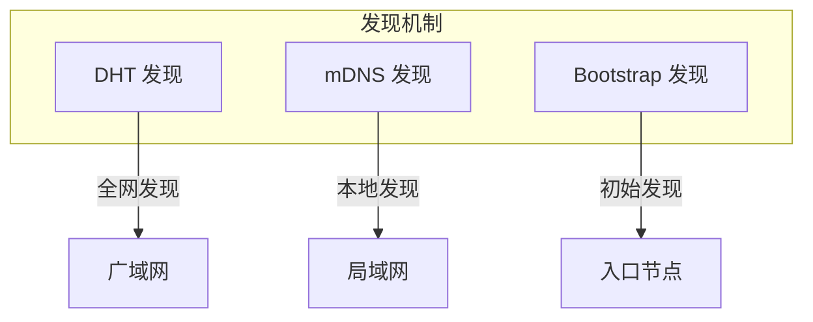
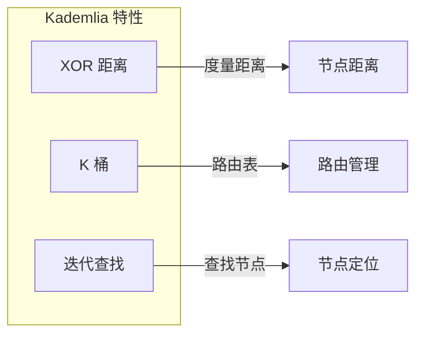
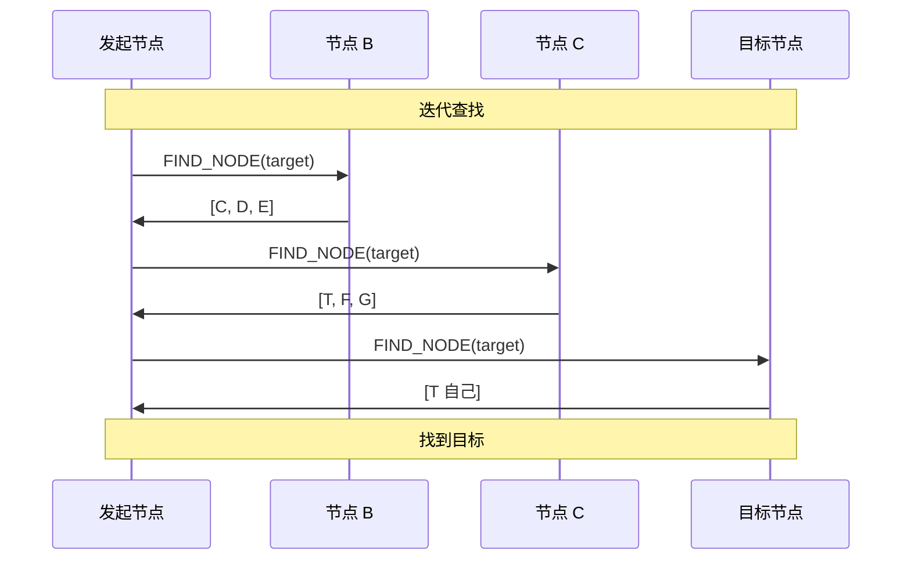
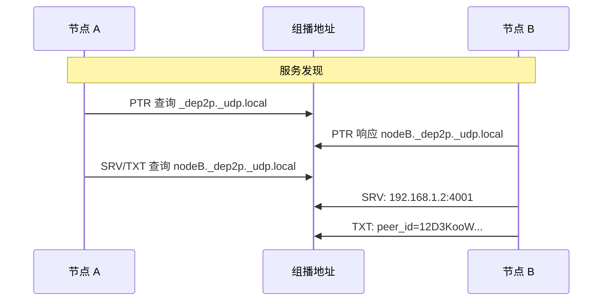
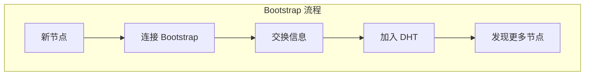
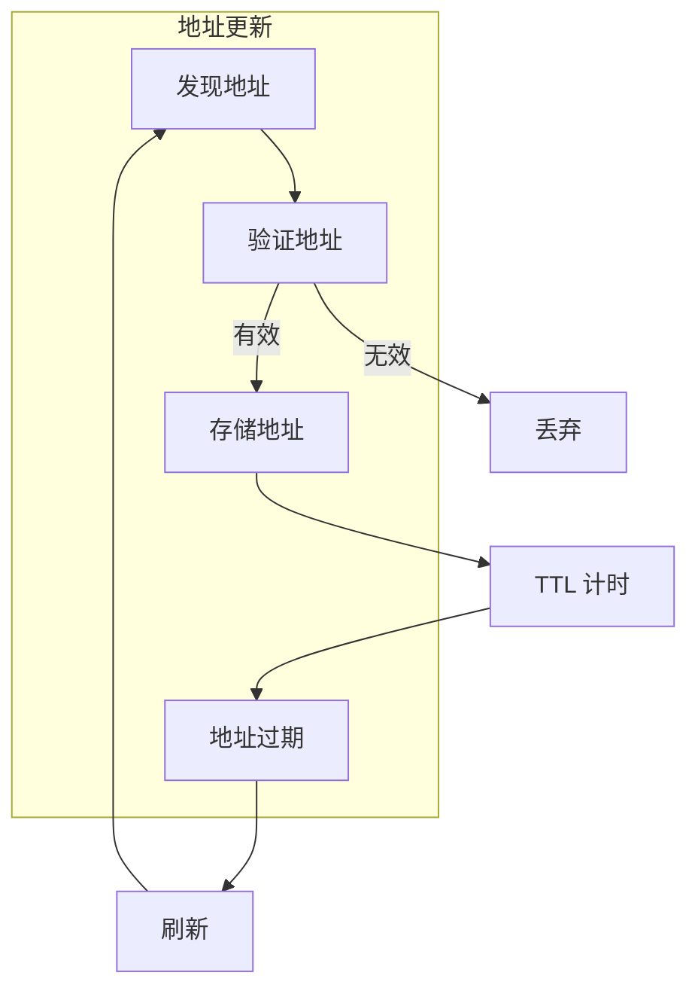
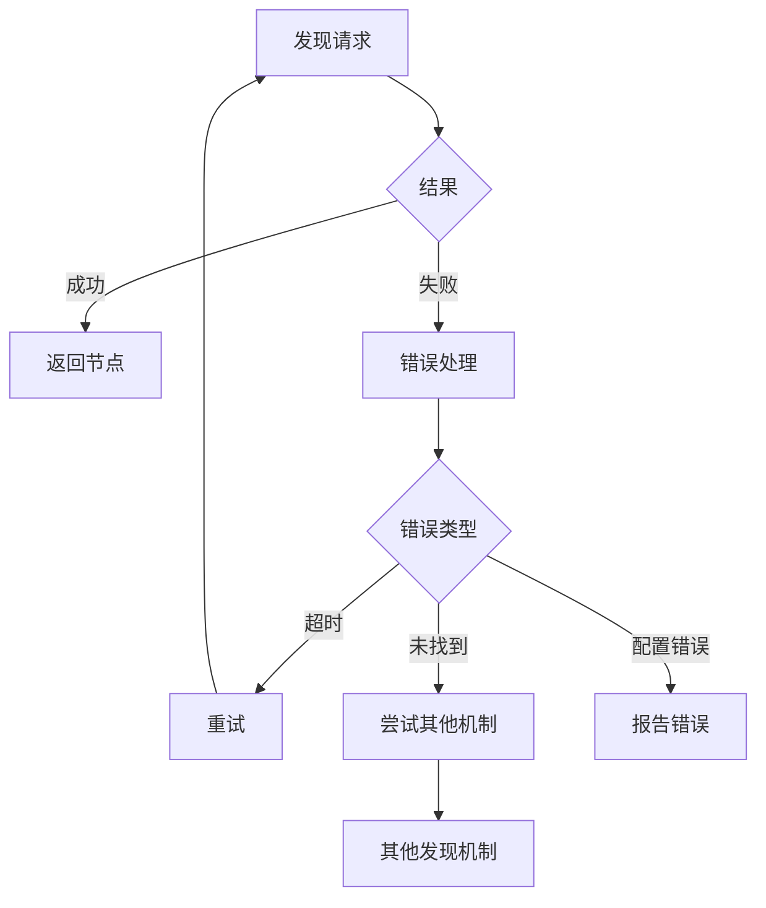

# 发现协议规范

本文档定义 DeP2P 节点发现协议的格式、流程和实现细节。

---

## 概述

发现协议负责在网络中查找和定位其他节点，是构建 P2P 网络的基础。

### 发现机制

DeP2P 支持多种发现机制：



| 机制 | 范围 | 适用场景 |
|------|------|----------|
| DHT | 全网 | 互联网节点发现 |
| mDNS | 局域网 | 本地网络节点发现 |
| Bootstrap | 初始 | 首次加入网络 |

---

## DHT 发现协议

### 协议信息

| 属性 | 值 |
|------|-----|
| 协议 ID | `/dep2p/sys/kad/1.0.0` |
| 作用域 | System |
| 基础 | Kademlia DHT |

### Kademlia 基础



### 消息类型

```protobuf
enum MessageType {
    FIND_NODE = 0;      // 查找节点
    FIND_NODE_RESP = 1; // 查找响应
    PING = 2;           // 心跳
    PONG = 3;           // 心跳响应
    GET_PROVIDERS = 4;  // 获取提供者
    ADD_PROVIDER = 5;   // 添加提供者
    GET_VALUE = 6;      // 获取值
    PUT_VALUE = 7;      // 存储值
}
```

### FIND_NODE

查找最近的 K 个节点：

```protobuf
message FindNodeRequest {
    // 目标节点 ID
    bytes target = 1;
    
    // 请求数量
    int32 count = 2;
}

message FindNodeResponse {
    // 最近的节点列表
    repeated PeerInfo closer_peers = 1;
}

message PeerInfo {
    // 节点 ID
    bytes id = 1;
    
    // 节点地址
    repeated bytes addrs = 2;
}
```

### 查找流程



### 代码示例

```go
// DHT 配置
type DHTConfig struct {
    // K 值（每桶节点数）
    K int
    
    // Alpha 值（并发查询数）
    Alpha int
    
    // 查找超时
    LookupTimeout time.Duration
    
    // 路由表刷新间隔
    RefreshInterval time.Duration
}

var DefaultDHTConfig = &DHTConfig{
    K:               20,
    Alpha:           3,
    LookupTimeout:   10 * time.Second,
    RefreshInterval: 10 * time.Minute,
}

// 查找节点
func (d *DHT) FindPeer(ctx context.Context, id peer.ID) (peer.AddrInfo, error) {
    // 迭代查找
    peers, err := d.runLookup(ctx, id)
    if err != nil {
        return peer.AddrInfo{}, err
    }
    
    // 查找目标
    for _, p := range peers {
        if p.ID == id {
            return p, nil
        }
    }
    
    return peer.AddrInfo{}, ErrPeerNotFound
}

// 迭代查找
func (d *DHT) runLookup(ctx context.Context, target peer.ID) ([]peer.AddrInfo, error) {
    // 从路由表获取初始节点
    closest := d.routingTable.NearestPeers(target, d.config.Alpha)
    
    seen := make(map[peer.ID]bool)
    result := make([]peer.AddrInfo, 0)
    
    for len(closest) > 0 {
        // 并发查询
        responses := d.queryPeers(ctx, closest, target)
        
        // 处理响应
        for _, resp := range responses {
            for _, p := range resp.CloserPeers {
                if !seen[p.ID] {
                    seen[p.ID] = true
                    result = append(result, p)
                }
            }
        }
        
        // 选择最近的节点继续查询
        closest = d.selectClosest(result, target, d.config.Alpha)
    }
    
    return result, nil
}
```

---

## mDNS 发现协议

### 协议信息

| 属性 | 值 |
|------|-----|
| 协议 | DNS-SD over mDNS |
| 端口 | 5353/UDP |
| 范围 | 局域网 |

### 服务发现

使用 DNS-SD 在局域网发现节点：



### 服务名称

```
_dep2p._udp.local
```

### TXT 记录

| 字段 | 描述 |
|------|------|
| `peer_id` | 节点 ID（Base58 编码） |
| `realm` | 当前 Realm（可选） |

### 代码示例

```go
// mDNS 配置
type MDNSConfig struct {
    // 服务名称
    ServiceName string
    
    // 发现间隔
    Interval time.Duration
    
    // 是否启用
    Enabled bool
}

var DefaultMDNSConfig = &MDNSConfig{
    ServiceName: "_dep2p._udp",
    Interval:    10 * time.Second,
    Enabled:     true,
}

// mDNS 服务
type MDNSService struct {
    host   host.Host
    config *MDNSConfig
    notify chan peer.AddrInfo
}

// 启动 mDNS 服务
func (m *MDNSService) Start() error {
    // 注册服务
    service, err := mdns.NewMDNSService(
        m.host.ID().String(),
        m.config.ServiceName,
        "",
        "",
        m.getPort(),
        []net.IP{},
        m.getTXTRecords(),
    )
    if err != nil {
        return err
    }
    
    // 启动服务器
    server, err := mdns.NewServer(&mdns.Config{Zone: service})
    if err != nil {
        return err
    }
    
    // 启动发现
    go m.discover()
    
    return nil
}

// 发现节点
func (m *MDNSService) discover() {
    ticker := time.NewTicker(m.config.Interval)
    defer ticker.Stop()
    
    for {
        select {
        case <-ticker.C:
            entries := make(chan *mdns.ServiceEntry)
            go m.handleEntries(entries)
            
            mdns.Lookup(m.config.ServiceName, entries)
            
        case <-m.ctx.Done():
            return
        }
    }
}
```

---

## Bootstrap 发现

### 机制

Bootstrap 节点是网络入口点，新节点通过它们加入网络：



### Bootstrap 配置

```go
// Bootstrap 配置
type BootstrapConfig struct {
    // Bootstrap 节点列表
    Peers []peer.AddrInfo
    
    // 连接超时
    Timeout time.Duration
    
    // 最小连接数
    MinPeers int
}

// 预设 Bootstrap 节点
var DefaultBootstrapPeers = []string{
    "/dnsaddr/bootstrap.dep2p.io/p2p/12D3KooW...",
    "/ip4/203.0.113.1/udp/4001/quic-v1/p2p/12D3KooW...",
}

// Bootstrap 流程
func (b *Bootstrapper) Bootstrap(ctx context.Context) error {
    // 连接 Bootstrap 节点
    for _, p := range b.config.Peers {
        if err := b.host.Connect(ctx, p); err != nil {
            log.Warn("连接 Bootstrap 失败", "peer", p.ID, "error", err)
            continue
        }
    }
    
    // 检查最小连接数
    if b.host.Network().Peers() < b.config.MinPeers {
        return ErrNotEnoughPeers
    }
    
    // 刷新 DHT
    return b.dht.Bootstrap(ctx)
}
```

---

## 地址更新

### 更新机制

发现到的地址需要定期更新：



### TTL 策略

| 来源 | TTL | 描述 |
|------|-----|------|
| 直接交换 | 1 小时 | 直接从节点获取 |
| DHT 查找 | 30 分钟 | 从 DHT 获取 |
| mDNS | 5 分钟 | 局域网发现 |
| 中继 | 10 分钟 | 中继地址 |

### 代码示例

```go
// 地址管理
type AddressManager struct {
    book     peerstore.AddrBook
    ttls     map[peer.ID]time.Time
    mu       sync.RWMutex
}

// 添加地址
func (m *AddressManager) AddAddrs(p peer.ID, addrs []multiaddr.Multiaddr, source AddressSource) {
    ttl := m.getTTL(source)
    m.book.AddAddrs(p, addrs, ttl)
    
    m.mu.Lock()
    m.ttls[p] = time.Now().Add(ttl)
    m.mu.Unlock()
}

// 获取 TTL
func (m *AddressManager) getTTL(source AddressSource) time.Duration {
    switch source {
    case SourceDirect:
        return 1 * time.Hour
    case SourceDHT:
        return 30 * time.Minute
    case SourceMDNS:
        return 5 * time.Minute
    case SourceRelay:
        return 10 * time.Minute
    default:
        return 30 * time.Minute
    }
}

// 清理过期地址
func (m *AddressManager) GC() {
    m.mu.Lock()
    defer m.mu.Unlock()
    
    now := time.Now()
    for p, exp := range m.ttls {
        if now.After(exp) {
            m.book.ClearAddrs(p)
            delete(m.ttls, p)
        }
    }
}
```

---

## 错误处理

### 错误类型

| 错误 | 描述 | 处理方式 |
|------|------|----------|
| `ErrPeerNotFound` | 未找到节点 | 重试或放弃 |
| `ErrNoBootstrapPeers` | 无 Bootstrap 节点 | 检查配置 |
| `ErrLookupTimeout` | 查找超时 | 重试 |
| `ErrDHTNotReady` | DHT 未就绪 | 等待初始化 |

### 错误处理流程



---

## 实现参考

### 代码位置

| 组件 | 路径 |
|------|------|
| DHT | `internal/core/discovery/dht/` |
| mDNS | `internal/core/discovery/mdns/` |
| Bootstrap | `internal/core/discovery/bootstrap/` |
| 地址管理 | `internal/core/address/` |

### 依赖库

- `github.com/libp2p/go-libp2p-kad-dht`
- `github.com/grandcat/zeroconf`

---

## 相关文档

- [路由协议](routing.md)
- [地址协议](../foundation/addressing.md)
- [协议索引](../README.md)
