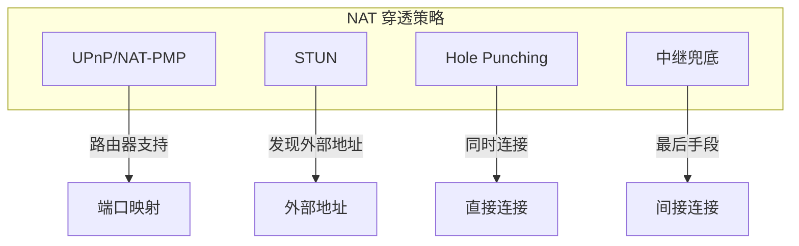
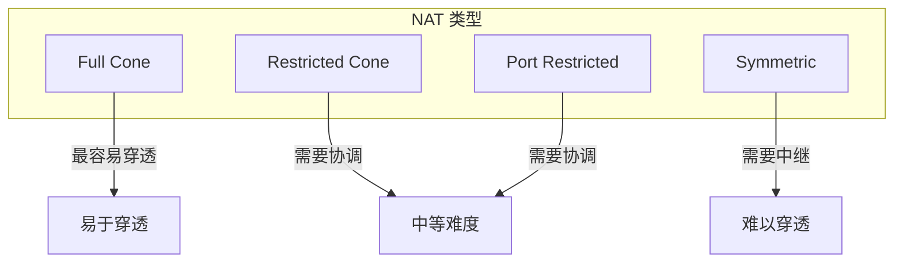
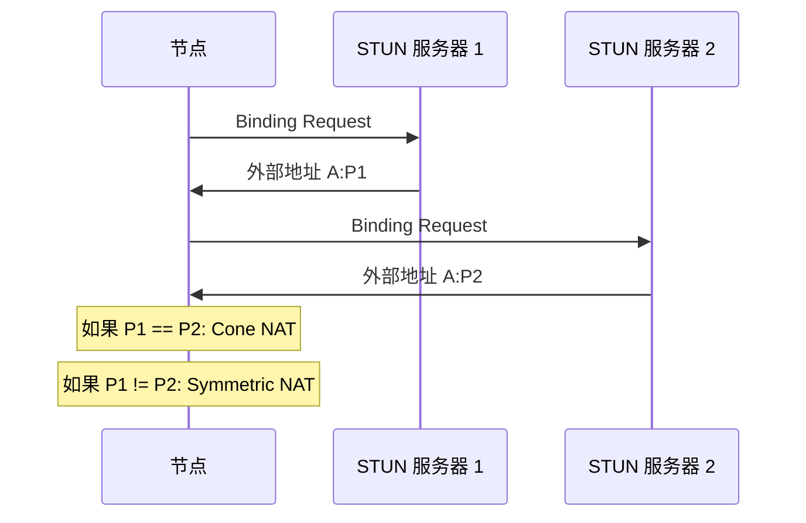
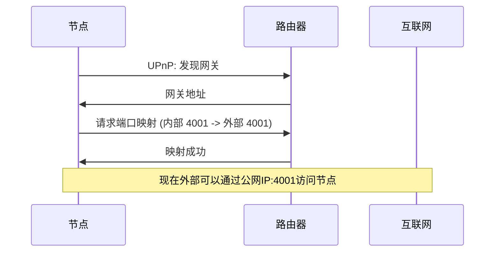
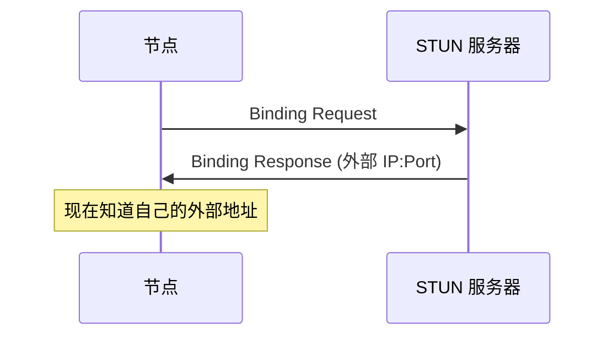
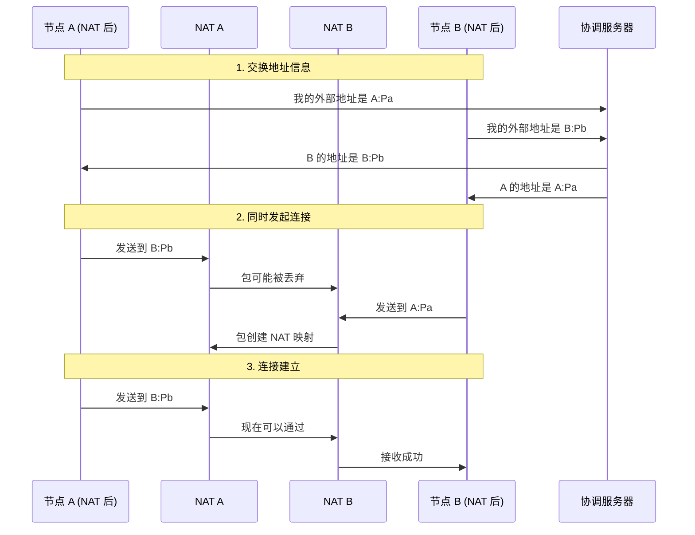
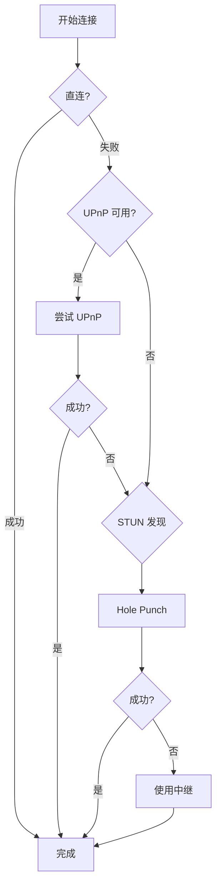

# NAT 穿透协议规范

本文档定义 DeP2P NAT 穿透协议的格式、流程和实现细节。

---

## 概述

NAT 穿透协议帮助位于 NAT 后的节点建立直接连接，减少对中继的依赖。

### 协议信息

| 属性 | 值 |
|------|-----|
| 协议 ID | `/dep2p/sys/holepunch/1.0.0` |
| 作用域 | System |
| Realm 验证 | 不需要 |

### NAT 穿透策略



---

## NAT 类型

### 分类



| NAT 类型 | 描述 | 穿透难度 |
|----------|------|----------|
| Full Cone | 任何外部地址可访问映射端口 | 易 |
| Restricted Cone | 仅已通信的 IP 可访问 | 中 |
| Port Restricted | 仅已通信的 IP:Port 可访问 | 中 |
| Symmetric | 每个目标使用不同映射 | 难 |

### NAT 类型检测



### 代码示例

```go
// NAT 类型
type NATType int

const (
    NATTypeUnknown NATType = iota
    NATTypeNone            // 无 NAT（公网 IP）
    NATTypeFullCone
    NATTypeRestrictedCone
    NATTypePortRestricted
    NATTypeSymmetric
)

// NAT 类型检测
func DetectNATType(ctx context.Context, stunServers []string) (NATType, error) {
    if len(stunServers) < 2 {
        return NATTypeUnknown, errors.New("need at least 2 STUN servers")
    }
    
    // 查询第一个 STUN 服务器
    addr1, err := querySTUN(ctx, stunServers[0])
    if err != nil {
        return NATTypeUnknown, err
    }
    
    // 查询第二个 STUN 服务器
    addr2, err := querySTUN(ctx, stunServers[1])
    if err != nil {
        return NATTypeUnknown, err
    }
    
    // 比较端口
    if addr1.Port == addr2.Port {
        // Cone NAT，需要进一步检测类型
        return detectConeType(ctx, stunServers[0], addr1)
    }
    
    // 端口不同，是 Symmetric NAT
    return NATTypeSymmetric, nil
}
```

---

## UPnP/NAT-PMP

### 端口映射

使用 UPnP 或 NAT-PMP 在路由器上创建端口映射：



### 代码示例

```go
// UPnP 端口映射
type PortMapper struct {
    gateway  *upnp.IGD
    mappings map[int]Mapping
    mu       sync.Mutex
}

type Mapping struct {
    InternalPort int
    ExternalPort int
    Protocol     string
    Duration     time.Duration
}

// 创建端口映射
func (pm *PortMapper) AddMapping(ctx context.Context, internalPort int) (int, error) {
    pm.mu.Lock()
    defer pm.mu.Unlock()
    
    // 发现网关
    if pm.gateway == nil {
        gw, err := upnp.Discover()
        if err != nil {
            return 0, fmt.Errorf("UPnP discovery failed: %w", err)
        }
        pm.gateway = gw
    }
    
    // 获取外部 IP
    externalIP, err := pm.gateway.ExternalIP()
    if err != nil {
        return 0, err
    }
    
    // 添加端口映射
    externalPort := internalPort
    err = pm.gateway.AddPortMapping(
        "UDP",
        externalPort,
        internalPort,
        "dep2p",
        3600, // 1 小时
    )
    if err != nil {
        return 0, err
    }
    
    pm.mappings[internalPort] = Mapping{
        InternalPort: internalPort,
        ExternalPort: externalPort,
        Protocol:     "UDP",
        Duration:     time.Hour,
    }
    
    return externalPort, nil
}

// 刷新映射
func (pm *PortMapper) Refresh(ctx context.Context) error {
    pm.mu.Lock()
    defer pm.mu.Unlock()
    
    for _, m := range pm.mappings {
        err := pm.gateway.AddPortMapping(
            m.Protocol,
            m.ExternalPort,
            m.InternalPort,
            "dep2p",
            3600,
        )
        if err != nil {
            return err
        }
    }
    
    return nil
}
```

---

## STUN

### 外部地址发现

STUN (Session Traversal Utilities for NAT) 用于发现外部地址：



### 代码示例

```go
// STUN 客户端
type STUNClient struct {
    servers []string
    timeout time.Duration
}

// 发现外部地址
func (c *STUNClient) Discover(ctx context.Context) (*net.UDPAddr, error) {
    for _, server := range c.servers {
        addr, err := c.query(ctx, server)
        if err == nil {
            return addr, nil
        }
    }
    return nil, errors.New("all STUN servers failed")
}

func (c *STUNClient) query(ctx context.Context, server string) (*net.UDPAddr, error) {
    conn, err := net.DialTimeout("udp", server, c.timeout)
    if err != nil {
        return nil, err
    }
    defer conn.Close()
    
    // 发送 Binding Request
    req := stun.MustBuild(stun.TransactionID, stun.BindingRequest)
    if _, err := conn.Write(req.Raw); err != nil {
        return nil, err
    }
    
    // 读取响应
    buf := make([]byte, 1024)
    conn.SetReadDeadline(time.Now().Add(c.timeout))
    n, err := conn.Read(buf)
    if err != nil {
        return nil, err
    }
    
    // 解析响应
    var msg stun.Message
    if err := msg.UnmarshalBinary(buf[:n]); err != nil {
        return nil, err
    }
    
    // 提取 XOR-MAPPED-ADDRESS
    var xorAddr stun.XORMappedAddress
    if err := xorAddr.GetFrom(&msg); err != nil {
        return nil, err
    }
    
    return &net.UDPAddr{
        IP:   xorAddr.IP,
        Port: xorAddr.Port,
    }, nil
}
```

---

## Hole Punching

### 原理

Hole Punching 通过双方同时发送数据包在 NAT 中创建映射：



### 协议消息

```protobuf
message HolePunchRequest {
    // 对端节点 ID
    bytes peer_id = 1;
    
    // 对端观察到的地址
    repeated bytes observed_addrs = 2;
}

message HolePunchResponse {
    // 状态
    StatusCode status = 1;
    
    // 我方观察到的地址
    repeated bytes observed_addrs = 2;
}

message HolePunchSync {
    // 同步时间戳
    int64 timestamp = 1;
}
```

### 代码示例

```go
// Hole Punch 协调器
type HolePuncher struct {
    host      host.Host
    attempts  int
    timeout   time.Duration
}

// 执行 Hole Punch
func (hp *HolePuncher) Punch(ctx context.Context, peer peer.ID) error {
    // 1. 通过中继交换地址
    addrs, err := hp.exchangeAddrs(ctx, peer)
    if err != nil {
        return fmt.Errorf("address exchange failed: %w", err)
    }
    
    // 2. 同步开始时间
    startTime, err := hp.sync(ctx, peer)
    if err != nil {
        return fmt.Errorf("sync failed: %w", err)
    }
    
    // 3. 等待开始时间
    time.Sleep(time.Until(startTime))
    
    // 4. 同时发起连接
    var lastErr error
    for i := 0; i < hp.attempts; i++ {
        for _, addr := range addrs {
            conn, err := hp.host.Network().DialPeer(ctx, peer)
            if err == nil {
                return nil // 成功
            }
            lastErr = err
        }
        time.Sleep(100 * time.Millisecond)
    }
    
    return fmt.Errorf("hole punch failed: %w", lastErr)
}

// 交换地址
func (hp *HolePuncher) exchangeAddrs(ctx context.Context, peer peer.ID) ([]multiaddr.Multiaddr, error) {
    // 通过中继连接打开流
    s, err := hp.host.NewStream(ctx, peer, protocolids.SysHolePunch)
    if err != nil {
        return nil, err
    }
    defer s.Close()
    
    // 发送请求
    req := &pb.HolePunchRequest{
        PeerId:        []byte(hp.host.ID()),
        ObservedAddrs: hp.getObservedAddrs(),
    }
    if err := writeMsg(s, req); err != nil {
        return nil, err
    }
    
    // 读取响应
    var resp pb.HolePunchResponse
    if err := readMsg(s, &resp); err != nil {
        return nil, err
    }
    
    // 解析地址
    addrs := make([]multiaddr.Multiaddr, len(resp.ObservedAddrs))
    for i, a := range resp.ObservedAddrs {
        addrs[i], _ = multiaddr.NewMultiaddrBytes(a)
    }
    
    return addrs, nil
}
```

---

## NAT 配置

### 配置选项

```go
// NAT 配置
type NATConfig struct {
    // 启用 UPnP
    EnableUPnP bool
    
    // 启用 NAT-PMP
    EnableNATPMP bool
    
    // 启用 Hole Punching
    EnableHolePunch bool
    
    // STUN 服务器列表
    STUNServers []string
    
    // 显式声明外部地址
    ExternalAddrs []multiaddr.Multiaddr
    
    // 端口映射刷新间隔
    MappingRefreshInterval time.Duration
}

var DefaultNATConfig = &NATConfig{
    EnableUPnP:      true,
    EnableNATPMP:    true,
    EnableHolePunch: true,
    STUNServers: []string{
        "stun.l.google.com:19302",
        "stun1.l.google.com:19302",
    },
    MappingRefreshInterval: 30 * time.Minute,
}
```

### 使用示例

```go
// 创建带 NAT 穿透的节点
node, err := dep2p.NewNode(
    dep2p.WithNATPortMap(true),
    dep2p.WithAutoNAT(true),
    dep2p.WithHolePunching(true),
    dep2p.WithSTUNServers([]string{
        "stun.l.google.com:19302",
    }),
)
```

---

## 错误处理

### 错误类型

| 错误 | 描述 | 处理方式 |
|------|------|----------|
| `ErrNATNotSupported` | NAT 不支持 UPnP | 尝试其他方法 |
| `ErrSymmetricNAT` | Symmetric NAT | 使用中继 |
| `ErrHolePunchFailed` | 打洞失败 | 回退到中继 |
| `ErrSTUNTimeout` | STUN 超时 | 重试或跳过 |

### 降级策略



---

## 实现参考

### 代码位置

| 组件 | 路径 |
|------|------|
| NAT 管理 | `internal/core/nat/manager.go` |
| UPnP | `internal/core/nat/upnp.go` |
| STUN | `internal/core/nat/stun.go` |
| Hole Punch | `internal/core/nat/holepunch.go` |

### 依赖库

- `github.com/libp2p/go-libp2p/p2p/protocol/holepunch`
- `github.com/huin/goupnp`
- `github.com/pion/stun`

---

## 相关文档

- [中继协议](../transport/relay.md)
- [地址协议](../foundation/addressing.md)
- [协议索引](../README.md)
