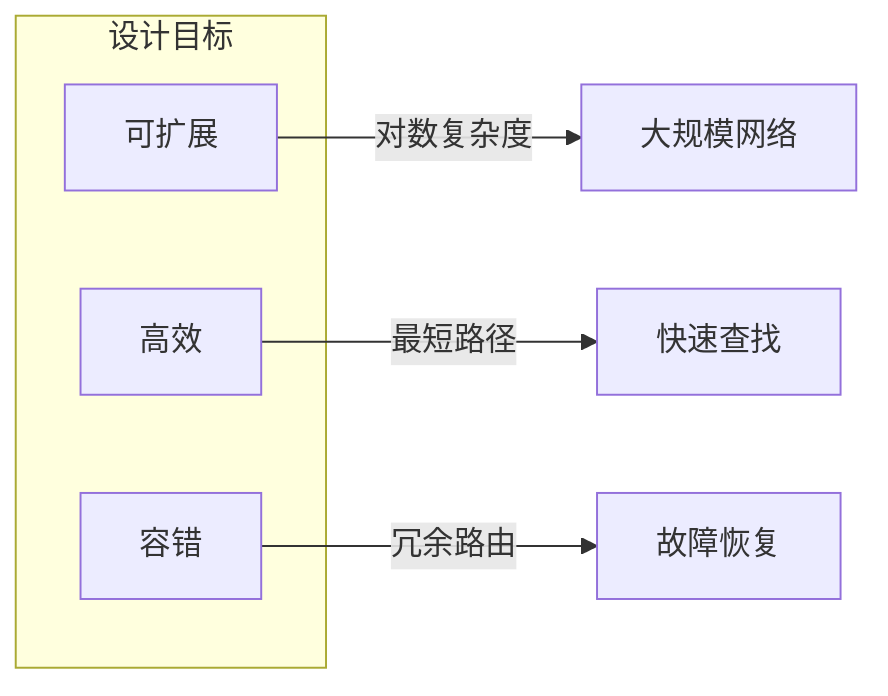
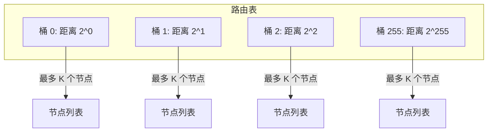
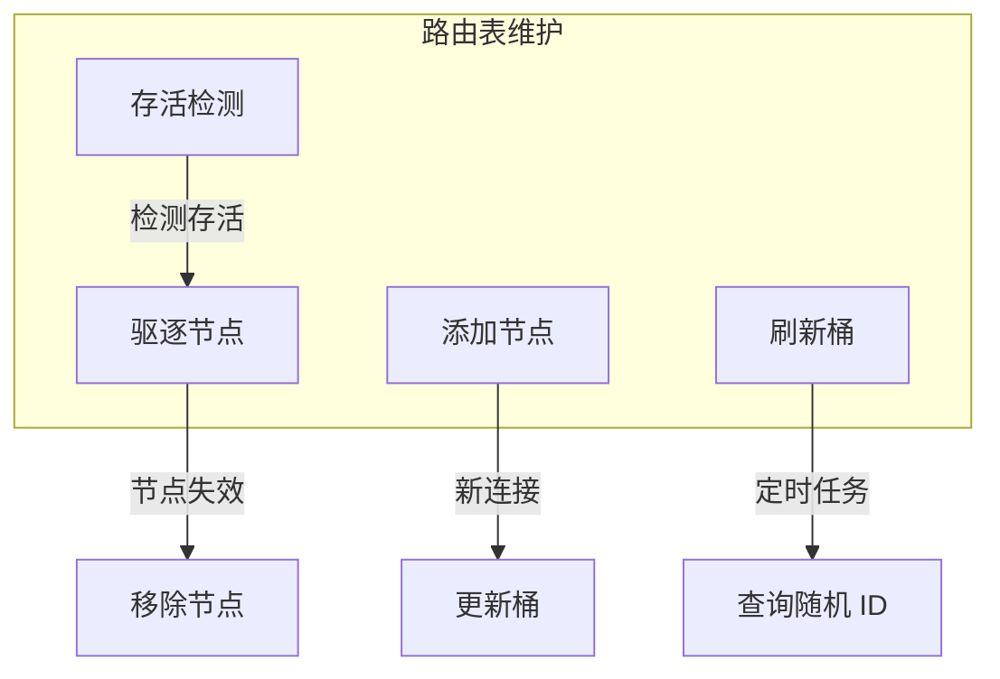
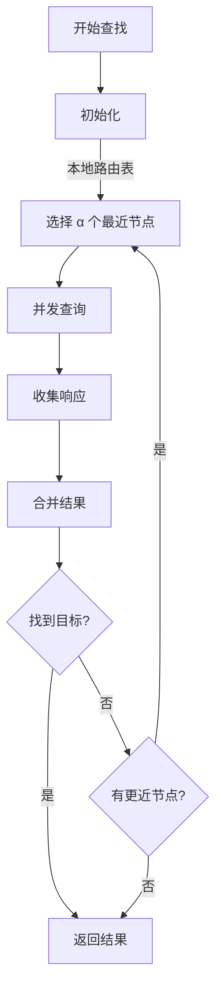
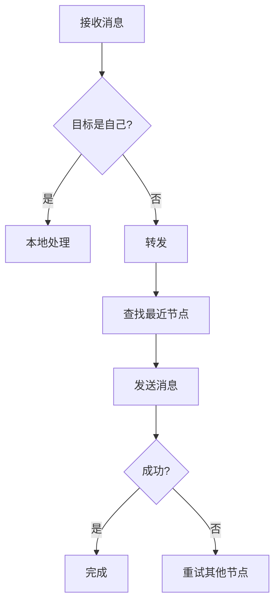

# 路由协议规范

本文档定义 DeP2P 路由协议的格式、算法和实现细节。

---

## 概述

路由协议负责管理网络拓扑和消息转发路径，是 P2P 网络的核心组件。

### 设计目标



| 目标 | 描述 |
|------|------|
| 可扩展 | 支持百万级节点 |
| 高效 | O(log N) 查找复杂度 |
| 容错 | 节点失效不影响网络 |

---

## Kademlia 路由

### 核心概念


### XOR 距离

节点间距离使用 XOR 运算：

```
distance(A, B) = A XOR B
```

**特性**：
- `d(A, A) = 0`
- `d(A, B) = d(B, A)`
- `d(A, B) + d(B, C) >= d(A, C)`

### 代码示例

```go
// 计算 XOR 距离
func XORDistance(a, b peer.ID) []byte {
    aBytes := []byte(a)
    bBytes := []byte(b)
    
    result := make([]byte, len(aBytes))
    for i := range aBytes {
        result[i] = aBytes[i] ^ bBytes[i]
    }
    
    return result
}

// 比较距离
func CloserTo(a, b, target peer.ID) bool {
    distA := XORDistance(a, target)
    distB := XORDistance(b, target)
    
    return bytes.Compare(distA, distB) < 0
}
```

---

## K 桶

### 结构

路由表由 256 个 K 桶组成，每桶最多存储 K 个节点：



### 桶索引计算

```go
// 计算桶索引
func BucketIndex(self, other peer.ID) int {
    distance := XORDistance(self, other)
    
    // 找到最高位的 1
    for i := 0; i < len(distance); i++ {
        for j := 7; j >= 0; j-- {
            if distance[i]&(1<<j) != 0 {
                return i*8 + (7 - j)
            }
        }
    }
    
    return 255
}
```

### K 桶实现

```go
// K 桶
type KBucket struct {
    peers    []peer.ID
    k        int
    mu       sync.RWMutex
}

// 添加节点
func (b *KBucket) AddPeer(p peer.ID) bool {
    b.mu.Lock()
    defer b.mu.Unlock()
    
    // 检查是否已存在
    for i, existing := range b.peers {
        if existing == p {
            // 移到末尾（最近使用）
            b.peers = append(b.peers[:i], b.peers[i+1:]...)
            b.peers = append(b.peers, p)
            return true
        }
    }
    
    // 桶未满，直接添加
    if len(b.peers) < b.k {
        b.peers = append(b.peers, p)
        return true
    }
    
    // 桶已满，检查头部节点是否存活
    // 如果存活，拒绝新节点
    // 如果不存活，替换
    return false
}

// 获取最近的 N 个节点
func (b *KBucket) NearestPeers(target peer.ID, n int) []peer.ID {
    b.mu.RLock()
    defer b.mu.RUnlock()
    
    // 复制节点列表
    peers := make([]peer.ID, len(b.peers))
    copy(peers, b.peers)
    
    // 按距离排序
    sort.Slice(peers, func(i, j int) bool {
        return CloserTo(peers[i], peers[j], target)
    })
    
    if n > len(peers) {
        n = len(peers)
    }
    
    return peers[:n]
}
```

---

## 路由表

### 结构

```go
// 路由表
type RoutingTable struct {
    self    peer.ID
    buckets [256]*KBucket
    k       int
    mu      sync.RWMutex
}

// 创建路由表
func NewRoutingTable(self peer.ID, k int) *RoutingTable {
    rt := &RoutingTable{
        self: self,
        k:    k,
    }
    
    for i := range rt.buckets {
        rt.buckets[i] = NewKBucket(k)
    }
    
    return rt
}

// 添加节点
func (rt *RoutingTable) AddPeer(p peer.ID) {
    if p == rt.self {
        return
    }
    
    idx := BucketIndex(rt.self, p)
    rt.buckets[idx].AddPeer(p)
}

// 查找最近的节点
func (rt *RoutingTable) NearestPeers(target peer.ID, count int) []peer.ID {
    idx := BucketIndex(rt.self, target)
    
    var result []peer.ID
    
    // 从目标桶开始搜索
    for i := 0; i < 256 && len(result) < count; i++ {
        // 交替搜索左右桶
        if idx+i < 256 {
            result = append(result, rt.buckets[idx+i].NearestPeers(target, count)...)
        }
        if i > 0 && idx-i >= 0 {
            result = append(result, rt.buckets[idx-i].NearestPeers(target, count)...)
        }
    }
    
    // 排序并截取
    sort.Slice(result, func(i, j int) bool {
        return CloserTo(result[i], result[j], target)
    })
    
    if len(result) > count {
        result = result[:count]
    }
    
    return result
}
```

### 路由表维护



---

## 迭代查找

### 算法



### 代码实现

```go
// 迭代查找
type LookupResult struct {
    Target peer.ID
    Peers  []peer.AddrInfo
}

func (d *DHT) Lookup(ctx context.Context, target peer.ID) (*LookupResult, error) {
    // 参数
    alpha := d.config.Alpha  // 并发数
    k := d.config.K          // 结果数
    
    // 初始化
    closest := d.routingTable.NearestPeers(target, alpha)
    queried := make(map[peer.ID]bool)
    result := &LookupResult{Target: target}
    
    for {
        // 选择未查询的节点
        var toQuery []peer.ID
        for _, p := range closest {
            if !queried[p] && len(toQuery) < alpha {
                toQuery = append(toQuery, p)
                queried[p] = true
            }
        }
        
        if len(toQuery) == 0 {
            break
        }
        
        // 并发查询
        responses := d.parallelQuery(ctx, toQuery, target)
        
        // 处理响应
        for _, resp := range responses {
            for _, p := range resp.Peers {
                if !contains(closest, p.ID) {
                    closest = append(closest, p.ID)
                }
            }
        }
        
        // 排序
        sort.Slice(closest, func(i, j int) bool {
            return CloserTo(closest[i], closest[j], target)
        })
        
        // 截取 K 个
        if len(closest) > k {
            closest = closest[:k]
        }
    }
    
    // 获取地址信息
    for _, p := range closest {
        if addrs := d.peerstore.Addrs(p); len(addrs) > 0 {
            result.Peers = append(result.Peers, peer.AddrInfo{
                ID:    p,
                Addrs: addrs,
            })
        }
    }
    
    return result, nil
}
```

---

## 路由刷新

### 刷新策略

定期刷新路由表以保持网络连通性：

```go
// 路由表刷新
type Refresher struct {
    dht      *DHT
    interval time.Duration
}

func (r *Refresher) Start(ctx context.Context) {
    ticker := time.NewTicker(r.interval)
    defer ticker.Stop()
    
    for {
        select {
        case <-ticker.C:
            r.refresh(ctx)
        case <-ctx.Done():
            return
        }
    }
}

func (r *Refresher) refresh(ctx context.Context) {
    // 刷新每个桶
    for i := 0; i < 256; i++ {
        bucket := r.dht.routingTable.buckets[i]
        
        // 如果桶为空或很久未更新，执行查找
        if bucket.NeedsRefresh() {
            // 生成该桶范围内的随机 ID
            randomID := r.generateRandomIDInBucket(i)
            
            // 执行查找
            r.dht.Lookup(ctx, randomID)
        }
    }
}
```

---

## 消息转发

### 转发策略



### 代码示例

```go
// 消息转发
func (r *Router) Forward(ctx context.Context, msg *Message) error {
    target := msg.Target
    
    // 检查是否是本地节点
    if target == r.self {
        return r.handleLocal(msg)
    }
    
    // 查找最近的节点
    peers := r.routingTable.NearestPeers(target, r.config.Alpha)
    
    // 尝试转发
    for _, p := range peers {
        if err := r.sendTo(ctx, p, msg); err == nil {
            return nil
        }
    }
    
    return ErrForwardFailed
}
```

---

## 配置参数

| 参数 | 默认值 | 描述 |
|------|--------|------|
| K | 20 | 每桶最大节点数 |
| Alpha | 3 | 并发查询数 |
| RefreshInterval | 10min | 桶刷新间隔 |
| QueryTimeout | 10s | 单次查询超时 |
| MaxRecordAge | 24h | 记录最大存活时间 |

---

## 实现参考

### 代码位置

| 组件 | 路径 |
|------|------|
| 路由表 | `internal/core/routing/table.go` |
| K 桶 | `internal/core/routing/bucket.go` |
| 查找 | `internal/core/routing/lookup.go` |
| 刷新 | `internal/core/routing/refresh.go` |

---

## 相关文档

- [发现协议](discovery.md)
- [NAT 穿透](nat.md)
- [协议索引](../README.md)
