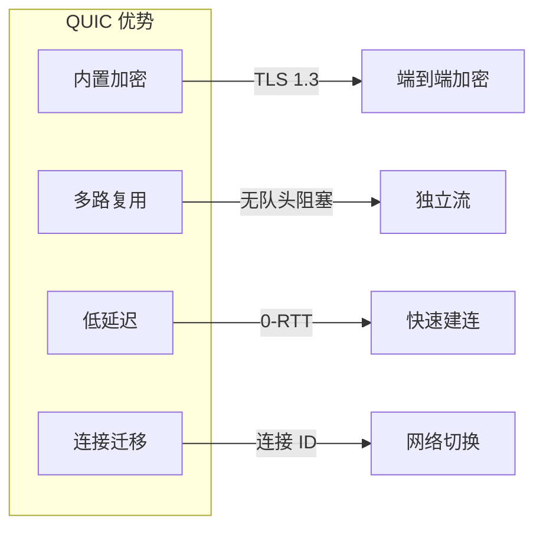
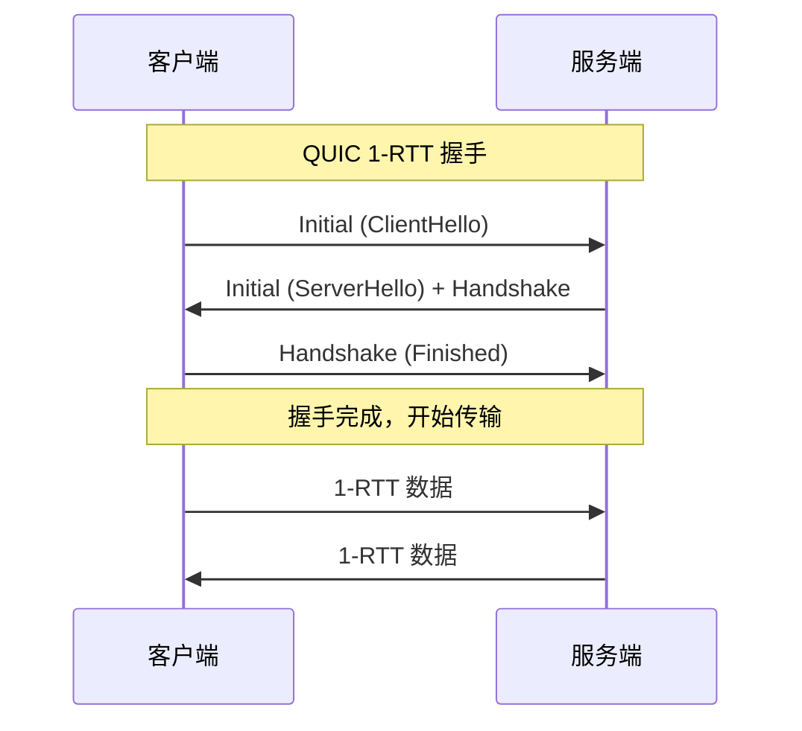
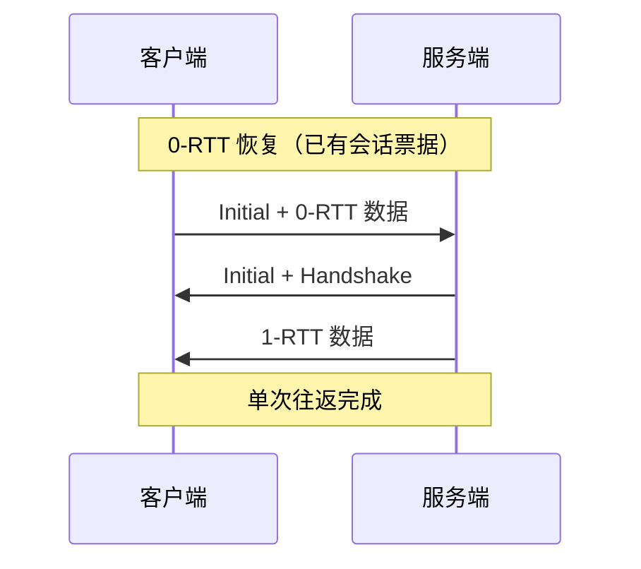
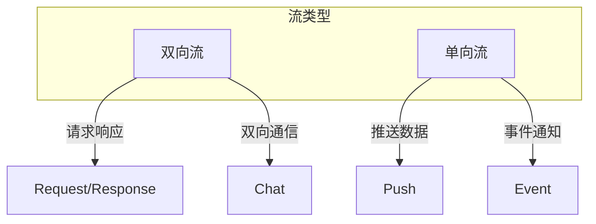
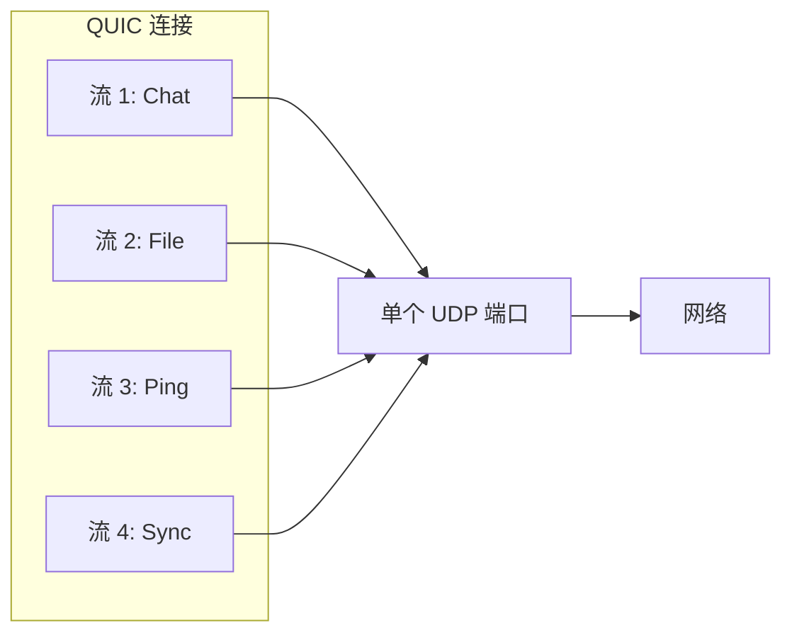
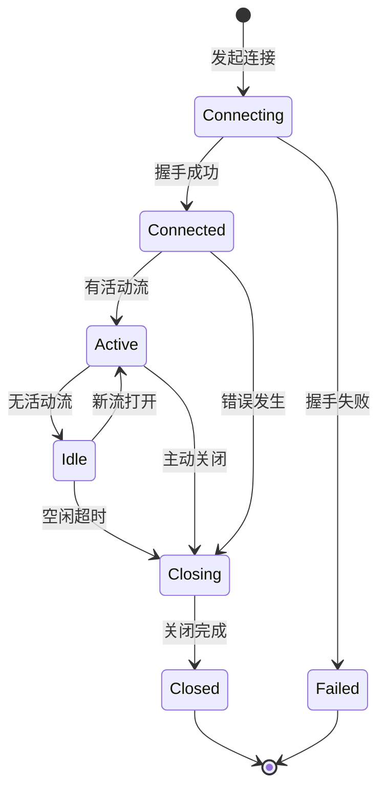
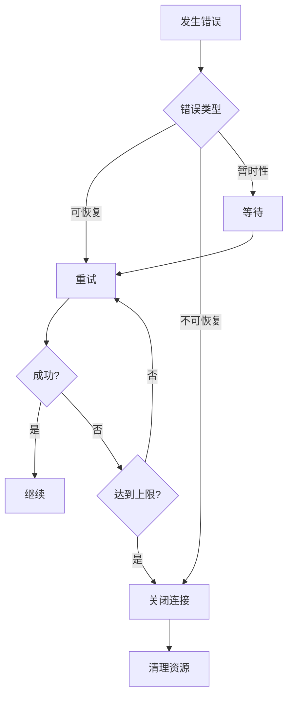

# QUIC 传输协议规范

本文档定义 DeP2P 基于 QUIC 的传输层协议规范。

---

## 概述

DeP2P 使用 QUIC 作为主要传输协议，提供安全、可靠、低延迟的网络传输。

### 为什么选择 QUIC



| 特性 | 描述 |
|------|------|
| 内置加密 | 强制 TLS 1.3，无明文传输 |
| 多路复用 | 单连接多流，无队头阻塞 |
| 低延迟 | 支持 0-RTT 恢复 |
| 连接迁移 | 支持网络切换不断连 |

---

## 协议版本

### 支持版本

| 版本 | RFC | 状态 |
|------|-----|------|
| QUIC v1 | RFC 9000 | 主要 |
| QUIC v2 | RFC 9369 | 支持 |

### Multiaddr 表示

```
# QUIC v1
/ip4/192.168.1.1/udp/4001/quic-v1

# QUIC v2（未来）
/ip4/192.168.1.1/udp/4001/quic-v2
```

---

## 连接建立

### 握手流程



### 0-RTT 恢复

对于已知服务器，支持 0-RTT 快速恢复：



### 代码示例

```go
import (
    "github.com/quic-go/quic-go"
)

// QUIC 传输配置
type QUICConfig struct {
    // 最大并发流
    MaxIncomingStreams int64
    
    // 最大并发单向流
    MaxIncomingUniStreams int64
    
    // 空闲超时
    MaxIdleTimeout time.Duration
    
    // 保活间隔
    KeepAlivePeriod time.Duration
    
    // 启用 0-RTT
    Allow0RTT bool
}

// 默认配置
var DefaultQUICConfig = &QUICConfig{
    MaxIncomingStreams:    256,
    MaxIncomingUniStreams: 256,
    MaxIdleTimeout:        30 * time.Second,
    KeepAlivePeriod:       15 * time.Second,
    Allow0RTT:             true,
}

// 创建 QUIC 监听器
func NewQUICListener(addr string, tlsConf *tls.Config) (*quic.Listener, error) {
    quicConf := &quic.Config{
        MaxIncomingStreams:    DefaultQUICConfig.MaxIncomingStreams,
        MaxIdleTimeout:        DefaultQUICConfig.MaxIdleTimeout,
        KeepAlivePeriod:       DefaultQUICConfig.KeepAlivePeriod,
        Allow0RTT:             DefaultQUICConfig.Allow0RTT,
    }
    
    return quic.ListenAddr(addr, tlsConf, quicConf)
}

// 连接到对端
func DialQUIC(ctx context.Context, addr string, tlsConf *tls.Config) (quic.Connection, error) {
    quicConf := &quic.Config{
        MaxIncomingStreams: DefaultQUICConfig.MaxIncomingStreams,
        MaxIdleTimeout:     DefaultQUICConfig.MaxIdleTimeout,
        KeepAlivePeriod:    DefaultQUICConfig.KeepAlivePeriod,
    }
    
    return quic.DialAddr(ctx, addr, tlsConf, quicConf)
}
```

---

## 流管理

### 流类型

QUIC 支持两种流类型：



| 流类型 | 方向 | 用途 |
|--------|------|------|
| 双向流 | 双方读写 | 请求响应、对话 |
| 单向流 | 发起方写 | 推送、通知 |

### 流多路复用



### 代码示例

```go
// 打开双向流
func OpenBidiStream(conn quic.Connection, proto string) (quic.Stream, error) {
    stream, err := conn.OpenStreamSync(context.Background())
    if err != nil {
        return nil, err
    }
    
    // 写入协议协商
    if err := writeProtocol(stream, proto); err != nil {
        stream.Close()
        return nil, err
    }
    
    return stream, nil
}

// 接受流
func AcceptStream(conn quic.Connection) (quic.Stream, string, error) {
    stream, err := conn.AcceptStream(context.Background())
    if err != nil {
        return nil, "", err
    }
    
    // 读取协议
    proto, err := readProtocol(stream)
    if err != nil {
        stream.Close()
        return nil, "", err
    }
    
    return stream, proto, nil
}

// 流处理器
type StreamHandler func(stream quic.Stream) error

// 注册处理器
func (h *Host) SetStreamHandler(proto string, handler StreamHandler) {
    h.mux.Lock()
    h.handlers[proto] = handler
    h.mux.Unlock()
}
```

---

## 连接管理

### 连接生命周期



### 连接池

```go
// 连接池配置
type ConnPoolConfig struct {
    // 每个对端最大连接数
    MaxConnsPerPeer int
    
    // 连接空闲超时
    IdleTimeout time.Duration
    
    // 连接重试次数
    MaxRetries int
    
    // 重试间隔
    RetryInterval time.Duration
}

// 连接池
type ConnPool struct {
    conns   map[peer.ID][]quic.Connection
    config  *ConnPoolConfig
    mu      sync.RWMutex
}

// 获取连接
func (p *ConnPool) Get(ctx context.Context, peerID peer.ID) (quic.Connection, error) {
    p.mu.RLock()
    conns := p.conns[peerID]
    p.mu.RUnlock()
    
    // 返回可用连接
    for _, conn := range conns {
        if conn.Context().Err() == nil {
            return conn, nil
        }
    }
    
    // 创建新连接
    return p.dial(ctx, peerID)
}
```

---

## 配置参数

### 核心参数

| 参数 | 默认值 | 描述 |
|------|--------|------|
| `MaxIncomingStreams` | 256 | 最大入站并发流 |
| `MaxIncomingUniStreams` | 256 | 最大入站单向流 |
| `MaxIdleTimeout` | 30s | 空闲超时 |
| `KeepAlivePeriod` | 15s | 保活间隔 |
| `InitialStreamReceiveWindow` | 512KB | 初始流接收窗口 |
| `MaxStreamReceiveWindow` | 6MB | 最大流接收窗口 |
| `InitialConnectionReceiveWindow` | 768KB | 初始连接接收窗口 |
| `MaxConnectionReceiveWindow` | 15MB | 最大连接接收窗口 |

### 配置示例

```go
// 服务器配置
func ServerQUICConfig() *quic.Config {
    return &quic.Config{
        MaxIncomingStreams:              1024,
        MaxIncomingUniStreams:           1024,
        MaxIdleTimeout:                  60 * time.Second,
        KeepAlivePeriod:                 30 * time.Second,
        InitialStreamReceiveWindow:     1 << 20, // 1MB
        MaxStreamReceiveWindow:         16 << 20, // 16MB
        InitialConnectionReceiveWindow: 2 << 20,  // 2MB
        MaxConnectionReceiveWindow:     32 << 20, // 32MB
        Allow0RTT:                       true,
    }
}

// 客户端配置
func ClientQUICConfig() *quic.Config {
    return &quic.Config{
        MaxIncomingStreams:    256,
        MaxIdleTimeout:        30 * time.Second,
        KeepAlivePeriod:       15 * time.Second,
    }
}
```

---

## 错误处理

### 错误类型

| 错误码 | 描述 | 处理方式 |
|--------|------|----------|
| `NO_ERROR` | 正常关闭 | 清理资源 |
| `INTERNAL_ERROR` | 内部错误 | 重试连接 |
| `CONNECTION_REFUSED` | 拒绝连接 | 检查配置 |
| `FLOW_CONTROL_ERROR` | 流控错误 | 调整窗口 |
| `STREAM_LIMIT_ERROR` | 流数超限 | 等待或关闭 |
| `CRYPTO_ERROR` | TLS 错误 | 检查证书 |

### 错误处理流程



---

## 性能优化

### 优化策略

1. **启用 0-RTT**: 减少已知对端的连接延迟
2. **调整窗口大小**: 根据网络条件调整流控窗口
3. **合理设置超时**: 平衡资源利用和响应性
4. **使用连接池**: 复用连接，减少握手开销

### 监控指标

```go
// 连接指标
type ConnMetrics struct {
    BytesSent     uint64
    BytesReceived uint64
    StreamsOpened uint64
    StreamsClosed uint64
    RTT           time.Duration
    PacketLoss    float64
}

// 获取指标
func (c *Connection) Metrics() ConnMetrics {
    stats := c.quicConn.Statistics()
    return ConnMetrics{
        BytesSent:     stats.SentBytes,
        BytesReceived: stats.ReceivedBytes,
        RTT:           stats.SmoothedRTT,
    }
}
```

---

## 实现参考

### 代码位置

| 组件 | 路径 |
|------|------|
| 传输实现 | `internal/core/transport/quic.go` |
| 配置 | `internal/core/transport/config.go` |
| 连接池 | `internal/core/transport/pool.go` |
| 测试 | `internal/core/transport/*_test.go` |

### 依赖库

- `github.com/quic-go/quic-go`

---

## 相关文档

- [安全协议](security.md)
- [中继协议](relay.md)
- [协议索引](../README.md)
