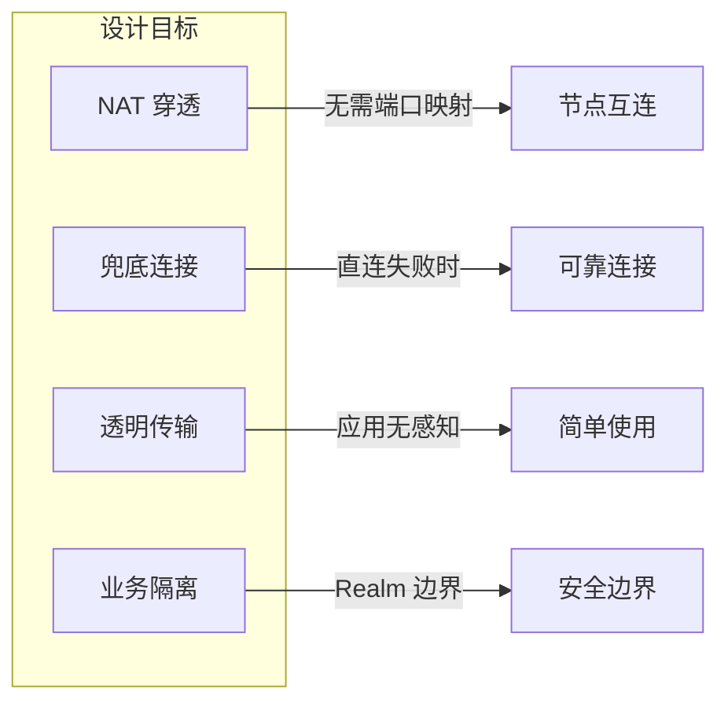
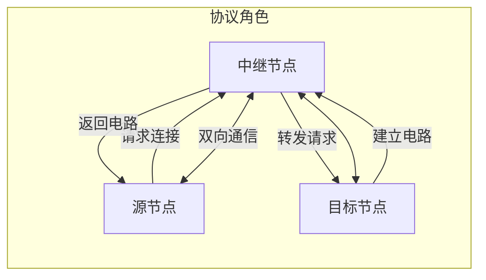
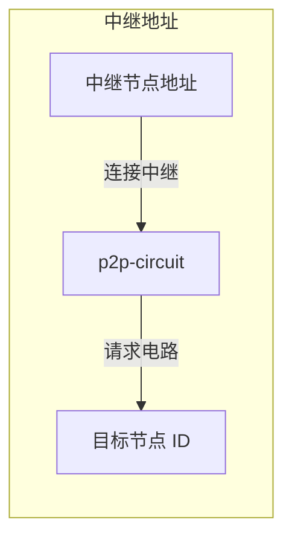
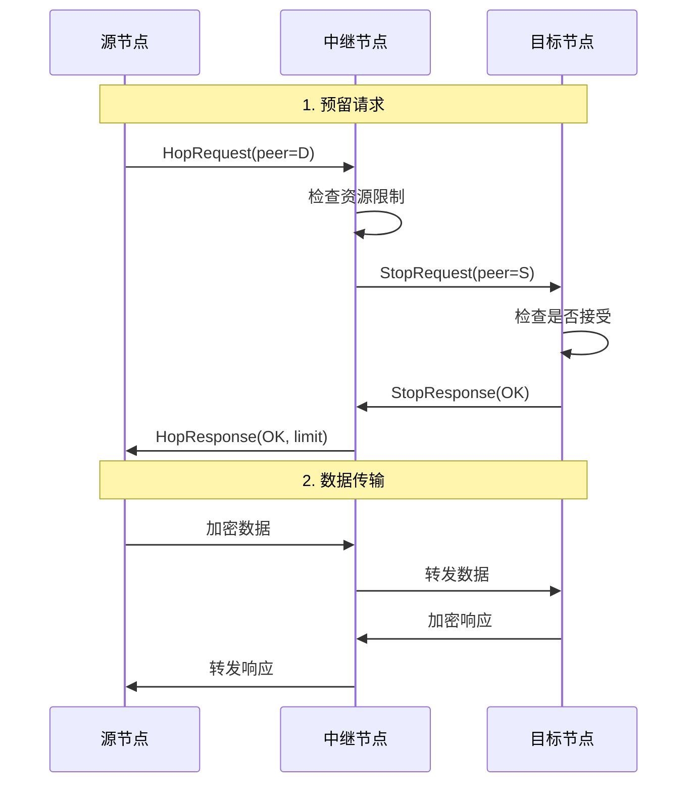
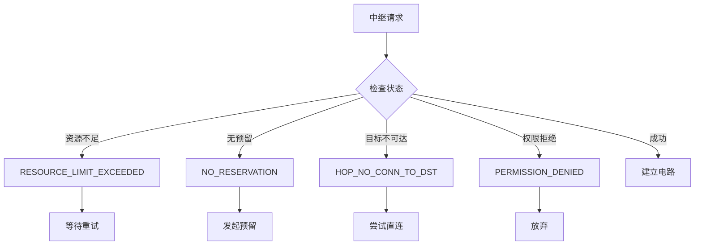
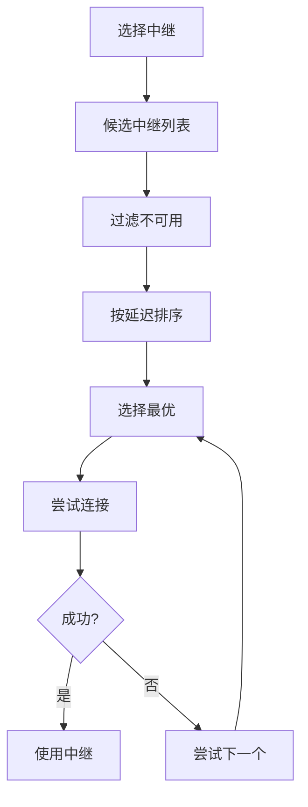

# 中继协议规范

本文档定义 DeP2P 中继（Relay）协议的格式、流程和实现细节。

---

## 概述

中继协议允许节点通过第三方中继节点进行通信，解决 NAT 穿透和防火墙问题。

### 协议信息（IMPL-1227 更新）

| 属性 | 值 |
|------|-----|
| System Relay 协议 ID | `/dep2p/sys/relay/1.0.0` |
| Realm Relay 协议 ID | `/dep2p/realm/<realmID>/relay/1.0.0` |
| 作用域 | Layer 1 (System) / Layer 2 (Realm) |
| Realm 验证 | System: 不需要 / Realm: 需要 PSK 验证 |
| 状态 | 稳定 |

### 分层中继架构（IMPL-1227）

```
┌─────────────────────────────────────────────────────────────────────────────────┐
│                          分层中继设计                                             │
├─────────────────────────────────────────────────────────────────────────────────┤
│                                                                                 │
│   ┌───────────────────────────────────────────────────────────────────────────┐ │
│   │  Layer 2: Realm Relay（业务中继）                                          │ │
│   │  ─────────────────────────────────────────────────────────────────────    │ │
│   │  • 服务范围: 仅同 Realm 成员                                               │ │
│   │  • 提供者:   Realm 成员自愿提供                                            │ │
│   │  • 协议白名单: /dep2p/app/<realmID>/*, /dep2p/realm/<realmID>/*           │ │
│   │  • 验证:     双方都需要 PSK 成员证明                                        │ │
│   │  • 限制:     由提供者配置                                                  │ │
│   └───────────────────────────────────────────────────────────────────────────┘ │
│                                                                                 │
│   ┌───────────────────────────────────────────────────────────────────────────┐ │
│   │  Layer 1: System Relay（系统中继）                                         │ │
│   │  ─────────────────────────────────────────────────────────────────────    │ │
│   │  • 服务范围: 全网任意节点                                                   │ │
│   │  • 提供者:   公共基础设施                                                   │ │
│   │  • 协议白名单: 仅 /dep2p/sys/*                                             │ │
│   │  • 验证:     无成员验证                                                    │ │
│   │  • 限制:     带宽 10KB/s，时长 60 秒                                        │ │
│   │  • 用途:     DHT、Bootstrap、NAT 探测、打洞协调                             │ │
│   └───────────────────────────────────────────────────────────────────────────┘ │
│                                                                                 │
│   ⚠️ 重要：System Relay 绝不转发业务消息（/dep2p/app/*）                          │
│                                                                                 │
└─────────────────────────────────────────────────────────────────────────────────┘
```

### 设计目标



| 目标 | 描述 |
|------|------|
| NAT 穿透 | 无需公网 IP 或端口映射 |
| 兜底连接 | 直连失败时的备选方案 |
| 透明传输 | 应用层无需感知中继 |
| 业务隔离 | 业务流量仅通过 Realm Relay（IMPL-1227）|

---

## 控制面/数据面边界（INV-003）

> **核心不变量**：System Relay MUST NOT 转发业务协议，Realm Relay MUST NOT 转发系统协议。
>
> 详见 [INV-003: 控制面/数据面分离](../../invariants/INV-003-control-data-separation.md)

### 边界定义

```
┌─────────────────────────────────────────────────────────────────────────────┐
│                    控制面/数据面边界                                          │
├─────────────────────────────────────────────────────────────────────────────┤
│                                                                              │
│   控制面（Control Plane）                                                    │
│   ─────────────────────────────────────────────────────────────────────────  │
│   承载方式：System Relay（Layer 1 公共基础设施）                              │
│   协议前缀：/dep2p/sys/*                                                     │
│   职责：打洞协调、地址验证、DHT 辅助、Bootstrap、NAT 探测                     │
│   限制：带宽 10KB/s，时长 60 秒                                              │
│                                                                              │
│   数据面（Data Plane）                                                       │
│   ─────────────────────────────────────────────────────────────────────────  │
│   承载方式：Realm Relay（Layer 2 成员自愿提供）                               │
│   协议前缀：/dep2p/app/<realmID>/*、/dep2p/realm/<realmID>/*                 │
│   职责：业务消息、PubSub、Stream、应用协议                                   │
│   要求：PSK 成员验证、配额控制、可观测                                       │
│                                                                              │
└─────────────────────────────────────────────────────────────────────────────┘
```

### 协议白名单/黑名单

| 协议前缀 | 分类 | System Relay | Realm Relay | 说明 |
|----------|------|--------------|-------------|------|
| `/dep2p/sys/ping/*` | 控制面 | ✅ 允许 | ❌ 禁止 | 心跳检测 |
| `/dep2p/sys/id/*` | 控制面 | ✅ 允许 | ❌ 禁止 | 身份识别 |
| `/dep2p/sys/kad/*` | 控制面 | ✅ 允许 | ❌ 禁止 | DHT 路由 |
| `/dep2p/sys/holepunch/*` | 控制面 | ✅ 允许 | ❌ 禁止 | 打洞协调 |
| `/dep2p/sys/relay/*` | 控制面 | ✅ 允许 | ❌ 禁止 | 中继控制 |
| `/dep2p/app/<realmID>/*` | 数据面 | ❌ 禁止 | ✅ 允许 | 应用协议 |
| `/dep2p/realm/<realmID>/*` | 数据面 | ❌ 禁止 | ✅ 允许 | Realm 协议 |

### 验证逻辑

```go
// System Relay 协议验证（控制面）
func (r *SystemRelay) validateProtocol(proto types.ProtocolID) error {
    if !strings.HasPrefix(string(proto), "/dep2p/sys/") {
        return ErrProtocolNotAllowed // 禁止转发业务协议
    }
    return nil
}

// Realm Relay 协议验证（数据面）
func (r *RealmRelay) validateProtocol(proto types.ProtocolID) error {
    appPrefix := fmt.Sprintf("/dep2p/app/%s/", r.realmID)
    realmPrefix := fmt.Sprintf("/dep2p/realm/%s/", r.realmID)
    
    p := string(proto)
    if !strings.HasPrefix(p, appPrefix) && !strings.HasPrefix(p, realmPrefix) {
        return ErrProtocolNotAllowed // 禁止转发其他 Realm 或系统协议
    }
    return nil
}
```

### 错误处理

| 场景 | 错误码 | 处理 |
|------|--------|------|
| System Relay 收到 `/dep2p/app/*` | `ErrProtocolNotAllowed` | 拒绝，记录日志 |
| Realm Relay 收到 `/dep2p/sys/*` | `ErrProtocolNotAllowed` | 拒绝，记录日志 |
| Realm Relay 收到其他 Realm 协议 | `ErrProtocolNotAllowed` | 拒绝，记录日志 |
| Realm Relay 成员验证失败 | `ErrNotMember` | 拒绝，记录日志 |

---

## 协议角色

### 三种角色



| 角色 | 描述 |
|------|------|
| 中继节点（Relay） | 提供转发服务的公网节点 |
| 源节点（Source） | 发起连接请求的节点 |
| 目标节点（Destination） | 被连接的节点 |

---

## 中继地址

### 地址格式

中继地址使用 `p2p-circuit` 协议：

```
/ip4/<relay-ip>/udp/<port>/quic-v1/p2p/<relay-id>/p2p-circuit/p2p/<target-id>
```

### 示例

```
# 通过 Relay 连接到 Target
/ip4/203.0.113.1/udp/4001/quic-v1/p2p/12D3KooWRelay.../p2p-circuit/p2p/12D3KooWTarget...
```

### 地址解析



---

## 消息格式

> **重要**：DeP2P 中继协议使用**自定义二进制格式**而非 protobuf，以降低依赖复杂度。
> 所有多字节整数使用**大端序（Big-Endian）**。

### 消息类型常量

| 常量 | 值 | 用途 |
|------|-----|------|
| `MsgTypeReserve` | 1 | 预留请求 |
| `MsgTypeReserveOK` | 2 | 预留成功响应 |
| `MsgTypeReserveError` | 3 | 预留失败响应 |
| `MsgTypeConnect` | 4 | 连接请求（CONNECT/HOP）|
| `MsgTypeConnectOK` | 5 | 连接成功响应 |
| `MsgTypeConnectError` | 6 | 连接失败响应 |

### RESERVE 请求格式

| 字段 | 偏移 | 字节 | 类型 | 说明 |
|------|------|------|------|------|
| MsgType | 0 | 1 | uint8 | 值=1 (MsgTypeReserve) |
| Version | 1 | 1 | uint8 | 协议版本（当前=1）|
| TTL | 2 | 4 | uint32 | 请求的预留时长（秒）|

**总长度**：6 字节

### RESERVE 成功响应格式

| 字段 | 偏移 | 字节 | 类型 | 说明 |
|------|------|------|------|------|
| MsgType | 0 | 1 | uint8 | 值=2 (MsgTypeReserveOK) |
| Version | 1 | 1 | uint8 | 协议版本 |
| TTL | 2 | 4 | uint32 | 实际预留时长（秒）|
| Slots | 6 | 2 | uint16 | 分配的槽位数 |
| AddrCount | 8 | 1 | uint8 | 中继地址数量 |
| Addrs | 9 | 变长 | []string | 中继地址列表（每个地址前 2 字节长度）|

### CONNECT 请求格式（IMPL-1227 v2）

> **版本历史**：
> - Version 1（已废弃）：仅 34 字节，无协议字段
> - Version 2（当前）：36+ 字节，支持协议白名单

| 字段 | 偏移 | 字节 | 类型 | 说明 |
|------|------|------|------|------|
| MsgType | 0 | 1 | uint8 | 值=4 (MsgTypeConnect) |
| Version | 1 | 1 | uint8 | 协议版本（当前=1）|
| DestPeer | 2 | 32 | [32]byte | 目标节点 ID |
| ProtoLen | 34 | 2 | uint16 | 协议长度（0=无协议检查）|
| Protocol | 36 | N | string | 目标协议（可选，用于白名单检查）|

**最小长度**：36 字节（ProtoLen=0 时）

**协议字段用途**（IMPL-1227）：
- System Relay：检查是否为 `/dep2p/sys/*` 协议
- Realm Relay：检查是否为本 Realm 协议（`/dep2p/app/<realmID>/*`）

### CONNECT 成功响应格式

| 字段 | 偏移 | 字节 | 类型 | 说明 |
|------|------|------|------|------|
| MsgType | 0 | 1 | uint8 | 值=5 (MsgTypeConnectOK) |
| Version | 1 | 1 | uint8 | 协议版本 |

**总长度**：2 字节

### CONNECT 失败响应格式

| 字段 | 偏移 | 字节 | 类型 | 说明 |
|------|------|------|------|------|
| MsgType | 0 | 1 | uint8 | 值=6 (MsgTypeConnectError) |
| Version | 1 | 1 | uint8 | 协议版本 |
| ErrCode | 2 | 2 | uint16 | 错误码 |

**错误码定义**：

| 错误码 | 含义 |
|--------|------|
| 100 | 请求格式错误（`ErrCodeMalformed`） |
| 200 | 资源限制（`ErrCodeResourceLimit`） |
| 201 | 无预留（`ErrCodeNoReservation`） |
| 300 | 连接到目标失败（`ErrCodeConnectFailed`） |
| 401 | 权限错误 / PSK 验证失败（`ErrCodePermission`） |
| 402 | 协议不允许（`ErrCodeProtocolNotAllowed`） |

---

## 参考：Protobuf 格式（libp2p 兼容，未采用）

> 以下为 libp2p relay v2 的 protobuf 格式定义，**DeP2P 未采用此格式**，
> 仅供参考兼容性讨论。

```protobuf
// libp2p relay v2 格式（未采用）
enum MessageType {
    HOP_REQUEST = 0;
    HOP_RESPONSE = 1;
    STOP_REQUEST = 2;
    STOP_RESPONSE = 3;
    STATUS = 4;
}

message HopRequest {
    bytes peer_id = 1;
    Reservation reservation = 2;
}

message Reservation {
    uint64 duration = 1;
    uint64 data = 2;
}
```

---

## 连接流程

### 建立电路



### 流程详解

1. **预留请求**: 源节点向中继请求连接目标
2. **资源检查**: 中继检查配额和限制
3. **通知目标**: 中继通知目标节点
4. **目标确认**: 目标决定是否接受
5. **建立电路**: 返回成功，开始转发
6. **数据传输**: 双向透明转发

---

## 中继节点

### 配置

```go
// 中继服务配置
type RelayConfig struct {
    // 是否启用中继服务
    Enabled bool
    
    // 资源限制
    Limits RelayLimits
    
    // 访问控制
    ACL *RelayACL
}

type RelayLimits struct {
    // 最大并发电路
    MaxCircuits int
    
    // 每个源的最大电路
    MaxCircuitsPerPeer int
    
    // 电路最大时长
    MaxDuration time.Duration
    
    // 电路最大数据量
    MaxData int64
    
    // 预留时长
    ReservationTTL time.Duration
}

// 默认配置
var DefaultRelayLimits = RelayLimits{
    MaxCircuits:        128,
    MaxCircuitsPerPeer: 4,
    MaxDuration:        2 * time.Minute,
    MaxData:            1 << 20, // 1MB
    ReservationTTL:     1 * time.Hour,
}
```

### 启动中继服务

```go
// 启用中继服务
func EnableRelayService(node dep2p.Node, config *RelayConfig) error {
    relay, err := relay.New(node, config)
    if err != nil {
        return err
    }
    
    return relay.Start()
}

// 中继服务实现
type RelayService struct {
    host     host.Host
    config   *RelayConfig
    circuits map[string]*Circuit
    mu       sync.RWMutex
}

func (r *RelayService) handleHopRequest(s network.Stream) {
    defer s.Close()
    
    // 读取请求
    var req pb.HopRequest
    if err := readMsg(s, &req); err != nil {
        return
    }
    
    // 检查限制
    if err := r.checkLimits(req); err != nil {
        writeStatus(s, pb.StatusCode_RESOURCE_LIMIT_EXCEEDED)
        return
    }
    
    // 通知目标
    destID := peer.ID(req.PeerId)
    if err := r.notifyDestination(s.Conn().RemotePeer(), destID); err != nil {
        writeStatus(s, pb.StatusCode_NO_RESERVATION)
        return
    }
    
    // 创建电路
    circuit := r.createCircuit(s.Conn().RemotePeer(), destID)
    
    // 返回成功
    writeMsg(s, &pb.HopResponse{
        Status: pb.StatusCode_OK,
        Limit:  circuit.Limit(),
    })
}
```

---

## 客户端使用

### RelayClient 接口（IMPL-1227）

```go
type RelayClient interface {
    // Connect 通过中继连接到目标节点
    // 建立透明双向隧道，不进行协议白名单检查
    Connect(ctx context.Context, relay, dest types.NodeID) (transport.Conn, error)
    
    // ConnectWithProtocol 通过中继连接（支持协议预检查）
    // protocol 非空时，Server 会检查该协议是否在白名单中：
    //   - System Relay：只允许 /dep2p/sys/* 协议
    //   - Realm Relay：只允许本 Realm 协议
    // protocol 为空时，等同于 Connect（跳过检查）
    ConnectWithProtocol(ctx context.Context, relay, dest types.NodeID, protocol types.ProtocolID) (transport.Conn, error)
    
    // Reserve 在中继服务器预留资源
    Reserve(ctx context.Context, relay types.NodeID) (Reservation, error)
    
    // ...其他方法
}
```

**设计说明**：
- Relay 建立的是**透明双向隧道**，具体协议协商在 stream 建立后才发生
- CONNECT 请求中的 `Protocol` 字段是**可选的预检查**（ProtoLen=0 表示不检查）
- 大多数场景使用 `Connect`（跳过检查），只有需要严格验证时才用 `ConnectWithProtocol`

### 自动中继

DeP2P 支持自动中继发现和使用：

```go
// 启用自动中继
node, err := dep2p.NewNode(
    dep2p.WithAutoRelay(true),
    dep2p.WithRelayReservation(true),
)
```

### 手动指定中继

```go
// 手动添加中继
relayAddr, _ := multiaddr.NewMultiaddr(
    "/ip4/203.0.113.1/udp/4001/quic-v1/p2p/12D3KooWRelay...",
)
node.AddRelay(relayAddr)

// 通过中继连接
targetAddr, _ := multiaddr.NewMultiaddr(
    "/p2p/12D3KooWRelay.../p2p-circuit/p2p/12D3KooWTarget...",
)
err := node.Connect(ctx, targetAddr)
```

### 地址广播

```go
// 获取包含中继的可分享地址
addrs := node.ShareableAddrs()
// 可能返回:
// - /ip4/1.2.3.4/udp/4001/quic-v1/p2p/self
// - /ip4/relay.../p2p/relay.../p2p-circuit/p2p/self
```

---

## 错误处理

### 状态码

```protobuf
enum StatusCode {
    OK = 100;
    MALFORMED_MESSAGE = 400;
    UNEXPECTED_MESSAGE = 401;
    HOP_DST_ADDR_TOO_LONG = 402;
    HOP_DST_MULTIADDR_INVALID = 403;
    HOP_NO_CONN_TO_DST = 404;
    HOP_CANT_DIAL_DST = 405;
    HOP_CANT_OPEN_DST_STREAM = 406;
    RESOURCE_LIMIT_EXCEEDED = 201;
    PERMISSION_DENIED = 202;
    NO_RESERVATION = 203;
    CONNECTION_FAILED = 204;
}
```

### 错误处理流程



---

## 安全考虑

### 资源保护

1. **速率限制**: 限制每个节点的请求频率
2. **配额管理**: 限制单个电路的数据量和时长
3. **白名单**: 可选的访问控制列表

### 访问控制

```go
// 中继访问控制
type RelayACL struct {
    // 允许列表（为空则允许所有）
    AllowList []peer.ID
    
    // 拒绝列表
    DenyList []peer.ID
    
    // 是否需要预留
    RequireReservation bool
}

func (acl *RelayACL) Check(peerID peer.ID) bool {
    // 检查拒绝列表
    for _, denied := range acl.DenyList {
        if peerID == denied {
            return false
        }
    }
    
    // 如果允许列表为空，允许所有
    if len(acl.AllowList) == 0 {
        return true
    }
    
    // 检查允许列表
    for _, allowed := range acl.AllowList {
        if peerID == allowed {
            return true
        }
    }
    
    return false
}
```

---

## 性能考虑

### 优化策略

1. **直连优先**: 中继仅作为兜底方案
2. **就近中继**: 选择延迟最低的中继节点
3. **电路复用**: 同一对节点复用电路
4. **升级直连**: 建立电路后尝试打洞直连

### 中继选择



---

## 部署模型（ADR-0005）

> **核心原则**：DeP2P 作为库，提供单实例 Relay 能力；多实例协调属于产品级部署，超出库的边界。
>
> 详见 [ADR-0005: Relay 部署模型分级](../../adr/0005-relay-deployment-models.md)

### 三级部署模型

```
┌─────────────────────────────────────────────────────────────────────────────┐
│                          Relay 部署模型分级                                  │
├─────────────────────────────────────────────────────────────────────────────┤
│                                                                              │
│   Tier 1: 单点自托管                                                        │
│   ─────────────────────────────────────────────────────────────────────────  │
│   • 单个 Relay 实例，无需协调                                               │
│   • 适用于小型 Realm (<100 节点) 或开发测试                                 │
│   • 支持状态：✅ 当前完全支持                                               │
│                                                                              │
│   Tier 2: 同 Realm 多中继                                                   │
│   ─────────────────────────────────────────────────────────────────────────  │
│   • 同一 Realm 内多个独立 Relay，客户端自行选择                              │
│   • 每个实例独立运行，无状态共享                                             │
│   • 支持状态：✅ 当前支持（但无协调）                                        │
│                                                                              │
│   Tier 3: 跨地域分布式集群                                                  │
│   ─────────────────────────────────────────────────────────────────────────  │
│   • 多实例共享状态、reservation 协调、全局限流                               │
│   • 需要分布式系统工程（etcd/Redis/Gossip 等）                               │
│   • 支持状态：❌ 超出 DeP2P 边界，需自行实现                                 │
│                                                                              │
└─────────────────────────────────────────────────────────────────────────────┘
```

### 能力边界

| 能力 | Tier 1 | Tier 2 | Tier 3 (自建) |
|------|--------|--------|--------------|
| Reservation 管理 | ✅ 内存 | ✅ 各实例独立 | 需自行同步 |
| 连接限流 | ✅ | ⚠️ 各实例独立 | 需分布式限流 |
| 高可用 | ❌ 单点故障 | ⚠️ 客户端切换 | 需自行实现 |
| 水平扩展 | ❌ | ✅ 独立扩展 | 需自行实现 |
| 全局统计 | ✅ | ❌ 需自行聚合 | 需自行实现 |

### 部署选择指引

```
我需要什么?
├─ 小型 Realm (<100 节点) / 开发测试 → Tier 1
├─ 中型 Realm (100-1000 节点) / 基本高可用 → Tier 2
└─ 大型 Realm (>1000 节点) / 全局限流/计费 → Tier 3 (自建)
```

> **详细部署指南**：[Relay 部署模型指南](../../../docs/zh/how-to/relay-deployment-models.md)

---

## 实现参考

### 代码位置

| 组件 | 路径 |
|------|------|
| 协议 ID | `pkg/protocolids/sys.go` |
| 中继服务 | `internal/core/relay/service.go` |
| 中继客户端 | `internal/core/relay/client.go` |
| 消息定义 | `pkg/proto/relay/relay.proto` |
| 测试 | `internal/core/relay/*_test.go` |

---

## 相关文档

- [NAT 穿透协议](../network/nat.md)
- [地址协议](../foundation/addressing.md)
- [协议索引](../README.md)
- [ADR-0005: Relay 部署模型分级](../../adr/0005-relay-deployment-models.md)
- [Relay 部署模型指南](../../../docs/zh/how-to/relay-deployment-models.md)
