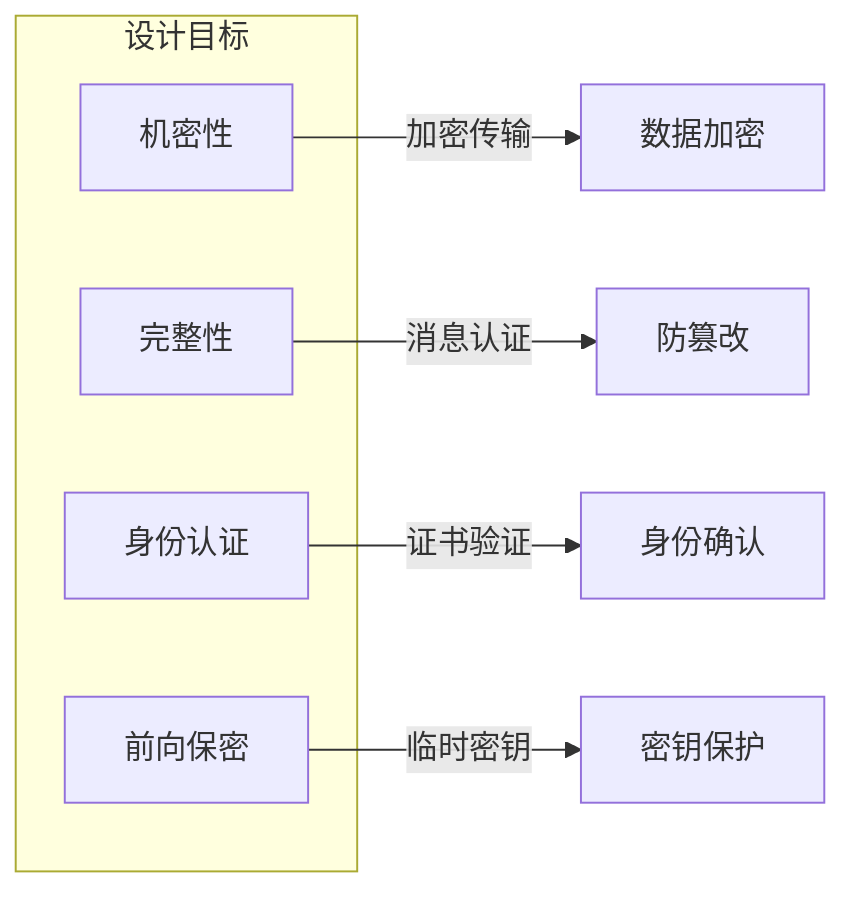
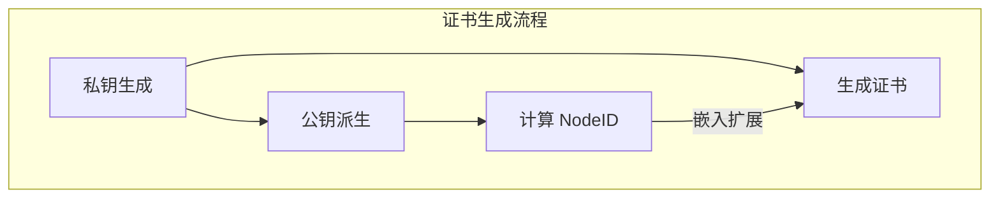
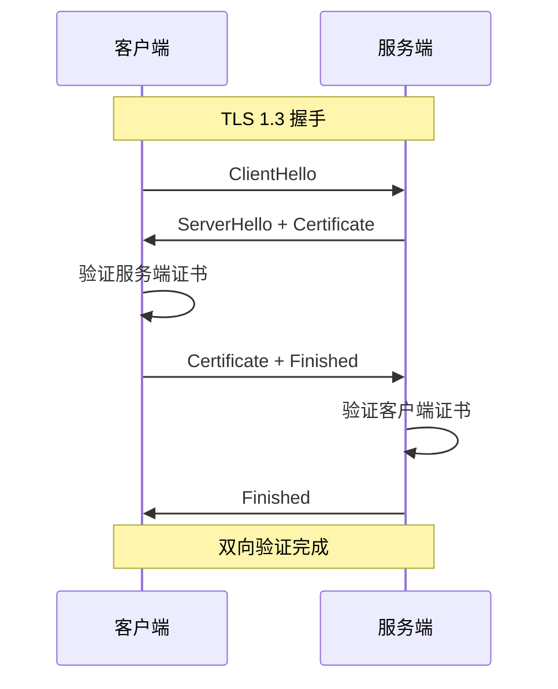
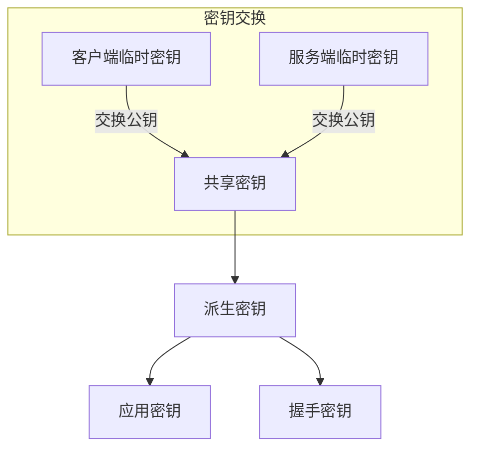
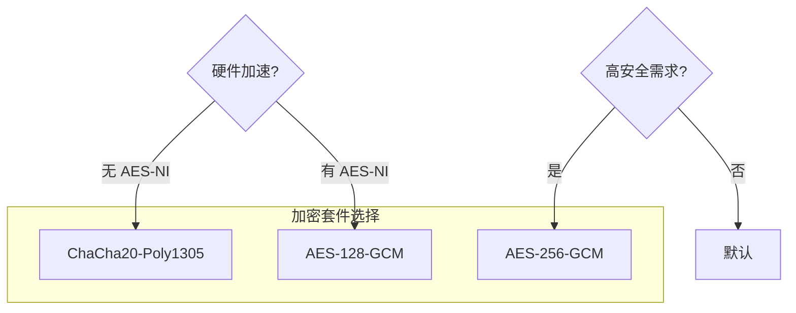
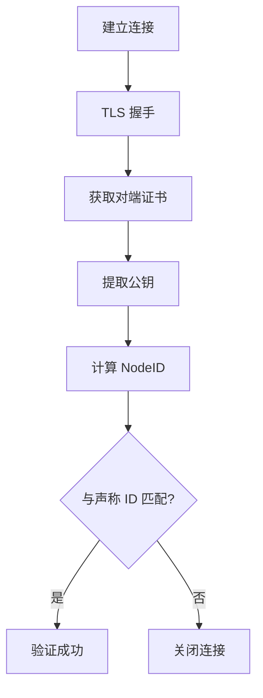
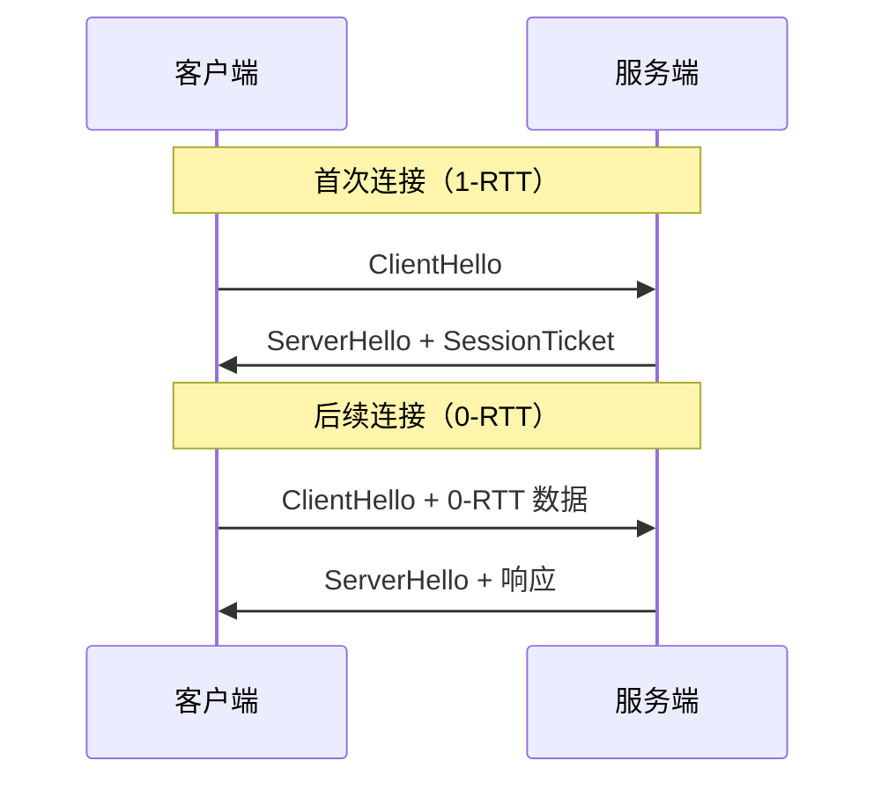
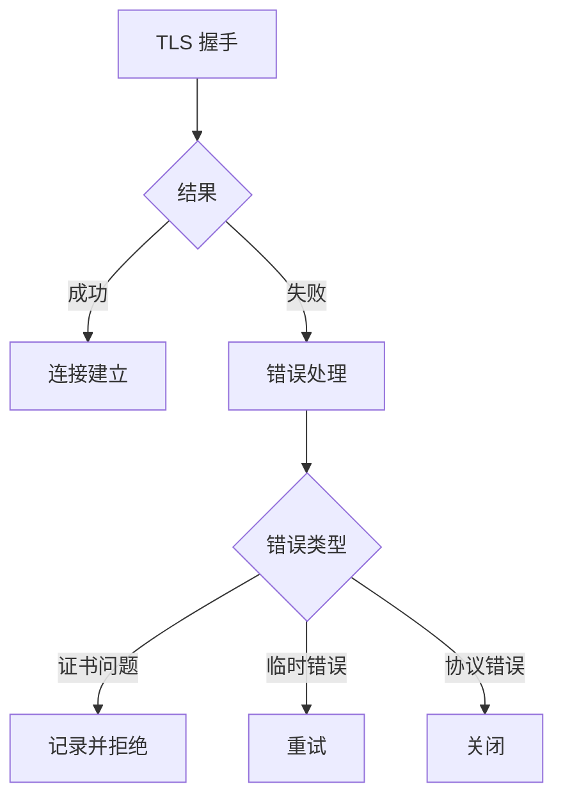

# 安全协议规范

本文档定义 DeP2P 安全协议的格式、握手流程和加密规范。

---

## 概述

DeP2P 基于 QUIC 的 TLS 1.3 提供端到端加密，确保通信的机密性、完整性和身份认证。

### 设计目标



| 目标 | 描述 |
|------|------|
| 机密性 | 所有数据加密传输 |
| 完整性 | 消息不可篡改 |
| 身份认证 | 验证对端身份 |
| 前向保密 | 泄露密钥不影响历史数据 |

---

## TLS 1.3 配置

### 证书生成

DeP2P 使用自签名证书，NodeID 嵌入证书：



### 代码示例

```go
import (
    "crypto/ed25519"
    "crypto/tls"
    "crypto/x509"
)

// 生成 DeP2P TLS 证书
func GenerateTLSCert(privKey ed25519.PrivateKey) (*tls.Certificate, error) {
    // 创建证书模板
    template := &x509.Certificate{
        SerialNumber: big.NewInt(1),
        Subject: pkix.Name{
            CommonName: "dep2p-node",
        },
        NotBefore:   time.Now(),
        NotAfter:    time.Now().Add(24 * 365 * time.Hour), // 1年
        KeyUsage:    x509.KeyUsageDigitalSignature,
        ExtKeyUsage: []x509.ExtKeyUsage{
            x509.ExtKeyUsageClientAuth,
            x509.ExtKeyUsageServerAuth,
        },
    }
    
    // 添加 NodeID 扩展
    nodeID := ComputeNodeID(privKey.Public().(ed25519.PublicKey))
    template.ExtraExtensions = []pkix.Extension{
        {
            Id:       oidNodeID,
            Critical: true,
            Value:    nodeID.Bytes(),
        },
    }
    
    // 自签名
    certDER, err := x509.CreateCertificate(
        rand.Reader, template, template, privKey.Public(), privKey,
    )
    if err != nil {
        return nil, err
    }
    
    return &tls.Certificate{
        Certificate: [][]byte{certDER},
        PrivateKey:  privKey,
    }, nil
}
```

### TLS 配置

```go
// 服务端 TLS 配置
func ServerTLSConfig(cert *tls.Certificate) *tls.Config {
    return &tls.Config{
        Certificates: []tls.Certificate{*cert},
        ClientAuth:   tls.RequireAnyClientCert,
        MinVersion:   tls.VersionTLS13,
        NextProtos:   []string{"dep2p"},
        
        // 自定义验证
        VerifyPeerCertificate: verifyPeerCert,
    }
}

// 客户端 TLS 配置
func ClientTLSConfig(cert *tls.Certificate) *tls.Config {
    return &tls.Config{
        Certificates:       []tls.Certificate{*cert},
        InsecureSkipVerify: true, // 使用自定义验证
        MinVersion:         tls.VersionTLS13,
        NextProtos:         []string{"dep2p"},
        
        // 自定义验证
        VerifyPeerCertificate: verifyPeerCert,
    }
}
```

---

## 证书验证

### 验证流程



### 验证规则

```go
// 验证对端证书
func verifyPeerCert(rawCerts [][]byte, _ [][]*x509.Certificate) error {
    if len(rawCerts) == 0 {
        return errors.New("no certificate provided")
    }
    
    cert, err := x509.ParseCertificate(rawCerts[0])
    if err != nil {
        return fmt.Errorf("invalid certificate: %w", err)
    }
    
    // 1. 验证证书时间
    now := time.Now()
    if now.Before(cert.NotBefore) || now.After(cert.NotAfter) {
        return errors.New("certificate expired or not yet valid")
    }
    
    // 2. 验证签名算法
    if !isAllowedSignatureAlgorithm(cert.SignatureAlgorithm) {
        return errors.New("unsupported signature algorithm")
    }
    
    // 3. 提取并验证 NodeID
    nodeID, err := extractNodeID(cert)
    if err != nil {
        return fmt.Errorf("invalid NodeID extension: %w", err)
    }
    
    // 4. 验证 NodeID 与公钥匹配
    expectedID := ComputeNodeID(cert.PublicKey)
    if nodeID != expectedID {
        return errors.New("NodeID mismatch")
    }
    
    return nil
}
```

### NodeID 扩展

```go
// NodeID 扩展 OID
var oidNodeID = asn1.ObjectIdentifier{1, 3, 6, 1, 4, 1, 99999, 1, 1}

// 从证书提取 NodeID
func extractNodeID(cert *x509.Certificate) (peer.ID, error) {
    for _, ext := range cert.Extensions {
        if ext.Id.Equal(oidNodeID) {
            return peer.IDFromBytes(ext.Value)
        }
    }
    return "", errors.New("NodeID extension not found")
}
```

---

## 密钥交换

### ECDHE 密钥交换

QUIC/TLS 1.3 使用椭圆曲线 Diffie-Hellman：



### 支持的曲线

| 曲线 | 安全强度 | 推荐 |
|------|----------|------|
| X25519 | 128 bit | 推荐 |
| P-256 | 128 bit | 支持 |
| P-384 | 192 bit | 支持 |

### 配置示例

```go
// 配置支持的曲线
config := &tls.Config{
    CurvePreferences: []tls.CurveID{
        tls.X25519,
        tls.CurveP256,
    },
}
```

---

## 加密套件

### TLS 1.3 套件

DeP2P 支持以下加密套件：

| 套件 | 加密 | 散列 |
|------|------|------|
| TLS_AES_128_GCM_SHA256 | AES-128-GCM | SHA-256 |
| TLS_AES_256_GCM_SHA384 | AES-256-GCM | SHA-384 |
| TLS_CHACHA20_POLY1305_SHA256 | ChaCha20-Poly1305 | SHA-256 |

### 套件选择



---

## 身份绑定

### NodeID 计算

NodeID 从公钥派生，确保身份与密钥绑定：

```go
// 从公钥计算 NodeID
func ComputeNodeID(pubKey crypto.PublicKey) peer.ID {
    // 编码公钥
    pubKeyBytes, _ := x509.MarshalPKIXPublicKey(pubKey)
    
    // 计算多重哈希
    mh, _ := multihash.Sum(pubKeyBytes, multihash.SHA2_256, -1)
    
    // 生成 NodeID
    return peer.ID(mh)
}
```

### 身份验证流程



---

## 会话恢复

### 0-RTT 恢复

TLS 1.3 支持 0-RTT 会话恢复：



### 安全考虑

0-RTT 数据存在重放风险，只用于幂等操作：

```go
// 0-RTT 配置
config := &tls.Config{
    // 启用 0-RTT
    SessionTicketsDisabled: false,
}

// QUIC 配置
quicConfig := &quic.Config{
    Allow0RTT: true,
}
```

---

## 错误处理

### TLS 告警

| 告警 | 描述 | 处理方式 |
|------|------|----------|
| `bad_certificate` | 证书无效 | 关闭连接 |
| `certificate_expired` | 证书过期 | 关闭连接 |
| `unknown_ca` | 未知 CA | 使用自定义验证 |
| `handshake_failure` | 握手失败 | 重试或关闭 |
| `protocol_version` | 版本不支持 | 降级或关闭 |

### 错误处理流程



---

## 安全建议

### 密钥管理

1. **私钥保护**: 使用安全存储，限制访问
2. **定期轮换**: 定期更新证书
3. **备份机制**: 安全备份私钥

### 证书管理

1. **有效期**: 设置合理的证书有效期
2. **撤销机制**: 支持证书撤销（可选）
3. **监控告警**: 证书即将过期时告警

### 配置建议

```go
// 安全配置示例
func SecureTLSConfig(cert *tls.Certificate) *tls.Config {
    return &tls.Config{
        Certificates: []tls.Certificate{*cert},
        MinVersion:   tls.VersionTLS13,  // 仅 TLS 1.3
        
        // 首选曲线
        CurvePreferences: []tls.CurveID{
            tls.X25519,
            tls.CurveP256,
        },
        
        // 禁用不安全选项
        Renegotiation:      tls.RenegotiateNever,
        InsecureSkipVerify: false,
        
        // 自定义验证
        VerifyPeerCertificate: verifyPeerCert,
    }
}
```

---

## 实现参考

### 代码位置

| 组件 | 路径 |
|------|------|
| TLS 配置 | `internal/core/security/tls.go` |
| 证书生成 | `internal/core/security/cert.go` |
| 验证逻辑 | `internal/core/security/verify.go` |
| 测试 | `internal/core/security/*_test.go` |

### 依赖库

- `crypto/tls`（标准库）
- `crypto/x509`（标准库）
- `github.com/quic-go/quic-go`

---

## 相关文档

- [身份协议](../foundation/identity.md)
- [QUIC 传输](quic.md)
- [协议索引](../README.md)
