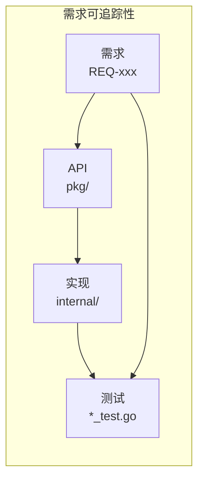
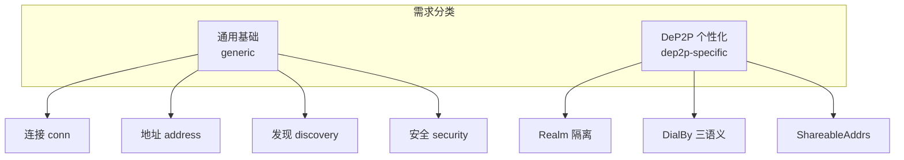
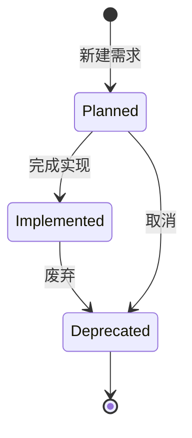
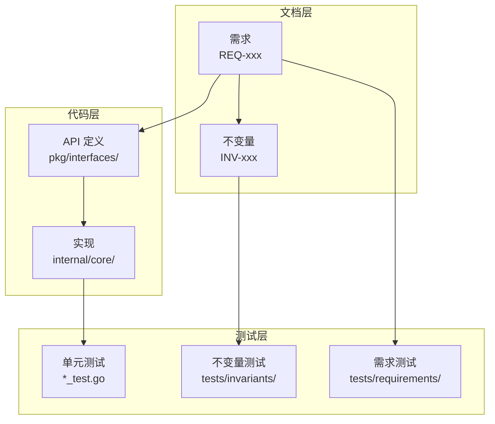

# 需求管理说明

本目录包含 DeP2P 项目的需求规范文档。

---

## 概述

需求规范的目标是确保每个需求：

- **可测试**：有明确的验收标准
- **可追踪**：从需求到实现到测试有完整的证据链
- **唯一编号**：每个需求有唯一的 REQ-xxx 编号



---

## 需求分类



### 通用基础（generic）

作为 P2P 网络库应具备的通用能力：

| 分类 | 说明 |
|------|------|
| `conn` | 连接管理 |
| `address` | 地址管理 |
| `discovery` | 节点发现 |
| `bootstrap` | 引导机制 |
| `relay_nat` | 中继和 NAT |
| `security` | 安全机制 |
| `observability_ops` | 可观测性和运维 |
| `resource_governance` | 资源治理 |

### DeP2P 个性化（dep2p-specific）

本项目独特的设计决策：

| 特性 | 说明 |
|------|------|
| Realm 隔离 | 业务隔离租户 |
| DialBy 三语义 | 连接语义分流 |
| ShareableAddrs | 只返回 VerifiedDirect |

---

## 需求结构

每个需求条目必须包含以下信息：

```yaml
id: REQ-CONN-001
title: 用户可预测的连接语义
type: dep2p-specific          # generic 或 dep2p-specific
priority: P0                   # P0/P1/P2
audience: [facade, endpoint]   # 受众
category: conn                 # 分类
status: implemented            # 状态
spec: REQ-CONN-001.md          # 规范文档
inv_refs: [INV-001, INV-002]   # 关联不变量
api_refs:                      # API 引用
  - file: node.go
    symbol: Node.Connect
impl_refs:                     # 实现引用
  - file: internal/core/endpoint/endpoint_impl.go
verify_tests:                  # 验证测试（implemented 必填）
  - file: tests/xxx_test.go
    test: TestXxx
gap: ""                        # 缺口说明（planned 必填）
```

---

## 编号体系

### 需求编号格式

```
REQ-<类别>-<编号>
```

| 类别 | 说明 | 示例 |
|------|------|------|
| CONN | 连接相关 | REQ-CONN-001 |
| ADDR | 地址相关 | REQ-ADDR-001 |
| DISC | 发现相关 | REQ-DISC-001 |
| BOOT | 引导相关 | REQ-BOOT-001 |
| RELAY | 中继/NAT | REQ-RELAY-001 |
| SEC | 安全相关 | REQ-SEC-001 |
| OPS | 可观测性 | REQ-OPS-001 |
| RES | 资源治理 | REQ-RES-001 |
| REALM | Realm 相关 | REQ-REALM-001 |

### 编号规则

- 编号从 001 开始
- 编号递增，不重用
- 废弃的需求保留编号

---

## 需求状态



| 状态 | 说明 | 必填字段 |
|------|------|----------|
| `planned` | 规划中 | `gap`（缺口说明） |
| `implemented` | 已实现 | `verify_tests`（测试证据） |
| `deprecated` | 已废弃 | `reason`（废弃原因） |

---

## 优先级

| 优先级 | 说明 | 处理方式 |
|--------|------|----------|
| **P0** | 关键路径 | 必须完成，阻塞用户路径 |
| **P1** | 重要功能 | 应该完成，影响用户体验 |
| **P2** | 可选功能 | 可以推迟，不影响核心功能 |

---

## 受众

| 受众 | 说明 |
|------|------|
| `facade` | 面向用户的高层 API（Node） |
| `endpoint` | 底层端点 API（Endpoint） |
| `ops` | 运维和诊断 |

---

## 需求追踪



### 追踪链示例

```
REQ-CONN-001: 用户可预测的连接语义
├── API: pkg/dep2p/node.go#Node.Connect
├── 实现: internal/core/endpoint/endpoint_impl.go
├── 不变量: INV-001, INV-002, INV-004
└── 测试: tests/invariants/inv_004_connection_semantics_test.go
```

---

## 需求索引

所有需求在 [index.yaml](index.yaml) 中索引：

```yaml
requirements:
  - id: REQ-CONN-001
    title: 用户可预测的连接语义
    status: implemented
    spec: REQ-CONN-001.md
    # ...
```

---

## 需求模板

创建新需求时，使用以下模板：

```markdown
# REQ-<类别>-<编号>: <标题>

## 元数据

| 属性 | 值 |
|------|---|
| **ID** | REQ-xxx-xxx |
| **优先级** | P0/P1/P2 |
| **状态** | planned/implemented |
| **类型** | generic/dep2p-specific |
| **受众** | facade/endpoint/ops |

---

## 需求描述

一句话描述需求。

---

## 背景和动机

为什么需要这个需求？解决什么问题？

---

## 需求详情

### 功能要求

1. 要求 1
2. 要求 2

### 错误处理

1. 错误场景 1 → 返回 ErrXxx
2. 错误场景 2 → 返回 ErrYyy

---

## 验收标准

- [ ] 标准 1
- [ ] 标准 2
- [ ] 标准 3

---

## 关联文档

| 类型 | 链接 |
|------|------|
| 不变量 | INV-xxx |
| API | pkg/xxx |
| 实现 | internal/xxx |
| 测试 | tests/xxx |
```

---

## 当前需求

| ID | 标题 | 优先级 | 状态 |
|----|------|--------|------|
| [REQ-CONN-001](REQ-CONN-001.md) | 用户可预测的连接语义 | P0 | 📋 planned |
| [REQ-REALM-001](REQ-REALM-001.md) | Realm 强制隔离 | P0 | 📋 planned |

---

## 相关文档

- [设计文档导航](../README.md)
- [系统不变量](../invariants/README.md)
- [测试追踪](../testing/README.md)
