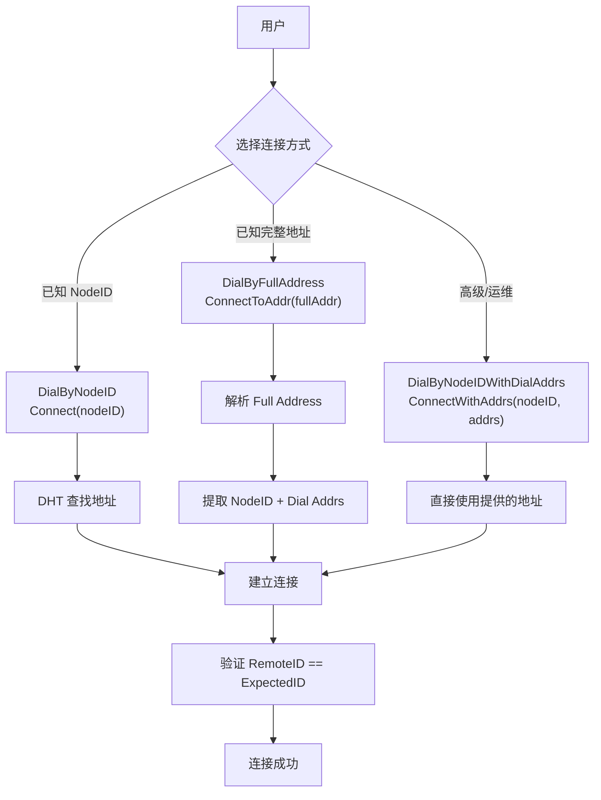
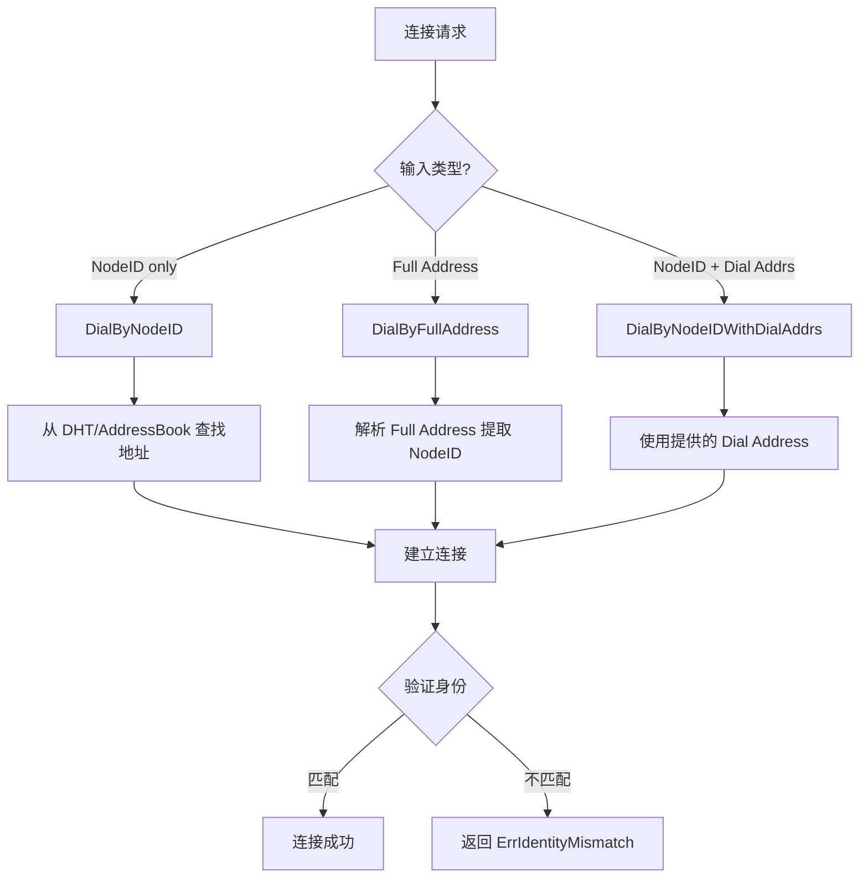

# REQ-CONN-001: 用户可预测的连接语义

## 元数据

| 属性 | 值 |
|------|---|
| **ID** | REQ-CONN-001 |
| **优先级** | P0 |
| **状态** | 📋 planned |
| **类型** | dep2p-specific |
| **受众** | facade, endpoint |
| **分类** | conn |

---

## 需求描述

用户应该能够通过明确的 API 选择连接语义，连接行为应可预测、可解释。

---

## 背景和动机

传统网络库的连接 API 通常接受 IP:Port 地址，这导致：

1. **身份不可验证**：无法确认对方身份
2. **连接目标模糊**：连接的是地址还是节点？
3. **行为不可预测**：地址变化后连接行为不明确

DeP2P 采用"身份第一性"原则，明确区分三种连接语义：

```
┌─────────────────────────────────────────────────────────────────────────────┐
│                    身份第一性原则                                            │
├─────────────────────────────────────────────────────────────────────────────┤
│                                                                              │
│   传统方式: connect("192.168.1.100:4001")  // 连接到地址（无身份保证）       │
│   DeP2P:    connect(nodeID)                 // 连接到身份（自动查找地址）    │
│                                                                              │
└─────────────────────────────────────────────────────────────────────────────┘
```

---

## 需求详情

### DialBy 三种语义



| 语义 | API | 输入 | 适用场景 | 用户可见 |
|------|-----|------|---------|---------|
| **DialByNodeID** | `Connect(nodeID)` | NodeID | 常规业务（DHT 查找地址）| ✅ 推荐 |
| **DialByFullAddress** | `ConnectToAddr(fullAddr)` | Full Address | 冷启动/分享/Bootstrap | ✅ 推荐 |
| **DialByNodeIDWithDialAddrs** | `ConnectWithAddrs(nodeID, addrs)` | NodeID + Dial Address | 高级/运维/受控 | ❌ 隐藏 |

### 连接分流规则



### Full Address vs Dial Address

| 类型 | 格式 | 示例 | 包含身份 |
|------|------|------|----------|
| **Full Address** | `/ip4/.../p2p/<nodeID>` | `/ip4/1.2.3.4/udp/4001/quic-v1/p2p/12D3KooW...` | ✅ 是 |
| **Dial Address** | `/ip4/.../` | `/ip4/1.2.3.4/udp/4001/quic-v1` | ❌ 否 |

### 错误处理

| 场景 | 错误 | 说明 |
|------|------|------|
| NodeID 未找到地址 | `ErrNoAddresses` | DHT 查找失败 |
| 身份验证失败 | `ErrIdentityMismatch` | RemoteID != ExpectedID |
| 连接超时 | `ErrTimeout` | 超过配置的超时时间 |
| 连接被拒绝 | `ErrConnectionRefused` | 对方拒绝连接 |
| 无效地址格式 | `ErrInvalidAddress` | 地址解析失败 |

---

## 验收标准

- [ ] `Connect(nodeID)` 自动从 DHT/AddressBook 查找地址
- [ ] `ConnectToAddr(fullAddr)` 解析 Full Address 并提取 NodeID
- [ ] `ConnectWithAddrs(nodeID, addrs)` 使用提供的 Dial Address
- [ ] 所有连接 MUST 验证 RemoteIdentity == ExpectedNodeID
- [ ] 身份不匹配时返回 `ErrIdentityMismatch`
- [ ] 无地址时返回 `ErrNoAddresses`
- [ ] 超时时返回 `ErrTimeout`

---

## 关联文档

| 类型 | 链接 |
|------|------|
| **不变量** | [INV-001-identity-first](../invariants/INV-001-identity-first.md) |
| **不变量** | [INV-002-realm-membership](../invariants/INV-002-realm-membership.md) |
| **API** | `pkg/dep2p/node.go` - `Node.Connect` |
| **API** | `pkg/dep2p/node.go` - `Node.ConnectToAddr` |
| **实现** | `internal/core/endpoint/endpoint_impl.go` |

---

## 测试证据

> **状态**：planned - 尚未实现

当实现后，测试将包括：

```go
// 预期的测试用例
func TestConnectByNodeID(t *testing.T) {
    // 测试通过 NodeID 连接，自动查找地址
}

func TestConnectToFullAddress(t *testing.T) {
    // 测试通过 Full Address 连接
}

func TestConnectIdentityMismatch(t *testing.T) {
    // 测试身份不匹配返回错误
}
```

---

## 缺口说明

当前状态为 `planned`，存在以下缺口：

1. **实现缺口**
   - 需要实现 DialBy 三种语义的分流逻辑
   - 需要实现 Full Address 解析

2. **测试缺口**
   - 需要添加连接语义测试
   - 需要添加身份验证测试

3. **文档缺口**
   - 需要补充 API 文档

---

## 相关文档

- [需求管理说明](README.md)
- [需求索引](index.yaml)
- [REQ-REALM-001](REQ-REALM-001.md)
