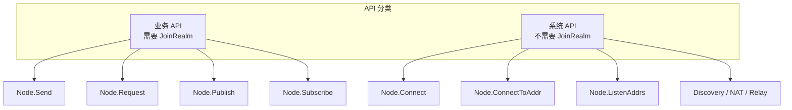
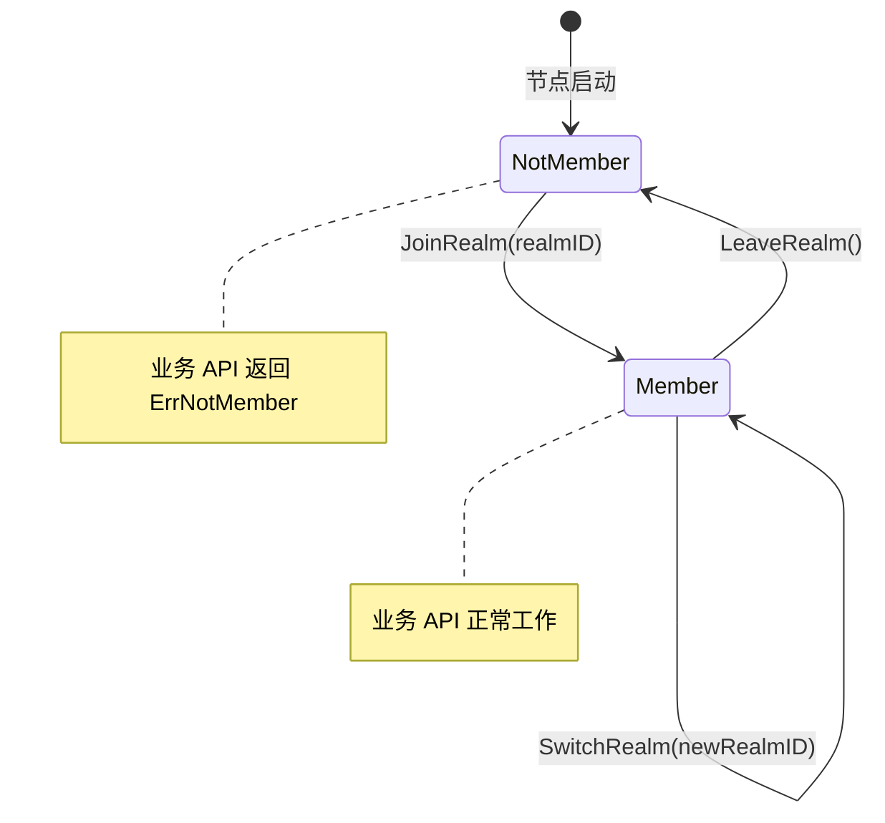

# REQ-REALM-001: Realm 强制隔离

## 元数据

| 属性 | 值 |
|------|---|
| **ID** | REQ-REALM-001 |
| **优先级** | P0 |
| **状态** | 📋 planned |
| **类型** | dep2p-specific |
| **受众** | facade, endpoint |
| **分类** | protocol_stream |

---

## 需求描述

未加入 Realm 的节点调用业务 API（Send/Request/Publish/Subscribe）时，必须返回 `ErrNotMember` 错误。

---

## 背景和动机

在多租户场景下，需要确保不同业务/租户之间的隔离：

1. **数据隔离**：应用 A 的消息不应被应用 B 收到
2. **安全隔离**：恶意节点不能伪装成其他租户成员
3. **简化编程**：用户不需要在每次调用时传递 tenantID

```
┌─────────────────────────────────────────────────────────────────────────────┐
│                    Realm 隔离架构                                            │
├─────────────────────────────────────────────────────────────────────────────┤
│                                                                              │
│   ┌─────────────────┐    ┌─────────────────┐    ┌─────────────────┐        │
│   │   Realm A       │    │   Realm B       │    │   Realm C       │        │
│   │  ┌───┐ ┌───┐   │    │  ┌───┐ ┌───┐   │    │  ┌───┐ ┌───┐   │        │
│   │  │ N1│ │ N2│   │    │  │ N3│ │ N4│   │    │  │ N5│ │ N6│   │        │
│   │  └───┘ └───┘   │    │  └───┘ └───┘   │    │  └───┘ └───┘   │        │
│   └─────────────────┘    └─────────────────┘    └─────────────────┘        │
│          ▲                      ▲                      ▲                    │
│          │                      │                      │                    │
│          └──────────────────────┼──────────────────────┘                    │
│                                 │                                           │
│                        消息只在 Realm 内传递                                 │
│                                                                              │
└─────────────────────────────────────────────────────────────────────────────┘
```

---

## 需求详情

### Realm 概念

**Realm** 是 DeP2P 的业务隔离租户，类似于：
- Kubernetes 的 Namespace
- 云厂商的 VPC
- 数据库的 Schema

### 核心原则

1. **单 Realm 模型**：每个节点同一时间只能加入一个 Realm
2. **业务 API 受限**：业务 API 必须先 JoinRealm 才能使用
3. **系统 API 不受限**：系统 API 不需要 JoinRealm

### API 分类



| 分类 | API | 需要 JoinRealm |
|------|-----|----------------|
| **业务 API** | `Send`, `Request`, `Publish`, `Subscribe` | ✅ 是 |
| **系统 API** | `Connect`, `ConnectToAddr`, `ListenAddrs` | ❌ 否 |
| **系统 API** | `Discovery`, `NAT`, `Relay` | ❌ 否 |

### Realm 状态机



### 错误处理

| 场景 | 错误 | 说明 |
|------|------|------|
| 未 JoinRealm 调用业务 API | `ErrNotMember` | 必须先加入 Realm |
| 已加入 Realm 再次 JoinRealm | `ErrAlreadyJoined` | 需要先 LeaveRealm |
| Realm ID 无效 | `ErrInvalidRealm` | 格式或权限问题 |

### 代码示例

```go
// 正确用法
node, _ := dep2p.NewNode(dep2p.WithPreset(dep2p.PresetDesktop))
defer node.Close()

// 必须先 JoinRealm
err := node.JoinRealm(ctx, "my-realm")
if err != nil {
    log.Fatal(err)
}

// 然后才能使用业务 API
err = node.Send(ctx, targetID, "/app/msg", []byte("hello"))

// 切换 Realm
err = node.LeaveRealm(ctx)
err = node.JoinRealm(ctx, "another-realm")
```

```go
// 错误用法：未 JoinRealm 调用业务 API
node, _ := dep2p.NewNode(dep2p.WithPreset(dep2p.PresetDesktop))

// 直接调用 Send 会返回 ErrNotMember
err := node.Send(ctx, targetID, "/app/msg", []byte("hello"))
if errors.Is(err, dep2p.ErrNotMember) {
    log.Println("必须先 JoinRealm")
}
```

---

## 验收标准

- [ ] 未 JoinRealm 调用 `Send` 返回 `ErrNotMember`
- [ ] 未 JoinRealm 调用 `Request` 返回 `ErrNotMember`
- [ ] 未 JoinRealm 调用 `Publish` 返回 `ErrNotMember`
- [ ] 未 JoinRealm 调用 `Subscribe` 返回 `ErrNotMember`
- [ ] JoinRealm 后业务 API 正常工作
- [ ] LeaveRealm 后业务 API 返回 `ErrNotMember`
- [ ] 已加入 Realm 再次 JoinRealm 返回 `ErrAlreadyJoined`
- [ ] 系统 API 不需要 JoinRealm

---

## 关联文档

| 类型 | 链接 |
|------|------|
| **不变量** | [INV-002-realm-membership](../invariants/INV-002-realm-membership.md) |
| **API** | `pkg/dep2p/node.go` - `Node.JoinRealm` |
| **API** | `pkg/dep2p/node.go` - `Node.LeaveRealm` |
| **API** | `pkg/dep2p/node.go` - `Node.Send` |
| **API** | `pkg/dep2p/node.go` - `Node.Request` |
| **实现** | `internal/core/realm/realm_manager.go` |

---

## 测试证据

> **状态**：planned - 尚未实现

当实现后，测试将包括：

```go
// 预期的测试用例
func TestSendWithoutJoinRealm(t *testing.T) {
    node, _ := dep2p.NewNode(opts...)
    defer node.Close()
    
    // 未 JoinRealm 调用 Send
    err := node.Send(ctx, targetID, "/test", []byte("hello"))
    
    // 必须返回 ErrNotMember
    require.ErrorIs(t, err, dep2p.ErrNotMember)
}

func TestSendAfterJoinRealm(t *testing.T) {
    node, _ := dep2p.NewNode(opts...)
    defer node.Close()
    
    // JoinRealm
    err := node.JoinRealm(ctx, "test-realm")
    require.NoError(t, err)
    
    // Send 应该成功
    err = node.Send(ctx, targetID, "/test", []byte("hello"))
    require.NoError(t, err)
}

func TestSendAfterLeaveRealm(t *testing.T) {
    node, _ := dep2p.NewNode(opts...)
    defer node.Close()
    
    // JoinRealm
    node.JoinRealm(ctx, "test-realm")
    
    // LeaveRealm
    node.LeaveRealm(ctx)
    
    // Send 应该返回 ErrNotMember
    err := node.Send(ctx, targetID, "/test", []byte("hello"))
    require.ErrorIs(t, err, dep2p.ErrNotMember)
}
```

---

## 缺口说明

当前状态为 `planned`，存在以下缺口：

1. **实现缺口**
   - 需要实现 `JoinRealm` / `LeaveRealm` API
   - 需要在业务 API 中添加 Realm 成员检查
   - 需要实现 `ErrNotMember` 错误返回

2. **测试缺口**
   - 需要添加 Realm 成员检查测试
   - 需要添加状态转换测试

3. **文档缺口**
   - 需要补充 Realm API 文档

---

## 相关文档

- [需求管理说明](README.md)
- [需求索引](index.yaml)
- [REQ-CONN-001](REQ-CONN-001.md)
