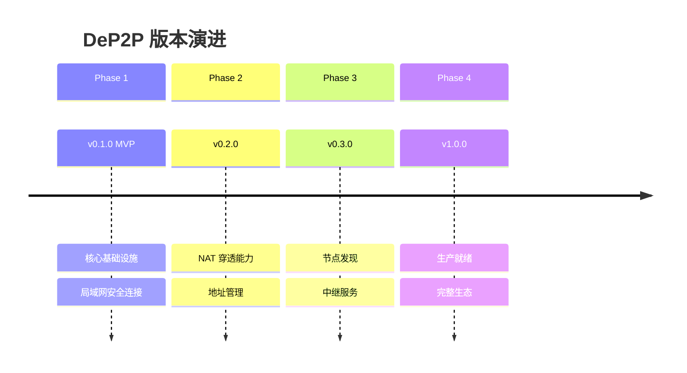
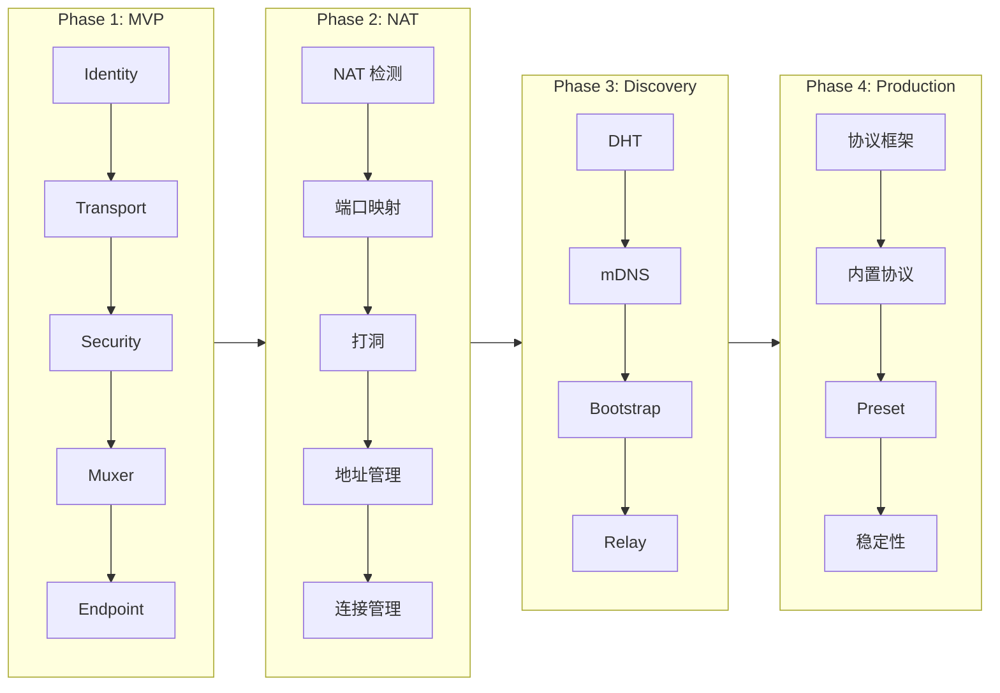
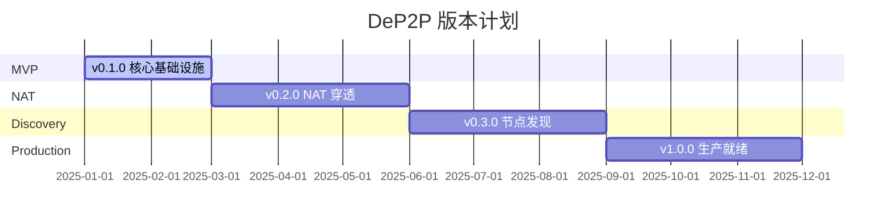

# 版本里程碑

本文档定义 DeP2P 的版本规划和里程碑目标。

> **注意**：本文档描述版本目标和范围，不包含每日进度。详细的实现进度请参阅 [implementation/status.md](implementation/status.md)。

---

## 版本规划概览

```
v0.1.0 (MVP)          v0.2.0                v0.3.0                v1.0.0
    │                     │                     │                     │
    ▼                     ▼                     ▼                     ▼
┌─────────────┐    ┌─────────────┐    ┌─────────────┐    ┌─────────────┐
│ 核心基础设施  │ -> │  NAT 穿透    │ -> │  节点发现    │ -> │  生产就绪    │
│ 局域网连接   │    │  地址管理    │    │  中继服务    │    │  完整生态    │
└─────────────┘    └─────────────┘    └─────────────┘    └─────────────┘
```



---

## 版本依赖关系



---

## 版本里程碑

### v0.1.0 - MVP（最小可行产品）

**目标**：在局域网内通过 IP:Port 建立安全连接

**范围**：

| 组件 | 功能 | 说明 |
|------|------|------|
| **Identity** | 身份管理 | Ed25519 密钥生成、NodeID 派生 |
| **Transport** | QUIC 传输 | 基于 QUIC 的可靠传输 |
| **Security** | TLS 认证 | 基于证书的双向认证 |
| **Muxer** | 多路复用 | 单连接多流 |
| **Endpoint** | 端点管理 | 连接建立和流管理 |

**验收标准**：
- 两节点可通过 IP:Port 建立加密连接
- 支持多路复用流
- 支持协议处理器注册

**不包含**：
- NAT 穿透
- 节点发现
- 中继服务

---

### v0.2.0 - NAT 穿透

**目标**：支持跨 NAT 的节点连接

**范围**：

| 组件 | 功能 | 说明 |
|------|------|------|
| **NAT 检测** | NAT 类型识别 | 识别 Full Cone、Symmetric 等 |
| **STUN** | 地址发现 | 发现外部可达地址 |
| **UPnP/NAT-PMP** | 端口映射 | 自动配置路由器端口映射 |
| **Hole Punching** | UDP 打洞 | 协调双方打洞 |
| **Address Manager** | 地址管理 | 管理多种类型地址 |
| **Connection Manager** | 连接管理 | 连接池和生命周期 |

**验收标准**：
- 支持 NAT 类型检测
- 支持 UPnP 端口映射
- 支持 UDP 打洞
- 地址自动发现和更新

**依赖**：v0.1.0

---

### v0.3.0 - 节点发现和中继

**目标**：只需 NodeID 即可连接任意节点

**范围**：

| 组件 | 功能 | 说明 |
|------|------|------|
| **DHT** | 分布式哈希表 | Kademlia 实现 |
| **mDNS** | 本地发现 | 局域网节点发现 |
| **Bootstrap** | 引导机制 | 初始节点发现 |
| **Relay** | 中继服务 | 中继客户端和服务器 |
| **Messaging** | 消息服务 | Send/Request/Publish |

**验收标准**：
- 只需 NodeID 即可连接节点
- 支持本地 mDNS 发现
- 支持中继连接
- 支持基本消息模式

**依赖**：v0.2.0

---

### v1.0.0 - 生产就绪

**目标**：完整的生产级 P2P 网络库

**范围**：

| 组件 | 功能 | 说明 |
|------|------|------|
| **Protocol Framework** | 协议框架 | 版本协商、优雅升级 |
| **Built-in Protocols** | 内置协议 | Ping、Identify、Kad 等 |
| **Preset** | 预设配置 | Desktop、Mobile、Server |
| **Realm** | 业务隔离 | 多租户支持 |
| **Observability** | 可观测性 | 日志、指标、追踪 |
| **Stability** | 稳定性 | 性能优化、完整测试 |

**验收标准**：
- 完整的协议生态
- 生产级稳定性
- 完善的可观测性
- 详尽的文档和示例

**依赖**：v0.3.0

---

## 各版本能力矩阵

| 能力 | v0.1.0 | v0.2.0 | v0.3.0 | v1.0.0 |
|------|--------|--------|--------|--------|
| **身份管理** | ✅ | ✅ | ✅ | ✅ |
| **QUIC 传输** | ✅ | ✅ | ✅ | ✅ |
| **TLS 认证** | ✅ | ✅ | ✅ | ✅ |
| **多路复用** | ✅ | ✅ | ✅ | ✅ |
| **协议处理** | ✅ | ✅ | ✅ | ✅ |
| **NAT 检测** | - | ✅ | ✅ | ✅ |
| **端口映射** | - | ✅ | ✅ | ✅ |
| **打洞** | - | ✅ | ✅ | ✅ |
| **地址管理** | - | ✅ | ✅ | ✅ |
| **连接管理** | - | ✅ | ✅ | ✅ |
| **DHT 发现** | - | - | ✅ | ✅ |
| **mDNS 发现** | - | - | ✅ | ✅ |
| **中继服务** | - | - | ✅ | ✅ |
| **消息服务** | - | - | ✅ | ✅ |
| **协议框架** | - | - | - | ✅ |
| **Realm 隔离** | - | - | - | ✅ |
| **预设配置** | - | - | - | ✅ |
| **可观测性** | - | - | - | ✅ |

---

## 当前状态

> **更新时间**: 2025-12

| 版本 | 状态 | 说明 |
|------|------|------|
| v0.1.0 | 🚧 开发中 | 核心基础设施开发中 |
| v0.2.0 | 📋 规划中 | NAT 穿透能力 |
| v0.3.0 | 📋 规划中 | 节点发现和中继 |
| v1.0.0 | 📋 规划中 | 生产就绪 |



---

## 优先级说明

| 优先级 | 说明 | 处理方式 |
|--------|------|----------|
| **P0** | 关键路径 | 必须完成，阻塞后续开发 |
| **P1** | 重要功能 | 应该完成，影响用户体验 |
| **P2** | 可选功能 | 可以推迟，不影响核心功能 |

---

## 风险与挑战

| 风险 | 影响 | 缓解措施 |
|------|------|----------|
| QUIC 库兼容性 | 中 | 持续关注 quic-go 更新 |
| NAT 穿透复杂性 | 高 | 分阶段实现，先 UPnP 后打洞 |
| DHT 性能 | 中 | Kademlia 经典实现，按需优化 |
| 跨平台兼容 | 中 | 持续测试 Linux/macOS/Windows |

---

## 相关文档

- [架构总览](architecture/overview.md)
- [实现状态](implementation/status.md)
- [需求规范](requirements/README.md)
- [用户文档](../docs/README.md)
