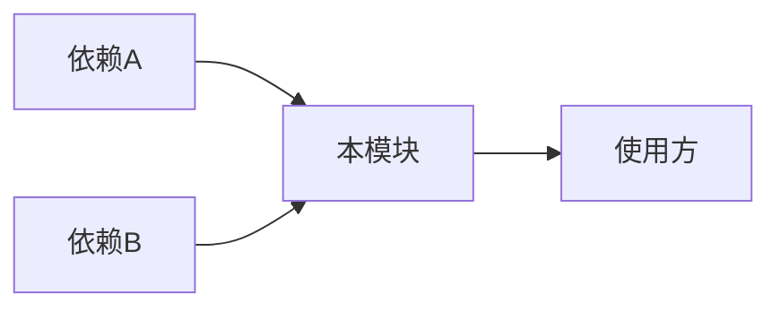
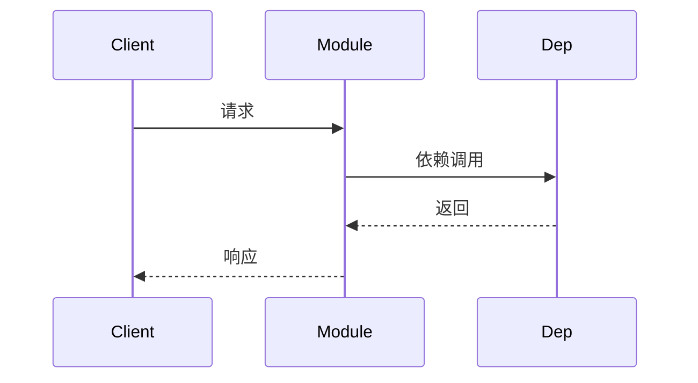

# {模块名称} 模块设计

> 模板版本: v1.0

---

## 元信息

| 字段 | 值 |
|------|-----|
| **模块 ID** | {MODULE_ID} |
| **状态** | draft / approved / implemented |
| **Owner** | @xxx |
| **创建日期** | YYYY-MM-DD |
| **更新日期** | YYYY-MM-DD |
| **代码路径** | `internal/core/{module}/` |

---

## 追溯链

| 关联类型 | ID | 说明 |
|----------|-----|------|
| **需求** | REQ-{DOMAIN}-{NNNN} | 关联需求 |
| **ADR** | ADR-{NNNN} | 架构决策 |
| **接口** | `pkg/interfaces/{xxx}/` | 接口定义 |
| **测试** | TST-{DOMAIN}-{NNNN} | 测试用例 |

---

## 1. 概述

[必填] 模块的职责和定位。

### 1.1 职责

本模块负责...

### 1.2 边界

- **输入**：接收什么数据/请求
- **输出**：产出什么数据/结果
- **不处理**：明确不在本模块范围内的功能

---

## 2. 依赖关系

[必填] 模块的依赖和被依赖关系。

### 2.1 依赖的模块

| 模块 | 接口 | 用途 |
|------|------|------|
| `identity` | `IdentityService` | 获取节点身份 |

### 2.2 被依赖情况

| 模块 | 使用的接口 |
|------|------------|
| `xxx` | `XXXService` |

### 2.3 依赖图



---

## 3. 核心接口

[必填] 模块对外暴露的核心接口。

### 3.1 公共接口

```go
// XXXService 定义模块的核心服务接口
type XXXService interface {
    // Method1 方法描述
    Method1(ctx context.Context, param Type) (Result, error)
    
    // Method2 方法描述
    Method2(ctx context.Context) error
}
```

### 3.2 内部接口

```go
// internalXXX 内部使用的接口
type internalXXX interface {
    // ...
}
```

---

## 4. 数据模型

[必填] 模块使用的核心数据结构。

### 4.1 核心结构

```go
// XXX 核心数据结构
type XXX struct {
    Field1 Type1 // 字段说明
    Field2 Type2 // 字段说明
}
```

### 4.2 状态定义

| 状态 | 值 | 说明 |
|------|-----|------|
| StateA | 0 | 状态描述 |
| StateB | 1 | 状态描述 |

---

## 5. 核心流程

[必填] 模块的核心处理流程。

### 5.1 流程名称



**流程说明**：

1. 步骤 1
2. 步骤 2
3. 步骤 3

---

## 6. 错误处理

[必填] 模块的错误码和处理策略。

### 6.1 错误码

| 错误码 | 名称 | 说明 | 处理建议 |
|--------|------|------|----------|
| E{NNNN} | ErrXxx | 错误描述 | 处理方式 |

### 6.2 错误处理策略

- **可重试错误**：列出可重试的错误
- **不可重试错误**：列出不可重试的错误
- **降级策略**：发生错误时的降级处理

---

## 7. 配置项

[可选] 模块的配置选项。

| 配置项 | 类型 | 默认值 | 说明 |
|--------|------|--------|------|
| `config.xxx` | Type | default | 配置说明 |

---

## 8. 可观测性

[必填] 模块的监控和调试支持。

### 8.1 指标 (Metrics)

| 指标名 | 类型 | 说明 |
|--------|------|------|
| `dep2p_xxx_total` | Counter | 计数指标 |
| `dep2p_xxx_duration_seconds` | Histogram | 延迟指标 |

### 8.2 日志

| 级别 | 场景 | 日志内容 |
|------|------|----------|
| INFO | 正常操作 | 操作成功日志 |
| WARN | 异常但可恢复 | 警告日志 |
| ERROR | 错误 | 错误详情 |

### 8.3 追踪 (Tracing)

- Span 名称：`module.operation`
- 关键属性：列出追踪中记录的属性

---

## 9. 测试策略

[必填] 模块的测试方法。

### 9.1 单元测试

| 测试点 | 测试文件 | 覆盖场景 |
|--------|----------|----------|
| 核心逻辑 | `xxx_test.go` | 正常/异常路径 |

### 9.2 集成测试

| 测试场景 | 测试文件 |
|----------|----------|
| 场景描述 | `tests/xxx_test.go` |

---

## 10. 实现状态

[必填] 当前实现进度。

| 功能 | 状态 | 说明 |
|------|------|------|
| 核心功能 | ✅ 已完成 / 🚧 进行中 / ⏳ 计划中 | 备注 |

---

## 11. 待办事项

- [ ] 待完成项 1
- [ ] 待完成项 2

---

## 变更历史

| 版本 | 日期 | 作者 | 变更说明 |
|------|------|------|----------|
| v1.0 | YYYY-MM-DD | @xxx | 初始版本 |
