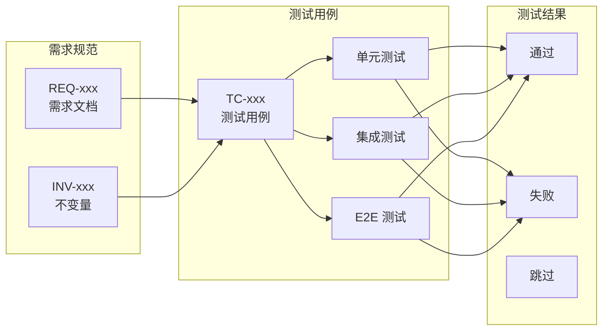
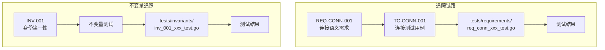
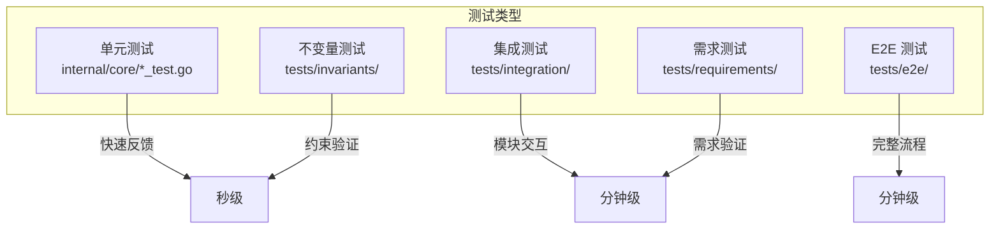
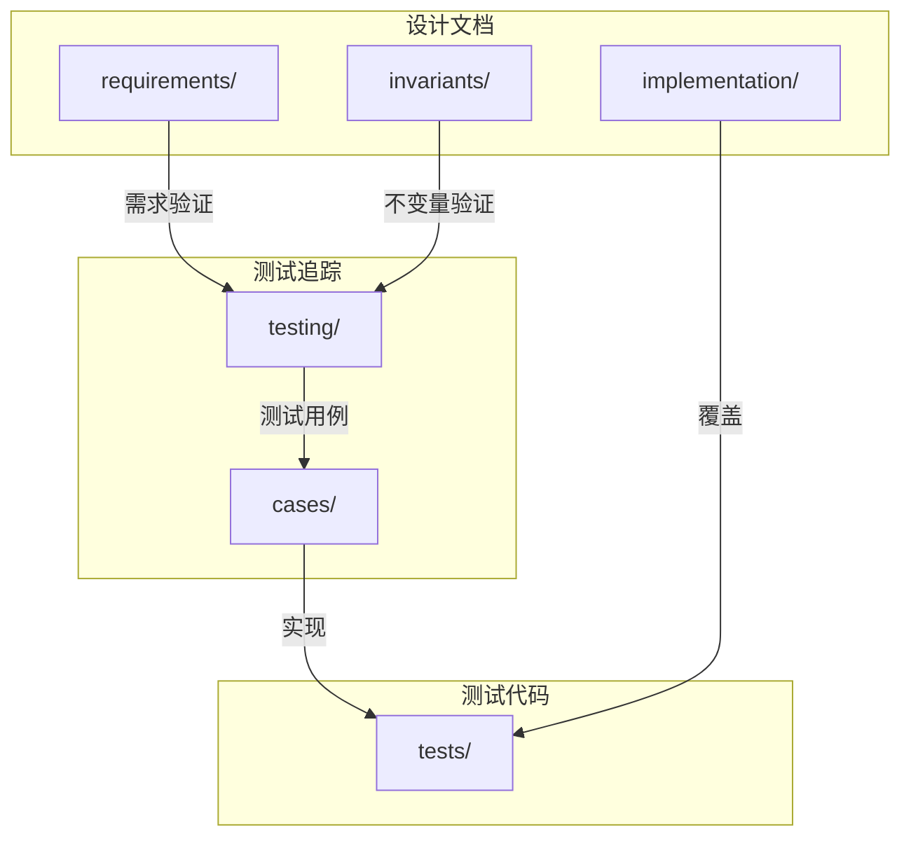

# 测试追踪

本目录包含 DeP2P 的测试追踪文档，确保需求到测试到结果的可追踪性。

---

## 概述

### 测试追踪的目的

测试追踪建立了**需求规范**、**测试用例**和**测试结果**之间的追踪关系：



### 追踪的价值

| 价值 | 描述 |
|------|------|
| 需求覆盖 | 确保每个需求都有对应测试 |
| 回归检测 | 变更后快速发现问题 |
| 质量保证 | 验证系统行为符合预期 |
| 文档同步 | 测试即文档 |
| 持续改进 | 测试覆盖率趋势追踪 |

---

## 文档导航

| 文档 | 描述 |
|------|------|
| [strategy.md](strategy.md) | 测试策略 |
| [coverage.md](coverage.md) | 覆盖率要求 |
| [test-plan.md](test-plan.md) | 测试分层（单元/集成/E2E） |
| [cases/](cases/) | 测试用例目录 |

---

## 追踪关系

### 需求 → 测试 → 结果



### 追踪表

| 需求/不变量 | 测试用例 | 测试代码 | 状态 |
|------------|---------|---------|------|
| [REQ-CONN-001](../requirements/REQ-CONN-001.md) | [TC-CONN-001](cases/TC-CONN-001.md) | `tests/requirements/req_conn_*.go` | ✅ |
| [REQ-REALM-001](../requirements/REQ-REALM-001.md) | TC-REALM-001 | `tests/requirements/req_realm_*.go` | ✅ |
| [INV-001](../invariants/INV-001-identity-first.md) | INV-001 测试 | `tests/invariants/inv_001_*.go` | ✅ |
| [INV-002](../invariants/INV-002-realm-membership.md) | INV-002 测试 | `tests/invariants/inv_002_*.go` | ✅ |

---

## 测试分类

### 测试类型



### 测试位置

| 测试类型 | 位置 | 描述 |
|---------|------|------|
| 单元测试 | `internal/core/*_test.go` | 各模块目录下的测试 |
| 集成测试 | `tests/integration/` | 模块间集成测试 |
| E2E 测试 | `tests/e2e/` | 端到端测试 |
| 需求测试 | `tests/requirements/` | 需求验证测试 |
| 不变量测试 | `tests/invariants/` | 不变量验证测试 |

---

## 测试用例编号规则

### 编号格式

测试用例使用 `TC-{类别}-{序号}` 格式：

| 前缀 | 类别 | 示例 |
|------|------|------|
| TC-CONN | 连接相关 | TC-CONN-001, TC-CONN-002 |
| TC-REALM | Realm 相关 | TC-REALM-001, TC-REALM-002 |
| TC-DISC | 发现相关 | TC-DISC-001, TC-DISC-002 |
| TC-NAT | NAT 相关 | TC-NAT-001, TC-NAT-002 |
| TC-RELAY | 中继相关 | TC-RELAY-001, TC-RELAY-002 |
| TC-MSG | 消息相关 | TC-MSG-001, TC-MSG-002 |

### 与需求/不变量的对应

| 需求/不变量前缀 | 测试用例前缀 | 测试代码前缀 |
|----------------|-------------|-------------|
| REQ-CONN | TC-CONN | req_conn |
| REQ-REALM | TC-REALM | req_realm |
| INV-001 | - | inv_001 |
| INV-002 | - | inv_002 |

---

## 测试代码结构

### 目录结构

```
tests/
├── README.md               # 测试框架总览
├── testutils/              # 测试工具库
│   ├── node.go             # 测试节点创建
│   ├── facade_node.go      # Facade 节点创建
│   ├── harness.go          # 日志验证工具
│   ├── wait.go             # 等待/超时工具
│   ├── leak.go             # Goroutine 泄漏检测
│   └── metrics.go          # 延迟/指标收集
├── e2e/                    # 端到端测试
│   ├── local_test.go       # 本机多节点连接
│   ├── echo_test.go        # Echo 协议测试
│   ├── security_test.go    # 安全层测试
│   ├── discovery_test.go   # 发现服务测试
│   ├── relay_test.go       # Relay 中继测试
│   └── ...
├── integration/            # 集成测试
│   ├── discovery_addressbook_test.go
│   ├── endpoint_connmgr_test.go
│   └── transport_security_test.go
├── requirements/           # 需求验证测试
│   ├── req_conn_*.go
│   ├── req_realm_*.go
│   └── ...
├── invariants/             # 不变量验证测试
│   ├── inv_001_identity_first_test.go
│   ├── inv_002_address_as_path_test.go
│   └── ...
└── mock/                   # Mock 对象
    ├── network.go
    └── README.md
```

---

## 运行测试

### 快速命令

```bash
# 运行所有测试
go test ./...

# 运行单元测试
go test ./internal/...

# 运行 E2E 测试
go test ./tests/e2e/... -v -timeout 10m

# 运行需求测试
go test ./tests/requirements/... -v

# 运行不变量测试
go test ./tests/invariants/... -v

# 运行特定测试
go test -v ./tests/e2e -run TestTwoNodesConnect

# 快速回归测试（CI 默认）
go test ./tests/e2e/... -short -timeout 2m
```

### 覆盖率报告

```bash
# 生成覆盖率报告
go test ./... -coverprofile=coverage.out

# 查看覆盖率
go tool cover -html=coverage.out
```

---

## 与其他文档的关系



| 关系 | 说明 |
|------|------|
| 需求规范 → 测试追踪 | 需求验证测试 |
| 不变量 → 测试追踪 | 不变量验证测试 |
| 测试追踪 → 测试代码 | 测试用例实现 |
| 实现映射 → 测试代码 | 代码覆盖 |

---

## 相关文档

- [设计文档导航](../README.md)
- [需求规范](../requirements/README.md)
- [不变量](../invariants/README.md)
- [实现映射](../implementation/README.md)
