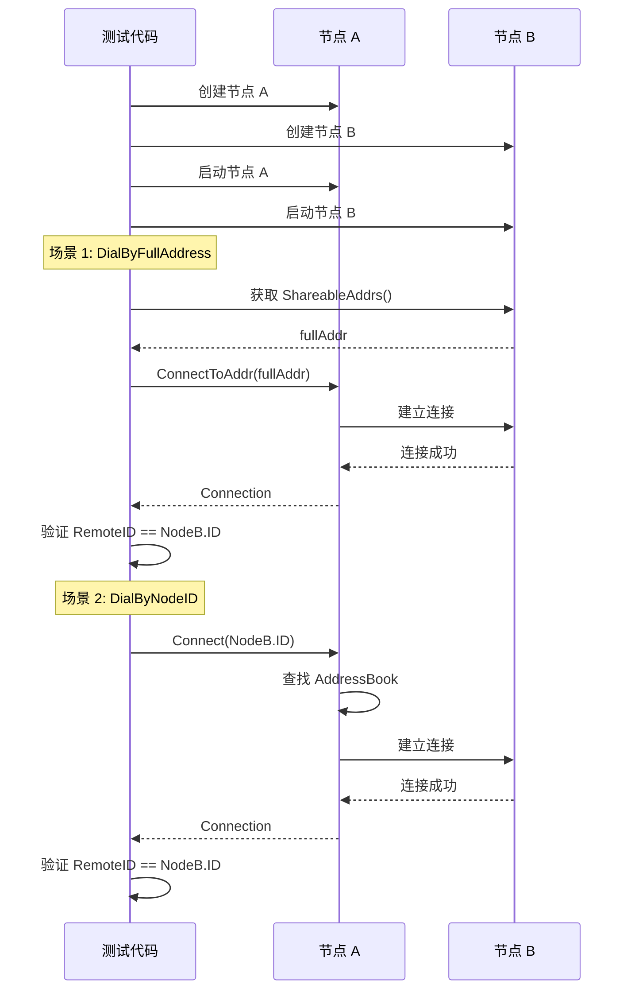

# TC-CONN-001: 连接语义测试用例

## 元数据

| 属性 | 值 |
|------|-----|
| **ID** | TC-CONN-001 |
| **名称** | 连接语义测试 |
| **关联需求** | [REQ-CONN-001](../../requirements/REQ-CONN-001.md) |
| **关联不变量** | [INV-001](../../invariants/INV-001-identity-first.md) |
| **优先级** | P0 |
| **状态** | ✅ Implemented |

---

## 测试目标

验证 DeP2P 的三种连接语义（DialBy）的正确性：

1. **DialByNodeID**: 通过 NodeID 连接，地址由 AddressBook/DHT 提供
2. **DialByFullAddress**: 通过完整地址连接，含 `/p2p/<NodeID>`
3. **DialByNodeIDWithDialAddrs**: 通过 NodeID + Dial 地址列表连接

---

## 测试流程



---

## 前置条件

| 条件 | 描述 |
|------|------|
| Go 版本 | Go 1.21+ |
| 测试环境 | 本机或局域网 |
| 端口可用 | 测试端口未被占用 |
| 无防火墙 | 本机测试无防火墙限制 |

---

## 测试场景

### 场景 1: DialByFullAddress 成功

**目标**: 验证通过完整地址连接成功

**步骤**:
1. 创建两个测试节点 A 和 B
2. 启动两个节点
3. 获取节点 B 的 `ShareableAddrs()`
4. 节点 A 使用 `ConnectToAddr()` 连接到节点 B
5. 验证连接成功且 `RemoteID == NodeB.ID`

**预期结果**:
- 连接成功，无错误
- `conn.RemoteID()` 等于 `NodeB.ID()`

**测试代码位置**: `tests/e2e/local_test.go`

```go
func TestDialByFullAddress_Success(t *testing.T) {
    nodeA, nodeB := testutils.NewTestFacadeNodePair(t)
    defer testutils.CloseFacadeNodes(nodeA, nodeB)
    
    testutils.StartFacadeAndWait(t, 5*time.Second, nodeA, nodeB)
    
    ctx, cancel := context.WithTimeout(context.Background(), 10*time.Second)
    defer cancel()
    
    // 获取 nodeB 的可分享地址
    addrs := nodeB.Node.ShareableAddrs()
    require.NotEmpty(t, addrs, "nodeB 应有可分享地址")
    
    // nodeA 通过完整地址连接到 nodeB
    conn, err := nodeA.Node.ConnectToAddr(ctx, addrs[0])
    require.NoError(t, err)
    require.NotNil(t, conn)
    
    // 验证连接
    assert.Equal(t, nodeB.Node.ID(), conn.RemoteID())
}
```

### 场景 2: DialByNodeID 成功

**目标**: 验证通过 NodeID 连接成功

**步骤**:
1. 创建两个测试节点 A 和 B
2. 启动两个节点
3. 先建立一次连接（确保地址簿有记录）
4. 断开连接
5. 节点 A 使用 `Connect(NodeB.ID)` 重新连接
6. 验证连接成功

**预期结果**:
- 连接成功，无错误
- `conn.RemoteID()` 等于 `NodeB.ID()`

**测试代码位置**: `tests/e2e/local_test.go`

```go
func TestDialByNodeID_Success(t *testing.T) {
    nodeA, nodeB := testutils.NewTestFacadeNodePair(t)
    defer testutils.CloseFacadeNodes(nodeA, nodeB)
    
    testutils.StartFacadeAndWait(t, 5*time.Second, nodeA, nodeB)
    
    ctx, cancel := context.WithTimeout(context.Background(), 10*time.Second)
    defer cancel()
    
    // 先通过完整地址建立连接（填充地址簿）
    addrs := nodeB.Node.ShareableAddrs()
    require.NotEmpty(t, addrs)
    
    conn1, err := nodeA.Node.ConnectToAddr(ctx, addrs[0])
    require.NoError(t, err)
    conn1.Close()
    
    // 现在通过 NodeID 连接
    conn2, err := nodeA.Node.Connect(ctx, nodeB.Node.ID())
    require.NoError(t, err)
    require.NotNil(t, conn2)
    
    // 验证连接
    assert.Equal(t, nodeB.Node.ID(), conn2.RemoteID())
}
```

### 场景 3: 身份验证失败

**目标**: 验证身份不匹配时连接失败

**步骤**:
1. 创建两个测试节点 A 和 B
2. 启动两个节点
3. 获取节点 B 的监听地址
4. 构造错误的完整地址（使用假的 NodeID）
5. 节点 A 尝试连接
6. 验证连接失败

**预期结果**:
- 连接失败，返回错误
- 错误表明身份不匹配

**测试代码位置**: `tests/invariants/inv_001_identity_first_test.go`

```go
func TestIdentityMismatch_Failure(t *testing.T) {
    nodeA, nodeB := testutils.NewTestFacadeNodePair(t)
    defer testutils.CloseFacadeNodes(nodeA, nodeB)
    
    testutils.StartFacadeAndWait(t, 5*time.Second, nodeA, nodeB)
    
    ctx, cancel := context.WithTimeout(context.Background(), 10*time.Second)
    defer cancel()
    
    // 获取 nodeB 的监听地址
    listen := nodeB.Node.ListenAddrs()
    require.NotEmpty(t, listen)
    
    // 构造假的 NodeID
    fakeID, _ := types.NodeIDFromBytes([]byte{
        1, 2, 3, 4, 5, 6, 7, 8,
        9, 10, 11, 12, 13, 14, 15, 16,
        17, 18, 19, 20, 21, 22, 23, 24,
        25, 26, 27, 28, 29, 30, 31, 32,
    })
    
    // 构造错误的完整地址
    dialAddr := listen[0].String()
    wrongFullAddr := dialAddr + "/p2p/" + fakeID.String()
    
    // 尝试连接，期望失败
    _, err := nodeA.Node.ConnectToAddr(ctx, wrongFullAddr)
    require.Error(t, err, "身份不匹配时应连接失败")
}
```

### 场景 4: 连接超时

**目标**: 验证连接超时处理

**步骤**:
1. 创建测试节点 A
2. 使用极短的超时时间
3. 尝试连接到不存在的节点
4. 验证超时错误

**预期结果**:
- 返回超时错误

**测试代码位置**: `tests/requirements/req_conn_004_test.go`

```go
func TestConnect_Timeout(t *testing.T) {
    node := testutils.NewTestFacadeNode(t)
    defer node.Close()
    
    testutils.StartFacadeAndWait(t, 5*time.Second, node)
    
    // 使用极短的超时
    ctx, cancel := context.WithTimeout(context.Background(), 1*time.Millisecond)
    defer cancel()
    
    // 尝试连接到不存在的节点
    fakeID, _ := types.RandomNodeID()
    _, err := node.Node.Connect(ctx, fakeID)
    
    // 验证超时或连接失败
    require.Error(t, err)
}
```

---

## 测试数据

### 节点配置

| 参数 | 值 | 说明 |
|------|-----|------|
| 预设 | `PresetMinimal` | 最小配置 |
| 监听地址 | 随机端口 | 自动分配 |
| 安全层 | TLS 1.3 | 默认安全层 |

### 超时配置

| 操作 | 超时时间 | 说明 |
|------|---------|------|
| 节点启动 | 5s | 等待节点就绪 |
| 连接建立 | 10s | 正常连接超时 |
| 测试总时间 | 30s | 单个测试用例 |

---

## 关联代码

### 测试代码

| 场景 | 文件 | 函数 |
|------|------|------|
| E2E 连接 | `tests/e2e/local_test.go` | `TestTwoNodesConnect` |
| 需求验证 | `tests/requirements/req_conn_*.go` | `TestREQCONN*` |
| 不变量验证 | `tests/invariants/inv_001_*.go` | `TestINV001*` |

### 实现代码

| 组件 | 文件 | 说明 |
|------|------|------|
| Connect | `node.go` | `Node.Connect()` |
| ConnectToAddr | `node.go` | `Node.ConnectToAddr()` |
| Endpoint | `internal/core/endpoint/` | 连接实现 |

---

## 验收标准

| 标准 | 描述 | 状态 |
|------|------|------|
| DialByFullAddress 成功 | 完整地址连接正常 | ✅ |
| DialByNodeID 成功 | NodeID 连接正常 | ✅ |
| 身份验证失败处理 | 错误身份时连接失败 | ✅ |
| 超时处理 | 超时时正确返回错误 | ✅ |
| 连接可用 | 连接后可发送数据 | ✅ |

---

## 运行测试

```bash
# 运行连接相关测试
go test ./tests/e2e/... -run TestTwoNodesConnect -v

# 运行需求测试
go test ./tests/requirements/... -run "CONN" -v

# 运行不变量测试
go test ./tests/invariants/... -run "INV001" -v
```

---

## 相关文档

- [测试追踪概述](../README.md)
- [测试策略](../strategy.md)
- [REQ-CONN-001: 连接语义需求](../../requirements/REQ-CONN-001.md)
- [INV-001: 身份第一性](../../invariants/INV-001-identity-first.md)
