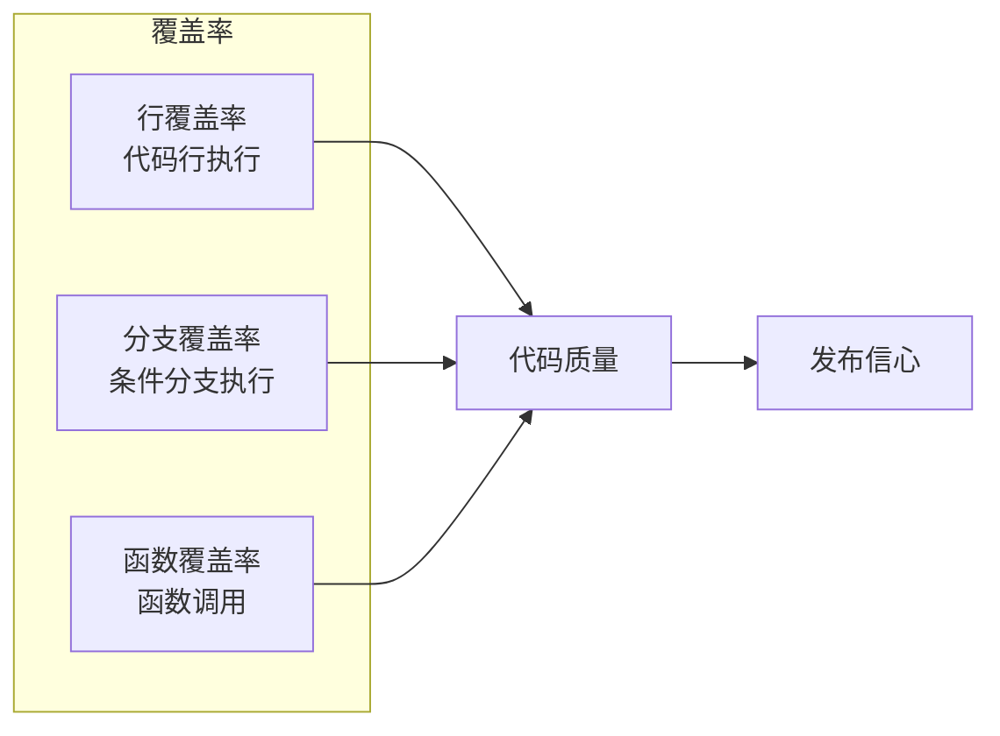
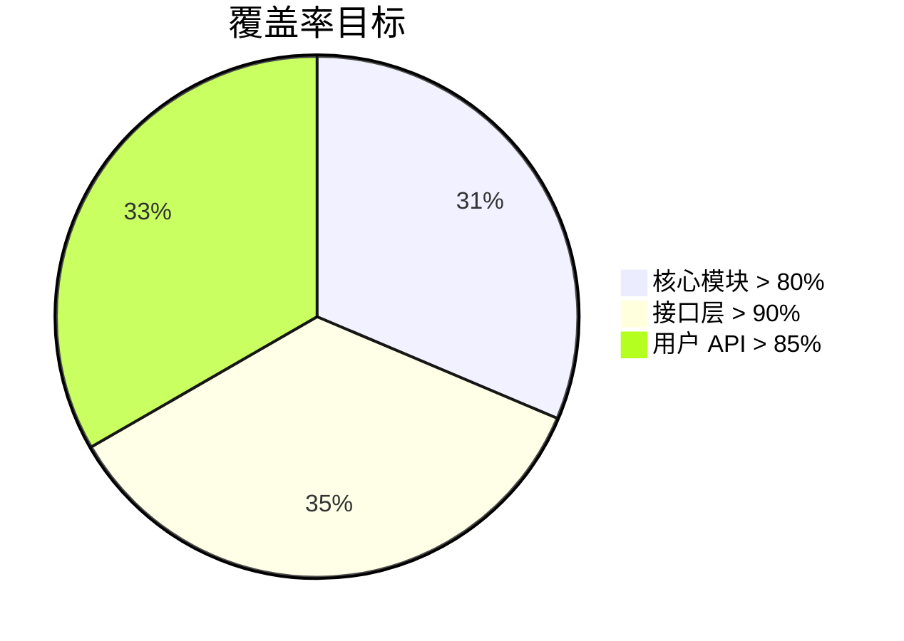
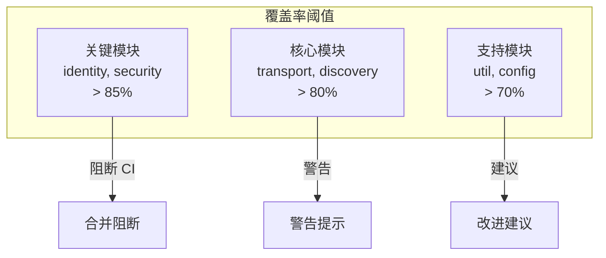
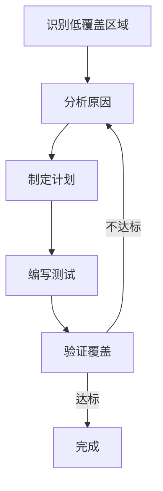

# 覆盖率要求

本文档定义 DeP2P 的测试覆盖率目标和要求。

---

## 概述

### 覆盖率的意义



### 覆盖率不是万能的

| 覆盖率高 | 不代表 |
|---------|-------|
| 100% 行覆盖 | 测试质量高 |
| 所有分支覆盖 | 没有 Bug |
| 高覆盖率 | 无需代码审查 |

> **原则**：覆盖率是必要条件，但不是充分条件。

---

## 覆盖率目标

### 整体目标



### 分层目标

| 层次 | 目标覆盖率 | 说明 |
|------|-----------|------|
| 用户 API (`pkg/dep2p/`) | > 85% | 用户直接使用的 API |
| 接口定义 (`pkg/interfaces/`) | > 90% | 接口契约 |
| 核心实现 (`internal/core/`) | > 80% | 核心业务逻辑 |
| 应用编排 (`internal/app/`) | > 70% | 启动和组装逻辑 |
| 工具函数 (`internal/util/`) | > 75% | 工具函数 |

### 模块目标

| 模块 | 目标 | 当前 | 状态 |
|------|-----|------|------|
| identity | 85% | ✅ | 达标 |
| transport | 80% | ✅ | 达标 |
| security | 85% | ✅ | 达标 |
| discovery | 80% | ✅ | 达标 |
| realm | 85% | ✅ | 达标 |
| messaging | 80% | ✅ | 达标 |
| endpoint | 80% | ✅ | 达标 |

---

## 覆盖率指标

### 指标类型

| 指标 | 描述 | 目标 |
|------|------|------|
| 行覆盖率 | 执行的代码行比例 | > 80% |
| 分支覆盖率 | 执行的条件分支比例 | > 70% |
| 函数覆盖率 | 调用的函数比例 | > 85% |

### 关键路径覆盖

对于关键路径，要求更高的覆盖率：

| 关键路径 | 覆盖率要求 |
|---------|-----------|
| 身份验证 | 100% |
| 连接建立 | 95% |
| Realm 成员检查 | 100% |
| 错误处理 | 90% |

---

## 覆盖率报告

### 生成报告

```bash
# 生成覆盖率文件
go test ./... -coverprofile=coverage.out

# 生成 HTML 报告
go tool cover -html=coverage.out -o coverage.html

# 查看覆盖率摘要
go tool cover -func=coverage.out
```

### 报告示例

```
github.com/dep2p/go-dep2p/internal/core/identity/identity.go:42:     NewIdentity         100.0%
github.com/dep2p/go-dep2p/internal/core/identity/identity.go:58:     NodeID              100.0%
github.com/dep2p/go-dep2p/internal/core/identity/identity.go:63:     PublicKey           100.0%
github.com/dep2p/go-dep2p/internal/core/identity/identity.go:68:     PrivateKey          100.0%
github.com/dep2p/go-dep2p/internal/core/identity/identity.go:73:     Sign                85.7%
github.com/dep2p/go-dep2p/internal/core/identity/identity.go:92:     Verify              80.0%
total:                                                                (statements)        87.5%
```

### CI 集成

```yaml
# .github/workflows/test.yml
- name: Run tests with coverage
  run: go test ./... -coverprofile=coverage.out -covermode=atomic

- name: Check coverage threshold
  run: |
    COVERAGE=$(go tool cover -func=coverage.out | grep total | awk '{print $3}' | sed 's/%//')
    if (( $(echo "$COVERAGE < 80" | bc -l) )); then
      echo "Coverage $COVERAGE% is below threshold 80%"
      exit 1
    fi
```

---

## 覆盖率阈值

### 模块阈值配置



### 阈值表

| 目录 | 最低阈值 | 目标阈值 | 违反处理 |
|------|---------|---------|---------|
| `internal/core/identity/` | 80% | 90% | 阻断 CI |
| `internal/core/security/` | 80% | 90% | 阻断 CI |
| `internal/core/realm/` | 80% | 85% | 阻断 CI |
| `internal/core/transport/` | 75% | 85% | 警告 |
| `internal/core/discovery/` | 75% | 85% | 警告 |
| `internal/core/messaging/` | 75% | 85% | 警告 |
| `internal/core/endpoint/` | 75% | 85% | 警告 |
| `internal/util/` | 60% | 75% | 建议 |

---

## 覆盖率追踪

### 趋势追踪

```mermaid
xychart-beta
    title "覆盖率趋势"
    x-axis ["v0.1", "v0.2", "v0.3", "v1.0"]
    y-axis "覆盖率 %" 0 --> 100
    line [60, 70, 80, 85]
```

### 版本目标

| 版本 | 覆盖率目标 | 状态 |
|------|-----------|------|
| v0.1.0 | 60% | ✅ 达标 |
| v0.2.0 | 70% | ✅ 达标 |
| v0.3.0 | 80% | ✅ 达标 |
| v1.0.0 | 85% | 🚧 进行中 |

---

## 覆盖率豁免

### 豁免场景

某些代码可以豁免覆盖率要求：

| 场景 | 豁免原因 | 标记方式 |
|------|---------|---------|
| 生成代码 | 自动生成，无需测试 | `// Code generated` |
| 调试代码 | 仅用于调试 | `// +build debug` |
| 平台特定 | 无法在 CI 测试 | `// +build linux` |
| 主函数 | 入口点 | `func main()` |

### 豁免标记

```go
// 生成代码豁免
// Code generated by protoc-gen-go. DO NOT EDIT.

// 调试代码豁免
//go:build debug
// +build debug

// 平台特定代码
//go:build linux
// +build linux
```

---

## 覆盖率改进

### 改进策略



### 常见问题

| 问题 | 原因 | 解决方案 |
|------|------|---------|
| 错误处理未覆盖 | 难以触发错误 | 使用 Mock |
| 边界条件未覆盖 | 未考虑边界 | 表驱动测试 |
| 并发代码未覆盖 | 难以测试 | 并发测试工具 |
| 外部依赖未覆盖 | 依赖外部服务 | Mock 外部服务 |

### 提高覆盖率的方法

1. **表驱动测试**：覆盖更多输入组合
2. **Mock 依赖**：测试错误路径
3. **边界测试**：测试边界条件
4. **负面测试**：测试错误情况

---

## 相关文档

- [测试追踪概述](README.md)
- [测试策略](strategy.md)
- [测试分层](test-plan.md)
